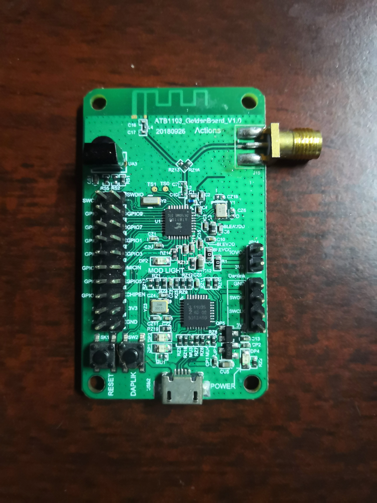

.. _atb1103_golden:

ATB1103 Golden Board
####################

Overview
********

ATB1103 Golden Board is based on the Actions Semi ATB1103 MCU. Zephyr
applications use the atb1103_golden configuration to run on these boards.

     ATB1103 Golden Board

This board supports Bluetooth 4.2 with LE packet length extension feature.
It can be used for BLE Voice Remote, Smart wearable devices, Smart Home
sensors, and BT Mesh device applications.

Hardware
********

ATB1103 Golden Board provides the following hardware components:

- Actions Semi ATB1103 MCU
- ARM |reg| 32-bit Cortex |reg|-M0 CPU
- 4MB Flash
- 40KB RAM
- Bluetooth 4.2
- 4 User LEDs
- IR LED
- Board reset and DAPLINK reset buttons
- GPIO with external interrupt capability
- UART (2)
- I2C (1)

Supported Features
==================

The Zephyr atb1103_golden board configuration supports the following hardware
features:

+-----------+------------+-------------------------------------+
| Interface | Controller | Driver/Component                    |
+===========+============+=====================================+
| NVIC      | on-chip    | nested vector interrupt controller  |
+-----------+------------+-------------------------------------+
| SYSTICK   | on-chip    | system clock                        |
+-----------+------------+-------------------------------------+
| CMU       | on-chip    | clock management unit               |
+-----------+------------+-------------------------------------+
| UART      | on-chip    | serial port                         |
+-----------+------------+-------------------------------------+

The default board configuration can be found in the defconfig file:
:zephyr_file:`boards/arm/atb1103_golden/atb1103_golden_defconfig`

Connections and IOs
===================

LED
---

- DP1 / DAPLINK LED = PIO0_21
- DP2 / User LED = GPIO18
- DP3 / DAPLINK LED = PIO0_20
- DP4 / Power LED = PWR3V3

Push buttons
------------

- SW1 / Board Reset Button
- SW2 / DAPLINK Reset Button

System Clock
============

ATB1103 Golden Board can be driven by an internal oscillator as well as the
external crystal oscillators. By default System clock is sourced by external
crystal oscillator (HOSC) at 32MHz.

Serial Port
===========

On ATB1103 Golden Board, Zephyr console output is assigned to UART0.
Default settings are 115200 8N1.

Programming and Debugging
*************************

Building
========

Here is an example for building the :ref:`hello_world` application.

.. zephyr-app-commands::
   :zephyr-app: samples/hello_world
   :board: atb1103_golden
   :goals: build

Flashing
========

DAPLink
---------

ATB1103 Golden Board provides:

- A USB connection to the host computer, which exposes a Mass Storage and an
  USB Serial Port.
- A Serial Flash device, which implements the USB flash disk file storage.

This interfaces are exposed via DAPLink which provides:

- Serial Wire Debug (SWD).
- USB Mass Storage Device (USBMSD).

For more details please refer to the `DAPLink Website`_.

Flashing Applications
---------------------

Connect the ATB1103 Golden Board to your host computer using the USB port.
You should see a USB connection exposing a Mass Storage (MBED) and a USB
Serial Port. Copy the generated ``zephyr.hex`` to the MBED drive.

Reset the board, and you should see the following message on the corresponding
serial port:

.. code-block:: console

   ***** Booting Zephyr OS build v2.1.0-rc1-141-g3cc5bda2fa10 *****
   Hello World! atb1103_golden

.. _DAPLink Website:
   https://github.com/ARMmbed/DAPLink
