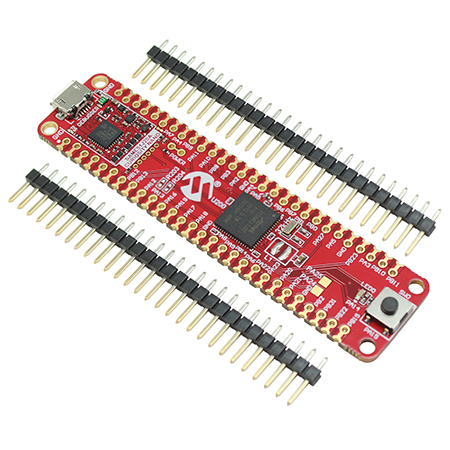
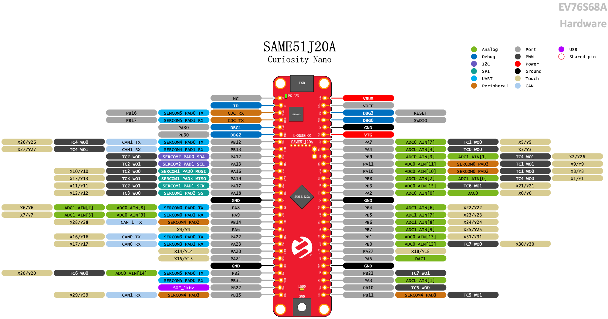

.. _atsame51_cnano:

SAM E51 Curiosity Nano Evaluation Kit
#####################################

Overview
********

The SAM E51 Curiosity Nano Evaluation Kit is a hardware
platform to evaluate the SAME51J20A microcontroller (MCU).
The evaluation kit provides easy access to the features of
the SAM E51 MCU to integrate the device into a custom design.
Because the evaluation kit contains an On-Board Nano Debugger
for programming and debugging, no external tools are necessary
to program the SAME51J20A device.

Hardware
********

- ATSAME51J20A ARM Cortex-M4F processor at up to 120 MHz
- 32.768 kHz crystal oscillator
- 1024 KiB flash memory and 256 KiB of RAM
- One yellow user LED
- One mechanical user push button
- On-board USB based EDBG unit with serial console

Supported Features
==================

The atsame51_cnano board configuration supports the following hardware
features:

+---------------+------------+-----+----------------------------+
| Interface     | Controller |     | Driver/Component           |
+===============+============+=====+============================+
| ADC           | on-chip    |     | adc                        |
+---------------+------------+-----+----------------------------+
| DMAC          | on-chip    |     | dma                        |
+---------------+------------+-----+----------------------------+
| EIC           | on-chip    |     | interrupt_controller       |
+---------------+------------+-----+----------------------------+
| GPIO          | on-chip    |     | gpio                       |
+---------------+------------+-----+----------------------------+
| MPU           | on-chip    |     | arch/arm                   |
+---------------+------------+-----+----------------------------+
| NVIC          | on-chip    |     | arch/arm                   |
+---------------+------------+-----+----------------------------+
| NVMCTRL       | on-chip    |     | flash                      |
+---------------+------------+-----+----------------------------+
| PORT          | on-chip    |     | pinctrl                    |
+---------------+------------+-----+----------------------------+
| RTC           | on-chip    |     | timer                      |
+---------------+------------+-----+----------------------------+
| SERCOM I2C    | on-chip    |     | i2c                        |
+---------------+------------+-----+----------------------------+
| SERCOM SPI    | on-chip    |     | spi                        |
+---------------+------------+-----+----------------------------+
| SERCOM USART  | on-chip    |     | serial, console            |
+---------------+------------+-----+----------------------------+
| Serial Number | on-chip    |     | hwinfo                     |
+---------------+------------+-----+----------------------------+
| SYSTICK       | on-chip    |     | timer                      |
+---------------+------------+-----+----------------------------+
| TC            | on-chip    |     | counter                    |
+---------------+------------+-----+----------------------------+
| TCC           | on-chip    |     | counter, pwm               |
+---------------+------------+-----+----------------------------+
| TRNG          | on-chip    |     | entropy                    |
+---------------+------------+-----+----------------------------+
| USB           | on-chip    |     | usb                        |
+---------------+------------+-----+----------------------------+
| WDT           | on-chip    |     | watchdog                   |
+---------------+------------+-----+----------------------------+

Other hardware features are not currently supported by Zephyr.

The default configuration can be found in the Kconfig
``boards/arm/atsame51_cnano/atsame51_cnano_defconfig``.

Pin Mapping
===========

The SAM E51 Curiosity Nano evaluation kit has 2 GPIO controllers. These
controllers are responsible for pin muxing, input/output, pull-up, etc.

For more details please refer to `SAM D5x/E5x Family Datasheet`_ and the 
`SAM E51 Curiosity Nano User Guide`_.

..
   Default Zephyr Peripheral Mapping:
   ----------------------------------
   - SERCOM2 USART TX : PB24
   - SERCOM2 USART RX : PB25
   - SERCOM4 SPI SCK  : PB26
   - SERCOM4 SPI MOSI : PB27
   - SERCOM4 SPI MISO : PB29
   - SERCOM7 I2C SDA  : PD08
   - SERCOM7 I2C SCL  : PD09
   - USB DP           : PA25
   - USB DM           : PA24

System Clock
============

The SAME54 MCU is configured to use the 32.768 kHz external oscillator
with the on-chip PLL generating the 48 MHz system clock.

SERCOMs
=======

The SAME51 MCU has 7 SERCOM interfaces which can be configured as UART / SPI
/ I2C interfaces. This board support file assigns these SERCOMs as follows:

Serial Ports
____________

Two SERCOM interfaces are configured as UARTs in this BSP.

SERCOM5 is the default Zephyr console.
   - SERCOM5 115200 8n1 connected to the onboard Atmel Embedded Debugger (EDBG)
SERCOM0 is a user UART.
   - SERCOM0 9600 8n1

SPI Port
________

One SERCOM interface is configured as SPI in this BSP.

SERCOM1 is a user SPI.

I2C Port
________

One SERCOM interface is configured as I2C in this BSP.

SERCOM2 is a user I2C.
   - SERCOM2 I2C Fast Mode (400kbps)

PWM
===

The SAME51 MCU has 5 TCC based PWM units with up to 6 outputs each and a period
of 24 bits or 16 bits.  If :code:`CONFIG_PWM_SAM0_TCC` is enabled then LED0 is
driven by TCC2 instead of by GPIO.

Programming and Debugging
*************************

The SAM E51 Curiosity Nano comes with a Atmel Embedded Debugger (EDBG). This
provides a debug interface to the SAME51 chip and is supported by
OpenOCD.

Flashing
========

#. Build the Zephyr kernel and the ``hello_world`` sample application:

   .. zephyr-app-commands::
      :zephyr-app: samples/hello_world
      :board: atsame51_cnano
      :goals: build
      :compact:

#. Connect the SAM E51 Curiosity Nano to your host computer using the USB debug
   port.

#. Run your favorite terminal program to listen for output. Under Linux the
   terminal should be :code:`/dev/ttyACM0`. For example:

   .. code-block:: console

      $ minicom -D /dev/ttyACM0 -o

   The -o option tells minicom not to send the modem initialization
   string. Connection should be configured as follows:

   - Speed: 115200
   - Data: 8 bits
   - Parity: None
   - Stop bits: 1

#. To flash an image:

   .. zephyr-app-commands::
      :zephyr-app: samples/hello_world
      :board: atsame51_cnano
      :goals: flash
      :compact:

   You should see "Hello World! atsame51_cnano" in your terminal.

References
**********

.. target-notes::

.. _Microchip website:
    https://www.microchip.com/en-us/product/ATSAME51J20A

.. _SAM D5x/E5x Family Datasheet:
    https://ww1.microchip.com/downloads/aemDocuments/documents/MCU32/ProductDocuments/DataSheets/SAM-D5x-E5x-Family-Data-Sheet-DS60001507.pdf

.. _SAM E51 Curiosity Nano User Guide:
    https://ww1.microchip.com/downloads/aemDocuments/documents/MCU32/ProductDocuments/UserGuides/SAM-E51-Curiosity-Nano-User-Guide-DS70005432.pdf
