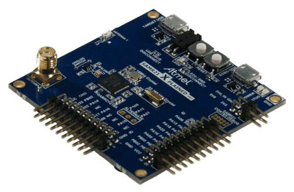

.. _atsamr21_xpro:

SAM R21 Xplained Pro Evaluation Kit
###################################

Overview
********

The SAM R21 Xplained Pro is a compact evaluation board by Atmel featuring a
ATSAMR21G18A SoC. The SoC includes a SAMR21 ARM Cortex-M0+ micro-controller
bundled with Atmel's AT86RF233, a 2.4GHz IEEE802.15.4 compatible radio.
The kit includes Atmel’s Embedded Debugger (EDBG), which provides a full
debug interface without the need for additional hardware.

Hardware
********

- ATSAMR21G18A ARM Cortex-M0+ processor at 48 MHz
- 32.768 kHz crystal oscillator
- 256 KiB flash memory and 32 KiB of RAM
- One yellow user LED
- One mechanical user push button
- One reset button
- On-board USB based EDBG unit with serial console

Supported Features
==================

The atsamr21_xpro board configuration supports the following hardware
features:

+-----------+------------+--------------------------------------+
| Interface | Controller | Driver/Component                     |
+===========+============+======================================+
| NVIC      | on-chip    | nested vector interrupt controller   |
+-----------+------------+--------------------------------------+
| SYSTICK   | on-chip    | systick                              |
+-----------+------------+--------------------------------------+
| WDT       | on-chip    | Watchdog                             |
+-----------+------------+--------------------------------------+
| GPIO      | on-chip    | I/O ports                            |
+-----------+------------+--------------------------------------+
| PWM       | on-chip    | Pulse Width Modulation               |
+-----------+------------+--------------------------------------+
| USART     | on-chip    | Serial ports                         |
+-----------+------------+--------------------------------------+
| SPI       | on-chip    | Serial Peripheral Interface ports    |
+-----------+------------+--------------------------------------+
| I2C       | on-chip    | I2C Peripheral Interface ports       |
+-----------+------------+--------------------------------------+

Other hardware features are not currently supported by Zephyr.

The default configuration can be found in the Kconfig
``boards/arm/atsamr21_xpro/atsamr21_xpro_defconfig``.

Pin Mapping
===========

The SAM R21 Xplained Pro evaluation kit has 3 GPIO controllers. These
controllers are responsible for pin muxing, input/output, pull-up, etc.

For mode details please refer to `SAM R21 Family Datasheet`_ and the `SAM R21
Xplained Pro Schematic`_.

.. image:: img/ATSAMR21-XPRO-pinout.jpg
     :align: center
     :alt: ATSAMR21-XPRO-pinout

Default Zephyr Peripheral Mapping:
----------------------------------
- SERCOM0 USART TX : PA5
- SERCOM0 USART RX : PA4
- SERCOM1 I2C SDA  : PA16
- SERCOM1 I2C SCL  : PA17
- SERCOM5 SPI MISO : PB02
- SERCOM5 SPI MOSI : PB22
- SERCOM5 SPI SCK  : PB23
- GPIO SPI CS      : PB03
- GPIO/PWM LED0    : PA19

System Clock
============

The SAMR21 MCU is configured to use the 32.768 kHz external oscillator
with the on-chip PLL generating the 48 MHz system clock.

Serial Port
===========

The SAMR21 MCU has six SERCOM based USARTs with two configured as USARTs in
this BSP. SERCOM0 is the default Zephyr console.

- SERCOM0 115200 8n1 connected to the onboard Atmel Embedded Debugger (EDBG)

PWM
===

The SAMR21 MCU has 3 TCC based PWM units with up to 4 outputs each and a
period of 24 bits or 16 bits.  If :code:`CONFIG_PWM_SAM0_TCC` is enabled then
LED0 is driven by TCC0 instead of by GPIO.

SPI Port
========

The SAMR21 MCU has 6 SERCOM based SPIs.

- SERCOM5 is exposed via Xplained Pro Standard Extension Header

I2C Port
========

When connecting an I2C device and a logic analyzer to an I2C port at the same
time, the internal pull-up resistors are not sufficient for stable bus
operation. You probably have to connect external pull-ups to both bus lines. 10K
is a good value to start with.

- SERCOM1 is exposed via Xplained Pro Standard Extension Header

Radio
=====

The SAMR21 SoC includes an on-chip AT86RF233 radio. It is internally
connected via SPI and some GPIO pins and behaves the same way as
externally connected SPI devices.

+-------------+------------------------------------------------------------------------------------------+
| Sensor      | AT86RF233                                                                                |
+=============+==========================================================================================+
| Type        | 2.4GHz IEEE802.15.4 radio                                                                |
+-------------+------------------------------------------------------------------------------------------+
| Vendor      | Atmel                                                                                    |
+-------------+------------------------------------------------------------------------------------------+
| Datasheet   |`Datasheet <http://www.atmel.com/images/atmel-8351-mcu_wireless-at86rf233_datasheet.pdf>`_|
+-------------+------------------------------------------------------------------------------------------+
| connected to| SPI_0                                                                                    |
+-------------+------------------------------------------------------------------------------------------+
| Pin Config:                                                                                            |
+-------------+------------------------------------------------------------------------------------------+
| Device      | SERCOM4                                                                                  |
+-------------+------------------------------------------------------------------------------------------+
| MOSI        | PB30 (OUT, SPI MOSI)                                                                     |
+-------------+------------------------------------------------------------------------------------------+
| MISO        | PC19 (IN, SPI MISO)                                                                      |
+-------------+------------------------------------------------------------------------------------------+
| SCLK        | PC18 (OUT, SPI SCLK)                                                                     |
+-------------+------------------------------------------------------------------------------------------+
| CS          | PB31 (OUT, GPIO output)                                                                  |
+-------------+------------------------------------------------------------------------------------------+
| IRQ         | PB00 (IN, GPIO external interrupt)                                                       |
+-------------+------------------------------------------------------------------------------------------+
| RSTN        | PB15 (OUT, GPIO output)                                                                  |
+-------------+------------------------------------------------------------------------------------------+
| SLP_TR      | PA20 (OUT, GPIO output)                                                                  |
+-------------+------------------------------------------------------------------------------------------+

Zephyr provide several samples that can use this technology. You can check
:zephyr:code-sample:`wpan-usb` and :zephyr:code-sample:`wpan-serial` examples as starting
points. Another good test can be done with IPv6 by using the server/client
echo demo. More information at :zephyr:code-sample:`sockets-echo-server` and
:zephyr:code-sample:`sockets-echo-client`.

Programming and Debugging
*************************

The SAM R21 Xplained Pro comes with a Atmel Embedded Debugger (EDBG).  This
provides a debug interface to the SAMR21 chip and is supported by
OpenOCD.

Flashing
========

#. Build the Zephyr kernel and the :ref:`hello_world` sample application:

   .. zephyr-app-commands::
      :zephyr-app: samples/hello_world
      :board: atsamr21_xpro
      :goals: build
      :compact:

#. Connect the SAM R21 Xplained Pro to your host computer using the USB debug
   port.

#. Run your favorite terminal program to listen for output. Under Linux the
   terminal should be :code:`/dev/ttyACM0`. For example:

   .. code-block:: console

      $ minicom -D /dev/ttyACM0 -o

   The -o option tells minicom not to send the modem initialization
   string. Connection should be configured as follows:

   - Speed: 115200
   - Data: 8 bits
   - Parity: None
   - Stop bits: 1

#. To flash an image:

   .. zephyr-app-commands::
      :zephyr-app: samples/hello_world
      :board: atsamr21_xpro
      :goals: flash
      :compact:

   You should see "Hello World! atsamr21_xpro" in your terminal.

References
**********

.. target-notes::

.. _Microchip website:
    http://www.microchip.com/DevelopmentTools/ProductDetails.aspx?PartNO=ATSAMR21-XPRO

.. _SAM R21 Family Datasheet:
    http://ww1.microchip.com/downloads/en/devicedoc/sam-r21_datasheet.pdf

.. _SAM R21 Xplained Pro Schematic:
    http://ww1.microchip.com/downloads/en/DeviceDoc/SAMR21-Xplained-Pro_Design-Documentation.zip
