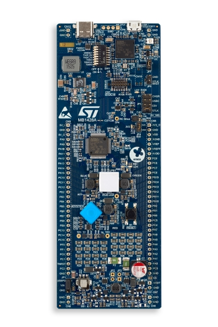

.. _b_g474e_dpow1_board:

ST B-G474E-DPOW1 Discovery
##########################

Overview
********
The B-G474E-DPOW1 Discovery kit is a digital power solution and a complete
demonstration and development platform for the STMicroelectronics STM32G474RET6
microcontroller. Leveraging the new HRTimer-oriented features, 96 Kbytes of
embedded RAM, math accelerator functions and USB-PD 3.0 offered by STM32G474RET6,
the B-G474E-DPOW1 Discovery kit, based on the USB 2.0 FS Type-C™ connector
interface, helps the user to prototype applications with digital power such as a
buck-boost converter, RGB power LED lighting or a class-D audio amplifier. The
B-G474E-DPOW1 Discovery kit does not require any separate probe, as it integrates
the STLINK-V3E debugger and programmer.

- STM32G474RET6 Arm® Cortex®-M4 core-based microcontroller, featuring 512 Kbytes
  of Flash memory and 128 Kbytes of SRAM, in LQFP64 package
- USB Type-C™ with USB 2.0 FS interface compatible with USB-PD 3.0
- RGB power LED for a bright lighting
- Digital power buck-boost converter with internal or external Input voltage and
  with onboard resistor loads
- Audio Class-D amplifier capable
- 4 user LEDs
- 3 LEDs for power and ST-LINK communication
- 4-direction joystick with a selection button
- Reset push-button
- Board connectors:
    - USB Type-C™
    - USB Micro-B
    - 2 x 32-pin header, 2.54 mm pitch, daughterboard extension connector for breadboard connection
- Flexible power-supply options: ST-LINK USB VBUS or USB Type-C™ VBUS or external source
- On-board STLINK-V3E debugger/programmer with USB re-enumeration capability: mass storage,
  Virtual COM port, and debug port

More information about the board can be found at the `B-G474E-DPOW1 website`_.

More information about STM32G474RE can be found here:
- `G474RE on www.st.com`_
- `STM32G4 reference manual`_

Supported Features
==================

The Zephyr b_g474e_dpow1 board configuration supports the following hardware features:

+-----------+------------+-------------------------------------+
| Interface | Controller | Driver/Component                    |
+===========+============+=====================================+
| NVIC      | on-chip    | nested vector interrupt controller  |
+-----------+------------+-------------------------------------+
| UART      | on-chip    | serial port-polling;                |
|           |            | serial port-interrupt               |
+-----------+------------+-------------------------------------+
| GPIO      | on-chip    | gpio                                |
+-----------+------------+-------------------------------------+
| USB       | on-chip    | usb                                 |
+-----------+------------+-------------------------------------+
| UCPD      | on-chip    | ucpd                                |
+-----------+------------+-------------------------------------+
| WATCHDOG  | on-chip    | independent watchdog                |
+-----------+------------+-------------------------------------+

Other hardware features are not yet supported in this Zephyr port.

The default configuration can be found in the defconfig file:
``boards/arm/b_g474e_dpow1/b_g474e_dpow1_defconfig``

Connections and IOs
===================

Each of the GPIO pins can be configured by software as output (push-pull or open-drain), as
input (with or without pull-up or pull-down), or as peripheral alternate function. Most of the
GPIO pins are shared with digital or analog alternate functions. All GPIOs are high current
capable except for analog inputs.

Default Zephyr Peripheral Mapping:
----------------------------------

- UART_3 TX/RX       : PC10/PC11 (ST-Link Virtual Port Com)
- BUTTON (JOY_SEL)   : PC13
- BUTTON (JOY_LEFT)  : PC4
- BUTTON (JOY_DOWN)  : PC5
- BUTTON (JOY_RIGHT) : PB2
- BUTTON (JOY_UP)    : PB10
- LED (DOWN BLUE)    : PA15
- LED (LEFT ORANGE)  : PB1
- LED (UP RED)       : PB5
- LED (RIGHT GREEN)  : PB7
- USB DM             : PA11
- USB DP             : PA12
- UCPD CC2           : PB4
- UCPD CC1           : PB6

For mode details please refer to `B-G474E-DPOW1 Discovery board User Manual`_.

Programming and Debugging
*************************

Applications for the ``b_g474e_dpow1`` board configuration can be built and
flashed in the usual way (see :ref:`build_an_application` and
:ref:`application_run` for more details).

Flashing
========

The B-G474E-DPOW1 Discovery board includes an ST-LINK/V3E embedded debug tool interface.

.. code-block:: console

   $ west flash

Flashing an application to the B_G474E_DPOW1
--------------------------------------------

Here is an example for the :zephyr:code-sample:`blinky` application.

.. zephyr-app-commands::
   :zephyr-app: samples/basic/blinky
   :board: b_g474e_dpow1
   :goals: build flash

You will see the LED blinking every second.

Debugging
=========

You can debug an application in the usual way. Here is an example for the
:ref:`hello_world` application.

.. zephyr-app-commands::
   :zephyr-app: samples/hello_world
   :board: b_g474e_dpow1
   :maybe-skip-config:
   :goals: debug

References
**********

.. target-notes::

.. _B-G474E-DPOW1 website:
   https://www.st.com/en/evaluation-tools/b-g474e-dpow1.html

.. _STM32G4 reference manual:
   https://www.st.com/resource/en/reference_manual/rm0440-stm32g4-series-advanced-armbased-32bit-mcus-stmicroelectronics.pdf

.. _B-G474E-DPOW1 Discovery board User Manual:
   https://www.st.com/resource/en/user_manual/um2577-discovery-kit-with-stm32g474re-mcu-stmicroelectronics.pdf

.. _G474RE on www.st.com:
   https://www.st.com/en/microcontrollers-microprocessors/stm32g474re.html
