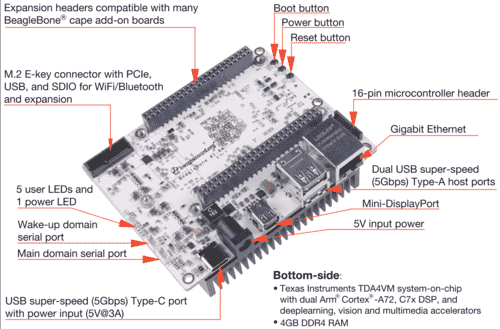

.. _beaglebone_ai64:

BeagleBone AI-64
################

Overview
********
BeagleBone AI-64 is a computational platform powered by TI J721E SoC, which is
targeted for automotive applications.

Hardware
********
The BeagleBone AI-64 is powered by TI J721E SoC, which has three domains (Main,
MCU, WKUP). This document gives overview of Zephyr running on Cortex R5 in the
Main domain.

L1 Memory System
----------------
* 16 KB instruction cache.
* 16 KB data cache.
* 64 KB TCM.

Region Address Translation
--------------------------
The RAT module performs a region based address translation. It translates a
32-bit input address into a 48-bit output address. Any input transaction that
starts inside of a programmed region will have its address translated, if the
region is enabled.

VIM Interrupt Controller
------------------------
The VIM aggregates device interrupts and sends them to the R5F CPU(s). The VIM
module supports 512 interrupt inputs per R5F core. Each interrupt can be either
a level or a pulse (both active-high). The VIM has two interrupt outputs per core
IRQ and FIQ.

Supported Features
******************
The board configuration supports,

+-----------+------------+----------------------+
| Interface | Controller | Driver/Component     |
+===========+============+======================+
| UART      | on-chip    | serial               |
+-----------+------------+----------------------+

Other hardwares features are currently not supported.

The default configuration can be found in the defconfig file.

Flashing
********
The Zephyr image can be flashed to J721E Cortex R5 through remoteproc from
Linux (Running on A72).

Note:
-----
Use the latest Linux image from https://beagleboard.org/latest-images to bootup
the BBAI-64. This is required for loading zephyr.elf/binary using remoteproc.

Steps to flash the image
------------------------
The example shows how to load an image on Cortex R5FSS0_CORE0 on J721e.

| Copy Zephyr image to the /lib/firmware/ directory.
| ``cp build/zephyr/zephyr.elf /lib/firmware/``
|
| Ensure the Core is not running.
| ``echo stop > /sys/class/remoteproc/remoteproc18/state``
|
| Configuring the image name to the remoteproc module.
| ``echo zephyr.elf > /sys/class/remoteproc/remoteproc18/firmware``
|
| Once the image name is configured, send the start command.
| ``echo start > /sys/class/remoteproc/remoteproc18/state``

Console
-------
The Zephyr on BeagleBone AI-64 J721E Cortex R5 uses UART 2 (Rx p8.22, Tx p8.34)
as console.

References
**********
* `BeagleBone AI-64 Homepage <https://beagleboard.org/ai-64>`_
* `J721E TRM <https://www.ti.com/lit/zip/spruil1>`_
