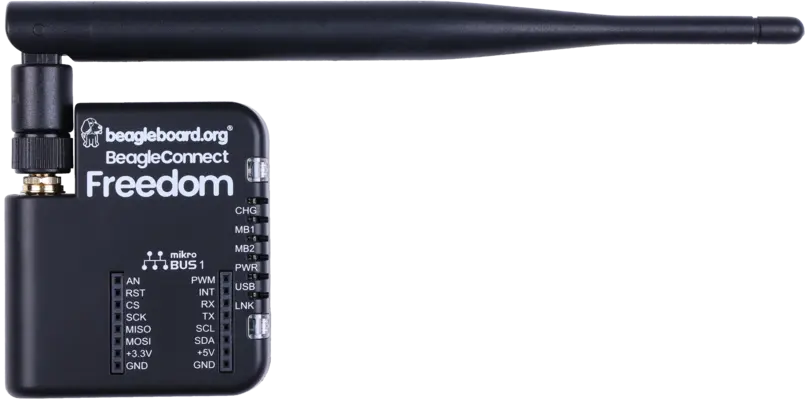
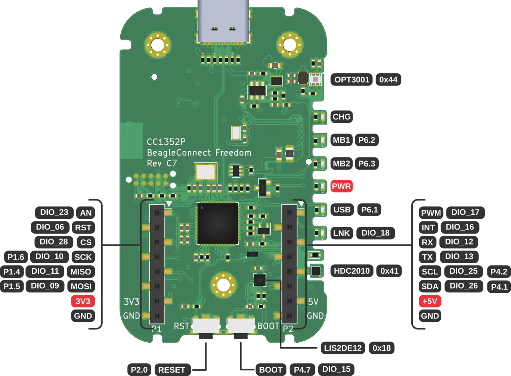

.. _beagleconnect_freedom:

BeagleConnect Freedom
#####################

Overview
********

BeagleBoard.org BeagleConnect Freedom is a wireless
Internet of Things board based on the SimpleLink multi-Standard CC1352P7 wireless MCU.

   BeagleBoard.org BeagleConnect Freedom

Hardware
********
BeagleBoard.org BeagleConnect Freedom board features the TI CC1352P7 wireless microcontroller.
The BeagleConnect Freedom is the first available BeagleConnect solution consisting
of a board and a case which ships programmed and ready to be used.

BeagleConnect Freedom board runs the Zephyr RTOS and has mikroBUS ports along
with BLE and Sub-GHz radios on it.

The CC1352P7 wireless MCU has a 48 MHz Arm Cortex-M4F SoC and a Bluetooth Low Energy and IEEE 802.15.4.

The board also features a TI MSP430F5503 microcontroller used as a USB-to-serial bridge and
GPIO expander.

Supported Features
==================

The board configuration supports the following hardware features:

+-----------+------------+----------------------+
| Interface | Controller | Driver/Component     |
+===========+============+======================+
| GPIO      | on-chip    | gpio                 |
+-----------+------------+----------------------+
| MPU       | on-chip    | arch/arm             |
+-----------+------------+----------------------+
| NVIC      | on-chip    | arch/arm             |
+-----------+------------+----------------------+
| PINMUX    | on-chip    | pinmux               |
+-----------+------------+----------------------+
| UART      | on-chip    | serial               |
+-----------+------------+----------------------+
| I2C       | on-chip    | i2c                  |
+-----------+------------+----------------------+
| SPI       | on-chip    | spi                  |
+-----------+------------+----------------------+
| I2C       | off-chip   | OPT3001              |
+-----------+------------+----------------------+
| I2C       | off-chip   | HDC2010              |
+-----------+------------+----------------------+
| I2C       | off-chip   | BCF_BRIDGE_MCU       |
+-----------+------------+----------------------+

Connections and IOs
===================

   BeagleConnect Freedom front connections

.. figure:: img/beagleconnect_freedom_back_annotated.webp
   :align: center
   :width: 500px
   :alt: Back connections

   BeagleConnect Freedom back connections

+-------+--------------+-------------------------------------+
| Pin   | Function     | Usage                               |
+=======+==============+=====================================+
| DIO5  | RST_MB2      | Reset mikroBUS port 2               |
+-------+--------------+-------------------------------------+
| DIO6  | RST_MB1      | Reset mikroBUS port 1               |
+-------+--------------+-------------------------------------+
| DIO7  | INT_SENSOR   | On-board sensor interrupts          |
+-------+--------------+-------------------------------------+
| DIO8  | FLASH_CS     | SPI flash chip-select               |
+-------+--------------+-------------------------------------+
| DIO9  | SDO / PICO   | SPI serial data output              |
+-------+--------------+-------------------------------------+
| DIO10 | SCK          | SPI serial clock                    |
+-------+--------------+-------------------------------------+
| DIO11 | SDI / POCI   | SPI serial data input               |
+-------+--------------+-------------------------------------+
| DIO12 | CC1352_RX    | UART RXD mikroBUS port 1 or MSP430  |
+-------+--------------+-------------------------------------+
| DIO13 | CC1352_TX    | UART TXD mikroBUS port 1 or MSP430  |
+-------+--------------+-------------------------------------+
| DIO14 | I2C_CTRL     | Enable on-board sensor I2C bus      |
+-------+--------------+-------------------------------------+
| DIO15 | USER_BOOT    | BOOT button status                  |
+-------+--------------+-------------------------------------+
| DIO16 | INT_MB1      | INTERRUPT PIN on mikroBUS port 1    |
+-------+--------------+-------------------------------------+
| DIO17 | PWM_MB1      | PWM PIN on mikroBUS port 1          |
+-------+--------------+-------------------------------------+
| DIO18 | LED_LINK     | Radio link indicator LED            |
+-------+--------------+-------------------------------------+
| DIO19 | PWM_MB2      | PWM PIN on mikroBUS port 2          |
+-------+--------------+-------------------------------------+
| DIO20 | INT_MB2      | INTERRUPT PIN on mikroBUS port 2    |
+-------+--------------+-------------------------------------+
| DIO21 | MB2_RX       | UART RXD on mikroBUS port 2         |
+-------+--------------+-------------------------------------+
| DIO22 | MB2_TX       | UART TXD on mikroBUS port 2         |
+-------+--------------+-------------------------------------+
| DIO23 | AN_MB1       | ANALOG PIN on mikroBUS port 1       |
+-------+--------------+-------------------------------------+
| DIO24 | AN_MB2       | ANALOG PIN on mikroBUS port 2       |
+-------+--------------+-------------------------------------+
| DIO25 | SCL          | I2C SCL                             |
+-------+--------------+-------------------------------------+
| DIO26 | SDA          | I2C SDA                             |
+-------+--------------+-------------------------------------+
| DIO27 | CS_MB2       | SPI CS on microBUS port 2           |
+-------+--------------+-------------------------------------+
| DIO28 | CS_MB1       | SPI CS on microBUS port 1           |
+-------+--------------+-------------------------------------+
| DIO29 | REF_SW_CTRL1 | Antenna mux PA enable               |
+-------+--------------+-------------------------------------+
| DIO30 | REF_SW_CTRL2 | Antenna mux SubG enable             |
+-------+--------------+-------------------------------------+

References
**********

BeagleBoard.org BeagleConnect Freedom reference:
  https://beagleconnect.org
