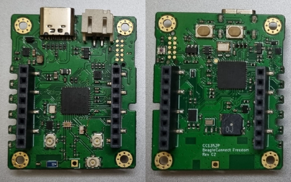

.. _beagleconnect_freedom:

BeagleConnect Freedom
#####################

Overview
********

BeagleBoard.org BeagleConnect Freedom is a wireless
Internet of Things board based on the SimpleLink multi-Standard CC1352P wireless MCU.

   BeagleBoard.org BeagleConnect Freedom

Hardware
********
BeagleBoard.org BeagleConnect Freedom board features the CC1352P wireless microcontroller.
The BeagleConnect Freedom is the first available BeagleConnect solution consisting
of a board and a case which ships programmed and ready to be used.

BeagleConnect Freedom board runs the Zephyr RTOS and has mikroBUS ports along 
with BLE and Sub-GHz radios on it.

The CC1352P wireless MCU has a 48 MHz Arm Cortex-M4F SoC and a Bluetooth Low Energy and IEEE 802.15.4.

Supported Features
==================

The CC1352P LaunchPad board configuration supports the following hardware
features:

+-----------+------------+----------------------+
| Interface | Controller | Driver/Component     |
+===========+============+======================+
| GPIO      | on-chip    | gpio                 |
+-----------+------------+----------------------+
| PINMUX    | on-chip    | pinmux               |
+-----------+------------+----------------------+
| UART      | on-chip    | serial               |
+-----------+------------+----------------------+
| I2C       | on-chip    | i2c                  |
+-----------+------------+----------------------+
| SPI       | on-chip    | spi                  |
+-----------+------------+----------------------+

Other hardware features are not supported by the Zephyr kernel.

Connections and IOs
===================

+-------+------------+---------------------+
| Pin   | Function   | Usage               |
+=======+============+=====================+
| DIO5  | RST_MB2    | RESET PIN (MB2)     |
+-------+------------+---------------------+
| DIO6  | RST_MB1    | RESET PIN (MB1)     |
+-------+------------+---------------------+
| DIO7  | INT_SENSOR | INTERRUPT PIN       |
+-------+------------+---------------------+
| DIO8  | FLASH_CS   | Flash CS            |
+-------+------------+---------------------+
| DIO9  | MOSI       | SPI MOSI (MB1/MB2)  |
+-------+------------+---------------------+
| DIO10 | SCK        | SPI CLK (MB1/MB2)   |
+-------+------------+---------------------+
| DIO11 | MISO       | SPI MISO (MB1/MB2)  |
+-------+------------+---------------------+
| DIO12 |            | UART RXD (MB1/430)  |
+-------+------------+---------------------+
| DIO13 |            | UART TXD (MB1/430)  |
+-------+------------+---------------------+
| DIO14 | 900M       | D5 LED              |
+-------+------------+---------------------+
| DIO15 | USER_BOOT  | BOOT BUTTON         |
+-------+------------+---------------------+
| DIO16 | CC1352_TDO | JTAG TDO            |
+-------+------------+---------------------+
| DIO17 | CC1352_TDI | JTAG TDI            |
+-------+------------+---------------------+
| DIO18 | 2.4G       | D6 LED              |
+-------+------------+---------------------+
| DIO19 | PWM_MB2    | PWM PIN (MB2)       |
+-------+------------+---------------------+
| DIO20 | INT_MB2    | INTERRUPT PIN (MB2) |
+-------+------------+---------------------+
| DIO21 | TX_MB2_RX  | UART RXD (MB2)      |
+-------+------------+---------------------+
| DIO22 | RX_MB2_TX  | UART TXD (MB2)      |
+-------+------------+---------------------+
| DIO23 | AN_MB1     | ANALOG PIN (MB1)    |
+-------+------------+---------------------+
| DIO24 | AN_MB2     | ANALOG PIN (MB2)    |
+-------+------------+---------------------+
| DIO25 | SCL        | I2C SCL (MB1/MB2)   |
+-------+------------+---------------------+
| DIO26 | SDA        | I2C SDA (MB1/MB2)   |
+-------+------------+---------------------+
| DIO27 | CS_MB2     | SPI CS (MB2)        |
+-------+------------+---------------------+
| DIO28 | CS_MB1     | SPI CS (MB1)        |
+-------+------------+---------------------+
| DIO29 | INT_MB1    | INTERRUPT PIN (MB1) |
+-------+------------+---------------------+
| DIO30 | PWM_MB1    | PWM PIN (MB1)       |
+-------+------------+---------------------+

References
**********

BeagleBoard.org BeagleConnect Freedom reference repository:
  https://beagleconnect.org
