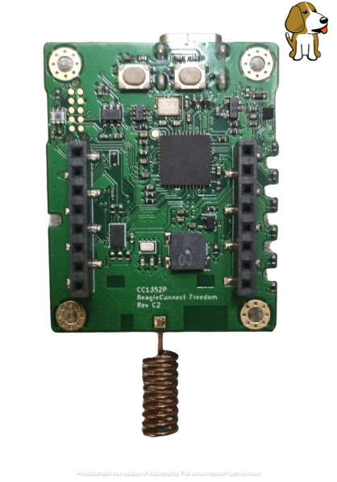

.. _beagleconnect_freedom_cc1352r:

BeagleBoard BeagleConnect Freedom
#################

Overview
********

The BeagleBoard BeagleConnect Freedom is a wireless
IOT board based on the SimpleLink |trade| multi-Standard CC1352R wireless MCU.

   BeagleBoard BeagleConnect Freedom |trade|

Hardware
********

The BeagleBoard BeagleConnect Freedom IOT board features the CC1352R wireless MCU.
The BeagleConnect Freedom is the first available BeagleConnect solution consisting
 of a board and a case which ships programmed and ready to be used.
 The BeagleConnect Freedom board runs the Zephyr RTOS has mikroBUS ports along
 with BLE and Sub-GHz radios on it.

The CC13522 wireless MCU has a 48 MHz Arm |reg| Cortex |reg|-M4F SoC and an
integrated Sub-1 and 2.4 GHz transceiver supporting multiple protocols including
Bluetooth |reg| Low Energy and IEEE |reg| 802.15.4.

Supported Features
==================

The CC1352R LaunchPad board configuration supports the following hardware
features:

+-----------+------------+----------------------+
| Interface | Controller | Driver/Component     |
+===========+============+======================+
| GPIO      | on-chip    | gpio                 |
+-----------+------------+----------------------+
| NVIC      | on-chip    | arch/arm             |
+-----------+------------+----------------------+
| PINMUX    | on-chip    | pinmux               |
+-----------+------------+----------------------+
| UART      | on-chip    | serial               |
+-----------+------------+----------------------+
| I2C       | on-chip    | i2c                  |
+-----------+------------+----------------------+
| SPI       | on-chip    | spi                  |
+-----------+------------+----------------------+

Other hardware features are not supported by the Zephyr kernel.

References
*********

BeagleBoard BeagleConnect Freedom reference repository:
  https://github.com/jadonk/beagleconnect
