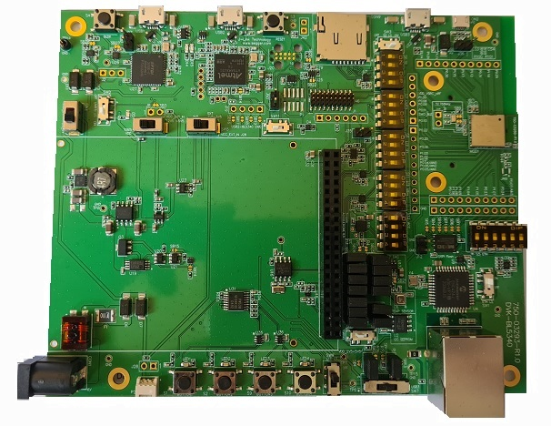

.. _bl5340_dvk:

Laird Connectivity BL5340 DVK
#############################

Overview
********

The BL5340 DVK is a single-board development kit for evaluation of
and development on the Laird Connectivity BL5340 Bluetooth module.

The BL5340 incorporates a Nordic nRF5340 SoC, with details as follows.

The nRF5340 is a dual-core SoC based on the Arm® Cortex®-M33 architecture,
with:

* a full-featured ARM Cortex-M33F core with DSP instructions, FPU, and
  ARMv8-M Security Extension, running at up to 128 MHz, referred to as
  the **Application MCU**
* a secondary ARM Cortex-M33 core, with a reduced feature set, running at
  a fixed 64 MHz, referred to as the **Network MCU**.

The bl5340_dvk_cpuapp provides support for the Application MCU on the
BL5340 DVK. The bl5340_dvk_cpunet provides support for the Network
MCU on the BL5340 DVK.

The nRF5340 SoC provides support for the following devices:

* :abbr:`ADC (Analog to Digital Converter)`
* CLOCK
* FLASH
* :abbr:`GPIO (General Purpose Input Output)`
* :abbr:`IDAU (Implementation Defined Attribution Unit)`
* :abbr:`I2C (Inter-Integrated Circuit)`
* :abbr:`MPU (Memory Protection Unit)`
* :abbr:`NVIC (Nested Vectored Interrupt Controller)`
* :abbr:`PWM (Pulse Width Modulation)`
* :abbr:`QSPI (Quad Serial Peripheral Interface)`
* RADIO (Bluetooth Low Energy and 802.15.4)
* :abbr:`RTC (nRF RTC System Clock)`
* Segger RTT (RTT Console)
* :abbr:`SPI (Serial Peripheral Interface)`
* :abbr:`UARTE (Universal asynchronous receiver-transmitter)`
* :abbr:`USB (Universal Serial Bus)`
* :abbr:`WDT (Watchdog Timer)`

     BL5340 DVK (Credit: Laird Connectivity)

More information about the board can be found at the
`BL5340 homepage`_.

The `Nordic Semiconductor Infocenter`_
contains the processor's information and the datasheet.

Hardware
********

The BL5340 module incorporates a 32MHz external clock.

The BL5340 DVK includes a 32.768kHz clock for Low Speed operations.

Supported Features
==================

The bl5340_dvk_cpuapp board configuration supports the following
hardware features:

+-----------+------------+----------------------+
| Interface | Controller | Driver/Component     |
+===========+============+======================+
| ADC       | on-chip    | adc                  |
+-----------+------------+----------------------+
| CLOCK     | on-chip    | clock_control        |
+-----------+------------+----------------------+
| FLASH     | on-chip    | flash                |
+-----------+------------+----------------------+
| GPIO      | on-chip    | gpio                 |
+-----------+------------+----------------------+
| I2C(M)    | on-chip    | i2c                  |
+-----------+------------+----------------------+
| MPU       | on-chip    | arch/arm             |
+-----------+------------+----------------------+
| NVIC      | on-chip    | arch/arm             |
+-----------+------------+----------------------+
| PWM       | on-chip    | pwm                  |
+-----------+------------+----------------------+
| QSPI      | on-chip    | qspi                 |
+-----------+------------+----------------------+
| RTC       | on-chip    | system clock         |
+-----------+------------+----------------------+
| RTT       | Segger     | console              |
+-----------+------------+----------------------+
| SPI(M/S)  | on-chip    | spi                  |
+-----------+------------+----------------------+
| SPU       | on-chip    | system protection    |
+-----------+------------+----------------------+
| UARTE     | on-chip    | serial               |
+-----------+------------+----------------------+
| USB       | on-chip    | usb                  |
+-----------+------------+----------------------+
| WDT       | on-chip    | watchdog             |
+-----------+------------+----------------------+

The bl5340_dvk_cpunet board configuration supports the following
hardware features:

+-----------+------------+----------------------+
| Interface | Controller | Driver/Component     |
+===========+============+======================+
| CLOCK     | on-chip    | clock_control        |
+-----------+------------+----------------------+
| FLASH     | on-chip    | flash                |
+-----------+------------+----------------------+
| GPIO      | on-chip    | gpio                 |
+-----------+------------+----------------------+
| I2C(M)    | on-chip    | i2c                  |
+-----------+------------+----------------------+
| MPU       | on-chip    | arch/arm             |
+-----------+------------+----------------------+
| NVIC      | on-chip    | arch/arm             |
+-----------+------------+----------------------+
| RADIO     | on-chip    | Bluetooth,           |
|           |            | ieee802154           |
+-----------+------------+----------------------+
| RTC       | on-chip    | system clock         |
+-----------+------------+----------------------+
| RTT       | Segger     | console              |
+-----------+------------+----------------------+
| SPI(M/S)  | on-chip    | spi                  |
+-----------+------------+----------------------+
| UARTE     | on-chip    | serial               |
+-----------+------------+----------------------+
| WDT       | on-chip    | watchdog             |
+-----------+------------+----------------------+

Other hardware features are not supported by the Zephyr kernel.
See the `BL5340 homepage`_ for a complete list of BL5340 DVK board hardware
features.

LEDs & Push Buttons
===================

An eight-pin port expander is used to provide additional inputs and outputs
to the BL5340 module.

Refer to the `TI TCA9538 datasheet`_ for further details.

LEDs
----

LEDs are connected to the port expander pins as follows. Note the LEDs are
active low.

+--------------+---------------+
| Pin          | Function      |
+==============+===============+
| P4           | LED1          |
+--------------+---------------+
| P5           | LED2          |
+--------------+---------------+
| P6           | LED3          |
+--------------+---------------+
| P7           | LED4          |
+--------------+---------------+

Push buttons
------------

Push Buttons are connected to the port expander pins as follows. Note the push
buttons are active low.

+--------------+---------------+
| Pin          | Function      |
+==============+===============+
| P0           | BUTTON1       |
+--------------+---------------+
| P1           | BUTTON2       |
+--------------+---------------+
| P2           | BUTTON3       |
+--------------+---------------+
| P3           | BUTTON4       |
+--------------+---------------+

An additional push-button is available that is connected directly to the BL5340
module as follows.

* BOOT = BUTTON5 = SW4 = boot

External Memory
===============

Several external memory sources are available for the BL5340 DVK. These are
described as follows.

Flash Memory
------------

A Macronix MX25R6435FZNIL0 8MB external QSPI Flash memory part is incorporated
for application image storage and large datasets.

Refer to the `Macronix MX25R6435FZNIL0 datasheet`_ for further details.

EEPROM Memory
-------------

A 32KB Giantec GT24C256C-2GLI-TR EEPROM is available via I2C for storage of
infrequently updated data and small datasets.

Refer to the `Giantec GT24C256C-2GLI-TR datasheet`_ for further details.

External Memory
---------------

An on-board SDCARD slot is available for use with SDCARDS.

Sensors
=======

The BL5340 DVK incorporates two sensors for user application testing.
These are described as follows.

Temperature, Pressure, Humidity & Air Quality Sensor
----------------------------------------------------

A Bosch BME680 Temperature, Pressure, Humidity & Air Quality sensor is
available via I2C for environmental measurement applications.

Refer to the `Bosch BME680 datasheet`_ for further details.

3-Axis Accelerometer
--------------------

An ST Microelectronics LIS3DH 3-Axis Accelerometer is available via I2C for
vibration and motion detection applications.

Refer to the `ST Microelectronics LIS3DH datasheet`_ for further details.

Ethernet
========

Cabled 10/100 Base-T Ethernet Connectivity is available via a Microchip
ENC424J600 Ethernet controller.

Refer to the `Microchip ENC424J600 datasheet`_ for further details.

TFT Display & Capacitive Touch Screen Controller
================================================

A 2.8 inch, 240 x 320 pixel TFT display with capacitive touch controller is
included with the BL5340 DVK for user interface application features.

Refer to the `ER_TFTM028_4 datasheet`_ for a high level overview of the
display.

An ILI9341 TFT controller is incorporated in the TFT module and
acts as the main controller.

Refer to the `ILI9341 datasheet`_ for further details.

An FT6206 Capacitive Touch Controller, controlled via I2C is
also incorporated in the TFT module.

Refer to the `FT6206 datasheet`_ for further details.

Real-Time Clock
===============

A real-time clock is available for accurate time data availability.

Refer to the `Microchip MCP7940N datasheet`_ for further details.

DAC
===

A 10-bit Digital to Analog Converter is incorporated for generation of variable
voltages.

Refer to the `Microchip MCP4725 datasheet`_ for further details.

Power Amplifier/Low Noise Amplifier (PA/LNA)
============================================

The PA version of the BL5340 module incorporates a PA/LNA for long range
applications. This is based upon the Nordic nRF21540 Front End Module.

Refer to the `Nordic nRF21540 datasheet`_ for further details.

Security components
===================

- Implementation Defined Attribution Unit (`IDAU`_) on the Application MCU.
  The IDAU is implemented with the System Protection Unit and is used to
  define secure and non-secure memory maps.  By default, all of the memory
  space  (Flash, SRAM, and peripheral address space) is defined to be secure
  accessible only.
- Secure boot.

Programming and Debugging
*************************

The BL5340 DVK Application MCU supports the Armv8m Security Extension.
Applications built for the bl5340_dvk_cpuapp board by default
boot in the Secure state.

The BL5340 DVK Network MCU does not support the Armv8m Security Extension.
nRF5340 IDAU may configure bus accesses by the nRF5340 Network MCU
to have Secure attribute set; the latter allows to build and run
Secure only applications on the nRF5340 SoC.

Building Secure/Non-Secure Zephyr applications
==============================================

The process requires the following steps:

1. Build the Secure Zephyr application for the Application MCU
   using ``-DBOARD=bl5340_dvk_cpuapp`` and
   ``CONFIG_TRUSTED_EXECUTION_SECURE=y`` in the application
   project configuration file.
2. Build the Non-Secure Zephyr application for the Application MCU
   using ``-DBOARD=bl5340_dvk_cpuappns``.
3. Merge the two binaries together.
4. Build the application firmware for the Network MCU using
   ``-DBOARD=bl5340_dvk_cpunet``.

When building a Secure/Non-Secure application for the BL5340 DVK Application
MCU, the Secure application will have to set the IDAU (SPU) configuration to
allow Non-Secure access to all CPU resources utilized by the Non-Secure
application firmware. SPU configuration shall take place before jumping to the
Non-Secure application.

Building a Secure only application
==================================

Build the Zephyr app in the usual way (see :ref:`build_an_application`
and :ref:`application_run`), using ``-DBOARD=bl5340_dvk_cpuapp`` for
the firmware running on the BL5340 Application MCU, and using
``-DBOARD=bl5340_dvk_cpunet`` for the firmware running
on the BL5340 Network MCU.

Flashing
========

Follow the instructions in the :ref:`nordic_segger` page to install
and configure all the necessary software. Further information can be
found in :ref:`nordic_segger_flashing`. Then build and flash
applications as usual (see :ref:`build_an_application` and
:ref:`application_run` for more details).

Here is an example for the :ref:`hello_world` application running on the
BL5340 DVK Application MCU.

First, run your favorite terminal program to listen for output.

.. code-block:: console

   $ minicom -D <tty_device> -b 115200

Replace :code:`<tty_device>` with the port where the BL5340 DVK board
can be found. For example, under Linux, :code:`/dev/ttyACM0`.

Then build and flash the application in the usual way.

.. zephyr-app-commands::
   :zephyr-app: samples/hello_world
   :board: bl5340_dvk_cpuapp
   :goals: build flash

Debugging
=========

Refer to the :ref:`nordic_segger` page to learn about debugging a BL5340 DVK
board with a Segger IC.

Testing Bluetooth on the BL5340 DVK
***********************************
Many of the Bluetooth examples will work on the BL5340 DVK.
Try them out:

* :ref:`ble_peripheral`
* :ref:`bluetooth-eddystone-sample`
* :ref:`bluetooth-ibeacon-sample`

References
**********

.. target-notes::

.. _IDAU:
   https://developer.arm.com/docs/100690/latest/attribution-units-sau-and-idau
.. _BL5340 homepage: https://www.lairdconnect.com/wireless-modules/bluetooth-modules/bluetooth-5-modules/bl5340-series-multi-core-bluetooth-52-802154-nfc-modules
.. _Nordic Semiconductor Infocenter: https://infocenter.nordicsemi.com
.. _TI TCA9538 datasheet: https://www.ti.com/lit/gpn/TCA9538
.. _Macronix MX25R6435FZNIL0 datasheet: https://www.macronix.com/Lists/Datasheet/Attachments/7913/MX25R6435F,%20Wide%20Range,%2064Mb,%20v1.5.pdf
.. _Giantec GT24C256C-2GLI-TR datasheet: http://www.giantec-semi.com/Upload/datasheet/CU/GT24C256C_DS_Cu.pdf
.. _Bosch BME680 datasheet: https://www.bosch-sensortec.com/media/boschsensortec/downloads/datasheets/bst-bme680-ds001.pdf
.. _ST Microelectronics LIS3DH datasheet: https://www.st.com/resource/en/datasheet/lis3dh.pdf
.. _Microchip ENC424J600 datasheet: https://ww1.microchip.com/downloads/en/DeviceDoc/39935c.pdf
.. _ER_TFTM028_4 datasheet: https://www.buydisplay.com/download/manual/ER-TFTM028-4_Datasheet.pdf
.. _ILI9341 datasheet: https://www.buydisplay.com/download/ic/ILI9341.pdf
.. _FT6206 datasheet: https://www.buydisplay.com/download/ic/FT6206.pdf
.. _Microchip MCP7940N datasheet: https://ww1.microchip.com/downloads/en/DeviceDoc/20005010H.pdf
.. _Microchip MCP4725 datasheet: https://ww1.microchip.com/downloads/en/DeviceDoc/22039d.pdf
.. _Nordic nRF21540 datasheet: https://infocenter.nordicsemi.com/pdf/nRF21540_PS_v1.0.pdf
