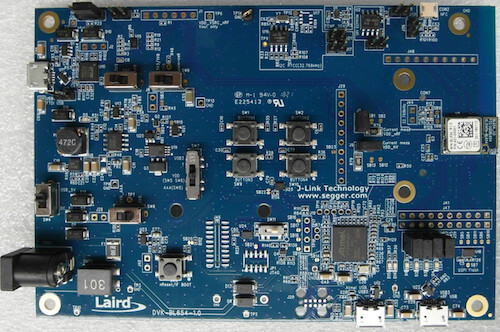
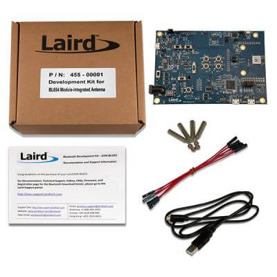

.. _bl654_dvk:

Laird Connectivity BL654 DVK
############################

Overview
********

The BL654 Development Kit hardware provides
support for the Laird Connectivity BL654 module powered by a Nordic Semiconductor nRF52840 ARM Cortex-M4F CPU.

This development kit has the following features:

* :abbr:`ADC (Analog to Digital Converter)`
* CLOCK
* FLASH
* :abbr:`GPIO (General Purpose Input Output)`
* :abbr:`I2C (Inter-Integrated Circuit)`
* :abbr:`MPU (Memory Protection Unit)`
* :abbr:`NVIC (Nested Vectored Interrupt Controller)`
* :abbr:`PWM (Pulse Width Modulation)`
* RADIO (Bluetooth Low Energy and 802.15.4)
* :abbr:`RTC (nRF RTC System Clock)`
* Segger RTT (RTT Console)
* :abbr:`SPI (Serial Peripheral Interface)`
* :abbr:`UART (Universal asynchronous receiver-transmitter)`
* :abbr:`USB (Universal Serial Bus)`
* :abbr:`WDT (Watchdog Timer)`

     BL654 Development Kit Board

     455-00001 (BL654 DVK integrated antenna) Box Contents

More information about the board can be found at the
`BL654 website`_.

Hardware
********

Supported Features
==================

The BL654 DVK board configuration supports the following
hardware features:

+-----------+------------+----------------------+
| Interface | Controller | Driver/Component     |
+===========+============+======================+
| ADC       | on-chip    | adc                  |
+-----------+------------+----------------------+
| CLOCK     | on-chip    | clock_control        |
+-----------+------------+----------------------+
| FLASH     | on-chip    | flash                |
+-----------+------------+----------------------+
| GPIO      | on-chip    | gpio                 |
+-----------+------------+----------------------+
| I2C(M)    | on-chip    | i2c                  |
+-----------+------------+----------------------+
| MPU       | on-chip    | arch/arm             |
+-----------+------------+----------------------+
| NVIC      | on-chip    | arch/arm             |
+-----------+------------+----------------------+
| PWM       | on-chip    | pwm                  |
+-----------+------------+----------------------+
| RADIO     | on-chip    | Bluetooth,           |
|           |            | ieee802154           |
+-----------+------------+----------------------+
| RTC       | on-chip    | system clock         |
+-----------+------------+----------------------+
| RTT       | Segger     | console              |
+-----------+------------+----------------------+
| SPI(M/S)  | on-chip    | spi                  |
+-----------+------------+----------------------+
| UART      | on-chip    | serial               |
+-----------+------------+----------------------+
| USB       | on-chip    | usb                  |
+-----------+------------+----------------------+
| WDT       | on-chip    | watchdog             |
+-----------+------------+----------------------+

Other hardware features have not been enabled yet for this board.
See `BL654 website`_
for a complete list of BL654 Development Kit board hardware features.

Connections and IOs
===================

LED
---

* LED1 (blue) = P0.13
* LED2 (blue) = P0.14
* LED3 (blue) = P0.15
* LED4 (blue) = P0.16

Push buttons
------------

* BUTTON1 = SW1 = P0.11
* BUTTON2 = SW2 = P0.12
* BUTTON3 = SW9 = P0.24
* BUTTON4 = SW10 = P0.25
* RESET = SW3 = nReset/IF BOOT

Programming and Debugging
*************************

Applications for the ``bl654_dvk`` board configuration can be built, flashed,
and debugged in the usual way. See :ref:`build_an_application` and
:ref:`application_run` for more details on building and running.

Flashing
========

Follow the instructions in the :ref:`nordic_segger` page to install
and configure all the necessary software. Further information can be
found in :ref:`nordic_segger_flashing`. Then build and flash
applications as usual (see :ref:`build_an_application` and
:ref:`application_run` for more details).

Here is an example for the :ref:`hello_world` application.

First, run your favorite terminal program to listen for output.

NOTE: On the BL654 DVK, the FTDI USB should be used to access the UART console.

.. code-block:: console

   $ minicom -D <tty_device> -b 115200

Replace :code:`<tty_device>` with the port where the board nRF52 DK
can be found. For example, under Linux, :code:`/dev/ttyUSB0`.

Then build and flash the application in the usual way.

.. zephyr-app-commands::
   :zephyr-app: samples/hello_world
   :board: bl654_dvk
   :goals: build flash

Debugging
=========

Refer to the :ref:`nordic_segger` page to learn about debugging Nordic based boards with a
Segger IC.

Testing Bluetooth on the BL654 DVK
***********************************
Many of the Bluetooth examples will work on the BL654 DVK.
Try them out:

* :ref:`ble_peripheral`
* :ref:`bluetooth-eddystone-sample`
* :ref:`bluetooth-ibeacon-sample`

Testing the LEDs and buttons on the BL654 DVK
************************************************

There are 2 samples that allow you to test that the buttons (switches) and LEDs on
the board are working properly with Zephyr:

* :zephyr:code-sample:`blinky`
* :zephyr:code-sample:`button`

You can build and flash the examples to make sure Zephyr is running correctly on
your board. The button and LED definitions can be found in
:zephyr_file:`boards/arm/bl654_dvk/bl654_dvk.dts`.

References
**********

.. target-notes::

.. _BL654 website: https://connectivity.lairdtech.com/wireless-modules/bluetooth-modules/bluetooth-5-modules/bl654-series
.. _J-Link Software and documentation pack: https://www.segger.com/jlink-software.html
