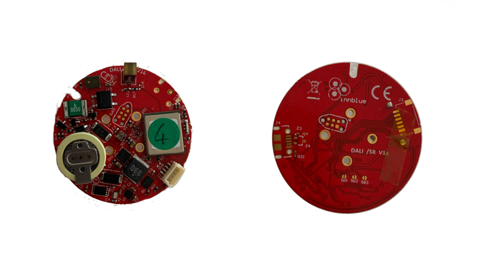

.. _blufdali_nrf52840:

BlufDALI nRF52840
#################

Overview
********

The BlufDALI nRF52840 is BLE board with `DALI2`_ / SensorReady interface
in `Zhaga formfactor`_ based on nRF52840 SoC module.

	 BlufDALI (Credit: innblue)

Hardware
********

The following parts are built into the board:

* Accelerometer: ST LIS2DTW12
* Ambient light sensor: Vishay VEML6030
* RTC: Microchip MACP7940n
* External flash: Macronix MX25V1635FZUI
* PDM: Knowles SPK0641HT4h

Supported Features
==================

The blufdali_nrf52840 board configuration supports the following
hardware (as of nRF9160) features:

+-----------+------------+----------------------+
| Interface | Controller | Driver/Component     |
+===========+============+======================+
| ADC       | on-chip    | adc                  |
+-----------+------------+----------------------+
| CLOCK     | on-chip    | clock_control        |
+-----------+------------+----------------------+
| FLASH     | on-chip    | flash                |
+-----------+------------+----------------------+
| GPIO      | on-chip    | gpio                 |
+-----------+------------+----------------------+
| I2C(M)    | on-chip    | i2c                  |
+-----------+------------+----------------------+
| MPU       | on-chip    | arch/arm             |
+-----------+------------+----------------------+
| NVIC      | on-chip    | arch/arm             |
+-----------+------------+----------------------+
| PWM       | on-chip    | pwm                  |
+-----------+------------+----------------------+
| RADIO     | on-chip    | Bluetooth,           |
|           |            | ieee802154           |
+-----------+------------+----------------------+
| RTC       | on-chip    | system clock         |
+-----------+------------+----------------------+
| SPI(M/S)  | on-chip    | spi                  |
+-----------+------------+----------------------+
| UART      | on-chip    | serial               |
+-----------+------------+----------------------+
| USB       | on-chip    | usb                  |
+-----------+------------+----------------------+
| WDT       | on-chip    | watchdog             |
+-----------+------------+----------------------+

Connections and IOs
===================

LED
---

* LED1 ( red ) = P0.25
* LED2 (green) = P0.16
* LED3 ( blue) = P0.24

Push buttons and Switches
-------------------------

* SolderBridge1 = P0.29
* SolderBridge2 = P0.30
* SolderBridge3 = P0.4

DALI2/SensorReady
-------------------------

* RX = P0.26
* TX = P1.03

Programming and Debugging
*************************

The BlufDALI board shall be connected to a Segger Embedded Debugger Unit
`J-Link OB <https://www.segger.com/jlink-ob.html>`_.  This provides a debug
interface to the NRF52840 chip. You can use JLink to communicate with
the NRF52840.

Flashing
========

#. Download JLink from the Segger `JLink Downloads Page`_.  Go to the section
   "J-Link Software and Documentation Pack" and install the "J-Link Software
   and Documentation pack for Linux".  The application JLinkExe needs to be
   accessible from your path.

#. Use external USB<->TTL converter and run your favorite terminal program to listen for output.  Under Linux the
   terminal might be :code:`/dev/ttyUSB0`. For example:

   .. code-block:: console

      $ minicom -D /dev/ttyUSB0 -o

   The -o option tells minicom not to send the modem initialization string.
   Connection should be configured as follows:

   - Speed: 115200
   - Data: 8 bits
   - Parity: None
   - Stop bits: 1

#. Connect the BlufDALI board to your host computer using the JST UART and USB<->TTL converter.
   Then build and flash the :ref:`hello_world` application.

   .. zephyr-app-commands::
      :zephyr-app: samples/hello_world
      :board: blufdali_nrf52840
      :goals: build flash

   You should see "Hello World! blufdali_nrf52840" in your terminal.

Debugging
=========

You can debug an application in the usual way.  Here is an example for the
:ref:`hello_world` application.

.. zephyr-app-commands::
   :zephyr-app: samples/hello_world
   :board: blufdali_nrf52840
   :maybe-skip-config:
   :goals: debug

References
**********

.. target-notes::

.. _DALI2:
     https://www.dali-alliance.org/dali/standards.html

.. _Zhaga formfactor:
     https://zhagastandard.org/books/overview/smart-interface-between-outdoor-luminaires-and-sensing-communication-modules-18.html

.. _JLink Downloads Page:
    https://www.segger.com/downloads/jlink
