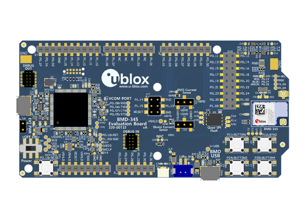

.. _bmd_345_eval:

BMD 345 EVAL
############

Overview
********

The BMD-345-EVAL hardware provides support for the u-blox BMD-345 Bluetooth 5.0
with PA/LNA, based on the Nordic Semiconductor nRF52840 ARM Cortex-M4F CPU
and the following devices:

* :abbr:`ADC (Analog to Digital Converter)`
* CLOCK
* FLASH
* :abbr:`GPIO (General Purpose Input Output)`
* :abbr:`I2C (Inter-Integrated Circuit)`
* :abbr:`MPU (Memory Protection Unit)`
* :abbr:`NVIC (Nested Vectored Interrupt Controller)`
* :abbr:`PWM (Pulse Width Modulation)`
* RADIO (Bluetooth Low Energy)
* :abbr:`RTC (nRF RTC System Clock)`
* Segger RTT (RTT Console)
* :abbr:`SPI (Serial Peripheral Interface)`
* :abbr:`UART (Universal asynchronous receiver-transmitter)`
* :abbr:`USB (Universal Serial Bus)`
* :abbr:`WDT (Watchdog Timer)`

     BMD-345-EVAL (Credit: ublox AG)

Hardware
********

BMD-345 on the BMD-345-EVAL board has an internal high frequency oscillator
at 32MHz and external slow frequency oscillator at 32.768kHz.

Front End Module
================

BMD-345 utilizes the skyworks RFX2411 front end module (FEM) also known as PA/LNA.
The FEM provides higher output power and better sensitivity.

Supported Features
==================

The bmd_345_eval board configuration supports the following
hardware features:

+-----------+------------+----------------------+
| Interface | Controller | Driver/Component     |
+===========+============+======================+
| ADC       | on-chip    | adc                  |
+-----------+------------+----------------------+
| CLOCK     | on-chip    | clock_control        |
+-----------+------------+----------------------+
| FLASH     | on-chip    | flash                |
+-----------+------------+----------------------+
| GPIO      | on-chip    | gpio                 |
+-----------+------------+----------------------+
| I2C(M)    | on-chip    | i2c                  |
+-----------+------------+----------------------+
| MPU       | on-chip    | arch/arm             |
+-----------+------------+----------------------+
| NVIC      | on-chip    | arch/arm             |
+-----------+------------+----------------------+
| PWM       | on-chip    | pwm                  |
+-----------+------------+----------------------+
| RADIO     | on-chip    | Bluetooth		|
+-----------+------------+----------------------+
| RTC       | on-chip    | system clock         |
+-----------+------------+----------------------+
| RTT       | Segger     | console              |
+-----------+------------+----------------------+
| SPI(M/S)  | on-chip    | spi                  |
+-----------+------------+----------------------+
| UART      | on-chip    | serial               |
+-----------+------------+----------------------+
| USB       | on-chip    | usb                  |
+-----------+------------+----------------------+
| WDT       | on-chip    | watchdog             |
+-----------+------------+----------------------+

Other hardware features are not supported by the Zephyr kernel.
See `bmd345eval_datasheet`_ datasheet for a complete list of
BMD 345 EVAL board hardware features.

Connections and IOs
===================

LED
---

* LED1 (green) = P0.13
* LED2 (green) = P0.14
* LED3 (green) = P0.15
* LED4 (green) = P0.16

Push buttons
------------

* BUTTON1 = SW1 = P0.11
* BUTTON2 = SW2 = P0.12
* BUTTON3 = SW3 = P0.24
* BUTTON4 = SW4 = P0.25
* BOOT = SW5 = boot/reset

Front End Module
----------------

* TX_EN (PA Tx Enable) = P1.05
* RX_EN (LNA Rx Enable) = P1.06
* PA_MODE (FEM Mode) = P1.04
* A-SEL (FEM Switch) = P1.02

Programming and Debugging
*************************

Applications for the ``bmd_345_eval`` board configuration can be
built and flashed in the usual way (see :ref:`build_an_application`
and :ref:`application_run` for more details).

Flashing
========

Follow the instructions in the :ref:`nordic_segger` page to install
and configure all the necessary software. Further information can be
found in :ref:`nordic_segger_flashing`. Then build and flash
applications as usual (see :ref:`build_an_application` and
:ref:`application_run` for more details).

Here is an example for the :ref:`hello_world` application.

First, run your favorite terminal program to listen for output.

.. code-block:: console

   $ minicom -D <tty_device> -b 115200

Replace :code:`<tty_device>` with the port where the board nRF52840 DK
can be found. For example, under Linux, :code:`/dev/ttyACM0`.

Then build and flash the application in the usual way.

.. zephyr-app-commands::
   :zephyr-app: samples/hello_world
   :board: bmd_345_eval
   :goals: build flash

Debugging
=========

Refer to the :ref:`nordic_segger` page to learn about debugging Nordic boards with a
Segger IC.

Testing the LEDs and buttons in the BMD 345 EVAL
************************************************

There are 2 samples that allow you to test that the buttons (switches) and LEDs on
the board are working properly with Zephyr:

.. code-block:: console

   samples/basic/blinky
   samples/basic/button

You can build and flash the examples to make sure Zephyr is running correctly on
your board. The button and LED definitions can be found in
:zephyr_file:`boards/arm/bmd_345_eval/bmd_345_eval.dts`.

Using UART1
***********

The following approach can be used when an application needs to use
more than one UART for connecting peripheral devices:

1. Add devicetree overlay file to the main directory of your application:

   .. code-block:: console

      $ cat bmd_345_eval.overlay
      &uart1 {
        compatible = "nordic,nrf-uarte";
        current-speed = <115200>;
        status = "okay";
        tx-pin = <14>;
        rx-pin = <16>;
      };

   In the overlay file above, pin P0.16 is used for RX and P0.14 is used for TX

2. Use the UART1 as ``device_get_binding(DT_LABEL(DT_NODELABEL(uart1)))``

See :ref:`set-devicetree-overlays` for further details.

Selecting the pins
==================
To select the pin numbers for tx-pin and rx-pin:

.. code-block:: console

   tx-pin = <pin_no>

Open the `nRF52840 Product Specification`_, chapter 7 'Hardware and Layout'.
In the table 7.1.1 'aQFN73 ball assignments' select the pins marked
'General purpose I/O'.  Note that pins marked as 'low frequency I/O only' can only be used
in under-10KHz applications. They are not suitable for 115200 speed of UART.

Translate the 'Pin' into number for devicetree by using the following formula::

   pin_no = b\*32 + a

where ``a`` and ``b`` are from the Pin value in the table (Pb.a).
For example, for P0.1, ``pin_no = 1`` and for P1.0, ``pin_no = 32``.

References
**********

.. target-notes::

.. _bmd345eval_datasheet: https://www.u-blox.com/sites/default/files/BMD-345_DataSheet_%28UBX-19039908%29_C1-Public.pdf
.. _J-Link Software and documentation pack: https://www.segger.com/jlink-software.html
.. _nRF52840 Product Specification: http://infocenter.nordicsemi.com/pdf/nRF52840_PS_v1.0.pdf
