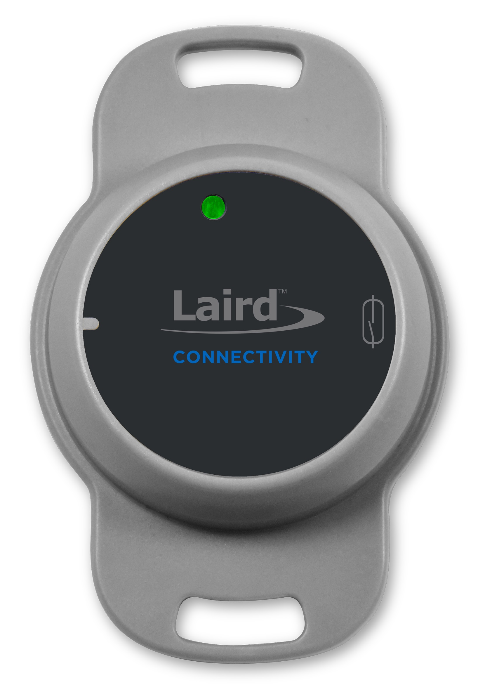
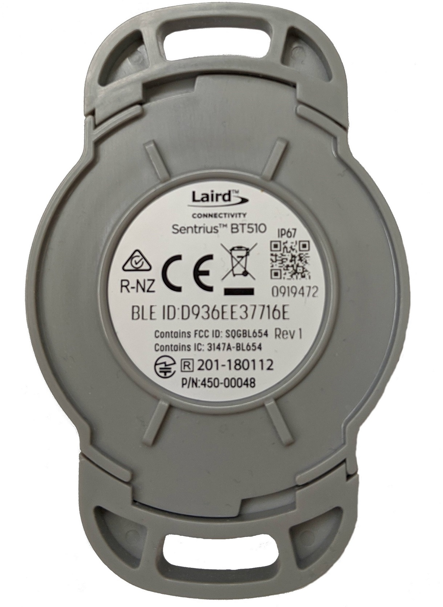

.. _bt510:

Laird Connectivity Sentrius BT510 Sensor
########################################

Overview
********

The Sentrius™ BT510 Sensor is a battery powered, Bluetooth v5 Long Range integrated sensor that uses a Nordic Semiconductor nRF52840 ARM Cortex-M4F CPU.

The sensor has the following features:

* :abbr:`ADC (Analog to Digital Converter)`
* CLOCK
* FLASH
* :abbr:`GPIO (General Purpose Input Output)`
* :abbr:`I2C (Inter-Integrated Circuit)`
* :abbr:`MPU (Memory Protection Unit)`
* :abbr:`NVIC (Nested Vectored Interrupt Controller)`
* :abbr:`PWM (Pulse Width Modulation)`
* RADIO (Bluetooth Low Energy and 802.15.4)
* :abbr:`RTC (nRF RTC System Clock)`
* Segger RTT (RTT Console)
* :abbr:`UART (Universal Asynchronous Receiver-Transmitter)`
* :abbr:`WDT (Watchdog Timer)`

     Sentrius BT510 Sensor, front view

     Sentrius BT510 Sensor, rear view

More information about the board can be found at the
`Sentrius BT510 website`_.

Hardware
********

Supported Features
==================

The BT510 Sensor supports the following
hardware features:

+-----------+------------+----------------------+
| Interface | Controller | Driver/Component     |
+===========+============+======================+
| ADC       | on-chip    | adc                  |
+-----------+------------+----------------------+
| CLOCK     | on-chip    | clock_control        |
+-----------+------------+----------------------+
| FLASH     | on-chip    | flash                |
+-----------+------------+----------------------+
| GPIO      | on-chip    | gpio                 |
+-----------+------------+----------------------+
| I2C(M)    | on-chip    | i2c                  |
+-----------+------------+----------------------+
| MPU       | on-chip    | arch/arm             |
+-----------+------------+----------------------+
| NVIC      | on-chip    | arch/arm             |
+-----------+------------+----------------------+
| PWM       | on-chip    | pwm                  |
+-----------+------------+----------------------+
| RADIO     | on-chip    | Bluetooth,           |
|           |            | ieee802154           |
+-----------+------------+----------------------+
| RTC       | on-chip    | system clock         |
+-----------+------------+----------------------+
| RTT       | Segger     | console              |
+-----------+------------+----------------------+
| UART      | on-chip    | serial               |
+-----------+------------+----------------------+
| WDT       | on-chip    | watchdog             |
+-----------+------------+----------------------+

Connections and IOs
===================

LED
---

Two LEDs are visible through the BT510 housing lid.

* LED_1A (green) = P0.22
* LED_1B (red) = P0.20

Push button
------------

The BT510 housing lid also acts as a push button.

* BUTTON_1 = SW1 = P1.10

Magnetoresistive sensor
-----------------------

The BT510 incorporates a Honeywell SM351LT magnetoresistive sensor. Refer to the `Honeywell SM351LT datasheet`_ for further details.

* MAG = P1.14

Accelerometer
-------------

The BT510 incorporates an I2C ST Microelectronics LIS2DH accelerometer. Refer to the `ST Microelectronics LIS2DH datasheet`_ for further details.

* SDA = P0.26
* SCL = P0.27
* INT_1 = P1.05
* INT_2 = P1.12

Temperature Sensor
------------------

The BT510 incorporates an I2C Silabs SI7055 temperature sensor. Refer to the `Silabs 7055 datasheet`_ for further details.

* SDA = P0.26
* SCL = P0.27

Programming and Debugging
*************************

Applications for the ``bt510`` board configuration can be built, flashed, and
debugged in the usual way. See :ref:`build_an_application` and
:ref:`application_run` for more details on building and running.

The BT510 features a TagConnect 10 way socket for connection of a
programmer/debugger, refer to `TagConnect TC2050 product page`_
for details of an appropriate TagConnect cable.

A non-standard layout is used to include access to the sensor debug UART.

+-----------+------------+----------------------+
| Pin No.   | Name       | Description          |
+===========+============+======================+
| 1         | Vcc        | Power Supply, 3.3V   |
+-----------+------------+----------------------+
| 2         | SWDIO      | SWD Data             |
+-----------+------------+----------------------+
| 3         | RXD        | Debug UART RX Data   |
+-----------+------------+----------------------+
| 4         | SWDCLK     | SWD Clock            |
+-----------+------------+----------------------+
| 5         | TM         | Spare GPIO           |
+-----------+------------+----------------------+
| 6         | SWO        | SWD Output           |
+-----------+------------+----------------------+
| 7         | N/C        | Not Connected        |
+-----------+------------+----------------------+
| 8         | TXD        | Debug UART TX Data   |
+-----------+------------+----------------------+
| 9         | GND        | Ground               |
+-----------+------------+----------------------+
| 10        | RESET      | Reset, Active Low    |
+-----------+------------+----------------------+

Connectivity to the programmer/debugger must be modified to match
the pinout shown above.

Laird Connectivity provide the USB-SWD programming board that supports
this connector layout, refer to the `USB SWD Programmer product page`_
.

Flashing
========

Follow the instructions in the :ref:`nordic_segger` page to install
and configure all the necessary software. Further information can be
found in :ref:`nordic_segger_flashing`. Then build and flash
applications as usual (see :ref:`build_an_application` and
:ref:`application_run` for more details).

Here is an example for the :ref:`hello_world` application.

First, run your favorite terminal program to listen for output.

NOTE: On the BT510, the UART lines are at TTL levels and must be passed through
an appropriate line driver circuit for translation to RS232 levels. Refer to the `MAX3232 datasheet`_
for a suitable driver IC.

.. code-block:: console

   $ minicom -D <tty_device> -b 115200

Replace :code:`<tty_device>` with the port where the bt510 can be found. For example, under Linux, :code:`/dev/ttyUSB0`.

Then build and flash the application in the usual way.

.. zephyr-app-commands::
   :zephyr-app: samples/hello_world
   :board: bt510
   :goals: build flash

Note that an external debugger is required to perform application flashing.

Debugging
=========

The ``bt510`` board does not have an on-board J-Link debug IC
as some nRF5x development boards, however, instructions from the
:ref:`nordic_segger` page also apply to this board, with the additional step
of connecting an external debugger.

Testing Bluetooth on the BT510
***********************************
Many of the Bluetooth examples will work on the BT510.
Try them out:

* :ref:`ble_peripheral`
* :ref:`bluetooth-eddystone-sample`
* :ref:`bluetooth-ibeacon-sample`

Testing the LEDs and buttons on the BT510
*****************************************

There are 2 samples that allow you to test that the buttons (switches) and LEDs on
the board are working properly with Zephyr:

* :ref:`blinky-sample`
* :ref:`button-sample`

You can build and flash the examples to make sure Zephyr is running correctly on
your board. The button, LED and sensor device definitions can be found in
:zephyr_file:`boards/arm/bt510/bt510.dts`.

References
**********

.. target-notes::

.. _Sentrius BT510 website: https://www.lairdconnect.com/iot-devices/iot-sensors/bt510-bluetooth-5-long-range-ip67-multi-sensor
.. _TagConnect TC2050 product page: https://www.tag-connect.com/product/tc2050-idc-050
.. _USB SWD Programmer product page: https://www.lairdconnect.com/usb-swd-programmer/
.. _MAX3232 datasheet: https://www.ti.com/lit/ds/symlink/max3232.pdf
.. _Silabs 7055 datasheet: https://www.silabs.com/documents/public/data-sheets/Si7050-1-3-4-5-A20.pdf
.. _ST Microelectronics LIS2DH datasheet: https://www.st.com/resource/en/datasheet/lis2dh.pdf
.. _Honeywell SM351LT datasheet: https://sensing.honeywell.com/honeywell-sensing-nanopower-series-datasheet-50095501-c-en.pdf
