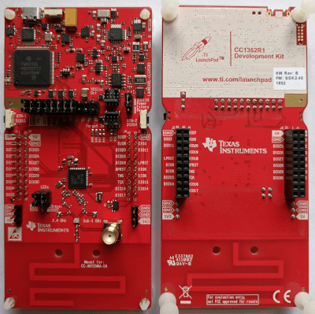

.. _cc1352r1_launchxl:

CC1352R1 LaunchXL
#################

Overview
********

The Texas Instruments CC1352R LaunchPad |trade| (LAUNCHXL-CC1352R1) is a
development kit for the SimpleLink |trade| multi-Standard CC1352R wireless MCU.

See the `TI CC1352R LaunchPad Product Page`_ for details.

   Texas Instruments CC1352R LaunchPad |trade|

Hardware
********

The CC1352R LaunchPad |trade| development kit features the CC1352R wireless MCU.
The board is equipped with two LEDs, two push buttons and BoosterPack connectors
for expansion. It also includes an integrated (XDS110) debugger.

The CC13522 wireless MCU has a 48 MHz Arm |reg| Cortex |reg|-M4F SoC and an
integrated Sub-1 and 2.4 GHz transceiver supporting multiple protocols including
Bluetooth |reg| Low Energy and IEEE |reg| 802.15.4.

See the `TI CC1352R Product Page`_ for additional details.

Supported Features
==================

The CC1352R LaunchPad board configuration supports the following hardware
features:

+-----------+------------+----------------------+
| Interface | Controller | Driver/Component     |
+===========+============+======================+
| GPIO      | on-chip    | gpio                 |
+-----------+------------+----------------------+
| NVIC      | on-chip    | arch/arm             |
+-----------+------------+----------------------+
| PINMUX    | on-chip    | pinmux               |
+-----------+------------+----------------------+
| UART      | on-chip    | serial               |
+-----------+------------+----------------------+
| I2C       | on-chip    | i2c                  |
+-----------+------------+----------------------+
| SPI       | on-chip    | spi                  |
+-----------+------------+----------------------+

Other hardware features are not supported by the Zephyr kernel.

Connections and IOs
===================

All I/O signals are accessible from the BoosterPack connectors. Pin function
aligns with the LaunchPad standard.

+-------+-----------+---------------------+
| Pin   | Function  | Usage               |
+=======+===========+=====================+
| DIO3  | GPIO      |                     |
+-------+-----------+---------------------+
| DIO4  | I2C_MSSCL | I2C SCL             |
+-------+-----------+---------------------+
| DIO5  | I2C_MSSDA | I2C SDA             |
+-------+-----------+---------------------+
| DIO6  | GPIO      | Red LED             |
+-------+-----------+---------------------+
| DIO7  | GPIO      | Green LED           |
+-------+-----------+---------------------+
| DIO8  | SSI0_RX   | SPI MISO            |
+-------+-----------+---------------------+
| DIO9  | SSI0_TX   | SPI MOSI            |
+-------+-----------+---------------------+
| DIO10 | SSI0_CLK  | SPI CLK             |
+-------+-----------+---------------------+
| DIO11 | SSIO_CS   | SPI CS              |
+-------+-----------+---------------------+
| DIO12 | UART0_RX  | UART RXD            |
+-------+-----------+---------------------+
| DIO13 | UART0_TX  | UART TXD            |
+-------+-----------+---------------------+
| DIO14 | GPIO      | Button 2            |
+-------+-----------+---------------------+
| DIO15 | GPIO      | Button 1            |
+-------+-----------+---------------------+
| DIO16 |           | JTAG TDO            |
+-------+-----------+---------------------+
| DIO17 |           | JTAG TDI            |
+-------+-----------+---------------------+
| DIO18 | UART0_RTS | UART RTS / JTAG SWO |
+-------+-----------+---------------------+
| DIO19 | UART0_CTS | UART CTS            |
+-------+-----------+---------------------+
| DIO20 | GPIO      | Flash CS            |
+-------+-----------+---------------------+
| DIO21 | GPIO      |                     |
+-------+-----------+---------------------+
| DIO22 | GPIO      |                     |
+-------+-----------+---------------------+
| DIO23 | AUX_IO    | A0                  |
+-------+-----------+---------------------+
| DIO24 | AUX_IO    | A1                  |
+-------+-----------+---------------------+
| DIO25 | AUX_IO    | A2                  |
+-------+-----------+---------------------+
| DIO26 | AUX_IO    | A3                  |
+-------+-----------+---------------------+
| DIO27 | AUX_IO    | A4                  |
+-------+-----------+---------------------+
| DIO28 | AUX_IO    | A5                  |
+-------+-----------+---------------------+
| DIO29 | AUX_IO    | A6                  |
+-------+-----------+---------------------+
| DIO30 | AUX_IO    | A7                  |
+-------+-----------+---------------------+

Programming and Debugging
*************************

Before flashing or debugging ensure the RESET, TMS, TCK, TDO, and TDI jumpers
are in place. Also place jumpers on the the TXD and RXD signals for a serial
console using the XDS110 application serial port.

Flashing
========

Applications for the ``CC1352R LaunchPad`` board configuration can be built and
flashed in the usual way (see :ref:`build_an_application` and
:ref:`application_run` for more details).

Here is an example for the :ref:`hello_world` application.

First, run your favorite terminal program to listen for output.

.. code-block:: console

   $ screen <tty_device> 115200

Replace :code:`<tty_device>` with the port where the XDS110 application
serial device can be found. For example, :code:`/dev/ttyACM0`.

Then build and flash the application in the usual way.

.. zephyr-app-commands::
   :zephyr-app: samples/hello_world
   :board: cc1352r1_launchxl
   :goals: build flash

Debugging
=========

You can debug an application in the usual way.  Here is an example for the
:ref:`hello_world` application.

.. zephyr-app-commands::
   :zephyr-app: samples/hello_world
   :board: cc1352r1_launchxl
   :maybe-skip-config:
   :goals: debug

Bootloader
==========

The ROM bootloader on CC13x2 and CC26x2 devices is enabled by default. The
bootloader will start if there is no valid application image in flash or the
so-called backdoor is enabled (via option
:option:`CONFIG_CC13X2_CC26X2_BOOTLOADER_BACKDOOR_ENABLE`) and BTN-1 is held
down during reset. See the bootloader documentation in chapter 10 of the `TI
CC13x2 / CC26x2 Technical Reference Manual`_ for additional information.

References
**********

CC1352R1 LaunchPad Quick Start Guide:
  http://www.ti.com/lit/pdf/swru525

.. _TI CC1352R LaunchPad Product Page:
   http://www.ti.com/tool/launchxl-cc1352r1

.. _TI CC1352R Product Page:
   http://www.ti.com/product/cc1352r

.. _TI CC13x2 / CC26x2 Technical Reference Manual:
   http://www.ti.com/lit/pdf/swcu185
