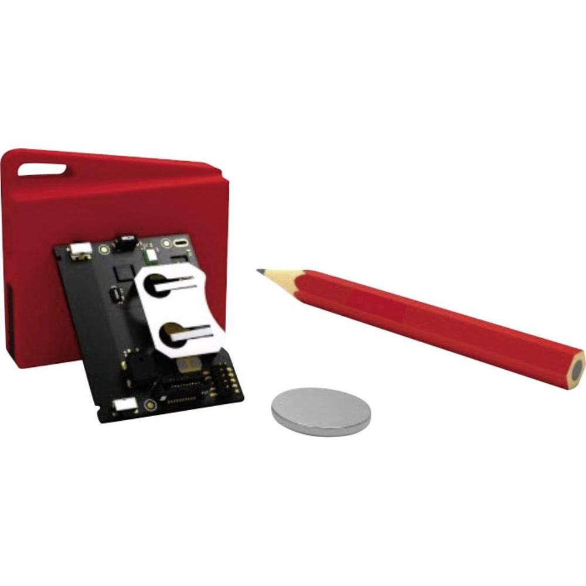

.. _cc2650_sensortag:

CC2650 SensorTag
################

Overview
********

The SimpleLink CC2650 SensorTag is a Texas Instruments board based
on the CC2650 wireless MCU. It contains multiple sensors and provides
Bluetooth and IEEE 802.15.4 connectivity.

Features
========

* CC2650 low-power wireless MCU: Bluetooth + IEEE 802.15.4 connectivity
* Autonomous low-power sensor controller
* Autonomous radio controller
* Program, debug, and serial line through "DevPack" JTAG probe's USB port
* Power from DevPack USB or batteries
* 2 buttons and 2 LEDs for user interaction

Hardware
********

The SensorTag board provides the following hardware:

* CC2650 SoC in RGZ (7x7mm) 48 pins format package
* Programmable Cortex-M3 CPU, clocked at 48MHz
* Proprietary sensor controller
        * 12-bit ADC, 200ks/s
        * 2 comparators
        * SPI + I2C digital interfaces for sensors
        * Programmable with register-based interface
* Cortex-M0 "RF Core" radio controller
        * 4KB of dedicated SRAM
        * Single transceiver, with modem and frequency synthesizer
        * Programmable with register-based interface
* 128KB flash
* 20KB SRAM
* 8KB cache
* SPI
* I2C
* I2S
* UART
* 31 GPIOs
* 4 32-bit timers
* True Random Number Generator
* Real Time Clock
* Watchdog timer
* 32 channels DMA controller
* 10 sensors: ambient light, digital microphone, magnetic sensor, humidity,
  pressure, accelerometer, gyroscope, magnetometer, object temperature and
  ambient temperature

Supported features
==================

The following SensorTag features are currently supported:

+-----------+------------+------------------------------------+
| Interface | Controller | Driver/Component                   |
+===========+============+====================================+
| NVIC      | on-chip    | Nested Vector Interrupt Controller |
+-----------+------------+------------------------------------+
| UART      | on-chip    | serial port polling                |
+-----------+------------+------------------------------------+
| GPIO      | on-chip    | gpio                               |
+-----------+------------+------------------------------------+
| PINMUX    | on-chip    | pinmux                             |
+-----------+------------+------------------------------------+

Connections and IOs
===================

The SensorTag has one GPIO controller, along with a flexible pin
multiplexer. In practice, the pins are routed as described in
:file:`boards/arm/cc2650_sensortag/board.h`; the most commonly used being:

+----------------+---------------+----------------------+
| Physical pin # | Digital I/O # | Signal               |
+================+===============+======================+
| 5              | DIO_0         | BUTTON_2 (right)     |
+----------------+---------------+----------------------+
| 9              | DIO_4         | BUTTON_1 (left)      |
+----------------+---------------+----------------------+
| 10             | DIO_5         | SDA                  |
+----------------+---------------+----------------------+
| 11             | DIO_6         | SCL                  |
+----------------+---------------+----------------------+
| 16             | DIO_10        | LED_1 (red)          |
+----------------+---------------+----------------------+
| 21             | DIO_15        | LED_2 (green)        |
+----------------+---------------+----------------------+
| 27             | DIO_17        | SCLK                 |
+----------------+---------------+----------------------+
| 28             | DIO_18        | MISO                 |
+----------------+---------------+----------------------+
| 29             | DIO_19        | MOSI                 |
+----------------+---------------+----------------------+
| 31             | DIO_21        | BUZZER               |
+----------------+---------------+----------------------+
| 41             | DIO_28        | UART_RX              |
+----------------+---------------+----------------------+
| 42             | DIO_29        | UART_TX              |
+----------------+---------------+----------------------+

System Clock
============

The CC2650 clocks its Cortex-M3 CPU through a 48MHz internal oscillator
by default. 2 system clocks, a high-frequency one and a low-frequency one,
are available to clock the CPU and the peripherals.
Available clock sources for them are:

* 48MHz internal oscillator
* 24MHz internal oscillator
* 32KHz internal oscillator
* 32.768KHz external oscillator

Programming and debugging
*************************

The ROM in the CC2650 contains a proprietary bootloader, executed
before the program stored on flash. The bootloader looks at a special
configuration area expected to be written at the end of flash, the
CCFG ("Customer Configuration" area). A 32-bit word in this area,
*IMAGE_VALID_CONF*, needs to be 0 in order for the bootloader to actually
pass control to your program. You can find more information on the CCFG
in the `CC2650 reference manual`_, section 9.1. The current CC2650 port
for Zephyr already does this by default; if you wish to check or modify
the CCFG content, see :file:`arch/arm/soc/ti_simplelink/cc2650/soc.c`.

Building
========

You can build an application in the usual way. Here is an example for
the :ref:`hello_world` application.

.. zephyr-app-commands::
   :zephyr-app: samples/hello_world
   :board: cc2650_sensortag
   :goals: build flash

Flashing
========

The CC2650 SensorTag can be flashed using a XDS110 JTAG device, the "DevPack",
designed to plug on it. For now, flashing with it is not supported
within Zephyr. However, you can use Uniflash, a TI proprietary tool, to do
the job for now.

.. note::
  Uniflash comes with some firmware for the "DevPeck" XDS110 JTAG probe.
  Different versions of Uniflash may have different firmware version.
  Currently, the most stable version is the 3.4. You should be able
  to grab it here:
  http://processors.wiki.ti.com/index.php/CCS_UniFlash_v3.4.1_Release_Notes

To update the "DevPack", reach the installation path of Uniflash 3.4,
then to the :file:`ccs_base/common/uscif/xds110/` subdirectory.
Then follow the :file:`ReadMe.txt`'s instructions:

.. code-block:: console

  $ ./xdsdfu -m
  $ ./xdsdfu -f firmware.bin -r

The green LED of the "DevPack" should blink repeatedly during the
operation, then light up again upon completion.

Debugging
=========

Debugging can be done with OpenOCD 0.10, which is supported
by the Zephyr SDK since v0.9.2. A basic configuration file for the
SensorTag board would be:

.. code-block:: console

  source [find interface/cmsis-dap.cfg]
  transport select jtag
  gdb_memory_map enable
  gdb_flash_program enable
  source [find target/cc26xx.cfg]
  adapter_khz 5000

Copy this in a file named ``ti-sensortag.cfg``, located in the
:file:`scripts/board` subdirectory of your local OpenOCD installation path.
When you wish to launch the OpenOCD server, just type:

.. code-block:: console

  $ openocd -f board/ti-sensortag.cfg

References
**********

TI CC2650 datasheet:
  http://www.ti.com/lit/ds/symlink/cc2650.pdf

CC2650 reference manual:
  http://www.ti.com/lit/ug/swcu117g/swcu117g.pdf

Uniflash 3.4 release notes:
  http://processors.wiki.ti.com/index.php/CCS_UniFlash_v3.4.1_Release_Notes

.. _CC2650 reference manual:
  http://www.ti.com/lit/ug/swcu117g/swcu117g.pdf
