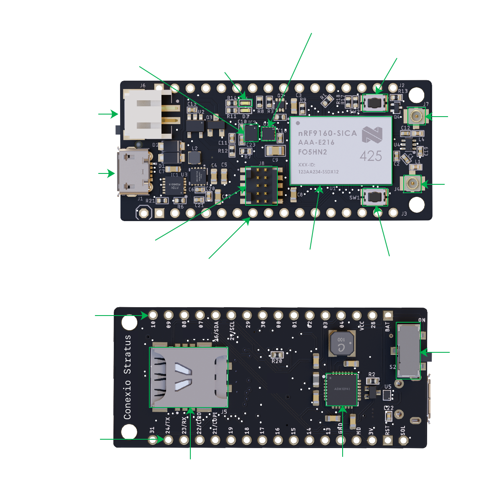
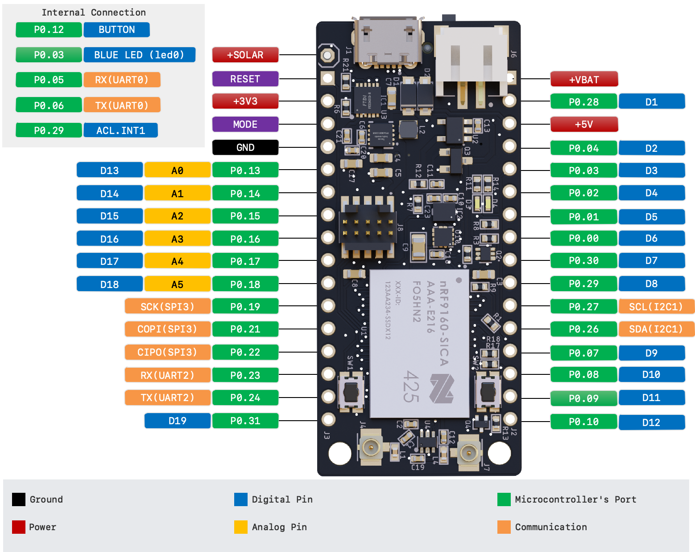

.. _conexio_stratus:

Conexio Stratus
###############

.. figure:: img/stratus-top.png
     :width: 600px
     :align: center
     :alt: Conexio Stratus

     Conexio Stratus (Credit: Conexio Technologies)

Overview
********
Conexio Stratus is a tiny (50.8 x 22.8 mm), yet powerful development kit for creating cellular-connected 
electronic projects and products. It is a battery-operated platform making it 
ideal for prototyping cellular IoT systems, for instance, asset tracking 
applications, environmental monitoring, and smart meter monitoring to name a few.

Equipped with the Nordic nRF9160 System in Package (SiP), it supports LTE-M, 
NB-IoT, and Global Positioning System (GPS). Stratus has two onboard external 
U.FL antennas, one for the GPS and the other for LTE-M/NB-IoT enabling it 
to support a global range of LTE bands.

Stratus has built-in battery charging, charging status indicator, monitoring, and energy-harvesting 
circuitry which makes it easier to connect and recharge a Li-Po battery without 
having to replace it frequently, creating fully energy-autonomous applications. 
In addition, Stratus incorporates an accelerometer and a temperature, humidity, and 
pressure sensor for detecting movements and sensing the surrounding environment, 
right out-of-the-box. Finally, Stratus provides 26 mixed-signal GPIOs for 
interfacing with external sensors, actuators, and other electronics.

The conexio_stratus board configuration provides support for the Nordic Semiconductor 
nRF9160 ARM Cortex-M33F CPU with ARMv8-M Security Extension and the following devices:

* :abbr:`ADC (Analog to Digital Converter)`
* CLOCK
* FLASH
* :abbr:`GPIO (General Purpose Input Output)`
* :abbr:`I2C (Inter-Integrated Circuit)`
* :abbr:`MPU (Memory Protection Unit)`
* :abbr:`NVIC (Nested Vectored Interrupt Controller)`
* :abbr:`PWM (Pulse Width Modulation)`
* :abbr:`RTC (nRF RTC System Clock)`
* Segger RTT (RTT Console)
* :abbr:`SPI (Serial Peripheral Interface)`
* :abbr:`UARTE (Universal asynchronous receiver-transmitter with EasyDMA)`
* :abbr:`WDT (Watchdog Timer)`
* :abbr:`IDAU (Implementation Defined Attribution Unit)`

More information about the board can be found at the
`Conexio Stratus Product Website`_.

Hardware
********

The detailed information about the on-board hardware can be found at the `Conexio Stratus Product Website`_.

Supported Features
==================

The conexio_stratus board configuration supports the following
hardware features:
   
+-----------+------------+----------------------+
| Interface | Controller | Driver/Component     |
+===========+============+======================+
| ADC       | on-chip    | adc                  |
+-----------+------------+----------------------+
| CLOCK     | on-chip    | clock_control        |
+-----------+------------+----------------------+
| FLASH     | on-chip    | flash                |
+-----------+------------+----------------------+
| GPIO      | on-chip    | gpio                 |
+-----------+------------+----------------------+
| I2C(M)    | on-chip    | i2c                  |
+-----------+------------+----------------------+
| MPU       | on-chip    | arch/arm             |
+-----------+------------+----------------------+
| NVIC      | on-chip    | arch/arm             |
+-----------+------------+----------------------+
| PWM       | on-chip    | pwm                  |
+-----------+------------+----------------------+
| SPI(M/S)  | on-chip    | spi                  |
+-----------+------------+----------------------+
| SPU       | on-chip    | system protection    |
+-----------+------------+----------------------+
| UARTE     | on-chip    | serial               |
+-----------+------------+----------------------+
| WDT       | on-chip    | watchdog             |
+-----------+------------+----------------------+
| ACCEL     | st         | lis2dh               |
+-----------+------------+----------------------+

Pin Mapping
-----------

Connections and IOs
===================

The Conexio Stratus has several user interaction and programmable components
onboard. Here are some of the highlights:

LED
---

* LED1 (blue) = P0.03

Push buttons and Switches
-------------------------

* BUTTON1 = P0.12
* RESET

USB-C Connector
-------------------

The Conexio Stratus embedds a USB/UART connection for communicating with a host PC,
loading the new firmware using a UART Enabled MCUBoot, and for program debugging. 
It also contains the circuitry for charging the LiPo battery via the USB port.

Standard JST Battery Connector
------------------------------

The Conexio Stratus has a 2-Pin LiPo battery connector onboard.

Nano SIM Holder
---------------

The Conexio Stratus has a built-in nano SIM (4FF) holder situated
on the bottom side.

Programming and Debugging
*************************

The Conexio Stratus has a 10-Pin JTAG/SWD connector onboard that can be used by
ARM Cortex programmers like:

* J-Link (SEGGER)
* CMSIS-DAP

Building an application
=======================
Applications on the Conexio Stratus may contain a Secure and a Non-Secure (ns) firmware image.
However, in most of the applications one can use the ``ns`` target with any of the Zephyr
or Nordic nRF SDK based samples using ``-DBOARD=conexio_stratus_ns``.

More information can be found in the `Stratus "Getting Started" Guide`_.

Flashing
========

Follow the instructions in the :ref:`nordic_segger` page to install
and configure all the necessary software. Further information can be
found in :ref:`nordic_segger_flashing`. Then build and flash
applications as usual (see :ref:`build_an_application` and
:ref:`application_run` for more details).

Here is an example for the :ref:`hello_world` application.

First, run your favorite terminal program to listen for output.

.. code-block:: console

   $ minicom -D <tty_device> -b 115200

Replace :code:`<tty_device>` with the port where the Conexio Stratus board
can be found. For example, under Linux/Mac, :code:`/dev/tty.usbserial`.

Then build and flash the application in the usual way.

.. zephyr-app-commands::
   :zephyr-app: samples/hello_world
   :board: conexio_stratus
   :goals: build flash

Debugging
=========

Refer to the :ref:`nordic_segger` page to learn about debugging Nordic boards with a
Segger IC.

Testing the LEDs and buttons on the Conexio Stratus board
*********************************************************

There are 2 samples that allow you to test that the buttons (switches) and LEDs on
the board are working properly with Zephyr:

* :ref:`blinky-sample`
* :ref:`button-sample`

You can build and flash the examples to make sure Zephyr is running correctly on
your Stratus board. The button and LED definitions can be found in
:zephyr_file:`boards/arm/conexio_stratus/conexio_stratus_common.dts`.

Sample applications can be found in the `Stratus Git repo`_.

References
**********

.. target-notes::

.. _Conexio Stratus Product Website: https://conexiotech.com/

.. _Stratus "Getting Started" Guide: https://github.com/Conexiotechnologies/conexio-stratus-firmware

.. _Stratus Git repo: https://github.com/Conexiotechnologies/