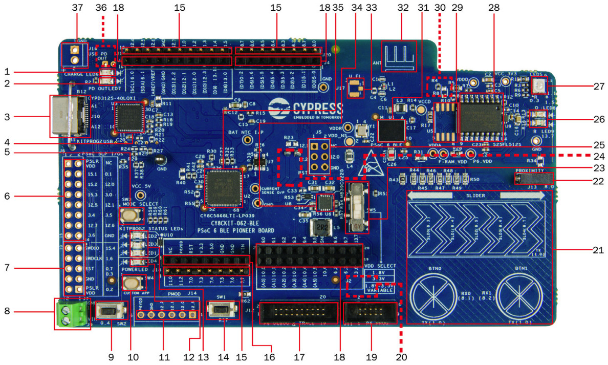

.. _cy8ckit_062_ble:

INFINEON PSoC63 BLE Pioneer Kit
###############################

Overview
********

The PSoC 6 BLE Pioneer Kit (CY8CKIT-062-BLE) is a hardware platform that
enables design and debug of the Cypress PSoC 63 BLE MCU.

The PSoC 6 BLE Pioneer Kit features the PSoC 63 MCU: a dual-core MCU, with a
150-MHz Arm Cortex-M4 as the primary application processor and a 100-MHz Arm
Cortex-M0+ that supports low-power operations, 1MB of Flash, 288KB of SRAM,
an integrated BLE 4.2 radio, 78 GPIO, 7 programmable analog blocks, 12
programmable digital blocks, and capacitive-sensing with CapSense.

The PSoC 6 BLE Pioneer board offers compatibility with Arduino shields, a
512-Mb NOR flash, onboard programmer/debugger (KitProg2), USB Type-C power
delivery system (EZ-PD™ CCG3), 5-segment CapSense slider, two CapSense
buttons, one CapSense proximity sensing header, an RGB LED, two user LEDs,
and one push button.

The CY8CKIT-062-BLE package includes a CY8CKIT-028-EPD E-INK Display Shield
that contains a 2.7-inch E-INK display, a motion sensor, a thermistor, and a
PDM microphone. The kit package also contains a CY5677 CySmart BLE 4.2 USB
Dongle that is factory-programmed to emulate a BLE GAP Central device,
enabling you to emulate a BLE host on your computer.

The Cortex-M0+ is a primary core on the board's SoC. It starts first and
enables the CM4 core.

1. Battery charging indicator (LED6)
2. USB PD output voltage availability indicator (LED7)
3. KitProg2 USB Type-C connector (J10)
4. Cypress EZ-PD™ CCG3 Type-C Port Controller with PD (CYPD3125-40LQXI, U3)
5. KitProg2 programming mode selection button (SW3)
6. KitProg2 I/O header (J6)1
7. KitProg2 programming/custom application header (J7)1
8. External power supply connector (J9)
9. PSoC 6 BLE user button (SW2)
10. KitProg2 application selection button (SW4)
11. Digilent® Pmod™ compatible I/O header (J14)1
12. Power LED (LED4)
13. KitProg2 status LEDs (LED1, LED2, and LED3)
14. PSoC 6 reset button (SW1)
15. PSoC 6 I/O header (J18, J19 and J20)
16. Arduino™ Uno R3 compatible power header (J1)
17. PSoC 6 debug and trace header (J12)
18. Arduino Uno R3 compatible PSoC 6 I/O header (J2, J3 and J4)
19. PSoC 6 program and debug header (J11)
20. KitProg2 programming target selection switch (SW6)
21. CapSense slider and buttons
22. CapSense proximity header (J13)
23. PSoC 6 BLE VDD selection switch (SW5)
24. PSoC 6 BLE power monitoring jumper (J8)2
25. Arduino Uno R3 compatible ICSP header (J5)1
26. PSoC 6 user LEDs (LED8 and LED9)
27. RGB LED (LED5)
28. Cypress  512-Mbit  serial  NOR  Flash  memory  (S25FL512S, U4)
29. Cypress serial Ferroelectric RAM (U5)1
30. VBACKUP and PMIC control selection switch (SW7)2
31. Cypress PSoC 6 BLE (CY8C6347BZI-BLD53, U1)
32. BLE Antenna
33. U.FL connector for external antenna (J17)1
34. Cypress main voltage regulator (MB39C022G, U6)
35. KitProg2  (PSoC  5LP)  programmer  and  debugger(CY8C5868LTI-LP039, U2)
36. Battery connector (J15)1,2
37. USB PD output voltage (9V/12V) connector (J16)

Hardware
********

For more information about the PSoC 63 BLE MCU SoC and CY8CKIT-062-BLE board:

- `PSoC 63 BLE MCU SoC Website`_
- `PSoC 63 BLE MCU Datasheet`_
- `PSoC 63 BLE MCU Architecture Reference Manual`_
- `PSoC 63 BLE MCU Register Reference Manual`_
- `CY8CKIT-062-BLE Website`_
- `CY8CKIT-062-BLE User Guide`_
- `CY8CKIT-062-BLE Schematics`_

Supported Features
==================

The board configuration supports the following hardware features:

+-----------+------------+-----------------------+
| Interface | Controller | Driver/Component      |
+===========+============+=======================+
| NVIC      | on-chip    | nested vectored       |
|           |            | interrupt controller  |
+-----------+------------+-----------------------+
| SYSTICK   | on-chip    | system clock          |
+-----------+------------+-----------------------+
| GPIO      | on-chip    | gpio                  |
+-----------+------------+-----------------------+
| PINCTRL   | on-chip    | pin control           |
+-----------+------------+-----------------------+
| SPI       | on-chip    | spi                   |
+-----------+------------+-----------------------+
| UART      | on-chip    | serial port-polling;  |
|           |            | serial port-interrupt |
+-----------+------------+-----------------------+

The default configurations can be found in the Kconfig
:zephyr_file:`boards/arm/cy8ckit_062_ble/cy8ckit_062_ble_m0_defconfig` for
Cortex-M0+ and on the Kconfig
:zephyr_file:`boards/arm/cy8ckit_062_ble/cy8ckit_062_ble_m4_defconfig` for
Cortex-M4

System Clock
============

The PSoC 63 BLE MCU SoC is configured to use the internal IMO+FLL as a source for
the system clock. CM0+ works at 50MHz, CM4 - at 100MHz. Other sources for the
system clock are provided in the SOC, depending on your system requirements.

Serial Port
===========

The PSoC 63 BLE MCU SoC has 8 SCB blocks and each one can be configured as
UART/SPI/I2C interfaces for serial communication. At the moment UART5 on SCB5
and UART6 on SCB6 are configured. SCB5 is connected to the onboard KitProg2's
USB-UART Bridge working as a serial console interface. SCB6 to P13_0, P13_1
pins on the J3 of the Arduino Uno R3 compatible PSoC6 I/O header for general
purposes.

OpenOCD Installation
====================

To get the OpenOCD package, it is required that you

1. Download the software ModusToolbox 3.1. https://softwaretools.infineon.com/tools/com.ifx.tb.tool.modustoolbox
2. Once downloaded add the path to access the Scripts folder provided by ModusToolbox
   export PATH=$PATH:/path/to/ModusToolbox/tools_3.1/openocd/scripts
3. Add the OpenOCD executable file's path to west flash/debug.
4. Flash using: west flash --openocd path/to/infineon/openocd/bin/openocd
5. Debug using: west debug --openocd path/to/infineon/openocd/bin/openocd

Programming and Debugging
*************************

The CY8CKIT-062-BLE includes an onboard programmer/debugger (KitProg2) with
mass storage programming to provide debugging, flash programming, and serial
communication over USB. There are also PSoC 6 program and debug headers J11
and J12 that can be used with Segger J-Link [default].
A watchdog timer is enabled by default. To disable it call Cy_WDT_Unlock() and
Cy_WDT_Disable().

#. Build the Zephyr kernel and the :ref:`hello_world` sample application:

   .. zephyr-app-commands::
      :zephyr-app: samples/hello_world
      :board: cy8ckit_062_ble_m0
      :goals: build
      :compact:

#. Run your favorite terminal program to listen for output. Under Linux the
   terminal should be :code:`/dev/ttyACM0`. For example:

   .. code-block:: console

      $ minicom -D /dev/ttyACM0 -o

   The -o option tells minicom not to send the modem initialization
   string. Connection should be configured as follows:

      - Speed: 115200
      - Data: 8 bits
      - Parity: None
      - Stop bits: 1

#. To flash an image:

   .. zephyr-app-commands::
      :zephyr-app: samples/hello_world
      :board: cy8ckit_062_ble_m0
      :goals: flash
      :compact:

   You should see "Hello World! cy8ckit_062_ble_m0" in your terminal.

Running on Dual Core
********************

#. Build the Zephyr kernel and the :zephyr:code-sample:`button` sample application:

   .. zephyr-app-commands::
      :zephyr-app: samples/basic/button
      :board: cy8ckit_062_ble_m4
      :goals: build
      :compact:

#. If you have a USB-Serial adapter, you can connect SBC[UART]-6 on Arduino
   header.  Schematic should be checked for connections.   Run your favorite
   terminal program again now listen for another output.   Under Linux the
   terminal should be :code:`/dev/ttyUSB0`. For example:

   .. code-block:: console

      $ minicom -D /dev/ttyUSB0 -o

   The -o option tells minicom not to send the modem initialization
   string. Connection should be configured as follows:

      - Speed: 115200
      - Data: 8 bits
      - Parity: None
      - Stop bits: 1

#. To flash an image:

   .. zephyr-app-commands::
      :zephyr-app: samples/basic/button
      :board: cy8ckit_062_ble_m4
      :goals: flash
      :compact:

#. Configure Cortex-M0+ to enable Cortex-M4:

   The last step flash the M4 image on the flash.  However, Cortex-M0 by default
   doesn't start the M4 and nothing will happen.  To enable Cortex-M4 CPU,
   repeat the steps on programming and debug and add the following parameter
   when performing the build process.

   .. zephyr-app-commands::
      :zephyr-app: samples/hello_world
      :board: cy8ckit_062_ble_m0
      :goals: build flash
      :gen-args: -DCONFIG_SOC_PSOC6_M0_ENABLES_M4=y
      :compact:

   Now you can press button SW-2 and see LED-9 blink at same time you have the
   "Hello World! cy8ckit_062_ble_m0" in the your terminal.

Board Revision
**************

The CY8CKIT-062-BLE KitProg2 shares connections with Arduino-R3 header.  This
connections may not allow the correct use of shields.  The default board
revision (0.0.0) allows use of default connections.  The use of Arduino headers
are only possible after rework the board and using the revision 1.0.0.

#. Build the Zephyr kernel and the :ref:`hello_world` sample application for
   board revision 1.0.0:

   .. zephyr-app-commands::
      :zephyr-app: samples/hello_world
      :board: cy8ckit_062_ble_m0@1.0.0
      :goals: build
      :compact:

#. The differences from version 0.0.0 to 1.0.0:

+-------------+------------+------------+
| Connection  | 0.0.0      | 1.0.0      |
+=============+============+============+
| CDC-COM RX  | P5_0       | P9_0       |
+-------------+------------+------------+
| CDC-COM TX  | P5_1       | P9_1       |
+-------------+------------+------------+
| R77         |  X         |            |
+-------------+------------+------------+
| R78         |            |   X        |
+-------------+------------+------------+

The P9 pins are available at J2. Those signals should be routed to J6.

J2-2 to J6-14
J2-4 to J6-13

The most complex part is short circuit pins 14 and 15 from U13.  That connect
UART_RTS with UART_CTS from KitProg2.

References
**********

.. _PSoC 63 BLE MCU SoC Website:
	https://www.cypress.com/products/32-bit-arm-cortex-m4-cortex-m0-psoc-63-connectivity-line

.. _PSoC 63 BLE MCU Datasheet:
	https://www.cypress.com/documentation/datasheets/psoc-6-mcu-psoc-63-ble-datasheet-programmable-system-chip-psoc

.. _PSoC 63 BLE MCU Architecture Reference Manual:
	https://www.cypress.com/documentation/technical-reference-manuals/psoc-6-mcu-psoc-63-ble-architecture-technical-reference

.. _PSoC 63 BLE MCU Register Reference Manual:
	https://www.cypress.com/documentation/technical-reference-manuals/psoc-6-mcu-cy8c63x6-cy8c63x7-cy8c63x6-cy8c63x7-registers

.. _CY8CKIT-062-BLE Website:
   https://www.cypress.com/documentation/development-kitsboards/psoc-6-ble-pioneer-kit-cy8ckit-062-ble

.. _CY8CKIT-062-BLE User Guide:
   https://www.cypress.com/file/390496/download

.. _CY8CKIT-062-BLE Schematics:
   https://www.cypress.com/file/417021/download
