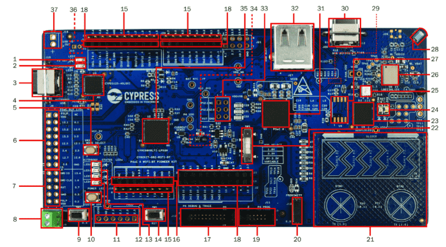

.. _cy8ckit_062_wifi_bt:

PSoC6 WiFi-BT Pioneer Kit
#########################

Overview
********

The PSoC 6 WiFi-BT Pioneer Kit (CY8CKIT-062-WiFi-BT) is a low-cost hardware
platform that enables design and debug of the PSoC 62 MCU and the Murata
LBEE5KL1DX Module (CYW4343W WiFi + Bluetooth Combo Chip).

The PSoC 6 WiFi-BT Pioneer Kit features the PSoC 62 MCU: a
dual-core MCU, with a 150-MHz Arm Cortex-M4 as the primary application
processor and a 100-MHz Arm Cortex-M0+ that supports low-power operations,
1MB of Flash, 288KB of SRAM, 104 GPIO, 7 programmable analog blocks,
56 programmable digital blocks, Full-Speed USB, a serial memory interface,
a PDM-PCM digital microphone interface, and industry-leading capacitive-sensing
with CapSense.

The PSoC 6 WiFi-BT Pioneer board offers compatibility with Arduino shields.

The Cortex-M0+ is a primary core on the board's SoC. It starts first and
enables the CM4 core.

1. USB PD output voltage availability indicator (LED7)
2. Battery charging indicator (LED6)
3. KitProg2 USB Type-C connector (J10)
4. Cypress EZ-PD™ CCG3 Type-C Port Controller with PD (CYPD3125-40LQXI, U3)
5. KitProg2 programming mode selection button (SW3)
6. KitProg2 I/O header (J6)1
7. KitProg2 programming/custom application header (J7)1
8. External power supply connector (J9)
9. PSoC 6 user button (SW2)
10. KitProg2 application selection button (SW4)
11. Digilent® Pmod™ compatible I/O header (J14)1
12. Power LED (LED4)
13. KitProg2 status LEDs (LED1, LED2, and LED3)
14. PSoC 6 reset button (SW1)
15. PSoC 6 I/O header (J18, J19 and J20)
16. Arduino™ Uno R3 compatible power header (J1)
17. PSoC 6 debug and trace header (J12)
18. Arduino Uno R3 compatible PSoC 6 I/O header (J2, J3 and J4)
19. PSoC 6 program and debug header (J11)
20. CapSense proximity header (J13)
21. CapSense slider and buttons
22. PSoC 6 VDD selection switch (SW5)
23. Cypress  512-Mbit  serial  NOR  Flash  memory  (S25-FL512S, U4)
24. PSoC 6 user LEDs (LED8 and LED9)
25. RGB LED (LED5)
26. WiFi/BT module (LBEE5KL 1DX, U6)
27. Cypress serial Ferroelectric RAM (U5)1
28. WiFi-BT Antenna
29. VBACKUP and PMIC control selection switch (SW7)2
30. PSoC 6 USB device Type-C connector (J28)
31. Cypress PSoC 6 (CY8C6247BZI-D54, U1)
32. PSoC 6 USB Host Type-A connector (J27)
33. Arduino Uno R3 compatible ICSP header (J5)1
34. PSoC 6 power monitoring jumper (J8)2
35. KitProg2  (PSoC  5LP)  programmer  and  debugger(CY8C5868LTI-LP039, U2)
36. Battery connector (J15)1,2
37. USB PD output voltage (9V/12V) connector (J16)

Hardware
********

For more information about the PSoC 62 MCU SoC and CY8CKIT-062-WiFi-BT board:

- `PSoC 62 MCU SoC Website`_
- `PSoC 62 MCU Datasheet`_
- `PSoC 62 MCU Architecture Reference Manual`_
- `PSoC 62 MCU Register Reference Manual`_
- `CY8CKIT-062-WiFi-BT Website`_
- `CY8CKIT-062-WiFi-BT User Guide`_
- `CY8CKIT-062-WiFi-BT Schematics`_

Supported Features
==================

The board configuration supports the following hardware features:

+-----------+------------+----------------------+
| Interface | Controller | Driver/Component     |
+===========+============+======================+
| NVIC      | on-chip    | nested vectored      |
|           |            | interrupt controller |
+-----------+------------+----------------------+
| SYSTICK   | on-chip    | system clock         |
+-----------+------------+----------------------+
| UART      | on-chip    | serial port          |
+-----------+------------+----------------------+

The default configuration can be found in the Kconfig
:zephyr_file:`boards/arm/cy8ckit_062_wifi_bt_m0/cy8ckit_062_wifi_bt_m0_defconfig`.

System Clock
============

The PSoC 62 MCU SoC is configured to use the internal IMO+FLL as a source for
the system clock. CM0+ works at 50MHz, CM4 - at 100MHz. Other sources for the
system clock are provided in the SOC, depending on your system requirements.

Serial Port
===========

The PSoC 62 MCU SoC has 9 SCB blocks 8 of each can be configured as UART
interfaces for serial communication. At the moment UART5 on SCB5 and UART6 on
SCB6 are configured. SCB5 is connected to the onboard KitProg2's USB-UART
Bridge, SCB6 to P12_0, P12_1 pins on the J3 of the Arduino Uno R3 compatible
PSoC6 I/O header.

Programming and Debugging
*************************

The CY8CKIT-062-WiFi-BT includes an onboard programmer/debugger (KitProg2) with
mass storage programming to provide debugging, flash programming, and serial
communication over USB. There are also PSoC 6 program and debug headers J11
and J12 that can be used with Segger J-Link.
A watchdog timer is enabled by default. To disable it call Cy_WDT_Unlock() and
Cy_WDT_Disable().

Only the CM0+ core starts by default after the MCU reset.  In order to have
CM4 core working FW for both cores should be written into Flash.  CM0+ FW
should starts the CM4 core at one point using
Cy_SysEnableCM4(CM4_START_ADDRESS); call.  CM4_START_ADDRESS is 0x10060000 in
the current configuration. The CM0+/CM4 Flash/SRAM areas are defined in
:zephyr_file:`dts/arm/cypress/psoc6.dtsi`.

Build the project for CM0+

.. zephyr-app-commands::
   :board: cy8ckit_062_wifi_bt_m0
   :goals: build

Switch the DevKit into CMSIS-DAP mode using SW3 (LED2 should blink) and flash
the board:

.. code-block:: console

   $<openocd_path>\bin\openocd -c "source [find interface/cmsis-dap.cfg]" \
      -c "transport select swd" -c "source [find target/psoc6.cfg]" \
      -c "if [catch {program {<zephyr_path>\samples\hello_world\build\zephyr\zephyr.elf}} ] \
         { echo {** Program operation failed **} } \
         else { echo {** Program operation completed successfully **} }" \
      -c "reset_config srst_only;reset run;psoc6.dap dpreg 0x04 0x00;shutdown"

Switch the DevKit back using SW3. Open a serial terminal (minicom, putty,
etc.) and connect to the board with the following settings:

- Speed: 115200
- Data: 8 bits
- Parity: None
- Stop bits: 1

Reset the board and the following message will appear on the corresponding
serial port:

.. code-block:: console

   ***** Booting Zephyr OS zephyr-v1.13.0-1877-g9d14874db1 *****
   Hello World! cy8ckit_062_wifi_bt_m0

References
**********

.. _PSoC 62 MCU SoC Website:
	http://www.cypress.com/products/32-bit-arm-cortex-m4-psoc-6

.. _PSoC 62 MCU Datasheet:
	http://www.cypress.com/documentation/datasheets/psoc-6-mcu-psoc-62-datasheet-programmable-system-chip-psoc-preliminary

.. _PSoC 62 MCU Architecture Reference Manual:
	http://www.cypress.com/documentation/technical-reference-manuals/psoc-6-mcu-psoc-62-architecture-technical-reference-manual

.. _PSoC 62 MCU Register Reference Manual:
	http://www.cypress.com/documentation/technical-reference-manuals/psoc-6-mcu-psoc-62-register-technical-reference-manual-trm

.. _CY8CKIT-062-WiFi-BT Website:
   http://www.cypress.com/documentation/development-kitsboards/psoc-6-wifi-bt-pioneer-kit

.. _CY8CKIT-062-WiFi-BT User Guide:
   http://www.cypress.com/file/407731/download

.. _CY8CKIT-062-WiFi-BT Schematics:
   http://www.cypress.com/file/420846/download
