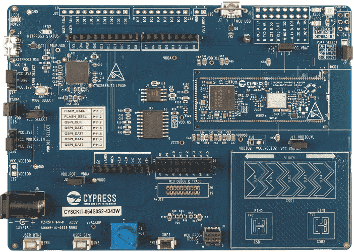

.. _cy8ckit_064s0s2_4343w:

CY8CPROTO-062-4343W
#########################

Overview
********

The CY8CKIT-064S0S2-4343W PSoC™ 64 Standard Secure - AWS Wi-Fi BT Pioneer Kit is
a low-cost hardware platform that enables design and debug of PSoC™ 64 MCUs.
It comes with a Murata LBEE5KL1DX Module (CYW4343W Wi-Fi + Bluetooth Combo Chip),
industry-leading CAPSENSE™ for touch buttons and slider, on-board debugger/programmer
with KitProg3, microSD card interface, 512-Mb Quad-SPI NOR flash, 4-Mbit Quad-SPI F-RAM
and PDM-PCM microphone interface.

Hardware
********

For more information about the PSoC 66 MCU SoC and CY8CKIT-064S0S2-4343W board:

- `PSoC 64 MCU SoC Website`_
- `PSoC 64 MCU Datasheet`_
- `PSoC 64 MCU Architecture Reference Manual`_
- `PSoC 64 MCU Register Reference Manual`_
- `CY8CKIT-064S0S2-4343W PSoC 6 Wi-Fi BT Website`_
- `CY8CKIT-064S0S2-4343W PSoC 6 Wi-Fi BT User Guide`_
- `CY8CKIT-064S0S2-4343W PSoC 6 Wi-Fi BT Schematics`_

Kit Features:
==================
- Support of up to 2MB Flash and 1MB SRAM
- Dedicated SDHC to interface with WICED wireless devices.
- Delivers dual-cores, with a 150-MHz Arm Cortex-M4 as the primary
  application processor and a 100-MHz Arm Cortex-M0+ as the secondary
  processor for low-power operations.
- Supports Full-Speed USB, capacitive-sensing with CAPSENSE, a PDM-PCM
  digital microphone interface, a Quad-SPI interface, 13 serial communication
  blocks, 7 programmable analog blocks, and 56 programmable digital blocks.

Kit Contents:
==================
- PSoC™ 64 Wi-Fi BT Pioneer Board
- USB Type-A to Micro-B cable
- Quick Start Guide
- Four jumper wires (4 inches each)
- Two jumper wires (5 inches each)

Supported Features
==================

The board configuration supports the following hardware features:

+-----------+------------+-----------------------+
| Interface | Controller | Driver/Component      |
+===========+============+=======================+
| NVIC      | on-chip    | nested vectored       |
|           |            | interrupt controller  |
+-----------+------------+-----------------------+
| SYSTICK   | on-chip    | system clock          |
+-----------+------------+-----------------------+
| GPIO      | on-chip    | GPIO                  |
+-----------+------------+-----------------------+
| UART      | on-chip    | serial port-polling;  |
|           |            | serial port-interrupt |
+-----------+------------+-----------------------+

The default configuration can be found in the Kconfig

:zephyr_file:`boards/arm/cy8ckit_064s0s2_4343w/cy8ckit_064s0s2_4343w_defconfig`

System Clock
============

The PSoC 62 MCU SoC is configured to use the internal IMO+FLL as a source for
the system clock. CM0+ works at 50MHz, CM4 - at 100MHz. Other sources for the
system clock are provided in the SOC, depending on your system requirements.

Install Infineon Connectivity Zephyr module
*******************************************
This modules includes assets which has any binary files (e.g WIFI/Bluetooth chip firmware,
CM0p prebuilt images, etc).

The following steps shows how to enable Infineon Connectivity Zephyr module in project:

1. Get the Zephyr source code

.. code-block:: console

    west init

2. Add an infineon_connectivity.yaml manifest file in to zephyr/submanifests folder. There is an example yaml file in this directory.
Use the snippet of infineon_connectivity.yaml below:

.. code-block:: yaml

   manifest:
     projects:
       - name: infineon_zephyr_connectivity
          url: https://github.com/ifyall/infineon_zephyr_connectivity.git
          submodules: true
          revision: develop
          path: modules/hal/infineon_connectivity
          groups:
            - hal

3. Update Zephyr modules

.. code-block:: console

   west update

3. Update Zephyr modules and export the environment

.. code-block:: console

   west update
   west zephyr-export

Build blinking led sample
*************************
Here is an example for the :ref:`blinky-sample` application.

.. code-block:: console

   cd zephyr
   west build -p auto -b cy8ckit_064s0s2_4343w samples/basic/blink

OpenOCD Installation
====================

You must download `Infineon OpenOCD`_ from Github to flash and debug.
Extract the files and note the path.

Programming and Debugging
*************************

The CY8CKIT-064S0S2-4343W includes an onboard programmer/debugger (KitProg2) with
mass storage programming to provide debugging, flash programming, and serial
communication over USB. Flash and debug commands must be pointed to the Cypress
OpenOCD you downloaded above.

On Windows:

.. code-block:: console

   west flash --openocd path/to/infineon/openocd/bin/openocd.exe
   west debug --openocd path/to/infineon/openocd/bin/openocd.exe

On Linux:

.. code-block:: console

   west flash --openocd path/to/infineon/openocd/bin/openocd
   west debug --openocd path/to/infineon/openocd/bin/openocd

Once the gdb console starts after executing the west debug command, you may
now set breakpoints and perform other standard GDB debugging on the PSoC 6 CM4 core.

Errata
====================

+------------------------------------------------+----------------------------------------+
| Problem                                        | Solution                               |
+------------------------------------------------+----------------------------------------+
| The GPIO_INT_TRIG_BOTH interrupt is not raised | This will be fixed in a future release.|
| when the associated GPIO is asserted.          |                                        |
+------------------------------------------------+----------------------------------------+
| GDB experiences a timeout error connecting to  | This will be fixed in a future release.|
| a server instance started by west debugserver. |                                        |
+------------------------------------------------+----------------------------------------+

.. _PSoC 64 MCU SoC Website:
   http://www.cypress.com/products/32-bit-arm-cortex-m4-psoc-6

.. _PSoC 64 MCU Datasheet:
   http://www.cypress.com/documentation/datasheets/psoc-6-mcu-psoc-62-datasheet-programmable-system-chip-psoc-preliminary

.. _PSoC 64 MCU Architecture Reference Manual:
   http://www.cypress.com/documentation/technical-reference-manuals/psoc-6-mcu-psoc-62-architecture-technical-reference-manual

.. _PSoC 64 MCU Register Reference Manual:
   http://www.cypress.com/documentation/technical-reference-manuals/psoc-6-mcu-psoc-62-register-technical-reference-manual-trm

.. _CY8CKIT-064S0S2-4343W PSoC 6 Wi-Fi BT Website:
    https://www.infineon.com/cms/en/product/evaluation-boards/cy8ckit-064s0s2-4343w/

.. _CY8CKIT-064S0S2-4343W PSoC 6 Wi-Fi BT User Guide:
    https://www.infineon.com/cms/en/product/evaluation-boards/cy8ckit-064s0s2-4343w/#!?fileId=8ac78c8c7d0d8da4017d0f02dd6d1a1e

.. _CY8CKIT-064S0S2-4343W PSoC 6 Wi-Fi BT Schematics:
    https://www.infineon.com/cms/en/product/evaluation-boards/cy8ckit-064s0s2-4343w/#!?fileId=8ac78c8c7d0d8da4017d0f02ce181a14

.. _Infineon OpenOCD:
    https://github.com/infineon/openocd/releases/tag/release-v4.3.0
