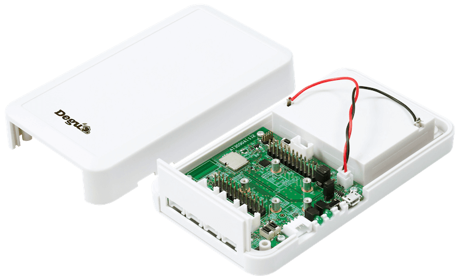

.. _degu_evk:

Degu Evaluation Kit
#################

Overview
********

Degu Evaluation Kit is the IoT device for sensors and actuators.

It has Nordic nRF52840 SoC and NXP A71CH Secure Element
and can connect to OpenThread mesh network.

Also it can connect some Seeed Grove sensors via GPIO, ADC, I2C,
and UART.

For more information, see this page:
https://open-degu.com/
