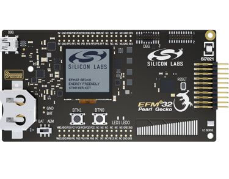

.. _efm32pg_stk3402a:

EFM32 Pearl Gecko Starter Kit
#############################

Overview
********

The EFM32 Pearl Gecko Starter Kit EFM32PG-STK3402A contains an MCU from
the EFM32PG family built on an ARM® Cortex®-M4F processor with excellent
low power capabilities.

   EFM32PG-SLSTK3402A (image courtesy of Silicon Labs)

Hardware
********

- Advanced Energy Monitoring provides real-time information about the
  energy consumption of an application or prototype design.
- Ultra low power 128x128 pixel Memory-LCD
- 2 user buttons, 2 LEDs and a touch slider
- Humidity, temperature, and inductive-capacitive metal sensor
- On-board Segger J-Link USB debugger

For more information about the EFM32PG SoC and EFM32PG-STK3402A board:

- `EFM32PG Website`_
- `EFM32PG12 Datasheet`_
- `EFM32PG12 Reference Manual`_
- `EFM32PG-STK3402A Website`_
- `EFM32PG-STK3402A User Guide`_
- `EFM32PG-STK3402A Schematics`_

Supported Features
==================

The efm32pg_stk3402a board configuration supports the following
hardware features:

+-----------+------------+-------------------------------------+
| Interface | Controller | Driver/Component                    |
+===========+============+=====================================+
| MPU       | on-chip    | memory protection unit              |
+-----------+------------+-------------------------------------+
| NVIC      | on-chip    | nested vector interrupt controller  |
+-----------+------------+-------------------------------------+
| SYSTICK   | on-chip    | systick                             |
+-----------+------------+-------------------------------------+
| COUNTER   | on-chip    | rtcc                                |
+-----------+------------+-------------------------------------+
| FLASH     | on-chip    | flash memory                        |
+-----------+------------+-------------------------------------+
| GPIO      | on-chip    | gpio                                |
+-----------+------------+-------------------------------------+
| UART      | on-chip    | serial port-polling;                |
|           |            | serial port-interrupt               |
+-----------+------------+-------------------------------------+
| I2C       | on-chip    | i2c port-polling                    |
+-----------+------------+-------------------------------------+
| WATCHDOG  | on-chip    | watchdog                            |
+-----------+------------+-------------------------------------+
| TRNG      | on-chip    | true random number generator        |
+-----------+------------+-------------------------------------+

The default configuration can be found in the defconfig file:

	``boards/arm/efm32pg_stk3402a/efm32pg_stk3402a_defconfig``

The default configuration when building for this EFM32JG12B SoC can be
found in another defconfig file:

	``boards/arm/efm32pg_stk3402a/efm32pg_stk3402a_defconfig_jg``

Other hardware features are currently not supported by the port.

EFM32 Jade Gecko SoC
--------------------

The EFM32 Pearl Gecko Starter Kit EFM32PG-STK3402A can also be used to
evaluate the EFM32 Jade Gecko SoC (EFM32JG12B). The only difference
between the Pearl Gecko and the Jade Gecko is their core. The Pearl
Gecko contains an ARM® Cortex®-M4F core, and the Jade Gecko an ARM®
Cortex®-M3 core. Other features such as memory and peripherals are the
same.

Code that is built for the Jade Gecko also runs on an equivalent Pearl
Gecko.

To build firmware for the Jade Gecko and run it on the EFM32 Pearl Gecko
Starter Kit, use the board ``efm32pg_stk3402a_jg`` instead of
``efm32pg_stk3402a``.

Connections and IOs
===================

The EFM32PG12 SoC has twelve GPIO controllers (PORTA to PORTL), but only
four are currently enabled (PORTA, PORTB, PORTD and PORTF) for the
EFM32PG-STK3402A board.

In the following table, the column **Name** contains pin names. For
example, PE2 means pin number 2 on PORTE, as used in the board's
datasheets and manuals.

+-------+-----+-------------+-------------------------------------+
| Name  | LOC | Function    | Usage                               |
+=======+=====+=============+=====================================+
| PF4   |     | GPIO        | LED0                                |
+-------+-----+-------------+-------------------------------------+
| PF5   |     | GPIO        | LED1                                |
+-------+-----+-------------+-------------------------------------+
| PF6   |     | GPIO        | Push Button PB0                     |
+-------+-----+-------------+-------------------------------------+
| PF7   |     | GPIO        | Push Button PB1                     |
+-------+-----+-------------+-------------------------------------+
| PA5   |     | GPIO        | Board Controller Enable             |
|       |     |             | EFM_BC_EN / VCOM_ENABLE             |
+-------+-----+-------------+-------------------------------------+
| PA0   |   0 | UART_TX     | UART TX Console VCOM_TX US0_TX      |
+-------+-----+-------------+-------------------------------------+
| PA1   |   0 | UART_RX     | UART RX Console VCOM_RX US0_RX      |
+-------+-----+-------------+-------------------------------------+
| PD10  |  18 | UART_TX     | EXP12_UART_TX LEU0_TX               |
+-------+-----+-------------+-------------------------------------+
| PD11  |  18 | UART_RX     | EXP14_UART_RX LEU0_RX               |
+-------+-----+-------------+-------------------------------------+
| PC10  |  15 | I2C_SDA     | ENV_I2C_SDA I2C0_SDA                |
+-------+-----+-------------+-------------------------------------+
| PC11  |  15 | I2C_SCL     | ENV_I2C_SCL I2C0_SCL                |
+-------+-----+-------------+-------------------------------------+

System Clock
============

The EFM32PG SoC is configured to use the 40 MHz external oscillator on
the board.

Serial Port
===========

The EFM32PG SoC has four USARTs and one Low Energy UART (LEUART).

Programming and Debugging
*************************

.. note::
   Before using the kit the first time, you should update the J-Link
   firmware from `J-Link-Downloads`_

Flashing
========

The EFM32PG-STK3402A includes an `J-Link`_ serial and
debug adaptor built into the board. The adaptor provides:

- A USB connection to the host computer, which exposes a mass storage
  device and a USB serial port.
- A serial flash device, which implements the USB flash disk file
  storage.
- A physical UART connection which is relayed over interface USB serial
  port.

Flashing an application to EFM32PG-STK3402A
-------------------------------------------

The sample application :ref:`hello_world` is used for this example. Build the
Zephyr kernel and application:

.. zephyr-app-commands::
   :zephyr-app: samples/hello_world
   :board: efm32pg_stk3402a
   :goals: build

Connect the EFM32PG-STK3402A to your host computer using the USB port and you
should see a USB connection which exposes a mass storage device(STK3402A).
Copy the generated zephyr.bin to the STK3402A drive.

Use a USB-to-UART converter such as an FT232/CP2102 to connect to the
UART on the expansion header.

Open a serial terminal (minicom, putty, etc.) with the following
settings:

- Speed: 115200
- Data: 8 bits
- Parity: None
- Stop bits: 1

Reset the board and you'll see the following message on the
corresponding serial port terminal session:

.. code-block:: console

   Hello World! arm

Twister Testing on EFM32PG-STK3402A
===================================

A very simple test on the GPIO functionality can be found at:

	``tests/drivers/gpio/gpio_basic_api``

The Twister tests can be run from the boards folder as follows:

.. code-block:: console

   ../../../../zephyr/scripts/twister --device-testing \
                                      --hardware-map efm32pg_stk3402a-map.yml \
                                      --load-tests efm32pg_stk3402a-testplan.json

Documenting the EFM32PG-STK3402A
********************************

The Zephyr documentation is based upon
`reStructuredText <http://sphinx-doc.org/rest.html>`__,
and `Sphinx <http://sphinx-doc.org/>`__, which are text based tools
that have limited facilities for `WYSIWYG (pronounced wiz-ee-wig) what you see is what you get:
<https://www.techtarget.com/whatis/definition/WYSIWYG-what-you-see-is-what-you-get>`__.

However, there are work arounds that can help you convert from
various other tools to **rst** files. While this is not Pearl Gecko
specific, it is included here, along with the changes above, as a
convenience, until we push upstream. Then a more appropriate location
can be found.

I have a preference for
`rich text editors <https://froala.com/blog/editor/a-beginners-guide-to-rich-text-editors/>`__\ ”
and a promoter of
`Literate Programming <https://en.wikipedia.org/wiki/Literate_programming>`__,
but I’m using Microsoft’s Word to edit this text. I started from the
original **rst** file and used `Pandoc <https://pandoc.org/>`__
to convert to **docx**.

.. code-block:: console

   pandoc -f rst -t docx \
      "//wsl.localhost/Ubuntu-20.04/<path>/zephyrproject/zephyr/boards/arm/efm32pg_stk3402a/doc/index.rst" \
      -o gp_stk.docx**

Note that your paths may vary but mine show the variability of the
systems that can be used. The **wsl** indicates that I’m using
`WSL2 <https://docs.microsoft.com/en-us/windows/wsl/about>`__ on
`WIN11 <https://en.wikipedia.org/wiki/Windows_11>`__ to build the
`**html** <https://docs.zephyrproject.org/latest/contribute/documentation/generation.html>`__
documentation. That is the version where board documentation is
generated, rather than the
`**pdf** <https://docs.zephyrproject.org/latest/contribute/documentation/generation.html>`__
version.

There may be a need to post the generated documentation internally, or
integrate some pages into something like
`Confluence <https://www.atlassian.com/software/confluence>`__, which we
do and why I chose this path. Word provides that path but you don't need
to save a **doc** version, rather than a **docx**. Simply create a page
and **Publish** it. Then hit the **…** to the right of the Edit button and
choose **Import Word Document**. There will likely be some minor edits you
need to make, but the content should be close.

If you already have a **Confluence** page, then in that same **…** menu you
can use the **Export to Word** menu item. That will create a **doc** file
that Word can convert to a **docx** file before using **Pandoc** to convert
it to **rst** format by reversing the names used above. Again, you will need
to make edits to comply with the Zephyr specific macros, but the content
(other than images) should mostly be there. If the **rst** file was constructed
by hand, then **Pandoc** may make other choices for line and column widths.
For small edits, doing it directly in the **rst** file is most efficient, but
if you have a lot of content, this method may be useful.

.. _EFM32PG-STK3402A Website:
   https://www.silabs.com/products/development-tools/mcu/32-bit/efm32-pearl-gecko-pg12-starter-kit

.. _EFM32PG-STK3402A User Guide:
   https://www.silabs.com/documents/public/user-guides/ug257-stk3402-usersguide.pdf

.. _EFM32PG-STK3402A Schematics:
   https://www.silabs.com/documents/public/schematic-files/BRD2501A-A01-schematic.pdf

.. _EFM32PG Website:
   https://www.silabs.com/products/mcu/32-bit/efm32-pearl-gecko

.. _EFM32PG12 Datasheet:
   https://www.silabs.com/documents/public/data-sheets/efm32pg12-datasheet.pdf

.. _EFM32PG12 Reference Manual:
   https://www.silabs.com/documents/public/reference-manuals/efm32pg12-rm.pdf

.. _J-Link:
   https://www.segger.com/jlink-debug-probes.html

.. _J-Link-Downloads:
   https://www.segger.com/downloads/jlink
