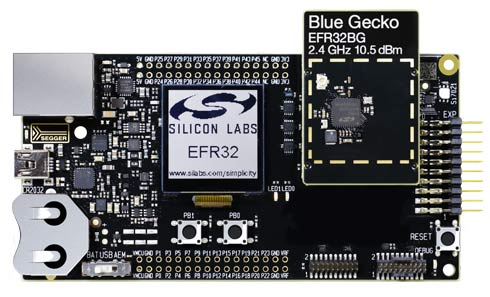

.. _efr32_radio:

EFR32 Radio Boards
##################

.. toctree::
   :maxdepth: 1

   brd4104a.rst
   brd4250b.rst
   brd4180a.rst
   brd4255a.rst
   brd4187c.rst

Overview
********

Support for EFR32 Radio boards is provided by one of the starter kits

- `SLWSTK6020B Bluetooth SoC Starter Kit`_
- `SLWSTK6000B Mighty Gecko Wireless Starter Kit`_
- `SLWSTK6061B Proprietary Wireless Starter Kit`_
- `SLWSTK6006A Mighty Gecko Wireless Starter Kit`_

   SLWSTK6020B (image courtesy of Silicon Labs)

Hardware
********

Wireless Starter Kit Mainboard:

- Advanced Energy Monitoring provides real-time information about the energy
  consumption of an application or prototype design.
- Ultra-low power 128x128 pixel memory LCD
- 2 user buttons and 2 LEDs
- 20 pin expansion header
- Si7021 Humidity and Temperature Sensor
- On-board Segger J-Link USB and Ethernet debugger

For more information about the BRD4001A board, refer to these documents:

- `EFR32BG13 Blue Gecko Bluetooth Starter Kit User's Guide`_
- `EFR32MG21 Mighty Gecko Wireless Starter Kit User's Guide`_
- `WSTK Main Board BRD4001A Schematics`_

.. _efr32_radio_supported_features:

Supported Features
==================

The board configuration supports the following hardware features:

+-----------+------------+-------------------------------------+
| Interface | Controller | Driver/Component                    |
+===========+============+=====================================+
| MPU       | on-chip    | memory protection unit              |
+-----------+------------+-------------------------------------+
| NVIC      | on-chip    | nested vector interrupt controller  |
+-----------+------------+-------------------------------------+
| SYSTICK   | on-chip    | systick                             |
+-----------+------------+-------------------------------------+
| COUNTER   | on-chip    | rtcc                                |
+-----------+------------+-------------------------------------+
| FLASH     | on-chip    | flash memory                        |
+-----------+------------+-------------------------------------+
| GPIO      | on-chip    | gpio                                |
+-----------+------------+-------------------------------------+
| UART      | on-chip    | serial port-polling;                |
|           |            | serial port-interrupt               |
+-----------+------------+-------------------------------------+
| SPI(M)    | on-chip    | spi port-polling                    |
+-----------+------------+-------------------------------------+
| WATCHDOG  | on-chip    | watchdog                            |
+-----------+------------+-------------------------------------+

Other hardware features are currently not supported by the port.

Connections and IOs
===================

In the following table, the column **Name** contains Pin names. For example, PA2
means Pin number 2 on PORTA, as used in the board's datasheets and manuals.

+-------+-------------+-------------------------------------+
| Name  | Function    | Usage                               |
+=======+=============+=====================================+
| PF4   | GPIO        | LED0                                |
+-------+-------------+-------------------------------------+
| PF5   | GPIO        | LED1                                |
+-------+-------------+-------------------------------------+
| PF6   | GPIO        | Push Button PB0                     |
+-------+-------------+-------------------------------------+
| PF7   | GPIO        | Push Button PB1                     |
+-------+-------------+-------------------------------------+
| PA5   | GPIO        | Board Controller Enable             |
|       |             | EFM_BC_EN                           |
+-------+-------------+-------------------------------------+
| PA0   | USART0_TX   | UART Console EFM_BC_TX US0_TX #0    |
+-------+-------------+-------------------------------------+
| PA1   | USART0_RX   | UART Console EFM_BC_RX US0_RX #0    |
+-------+-------------+-------------------------------------+
| PC6   | SPI_MOSI    | Flash MOSI US1_TX #11               |
+-------+-------------+-------------------------------------+
| PC7   | SPI_MISO    | Flash MISO US1_RX #11               |
+-------+-------------+-------------------------------------+
| PC8   | SPI_SCLK    | Flash SCLK US1_CLK #11              |
+-------+-------------+-------------------------------------+
| PA4   | SPI_CS      | Flash Chip Select (GPIO)            |
+-------+-------------+-------------------------------------+

.. _efr32_radio_programming:

Programming and Debugging
*************************

The BRD4001A includes an `J-Link`_ serial and debug adaptor built into the
board. The adaptor provides:

- A USB connection to the host computer, which exposes a debug interface and a
  USB Serial Port.
- A physical UART connection which is relayed over interface USB Serial port.
- An Ethernet connection to support remote debugging.

It is compatible with the following host debug tools:

- :ref:`openocd-debug-host-tools`
- :ref:`jlink-debug-host-tools`

OpenOCD is included in the Zephyr SDK. Refer to the links above for information
on how to install required host debug tools if you are not using the Zephyr SDK.

Flashing
========

Connect the BRD4001A main board with the mounted radio module to your host
computer using the USB port.

Following example shows how to build the :ref:`hello_world` application for
BRD4104A radio module.

.. zephyr-app-commands::
   :zephyr-app: samples/hello_world
   :board: efr32_radio_brd4104a
   :goals: flash

Open a serial terminal (minicom, putty, etc.) with the following settings:

- Speed: 115200
- Data: 8 bits
- Parity: None
- Stop bits: 1

Reset the board and you should see the following message in the terminal:

.. code-block:: console

   Hello World! efr32_radio_brd4104a

.. _SLWSTK6020B Bluetooth SoC Starter Kit:
   https://www.silabs.com/products/development-tools/wireless/bluetooth/blue-gecko-bluetooth-low-energy-soc-starter-kit

.. _SLWSTK6000B Mighty Gecko Wireless Starter Kit:
   https://www.silabs.com/products/development-tools/wireless/mesh-networking/mighty-gecko-starter-kit

.. _SLWSTK6061B Proprietary Wireless Starter Kit:
   https://www.silabs.com/products/development-tools/wireless/proprietary/slwstk6061b-efr32-flex-gecko-868-mhz-2-4-ghz-and-sub-ghz-starter-kit

.. _SLWSTK6006A Mighty Gecko Wireless Starter Kit:
   https://www.silabs.com/products/development-tools/wireless/efr32xg21-wireless-starter-kit

.. _EFR32BG13 Blue Gecko Bluetooth Starter Kit User's Guide:
   https://www.silabs.com/documents/public/user-guides/ug279-brd4104a-user-guide.pdf

.. _EFR32MG21 Mighty Gecko Wireless Starter Kit User's Guide:
   https://www.silabs.com/documents/public/user-guides/ug385-brd4180a-user-guide.pdf

.. _EFR32MG24 Mighty Gecko Wireless Starter Kit User's Guide:
   https://www.silabs.com/documents/public/user-guides/ug526-brd4187c-user-guide.pdf

.. _WSTK Main Board BRD4001A Schematics:
   https://www.silabs.com/documents/public/schematic-files/BRD4001A-A01-schematic.pdf

.. _J-Link:
   https://www.segger.com/jlink-debug-probes.html
