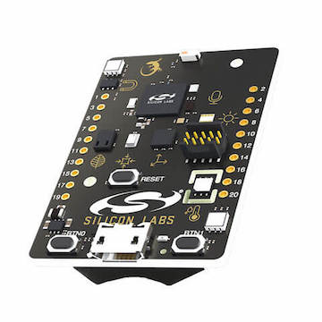

.. _efr32mg_sltb004a:

EFR32MG-SLTB004A
################

Overview
********

The EFR32™ Mighty Gecko Starter Kit EFR32MG-SLTB004A (a.k.a Thunderboard
Sense 2) contains a MCU from the EFR32MG family built on ARM® Cortex®-M4F
processor with low power capabilities.

Hardware
********

- EFR32MG12 Mighty Gecko Wireless SoC with 38.4 MHz operating frequency
- ARM® Cortex® M4 core with 256 kB RAM and 1024 kB Flash
- Macronix ultra low power 8-Mbit SPI flash (MX25R8035F)
- 2.4 GHz ceramic antenna for wireless transmission
- Silicon Labs Si7021 relative humidity and temperature sensor
- Silicon Labs Si1133 UV index and ambient light sensor
- Silicon Labs Si7210 hall effect sensor
- Bosch Sensortec BMP280 barometric pressure sensor
- ams CCS811 indoor air quality gas sensor
- TDK InvenSense ICM-20648 6-axis inertial sensor
- TDK InvenSense ICS-43434 MEMS microphone
- Four high brightness RGB LEDs from Broadcom Limited (ASMT-YTB7-0AA02)
- One bi-color LED and two push buttons
- Power enable signals for fine grained power-control
- On-board SEGGER J-Link debugger for easy programming and debugging, which
  includes a USB virtual COM port
- Mini Simplicity connector for access to energy profiling and advanced wireless
  network debugging
- Breakout pads for GPIO access and connection to external hardware
- Reset button
- Automatic switch-over between USB and battery power
- CR2032 coin cell holder and external battery connector

For more information about the EFR32MG SoC and Thunderboard Sense 2
(EFR32MG-SLTB004A) board:

- `EFR32MG Website`_
- `EFR32MG Datasheet`_
- `EFR32MG Reference Manual`_
- `EFR32MG-SLTB004A Website`_
- `EFR32MG-SLTB004A User Guide`_
- `EFR32MG-SLTB004A Schematics`_

Supported Features
==================

The efr32mg_sltb004a board configuration supports the following hardware features:

+-----------+------------+-------------------------------------+
| Interface | Controller | Driver/Component                    |
+===========+============+=====================================+
| NVIC      | on-chip    | nested vector interrupt controller  |
+-----------+------------+-------------------------------------+
| SYSTICK   | on-chip    | systick                             |
+-----------+------------+-------------------------------------+
| COUNTER   | on-chip    | rtcc                                |
+-----------+------------+-------------------------------------+
| FLASH     | on-chip    | flash memory                        |
+-----------+------------+-------------------------------------+
| GPIO      | on-chip    | gpio                                |
+-----------+------------+-------------------------------------+
| UART      | on-chip    | serial port-polling;                |
|           |            | serial port-interrupt               |
+-----------+------------+-------------------------------------+
| I2C       | on-chip    | i2c port-polling                    |
+-----------+------------+-------------------------------------+

The default configuration can be found in the defconfig file:
``boards/arm/efr32mg_sltb004a/efr32mg_sltb004a_defconfig``.

Other hardware features are currently not supported by the port.

Connections and IOs
===================

The EFR32MG SoC has eight gpio controllers (PORTA, PORTB, PORTC, PORTD,
PORTF, PORTI, PORTJ and PORTK).

In the following table, the column Name contains Pin names. For example, PE2
means Pin number 2 on PORTE and #27 represents the location bitfield , as used
in the board's and microcontroller's datasheets and manuals.

+------+-------------+-----------------------------------+
| Name | Function    | Usage                             |
+======+=============+===================================+
| PD8  | GPIO        | LED0 (RED)                        |
+------+-------------+-----------------------------------+
| PD9  | GPIO        | LED1 (GREEN)                      |
+------+-------------+-----------------------------------+
| PD14 | GPIO        | SW0 Push Button PB0               |
+------+-------------+-----------------------------------+
| PD15 | GPIO        | Push Button PB1                   |
+------+-------------+-----------------------------------+
| PA0  | UART_TX     | UART TX Console VCOM_TX US0_TX #0 |
+------+-------------+-----------------------------------+
| PA1  | UART_RX     | UART RX Console VCOM_RX US0_RX #0 |
+------+-------------+-----------------------------------+
| PF3  | UART_TX     | EXP12_UART_TX LEU0_TX #27         |
+------+-------------+-----------------------------------+
| PF4  | UART_RX     | EXP14_UART_RX LEU0_RX #27         |
+------+-------------+-----------------------------------+
| PC10 | I2C_SDA     | EXP16_I2C_SDA I2C0_SDA #15        |
+------+-------------+-----------------------------------+
| PC11 | I2C_SCL     | EXP15_I2C_SCL I2C0_SCL #15        |
+------+-------------+-----------------------------------+
| PC4  | I2C_SDA     | ENV_I2C_SDA I2C1_SDA #17          |
+------+-------------+-----------------------------------+
| PC5  | I2C_SCL     | ENV_I2C_SCL I2C1_SCL #17          |
+------+-------------+-----------------------------------+

System Clock
============

The EFR32MG SoC is configured to use the 38.4 MHz external oscillator on the
board.

Serial Port
===========

The EFR32MG SoC has four USARTs and one Low Energy UARTs (LEUART with 9600
maximum baudrate). USART0 is configured as the Zephyr console and is connected
to the On-Board J-Link Debugger that presents a virtual COM port for general
purpose application serial data transfer with this interface.

Programming and Debugging
*************************

.. note::
   Before using the kit the first time, you should update the J-Link firmware
   from `J-Link-Downloads`_

Flashing
========

The EFR32MG-SLTB004A includes an `J-Link`_ serial and debug adaptor built into the
board. The adaptor provides:

- A USB connection to the host computer, which exposes a Mass Storage and a
  USB Serial Port.
- A Serial Flash device, which implements the USB flash disk file storage.
- A physical UART connection which is relayed over interface USB Serial port.

Flashing an application to EFR32-SLTB004A
-----------------------------------------

The sample application :ref:`hello_world` is used for this example.
Build the Zephyr kernel and application:

.. zephyr-app-commands::
   :zephyr-app: samples/hello_world
   :board: efr32mg_sltb004a
   :goals: build

Connect the EFR32MG-SLTB004A to your host computer using the USB port and you
should see a USB connection which exposes a Mass Storage (TB004) and a
USB Serial Port. Copy the generated zephyr.bin in the SLTB004A drive.

Open a serial terminal (minicom, putty, etc.) with the following settings:

- Speed: 115200
- Data: 8 bits
- Parity: None
- Stop bits: 1

Reset the board and you should be able to see on the corresponding Serial Port
the following message:

.. code-block:: console

   Hello World! arm

.. _EFR32MG-SLTB004A Website:
   https://www.silabs.com/products/development-tools/thunderboard/thunderboard-sense-two-kit

.. _EFR32MG-SLTB004A User Guide:
   https://www.silabs.com/documents/public/user-guides/ug309-sltb004a-user-guide.pdf

.. _EFR32MG-SLTB004A Schematics:
   https://www.silabs.com/documents/public/schematic-files/TBSense2-BRD4166A-D00-schematic.pdf

.. _EFR32MG Website:
   https://www.silabs.com/products/wireless/mesh-networking/efr32mg-mighty-gecko-zigbee-thread-soc

.. _EFR32MG Datasheet:
   https://www.silabs.com/documents/public/data-sheets/efr32mg12-datasheet.pdf

.. _EFR32MG Reference Manual:
   https://www.silabs.com/documents/public/reference-manuals/efr32xg12-rm.pdf

.. _J-Link:
   https://www.segger.com/jlink-debug-probes.html

.. _J-Link-Downloads:
   https://www.segger.com/downloads/jlink
