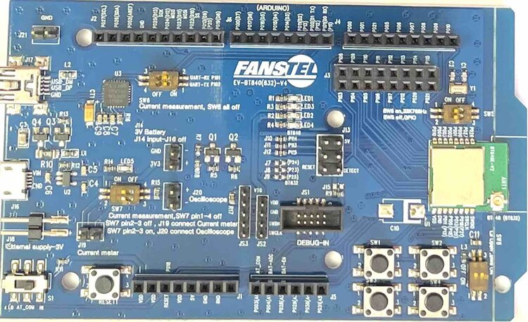

.. _fanstel_bt840dk:

BT840 DK
########

Overview
********

The BT840 DK is an evaluation board for the BT840 module from Fanstel. This module
is designed around the Nordic NRF52840. It can be used with many Arduino UNO R3
compatible shields.

     BT840 DK (Credit: Fanstel Corp)

More information about the board can be found in the `BT840 EVM User Manual`_.

Note that this board configuration should be compatible with any of the BT840 based EVMs by Fanstel.
This includes the EV-BT840, EV-BT840E, EV-BT840F, EV-BT840X, and EV-BT840XE.

Hardware
********

The BT840 DK has two external oscillators. The frequency of the slow clock
is 32.768 kHz. The frequency of the main clock is 32 MHz.

Supported Features
==================

The board configuration supports the following
hardware features:

+-----------+------------+----------------------+
| Interface | Controller | Driver/Component     |
+===========+============+======================+
| ADC       | on-chip    | adc                  |
+-----------+------------+----------------------+
| CLOCK     | on-chip    | clock_control        |
+-----------+------------+----------------------+
| FLASH     | on-chip    | flash                |
+-----------+------------+----------------------+
| GPIO      | on-chip    | gpio                 |
+-----------+------------+----------------------+
| I2C(M)    | on-chip    | i2c                  |
+-----------+------------+----------------------+
| MPU       | on-chip    | arch/arm             |
+-----------+------------+----------------------+
| NVIC      | on-chip    | arch/arm             |
+-----------+------------+----------------------+
| PWM       | on-chip    | pwm                  |
+-----------+------------+----------------------+
| RADIO     | on-chip    | Bluetooth,           |
|           |            | ieee802154           |
+-----------+------------+----------------------+
| RTC       | on-chip    | system clock         |
+-----------+------------+----------------------+
| SPI(M/S)  | on-chip    | spi                  |
+-----------+------------+----------------------+
| UART      | on-chip    | serial               |
+-----------+------------+----------------------+
| WDT       | on-chip    | watchdog             |
+-----------+------------+----------------------+

Note that USB is technically supported by the chipset, and by Zephyr, but this
EVM does not provide access to the USB interface.

Connections and IOs
===================

LED
---

* LED1 (green) = P0.17
* LED2 (green) = P1.0
* LED3 (green) = P0.19
* LED4 (green) = P0.13

Push buttons
------------

* BUTTON1 = SW1 = P0.11
* BUTTON2 = SW2 = P0.14
* BUTTON3 = SW3 = P0.15
* BUTTON4 = SW4 = P0.16

Programming and Debugging
*************************

Applications for the ``fanstel_bt840dk`` board configuration can be
built, flashed, and debugged in the usual way. See
:ref:`build_an_application` and :ref:`application_run` for more details on
building and running.

Note that there is no onboard program/debug interface so you will need to connect a compatible
one externally.

Testing the LEDs and buttons
****************************

There are 2 samples that allow you to test that the buttons (switches) and LEDs on
the board are working properly with Zephyr:

.. code-block:: console

   samples/basic/blinky
   samples/basic/button

You can build and flash the examples to make sure Zephyr is running correctly on
your board. The button and LED definitions can be found in
:zephyr_file:`boards/arm/fanstel_bt840dk/fanstel_bt840dk.dts`.

References
**********

.. target-notes::

.. _BT840 EVM User Manual: https://static1.squarespace.com/static/561459a2e4b0b39f5cefa12e/t/594041d8579fb316e48ec449/1497383385058/EV+BT840F+User+Manual.pdf
