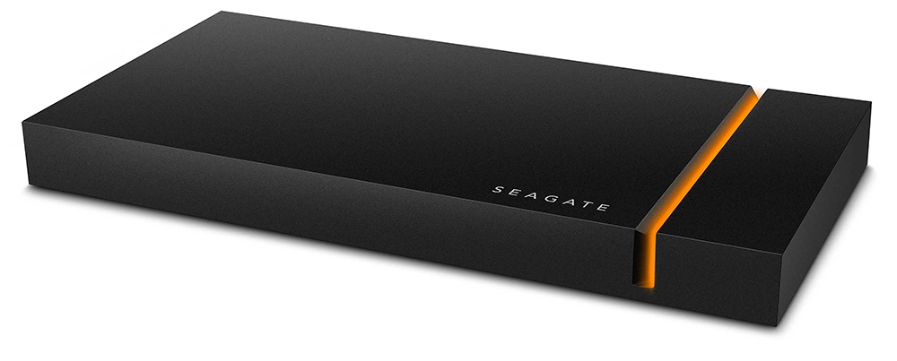

.. _faze:

Seagate FireCuda Gaming SSD (FaZe) board
########################################

Overview
********

The FaZe board can be found in the Seagate FireCuda Gaming SSD devices. A NVMe
SSD and two chips are embedded: an ASMedia ASM2364 USB-to-PCIe bridge controller
and a NXP LPC11U67 MCU. The former is handling the USB type-C to SSD I/Os while
the latter is dedicated to the LED effects. The two chips are connected together
through I2C and GPIOs.

This Zephyr port is running on the NXP LPC11U67 MCU.

Hardware
********

- NXP LPC11U67 MCU (LQFP48 package):

  - ARM Cortex-M0+
  - 20 KB SRAM: 16 KB (SRAM0) + 2 KB (SRAM1) + 2KB (USB SRAM)
  - 128 KB on-chip flash
  - 4 KB on-chip EEPROM

- External devices connected to the NXP LPC11U67 MCU:

  - ASMedia ASM2364 USB-to-PCIe bridge (I2C master on port O).
  - 6 RGB LEDs connected to a TI LP5030 LED controller (I2C device on
    port 1).
  - 1 white LED (SSD activity blinking).

More information can be found here:

- `LPC11UXX SoC Website`_
- `LPC11U6X Datasheet`_
- `LPC11U6X Reference Manual`_

Supported Features
==================

All the hardware features available on the FaZe board are supported in Zephyr.

+-----------+------------+-------------------------------------+
| Interface | Controller | Driver/Component                    |
+===========+============+=====================================+
| NVIC      | on-chip    | nested vector interrupt controller  |
+-----------+------------+-------------------------------------+
| SYSTICK   | on-chip    | systick                             |
+-----------+------------+-------------------------------------+
| IOCON     | on-chip    | pinmux                              |
+-----------+------------+-------------------------------------+
| CLOCK     | on-chip    | clock and reset control             |
+-----------+------------+-------------------------------------+
| GPIO      | on-chip    | gpio                                |
+-----------+------------+-------------------------------------+
| I2C       | on-chip    | i2c master/slave controller         |
+-----------+------------+-------------------------------------+
| UART      | on-chip    | serial port-polling;                |
|           |            | serial port interrupt               |
+-----------+------------+-------------------------------------+
| EEPROM    | on-chip    | eeprom                              |
+-----------+------------+-------------------------------------+

Connections and IOs
===================

The IOCON controller can be used to configure the LPC11U67 pins.

+---------+-----------------+----------------------------+
| Name    | Function        | Usage                      |
+=========+=================+============================+
| PIO0_2  | GPIO            | ASM2364 interrupt          |
+---------+-----------------+----------------------------+
| PIO0_4  | I2C0            | I2C0 SCL                   |
+---------+-----------------+----------------------------+
| PIO0_5  | I2C0            | I2C0 SDA                   |
+---------+-----------------+----------------------------+
| PIO0_7  | I2C1            | I2C1 SCL                   |
+---------+-----------------+----------------------------+
| PIO0_18 | UART            | USART0 RX                  |
+---------+-----------------+----------------------------+
| PIO0_19 | UART            | USART0 TX                  |
+---------+-----------------+----------------------------+
| PIO0_20 | GPIO            | USB sleep                  |
+---------+-----------------+----------------------------+
| PIO1_23 | GPIO            | SSD activity white LED     |
+---------+-----------------+----------------------------+
| PIO1_24 | I2C1            | I2C1 SDA                   |
+---------+-----------------+----------------------------+

Programming and Debugging
*************************

Flashing
========

The NXP LPC11U67 MCU can be flashed by connecting an external debug probe to
the SWD port (on-board 4-pins J2 header). In the default OpenOCD configuration
(``boards/arm/faze/support/openocd.cfg``) the ST Link interface is selected.
You may need to replace it with the interface of your debug probe.

Once the debug probe is connected to both the FaZe board and your host computer
then you can simply run the ``west flash`` command to write a firmware image you
built into flash.

Debugging
=========

Please refer to the `Flashing`_ section and run the ``west debug`` command
instead of ``west flash``.

References
**********

- `LPC11UXX SoC Website`_
- `LPC11U6X Datasheet`_
- `LPC11U6X Reference Manual`_

.. _LPC11UXX SoC Website:
   https://www.nxp.com/products/processors-and-microcontrollers/arm-microcontrollers/general-purpose-mcus/lpc1100-cortex-m0-plus-m0/scalable-entry-level-32-bit-microcontroller-mcu-based-on-arm-cortex-m0-plus-and-cortex-m0-cores:LPC11U00

.. _LPC11U6X Datasheet:
   https://www.nxp.com/docs/en/data-sheet/LPC11U6X.pdf

.. _LPC11U6x Reference Manual:
   https://www.nxp.com/webapp/Download?colCode=UM10732
