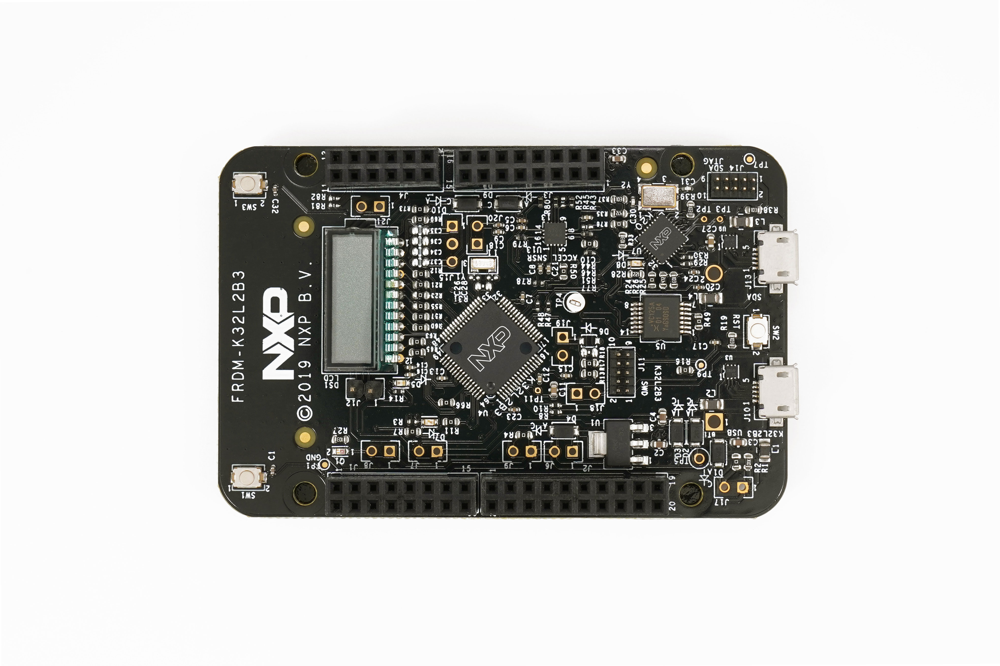

.. _frdm_k32l2b3:

NXP FRDM-K32L2B3
################

Overview
********

The FRDM-K32L2B3 Freedom development board provides a platform for evaluation
and development of the K32 L2B MCU Family. The board includes onboard debug
probe, segment LCD, accelerometer/magnetometer, a full speed USB and easy
access to K32 L2B's MCU I/O. The FRDM-K32L2B3 board is fully supported by the
MCUXpresso suite of tools, which provides device drivers, middleware and
examples to allow rapid development, plus configuration tools and an optional
free IDE.

Hardware
********

- K32L2B31VLH0A MCU @ 48 MHz, 256 KB flash, 32 KB SRAM, USB FS, LQFP64
- NXP FXOS8700CQ digital sensor, 3D accelerometer + 3D magnetometer
- OpenSDA debug interface

For more information about the K32L2B3 SoC and FRDM-K32L2B3 board:

- `K32L2 Website`_
- `K32L2B3 Datasheet`_
- `K32L2B3 Reference Manual`_
- `FRDM-K32L2B3 Website`_
- `FRDM-K32L2B3 User Guide`_
- `FRDM-K32L2B3 Schematics`_

Supported Features
==================

The frdm_k32l2b3 board configuration supports the following hardware features:

+-----------+------------+-------------------------------------+
| Interface | Controller | Driver/Component                    |
+===========+============+=====================================+
| NVIC      | on-chip    | nested vector interrupt controller  |
+-----------+------------+-------------------------------------+
| SYSTICK   | on-chip    | systick                             |
+-----------+------------+-------------------------------------+
| PINMUX    | on-chip    | pinmux                              |
+-----------+------------+-------------------------------------+
| GPIO      | on-chip    | gpio                                |
+-----------+------------+-------------------------------------+
| UART      | on-chip    | serial port-polling;                |
|           |            | serial port-interrupt               |
+-----------+------------+-------------------------------------+
| I2C       | on-chip    | i2c                                 |
+-----------+------------+-------------------------------------+
| FLASH     | on-chip    | soc flash                           |
+-----------+------------+-------------------------------------+
| USB       | on-chip    | USB device                          |
+-----------+------------+-------------------------------------+

The default configuration can be found in the defconfig file:

	``boards/arm/frdm_k32l2b3/frdm_k32l2b3_defconfig``

Other hardware features are not currently supported by the port.

Connections and IOs
===================

The K32L2B3 SoC has five pairs of pinmux/gpio controllers, and all are currently enabled
(PORTA/GPIOA, PORTB/GPIOB, PORTC/GPIOC, PORTD/GPIOD, and PORTE/GPIOE) for the FRDM-K32L2B3 board.

+-------+-------------+---------------------------+
| Name  | Function    | Usage                     |
+=======+=============+===========================+
| PTE31 | GPIO        | Red LED                   |
+-------+-------------+---------------------------+
| PTD5  | GPIO        | Green LED                 |
+-------+-------------+---------------------------+
| PTA1  | UART0_RX    | UART Console              |
+-------+-------------+---------------------------+
| PTA2  | UART0_TX    | UART Console              |
+-------+-------------+---------------------------+
| PTE24 | I2C0_SCL    | I2C                       |
+-------+-------------+---------------------------+
| PTE25 | I2C0_SDA    | I2C                       |
+-------+-------------+---------------------------+

System Clock
============

The K32L2B3 SoC is configured to use the 8 MHz external oscillator on the board
with the on-chip FLL to generate a 48 MHz system clock.

Serial Port
===========

The K32L2B3 UART0 is used for the console.

USB
===

The K32L2B3 SoC has a USB FS controller that supports device through its
micro USB connector (USB K32L2B3).

Programming and Debugging
*************************

Build and flash applications as usual (see :ref:`build_an_application` and
:ref:`application_run` for more details).

Configuring a Debug Probe
=========================

A debug probe is used for both flashing and debugging the board. This board is
configured by default to use the :ref:`opensda-daplink-onboard-debug-probe`.

Option 1: :ref:`opensda-daplink-onboard-debug-probe` (Recommended)
------------------------------------------------------------------

Install the :ref:`pyocd-debug-host-tools` and make sure they are in your search
path.

Follow the instructions in :ref:`opensda-daplink-onboard-debug-probe` to program
the `OpenSDA DAPLink FRDM-K32L2B3 Firmware`_.

Option 2: :ref:`opensda-jlink-onboard-debug-probe`
--------------------------------------------------

Install the :ref:`jlink-debug-host-tools` and make sure they are in your search
path.

Follow the instructions in :ref:`opensda-jlink-onboard-debug-probe` to program
the `OpenSDA J-Link Generic Firmware`_.

Add the argument ``-DOPENSDA_FW=jlink`` when you invoke ``west build`` to
override the default runner from pyOCD to J-Link:

.. zephyr-app-commands::
   :zephyr-app: samples/hello_world
   :board: frdm_k32l2b3
   :gen-args: -DOPENSDA_FW=jlink
   :goals: build

Configuring a Console
=====================

Regardless of your choice in debug probe, we will use the OpenSDA
microcontroller as a usb-to-serial adapter for the serial console.

Connect a USB cable from your PC to J13.

Use the following settings with your serial terminal of choice (minicom, putty,
etc.):

- Speed: 115200
- Data: 8 bits
- Parity: None
- Stop bits: 1

Flashing
========

Here is an example for the :ref:`hello_world` application.

.. zephyr-app-commands::
   :zephyr-app: samples/hello_world
   :board: frdm_k32l2b3
   :goals: flash

Open a serial terminal, reset the board (press the SW2 button), and you should
see the following message in the terminal:

.. code-block:: console

   ***** Booting Zephyr OS build v2.1.0 *****
   Hello World! frdm_k32l2b3

Debugging
=========

Here is an example for the :ref:`hello_world` application.

.. zephyr-app-commands::
   :zephyr-app: samples/hello_world
   :board: frdm_k32l2b3
   :goals: debug

Open a serial terminal, step through the application in your debugger, and you
should see the following message in the terminal:

.. code-block:: console

   ***** Booting Zephyr OS build v2.1.0 *****
   Hello World! frdm_k32l2b3

.. _FRDM-K32L2B3 Website:
   https://www.nxp.com/products/sensors/motion-sensors/6-axis/nxp-freedom-development-platform-for-k32-l2b-mcus:FRDM-K32L2B3

.. _FRDM-K32L2B3 User Guide:
   https://www.nxp.com/document/guide/frdm-k32l2b3-getting-started:GS-FRDM-K32L2B3-VS

.. _FRDM-K32L2B3 Schematics:
   https://www.nxp.com/downloads/en/schematics/FRDM-K32L2B3-DF.7z

.. _K32L2 Website:
   https://www.nxp.com/products/processors-and-microcontrollers/arm-microcontrollers/general-purpose-mcus/k32-l-series-cortex-m4-m0-plus/k32-l2-ultra-low-power-highly-integrated-mcu:K32-L2

.. _K32L2B3 Datasheet:
   https://www.nxp.com/docs/en/data-sheet/K32L2B3x.pdf

.. _K32L2B3 Reference Manual:
   https://www.nxp.com/docs/en/reference-manual/K32L2B3xRM.pdf

.. _DAPLink Bootloader Update:
   https://os.mbed.com/blog/entry/DAPLink-bootloader-update/

.. _OpenSDA DAPLink FRDM-K32L2B3 Firmware:
   https://www.nxp.com/downloads/en/bsdl/k20dx_frdm_k32l2b_if_crc.bin

.. _OpenSDA J-Link Generic Firmware:
   https://www.segger.com/downloads/jlink/OpenSDA_V2_1
