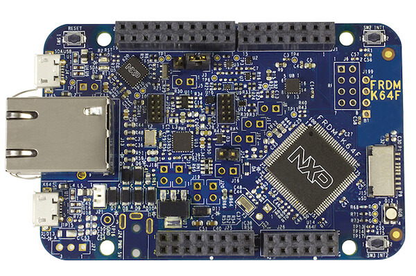

.. _frdm_k64f:

NXP FRDM-K64F
##############

Overview
********

The Freedom-K64F is an ultra-low-cost development platform for Kinetis K64,
K63, and K24 MCUs.

- Form-factor compatible with the Arduino R3 pin layout
- Peripherals enable rapid prototyping, including a 6-axis digital
  accelerometer and magnetometer to create full eCompass capabilities, a
  tri-colored LED and 2 user push-buttons for direct interaction, a microSD
  card slot, and connectivity using onboard Ethernet port and headers for use
  with Bluetooth* and 2.4 GHz radio add-on modules
- OpenSDAv2, the NXP open source hardware embedded serial and debug adapter
  running an open source bootloader, offers options for serial communication,
  flash programming, and run-control debugging

Hardware
********

- MK64FN1M0VLL12 MCU (120 MHz, 1 MB flash memory, 256 KB RAM, low-power,
  crystal-less USB, and 100 Low profile Quad Flat Package (LQFP))
- Dual role USB interface with micro-B USB connector
- RGB LED
- FXOS8700CQ accelerometer and magnetometer
- Two user push buttons
- Flexible power supply option - OpenSDAv2 USB, Kinetis K64 USB, and external source
- Easy access to MCU input/output through Arduino* R3 compatible I/O connectors
- Programmable OpenSDAv2 debug circuit supporting the CMSIS-DAP Interface
  software that provides:

  - Mass storage device (MSD) flash programming interface
  - CMSIS-DAP debug interface over a driver-less USB HID connection providing
    run-control debugging and compatibility with IDE tools
  - Virtual serial port interface
  - Open source CMSIS-DAP software project

- Ethernet
- SDHC

For more information about the K64F SoC and FRDM-K64F board:

- `K64F Website`_
- `K64F Datasheet`_
- `K64F Reference Manual`_
- `FRDM-K64F Website`_
- `FRDM-K64F User Guide`_
- `FRDM-K64F Schematics`_

Supported Features
==================

The frdm_k64f board configuration supports the following hardware features:

+-----------+------------+-------------------------------------+
| Interface | Controller | Driver/Component                    |
+===========+============+=====================================+
| NVIC      | on-chip    | nested vector interrupt controller  |
+-----------+------------+-------------------------------------+
| SYSTICK   | on-chip    | systick                             |
+-----------+------------+-------------------------------------+
| PINMUX    | on-chip    | pinmux                              |
+-----------+------------+-------------------------------------+
| GPIO      | on-chip    | gpio                                |
+-----------+------------+-------------------------------------+
| I2C       | on-chip    | i2c                                 |
+-----------+------------+-------------------------------------+
| SPI       | on-chip    | spi                                 |
+-----------+------------+-------------------------------------+
| WATCHDOG  | on-chip    | watchdog                            |
+-----------+------------+-------------------------------------+
| ADC       | on-chip    | adc                                 |
+-----------+------------+-------------------------------------+
| PWM       | on-chip    | pwm                                 |
+-----------+------------+-------------------------------------+
| ETHERNET  | on-chip    | ethernet                            |
+-----------+------------+-------------------------------------+
| UART      | on-chip    | serial port-polling;                |
|           |            | serial port-interrupt               |
+-----------+------------+-------------------------------------+
| FLASH     | on-chip    | soc flash                           |
+-----------+------------+-------------------------------------+
| USB       | on-chip    | USB device                          |
+-----------+------------+-------------------------------------+
| SENSOR    | off-chip   | fxos8700 polling;                   |
|           |            | fxos8700 trigger                    |
+-----------+------------+-------------------------------------+

The default configuration can be found in the defconfig file:

	``boards/arm/frdm_k64f/frdm_k64f_defconfig``

Other hardware features are not currently supported by the port.

Connections and IOs
===================

The K64F SoC has five pairs of pinmux/gpio controllers.

+-------+-----------------+---------------------------+
| Name  | Function        | Usage                     |
+=======+=================+===========================+
| PTB22 | GPIO            | Red LED                   |
+-------+-----------------+---------------------------+
| PTE26 | GPIO            | Green LED                 |
+-------+-----------------+---------------------------+
| PTB21 | GPIO            | Blue LED                  |
+-------+-----------------+---------------------------+
| PTC6  | GPIO            | SW2 / FXOS8700 INT1       |
+-------+-----------------+---------------------------+
| PTC13 | GPIO            | FXOS8700 INT2             |
+-------+-----------------+---------------------------+
| PTA4  | GPIO            | SW3                       |
+-------+-----------------+---------------------------+
| PTB10 | ADC             | ADC1 channel 14           |
+-------+-----------------+---------------------------+
| PTB16 | UART0_RX        | UART Console              |
+-------+-----------------+---------------------------+
| PTB17 | UART0_TX        | UART Console              |
+-------+-----------------+---------------------------+
| PTC8  | PWM             | PWM_3 channel 4           |
+-------+-----------------+---------------------------+
| PTC9  | PWM             | PWM_3 channel 5           |
+-------+-----------------+---------------------------+
| PTC16 | UART3_RX        | UART BT HCI               |
+-------+-----------------+---------------------------+
| PTC17 | UART3_TX        | UART BT HCI               |
+-------+-----------------+---------------------------+
| PTD0  | SPI0_PCS0       | SPI                       |
+-------+-----------------+---------------------------+
| PTD1  | SPI0_SCK        | SPI                       |
+-------+-----------------+---------------------------+
| PTD2  | SPI0_SOUT       | SPI                       |
+-------+-----------------+---------------------------+
| PTD3  | SPI0_SIN        | SPI                       |
+-------+-----------------+---------------------------+
| PTE24 | I2C0_SCL        | I2C / FXOS8700            |
+-------+-----------------+---------------------------+
| PTE25 | I2C0_SDA        | I2C / FXOS8700            |
+-------+-----------------+---------------------------+
| PTA5  | MII0_RXER       | Ethernet                  |
+-------+-----------------+---------------------------+
| PTA12 | MII0_RXD1       | Ethernet                  |
+-------+-----------------+---------------------------+
| PTA13 | MII0_RXD0       | Ethernet                  |
+-------+-----------------+---------------------------+
| PTA14 | MII0_RXDV       | Ethernet                  |
+-------+-----------------+---------------------------+
| PTA15 | MII0_TXEN       | Ethernet                  |
+-------+-----------------+---------------------------+
| PTA16 | MII0_TXD0       | Ethernet                  |
+-------+-----------------+---------------------------+
| PTA17 | MII0_TXD1       | Ethernet                  |
+-------+-----------------+---------------------------+
| PTA28 | MII0_TXER       | Ethernet                  |
+-------+-----------------+---------------------------+
| PTB0  | MII0_MDIO       | Ethernet                  |
+-------+-----------------+---------------------------+
| PTB1  | MII0_MDC        | Ethernet                  |
+-------+-----------------+---------------------------+
| PTC16 | ENET0_1588_TMR0 | Ethernet                  |
+-------+-----------------+---------------------------+
| PTC17 | ENET0_1588_TMR1 | Ethernet                  |
+-------+-----------------+---------------------------+
| PTC18 | ENET0_1588_TMR2 | Ethernet                  |
+-------+-----------------+---------------------------+
| PTC19 | ENET0_1588_TMR3 | Ethernet                  |
+-------+-----------------+---------------------------+

.. note::
   Do not enable Ethernet and UART BT HCI simultaneously because they conflict
   on PTC16-17.

System Clock
============

The K64F SoC is configured to use the 50 MHz external oscillator on the board
with the on-chip PLL to generate a 120 MHz system clock.

Serial Port
===========

The K64F SoC has six UARTs. One is configured for the console, another for BT
HCI, and the remaining are not used.

USB
===

The K64F SoC has a USB OTG (USBOTG) controller that supports both
device and host functions through its micro USB connector (K64F USB).
Only USB device function is supported in Zephyr at the moment.

Programming and Debugging
*************************

The FRDM-K64F includes the :ref:`nxp_opensda` serial and debug adapter built
into the board to provide debugging, flash programming, and serial
communication over USB.

To use the pyOCD tools with OpenSDA, follow the instructions in the
:ref:`nxp_opensda_pyocd` page using the `DAPLink FRDM-K64F Firmware`_. The
pyOCD tools are the default for this board, therefore it is not necessary to
set ``OPENSDA_FW=daplink`` explicitly when using the default flash and debug
mechanisms.

With these mechanisms, applications for the ``frdm_k64f`` board
configuration can be built and flashed in the usual way (see
:ref:`build_an_application` and :ref:`application_run` for more
details).

To use the Segger J-Link tools with OpenSDA, follow the instructions in the
:ref:`nxp_opensda_jlink` page using the `Segger J-Link OpenSDA V2.1 Firmware`_.
The Segger J-Link tools are not the default for this board, therefore it is
necessary to set ``OPENSDA_FW=jlink`` explicitly in the environment before
programming and debugging.

Flashing
========

This example uses the :ref:`hello_world` sample with the
:ref:`nxp_opensda_pyocd` tools.

.. zephyr-app-commands::
   :zephyr-app: samples/hello_world
   :board: frdm_k64f
   :goals: flash

Open a serial terminal (minicom, putty, etc.) with the following settings:

- Speed: 115200
- Data: 8 bits
- Parity: None
- Stop bits: 1

Reset the board and you should be able to see on the corresponding Serial Port
the following message:

.. code-block:: console

   Hello World! arm

Debugging
=========

You can debug an application in the usual way.  Here is an example for the
:ref:`hello_world` application.

.. zephyr-app-commands::
   :zephyr-app: samples/hello_world
   :board: frdm_k64f
   :maybe-skip-config:
   :goals: debug

.. _FRDM-K64F Website:
   http://www.nxp.com/products/software-and-tools/hardware-development-tools/freedom-development-boards/freedom-development-platform-for-kinetis-k64-k63-and-k24-mcus:FRDM-K64F

.. _FRDM-K64F User Guide:
   http://www.nxp.com/assets/documents/data/en/user-guides/FRDMK64FUG.pdf

.. _FRDM-K64F Schematics:
   http://www.nxp.com/assets/downloads/data/en/schematics/FRDM-K64F-SCH-E4.pdf

.. _K64F Website:
   http://www.nxp.com/products/microcontrollers-and-processors/arm-processors/kinetis-cortex-m-mcus/k-series-performance-m4/k6x-ethernet/kinetis-k64-120-mhz-256kb-sram-microcontrollers-mcus-based-on-arm-cortex-m4-core:K64_120

.. _K64F Datasheet:
   http://www.nxp.com/assets/documents/data/en/data-sheets/K64P144M120SF5.pdf

.. _K64F Reference Manual:
   http://www.nxp.com/assets/documents/data/en/reference-manuals/K64P144M120SF5RM.pdf

.. _DAPLink FRDM-K64F Firmware:
   http://www.nxp.com/assets/downloads/data/en/ide-debug-compile-build-tools/OpenSDAv2.2_DAPLink_frdmk64f_rev0242.zip

.. _Segger J-Link OpenSDA V2.1 Firmware:
   https://www.segger.com/downloads/jlink/OpenSDA_V2_1.bin
