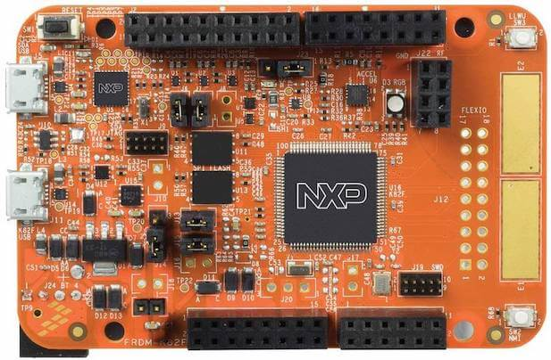

.. _frdm_k82f:

NXP FRDM-K82F
##############

Overview
********

The FRDM-K82F is a low-cost development platform for Kinetis K80, K81,
and K82 MCUs.

- Form-factor compatible with the Arduino R3 pin layout
- Peripherals enable rapid prototyping, including a six-axis digital
  accelerometer and magnetometer to create full eCompass capabilities, a
  tri-colored LED and two user push-buttons for direct interaction, 2x32 Mb
  QuadSPI external flash, FlexIO camera header, touchpads and headers for use
  with Bluetooth and 2.4 GHz radio add-on modules
- OpenSDAv2.1, the NXP open source hardware embedded serial and debug adapter
  running an open source bootloader, offers options for serial communication,
  flash programming, and run-control debugging

Hardware
********

- MK82FN256VLL15 MCU (150 MHz, 256 KB flash memory, 256 KB RAM, low-power,
  crystal-less USB, and 100 Low profile Quad Flat Package (LQFP))
- Dual role USB interface with micro-B USB connector
- RGB LED
- FXOS8700CQ accelerometer and magnetometer
- Two user push buttons
- 2x 32 Mb QSPI flash
- Flexible power supply option - OpenSDAv2.1 USB, Kinetis K82 USB, and external source
- Easy access to MCU input/output through Arduino R3 compatible I/O connectors
- Programmable OpenSDAv2.1 debug circuit supporting the CMSIS-DAP Interface
  software that provides:

  - Mass storage device (MSD) flash programming interface
  - CMSIS-DAP debug interface over a driver-less USB HID connection providing
    run-control debugging and compatibility with IDE tools
  - Virtual serial port interface
  - Open source CMSIS-DAP software project

- FlexIO header

For more information about the K82F SoC and FRDM-K82F board:

- `K82F Website`_
- `K82F Datasheet`_
- `K82F Reference Manual`_
- `FRDM-K82F Website`_
- `FRDM-K82F User Guide`_
- `FRDM-K82F Schematics`_

Supported Features
==================

The frdm_k82f board configuration supports the following hardware features:

+-----------+------------+-------------------------------------+
| Interface | Controller | Driver/Component                    |
+===========+============+=====================================+
| NVIC      | on-chip    | nested vector interrupt controller  |
+-----------+------------+-------------------------------------+
| SYSTICK   | on-chip    | systick                             |
+-----------+------------+-------------------------------------+
| PINMUX    | on-chip    | pinmux                              |
+-----------+------------+-------------------------------------+
| ADC       | on-chip    | adc                                 |
+-----------+------------+-------------------------------------+
| FLASH     | on-chip    | soc flash                           |
+-----------+------------+-------------------------------------+
| FLASH     | off-chip   | QSPI flash                          |
+-----------+------------+-------------------------------------+
| GPIO      | on-chip    | gpio                                |
+-----------+------------+-------------------------------------+
| I2C       | on-chip    | i2c                                 |
+-----------+------------+-------------------------------------+
| PWM       | on-chip    | pwm                                 |
+-----------+------------+-------------------------------------+
| RTC       | on-chip    | rtc                                 |
+-----------+------------+-------------------------------------+
| SENSOR    | off-chip   | fxos8700 polling;                   |
|           |            | fxos8700 trigger                    |
+-----------+------------+-------------------------------------+
| SPI       | on-chip    | spi                                 |
+-----------+------------+-------------------------------------+
| UART      | on-chip    | serial port-polling;                |
|           |            | serial port-interrupt               |
+-----------+------------+-------------------------------------+
| USB       | on-chip    | USB device                          |
+-----------+------------+-------------------------------------+
| WATCHDOG  | on-chip    | watchdog                            |
+-----------+------------+-------------------------------------+

The default configuration can be found in the defconfig file:

	``boards/arm/frdm_k82f/frdm_k82f_defconfig``

Other hardware features are not currently supported by the port.

System Clock
============

The K82F SoC is configured to use the 12 MHz external oscillator on the board
with the on-chip PLL to generate a 120 MHz system clock.

Serial Port
===========

The K82F SoC has five UARTs. One is configured for the console, the remaining
ones are not used.

USB
===

The K82F SoC has a USB OTG (USBOTG) controller that supports both
device and host functions through its micro USB connector (J11).
Only USB device function is supported in Zephyr at the moment.

Programming and Debugging
*************************

Build and flash applications as usual (see :ref:`build_an_application` and
:ref:`application_run` for more details).

Configuring a Debug Probe
=========================

A debug probe is used for both flashing and debugging the board. This board is
configured by default to use the :ref:`opensda-daplink-onboard-debug-probe`.

Early versions of this board have an outdated version of the OpenSDA bootloader
and require an update. Please see the `DAPLink Bootloader Update`_ page for
instructions to update from the CMSIS-DAP bootloader to the DAPLink bootloader.

Option 1: :ref:`opensda-daplink-onboard-debug-probe` (Recommended)
------------------------------------------------------------------

Install the :ref:`pyocd-debug-host-tools` and make sure they are in your search
path.

Follow the instructions in :ref:`opensda-daplink-onboard-debug-probe` to program
the `OpenSDA DAPLink FRDM-K82F Firmware`_.

Option 2: :ref:`opensda-jlink-onboard-debug-probe`
--------------------------------------------------

Install the :ref:`jlink-debug-host-tools` and make sure they are in your search
path.

Follow the instructions in :ref:`opensda-jlink-onboard-debug-probe` to program
the `OpenSDA J-Link Firmware for FRDM-K82F`_.

Add the argument ``-DOPENSDA_FW=jlink`` when you invoke ``west build`` or
``cmake`` to override the default runner from pyOCD to J-Link:

.. zephyr-app-commands::
   :zephyr-app: samples/hello_world
   :tool: all
   :board: frdm_k82f
   :gen-args: -DOPENSDA_FW=jlink
   :goals: build

Configuring a Console
=====================

Regardless of your choice in debug probe, we will use the OpenSDA
microcontroller as a usb-to-serial adapter for the serial console.

Connect a USB cable from your PC to J5.

Use the following settings with your serial terminal of choice (minicom, putty,
etc.):

- Speed: 115200
- Data: 8 bits
- Parity: None
- Stop bits: 1

Flashing
========

Here is an example for the :ref:`hello_world` application.

.. zephyr-app-commands::
   :zephyr-app: samples/hello_world
   :board: frdm_k82f
   :goals: flash

Open a serial terminal, reset the board (press the SW1 button), and you should
see the following message in the terminal:

.. code-block:: console

   ***** Booting Zephyr OS v1.14.0-xxx-gxxxxxxxxxxxx *****
   Hello World! frdm_k82f

Debugging
=========

Here is an example for the :ref:`hello_world` application.

.. zephyr-app-commands::
   :zephyr-app: samples/hello_world
   :board: frdm_k82f
   :goals: debug

Open a serial terminal, step through the application in your debugger, and you
should see the following message in the terminal:

.. code-block:: console

   ***** Booting Zephyr OS v1.14.0-xxx-gxxxxxxxxxxxx *****
   Hello World! frdm_k82f

.. _FRDM-K82F Website:
   https://www.nxp.com/design/development-boards/freedom-development-boards/mcu-boards/freedom-development-platform-for-kinetis-k82-k81-and-k80-mcus:FRDM-K82F

.. _FRDM-K82F User Guide:
   https://www.nxp.com/docs/en/user-guide/FRDMK82FUG.pdf

.. _FRDM-K82F Schematics:
   https://www.nxp.com/downloads/en/schematics/FRDM-K82F-SCH.pdf

.. _K82F Website:
   https://www.nxp.com/products/processors-and-microcontrollers/arm-microcontrollers/general-purpose-mcus/k-series-cortex-m4/k8x-secure/kinetis-k82-150-mhz-hw-cryptographic-co-processor-quadspi-microcontrollers-mcus-based-on-arm-cortex-m4-core:K82_150

.. _K82F Datasheet:
   https://www.nxp.com/docs/en/data-sheet/K82P121M150SF5.pdf

.. _K82F Reference Manual:
   https://www.nxp.com/docs/en/reference-manual/K82P121M150SF5RM.pdf

.. _DAPLink Bootloader Update:
   https://os.mbed.com/blog/entry/DAPLink-bootloader-update/

.. _OpenSDA DAPLink FRDM-K82F Firmware:
   https://www.nxp.com/assets/downloads/data/en/snippets-boot-code-headers-monitors/k20dx_frdmk82f_if_crc_legacy_0x8000.bin

.. _OpenSDA J-Link Firmware for FRDM-K82F:
   https://www.segger.com/downloads/jlink/OpenSDA_FRDM-K82F
