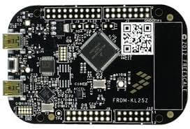

.. _frdm_kl25z:

NXP FRDM-KL25Z
##############

Overview
********

The Freedom KL25Z is an ultra-low-cost development platform for
Kinetis |reg| L Series KL1x (KL14/15) and KL2x (KL24/25) MCUs built
on ARM |reg| Cortex |reg|-M0+ processor.

The FRDM-KL25Z features include easy access to MCU I/O, battery-ready,
low-power operation, a standard-based form factor with expansion board
options and a built-in debug interface for flash programming and run-control.

Hardware
********

- MKL25Z128VLK4 MCU @ 48 MHz, 128 KB flash, 16 KB SRAM, USB OTG (FS), 80LQFP
- On board capacitive touch "slider", MMA8451Q accelerometer, and tri-color LED
- OpenSDA debug interface

For more information about the KL25Z SoC and FRDM-KL25Z board:

- `KL25Z Website`_
- `KL25Z Datasheet`_
- `KL25Z Reference Manual`_
- `FRDM-KL25Z Website`_
- `FRDM-KL25Z User Guide`_
- `FRDM-KL25Z Schematics`_

Supported Features
==================

The frdm_kl25z board configuration supports the following hardware features:

+-----------+------------+-------------------------------------+
| Interface | Controller | Driver/Component                    |
+===========+============+=====================================+
| NVIC      | on-chip    | nested vector interrupt controller  |
+-----------+------------+-------------------------------------+
| SYSTICK   | on-chip    | systick                             |
+-----------+------------+-------------------------------------+
| PINMUX    | on-chip    | pinmux                              |
+-----------+------------+-------------------------------------+
| GPIO      | on-chip    | gpio                                |
+-----------+------------+-------------------------------------+
| UART      | on-chip    | serial port-polling;                |
|           |            | serial port-interrupt               |
+-----------+------------+-------------------------------------+
| I2C       | on-chip    | i2c                                 |
+-----------+------------+-------------------------------------+
| SPI       | on-chip    | spi                                 |
+-----------+------------+-------------------------------------+
| FLASH     | on-chip    | soc flash                           |
+-----------+------------+-------------------------------------+

The default configuration can be found in the defconfig file:

	``boards/arm/frdm_kl25z/frdm_kl25z_defconfig``

Other hardware features are not currently supported by the port.

Connections and IOs
===================

The KL25Z SoC has five pairs of pinmux/gpio controllers, and all are currently enabled
(PORTA/GPIOA, PORTB/GPIOB, PORTC/GPIOC, PORTD/GPIOD, and PORTE/GPIOE) for the FRDM-KL25Z board.

+-------+-------------+---------------------------+
| Name  | Function    | Usage                     |
+=======+=============+===========================+
| PTB18 | GPIO        | Red LED                   |
+-------+-------------+---------------------------+
| PTB19 | GPIO        | Green LED                 |
+-------+-------------+---------------------------+
| PTD1  | GPIO        | Blue LED                  |
+-------+-------------+---------------------------+
| PTA1  | UART0_RX    | UART Console              |
+-------+-------------+---------------------------+
| PTA2  | UART0_TX    | UART Console              |
+-------+-------------+---------------------------+
| PTE24 | I2C0_SCL    | I2C                       |
+-------+-------------+---------------------------+
| PTE25 | I2C0_SDA    | I2C                       |
+-------+-------------+---------------------------+
| PTC4  | SPI0_PSC0   | SPI                       |
+-------+-------------+---------------------------+
| PTC5  | SPI0_SCK    | SPI                       |
+-------+-------------+---------------------------+
| PTC6  | SPI0_MOSI   | SPI                       |
+-------+-------------+---------------------------+
| PTC7  | SPI0_MISO   | SPI                       |
+-------+-------------+---------------------------+

System Clock
============

The KL25Z SoC is configured to use the 8 MHz external oscillator on the board
with the on-chip FLL to generate a 48 MHz system clock.

Serial Port
===========

The KL25Z UART0 is used for the console.

Programming and Debugging
*************************

The FRDM-KL25Z includes the :ref:`nxp_opensda` serial and debug adapter built
into the board to provide debugging, flash programming, and serial
communication over USB.

To use the pyOCD tools with OpenSDA, follow the instructions in the
:ref:`nxp_opensda_pyocd` page using the `DAPLink FRDM-KL25Z Firmware`_.

To use the Segger J-Link tools with OpenSDA, follow the instructions in the
:ref:`nxp_opensda_jlink` page using the `Segger J-Link OpenSDA V2.1 Firmware`_.

Flashing
========

This example uses the :ref:`hello_world` sample with the
:ref:`nxp_opensda_pyocd` tools. Use the ``make flash`` build target to build
your Zephyr application, invoke the pyOCD flash tool and program your Zephyr
application to flash.

.. code-block:: console

   $ cd <zephyr_root_path>
   $ . zephyr-env.sh
   $ cd samples/hello_world/
   $ make BOARD=frdm_kl25z FLASH_SCRIPT=pyocd.sh flash

Open a serial terminal (minicom, putty, etc.) with the following settings:

- Speed: 115200
- Data: 8 bits
- Parity: None
- Stop bits: 1

Reset the board and you should be able to see on the corresponding Serial Port
the following message:

.. code-block:: console

   Hello World! arm

Debugging
=========

This example uses the :ref:`hello_world` sample with the
:ref:`nxp_opensda_pyocd` tools. Use the ``make debug`` build target to build
your Zephyr application, invoke the pyOCD GDB server, attach a GDB client, and
program your Zephyr application to flash. It will leave you at a gdb prompt.

.. code-block:: console

   $ cd <zephyr_root_path>
   $ . zephyr-env.sh
   $ cd samples/hello_world/
   $ make BOARD=frdm_kl25z DEBUG_SCRIPT=pyocd.sh debug

.. _FRDM-KL25Z Website:
   http://www.nxp.com/products/software-and-tools/hardware-development-tools/freedom-development-boards/freedom-development-platform-for-kinetis-kl14-kl15-kl24-kl25-mcus:FRDM-KL25Z?tid=vanFRDM-KL25Z

.. _FRDM-KL25Z User Guide:
   http://www.nxp.com/assets/documents/data/en/user-guides/FRDMKL25ZUM.zip

.. _FRDM-KL25Z Schematics:
   http://www.nxp.com/assets/downloads/data/en/schematics/FRDM-KL25Z_SCH_REV_E.pdf

.. _KL25Z Website:
   http://www.nxp.com/products/microcontrollers-and-processors/arm-processors/kinetis-cortex-m-mcus/l-series-ultra-low-power-m0-plus/kinetis-kl2x-48-mhz-usb-ultra-low-power-microcontrollers-mcus-based-on-arm-cortex-m0-plus-core:KL2x?lang_cd=en

.. _KL25Z Datasheet:
   http://www.nxp.com/assets/documents/data/en/data-sheets/KL25P80M48SF0.pdf

.. _KL25Z Reference Manual:
   http://www.nxp.com/assets/documents/data/en/reference-manuals/KL25P80M48SF0RM.pdf

.. _DAPLink FRDM-KL25Z Firmware:
   http://www.nxp.com/assets/downloads/data/en/ide-debug-compile-build-tools/OpenSDAv2.2_DAPLink_frdmkl25z_rev0242.zip

.. _Segger J-Link OpenSDA V2.1 Firmware:
   https://www.segger.com/downloads/jlink/OpenSDA_V2_1.bin
