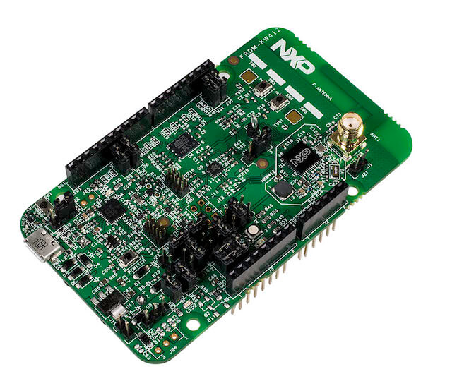

.. _frdm_kw41z:

NXP FRDM-KW41Z
##############

Overview
********

The FRDM-KW41Z is a development kit enabled by the Kinetis |reg| W series
KW41Z/31Z/21Z (KW41Z) family built on ARM |reg| Cortex |reg|-M0+ processor with
integrated 2.4 GHz transceiver supporting Bluetooth |reg| Smart/Bluetooth
|reg| Low Energy
(BLE) v4.2, Generic FSK, IEEE |reg| 802.15.4 and Thread.

The FRDM-KW41Z kit contains two Freedom boards that can be used as a
development board or a shield to connect to a host processor. The FRDM-KW41Z is
form-factor compatible with the Arduino |trade| R3 pin layout for more expansion
options.

The FRDM-KW41Z highly-sensitive, optimized 2.4 GHz radio features a PCB
F-antenna which can be bypassed to test via SMA connection, multiple power
supply options, push/capacitive touch buttons, switches, LEDs and integrated
sensors.

Hardware
********

- Can be configured as Host or Shield for connection to Host Processor
- Supports all DC-DC configurations (Buck, Boost, Bypass)
- PCB inverted F-type antenna
- SMA RF Connector
- RF regulatory certified
- Serial Flash for OTA firmware upgrades
- On board NXP FXOS8700CQ digital sensor, 3D Accelerometer ( |plusminus| 2g/
  |plusminus| 4g/ |plusminus| 8g) + 3D
  Magnetometer
- OpenSDA and JTAG debug

For more information about the KW41Z SoC and FRDM-KW41Z board:

- `KW41Z Website`_
- `KW41Z Datasheet`_
- `KW41Z Reference Manual`_
- `FRDM-KW41Z Website`_
- `FRDM-KW41Z User Guide`_
- `FRDM-KW41Z Schematics`_

Supported Features
==================

The frdm_kw41z board configuration supports the following hardware features:

+-----------+------------+-------------------------------------+
| Interface | Controller | Driver/Component                    |
+===========+============+=====================================+
| NVIC      | on-chip    | nested vector interrupt controller  |
+-----------+------------+-------------------------------------+
| SYSTICK   | on-chip    | systick                             |
+-----------+------------+-------------------------------------+
| PINMUX    | on-chip    | pinmux                              |
+-----------+------------+-------------------------------------+
| COUNTER   | on-chip    | rtc                                 |
+-----------+------------+-------------------------------------+
| GPIO      | on-chip    | gpio                                |
+-----------+------------+-------------------------------------+
| I2C       | on-chip    | i2c                                 |
+-----------+------------+-------------------------------------+
| SPI       | on-chip    | spi                                 |
+-----------+------------+-------------------------------------+
| ADC       | on-chip    | adc                                 |
+-----------+------------+-------------------------------------+
| UART      | on-chip    | serial port-polling;                |
|           |            | serial port-interrupt               |
+-----------+------------+-------------------------------------+
| FLASH     | on-chip    | soc flash                           |
+-----------+------------+-------------------------------------+
| SENSOR    | off-chip   | fxos8700 polling:                   |
|           |            | fxos8700 trigger                    |
+-----------+------------+-------------------------------------+

The default configuration can be found in the defconfig file:

	``boards/arm/frdm_kw41z/frdm_kw41z_defconfig``

Other hardware features are not currently supported by the port.

Connections and IOs
===================

The KW41Z SoC has three pairs of pinmux/gpio controllers, but only two are
currently enabled (PORTA/GPIOA and PORTC/GPIOC) for the FRDM-KW41Z board.

+-------+-------------+---------------------------+
| Name  | Function    | Usage                     |
+=======+=============+===========================+
| PTC1  | GPIO        | Red LED / FXOS8700 INT1   |
+-------+-------------+---------------------------+
| PTA19 | GPIO        | Green LED                 |
+-------+-------------+---------------------------+
| PTA18 | GPIO        | Blue LED                  |
+-------+-------------+---------------------------+
| PTB2  | ADC         | ADC0 channel 3            |
+-------+-------------+---------------------------+
| PTC2  | I2C1_SCL    | I2C / FXOS8700            |
+-------+-------------+---------------------------+
| PTC3  | I2C1_SDA    | I2C / FXOS8700            |
+-------+-------------+---------------------------+
| PTC4  | GPIO        | SW3                       |
+-------+-------------+---------------------------+
| PTC5  | GPIO        | SW4                       |
+-------+-------------+---------------------------+
| PTC6  | LPUART0_RX  | UART Console              |
+-------+-------------+---------------------------+
| PTC7  | LPUART0_TX  | UART Console              |
+-------+-------------+---------------------------+
| PTC16 | SPI0_SCK    | SPI                       |
+-------+-------------+---------------------------+
| PTC17 | SPI0_SOUT   | SPI                       |
+-------+-------------+---------------------------+
| PTC18 | SPI0_SIN    | SPI                       |
+-------+-------------+---------------------------+
| PTC19 | SPI0_PCS0   | SPI                       |
+-------+-------------+---------------------------+

System Clock
============

The KW41Z SoC is configured to use the 32 MHz external oscillator on the board
with the on-chip FLL to generate a 40 MHz system clock.

Serial Port
===========

The KW41Z SoC has one UART, which is used for the console.

Programming and Debugging
*************************

Build and flash applications as usual (see :ref:`build_an_application` and
:ref:`application_run` for more details).

Configuring a Debug Probe
=========================

A debug probe is used for both flashing and debugging the board. This board is
configured by default to use the :ref:`opensda-daplink-onboard-debug-probe`.

Option 1: :ref:`opensda-daplink-onboard-debug-probe` (Recommended)
------------------------------------------------------------------

Install the :ref:`pyocd-debug-host-tools` and make sure they are in your search
path.

Follow the instructions in :ref:`opensda-daplink-onboard-debug-probe` to program
the `OpenSDA DAPLink FRDM-KW41Z Firmware`_.

Option 2: :ref:`opensda-jlink-onboard-debug-probe`
--------------------------------------------------

Install the :ref:`jlink-debug-host-tools` and make sure they are in your search
path.

Follow the instructions in :ref:`opensda-jlink-onboard-debug-probe` to program
the `OpenSDA J-Link FRDM-KW41Z Firmware`_.

Add the argument ``-DOPENSDA_FW=jlink`` when you invoke ``west build`` to
override the default runner from pyOCD to J-Link:

.. zephyr-app-commands::
   :zephyr-app: samples/hello_world
   :board: frdm_kw41z
   :gen-args: -DOPENSDA_FW=jlink
   :goals: build

Configuring a Console
=====================

Regardless of your choice in debug probe, we will use the OpenSDA
microcontroller as a usb-to-serial adapter for the serial console.

Connect a USB cable from your PC to J6.

Use the following settings with your serial terminal of choice (minicom, putty,
etc.):

- Speed: 115200
- Data: 8 bits
- Parity: None
- Stop bits: 1

Flashing
========

Here is an example for the :ref:`hello_world` application.

.. zephyr-app-commands::
   :zephyr-app: samples/hello_world
   :board: frdm_kw41z
   :goals: flash

Open a serial terminal, reset the board (press the SW1 button), and you should
see the following message in the terminal:

.. code-block:: console

   ***** Booting Zephyr OS v1.14.0-rc1 *****
   Hello World! frdm_kw41z

Debugging
=========

Here is an example for the :ref:`hello_world` application.

.. zephyr-app-commands::
   :zephyr-app: samples/hello_world
   :board: frdm_kw41z
   :goals: debug

Open a serial terminal, step through the application in your debugger, and you
should see the following message in the terminal:

.. code-block:: console

   ***** Booting Zephyr OS v1.14.0-rc1 *****
   Hello World! frdm_kw41z

.. _FRDM-KW41Z Website:
   https://www.nxp.com/products/processors-and-microcontrollers/arm-based-processors-and-mcus/kinetis-cortex-m-mcus/w-serieswireless-conn.m0-plus-m4/freedom-development-kit-for-kinetis-kw41z-31z-21z-mcus:FRDM-KW41Z

.. _FRDM-KW41Z User Guide:
   https://www.nxp.com/webapp/Download?colCode=FRDMKW41ZUG

.. _FRDM-KW41Z Schematics:
   https://www.nxp.com/webapp/Download?colCode=FRDM-KW41Z-SCH

.. _KW41Z Website:
   https://www.nxp.com/products/wireless/zigbee/kinetis-kw41z-2.4-ghz-dual-mode-bluetooth-low-energy-and-802.15.4-wireless-radio-microcontroller-mcu-based-on-arm-cortex-m0-plus-core:KW41Z

.. _KW41Z Datasheet:
   https://www.nxp.com/docs/en/data-sheet/MKW41Z512.pdf

.. _KW41Z Reference Manual:
   https://www.nxp.com/webapp/Download?colCode=MKW41Z512RM

.. _OpenSDA DAPLink FRDM-KW41Z Firmware:
   https://www.nxp.com/assets/downloads/data/en/reference-applications/OpenSDAv2.2_DAPLink_frdmkw41z_rev0241.zip

.. _OpenSDA J-Link FRDM-KW41Z Firmware:
   https://www.segger.com/downloads/jlink/OpenSDA_FRDM-KW41Z
