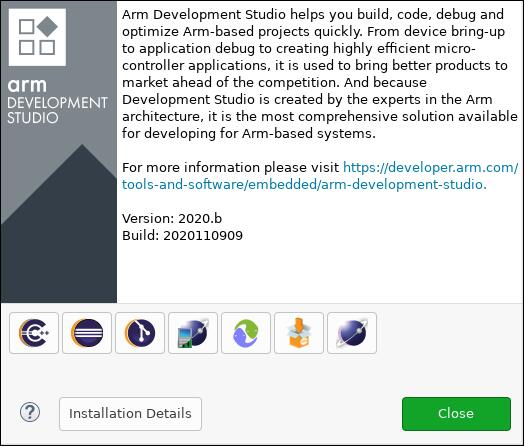
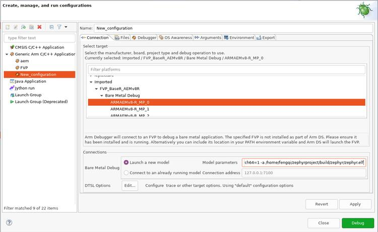
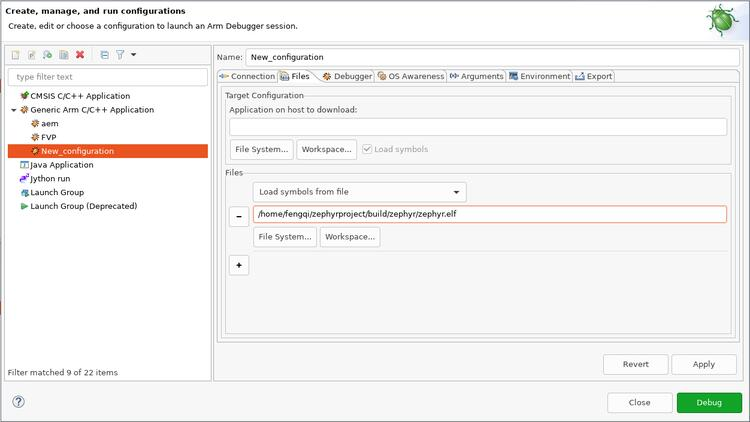
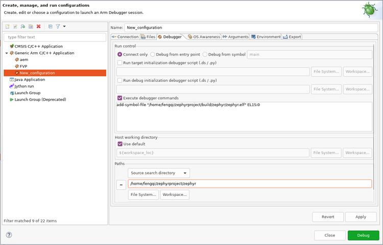
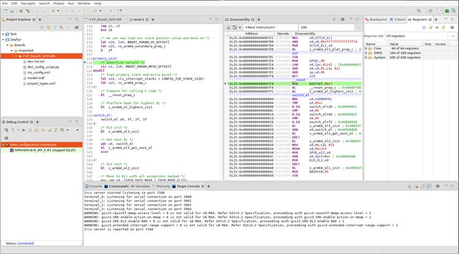

.. zephyr:board:: fvp_baser_aemv8r

Overview
********

This board configuration uses Armv8-R AEM FVP [1]_ to emulate a generic
Armv8-R [2]_ hardware platform supporting both 32-bit (AArch32) and 64-bit (AArch64) architectures.

Fixed Virtual Platforms (FVP) are complete simulations of an Arm system,
including processor, memory and peripherals. These are set out in a
"programmer's view", which gives you a comprehensive model on which to build
and test your software.

The Armv8-R AEM FVP is a free of charge Armv8-R Fixed Virtual Platform. It
supports the latest Armv8-R feature set. Please refer to FVP documentation
page [3]_ for more details about FVP.

To Run the Fixed Virtual Platform simulation tool you must download "Armv8-R AEM
FVP" from Arm developer [1]_ (This might require the user to register) and
install it on your host PC.

The current minimum required version of "Armv8-R AEM FVP" is 11.16.16.

Hardware
********

Supported Features
==================

.. zephyr:board-supported-hw::

When FVP is launched with ``-a, --application FILE`` option, the kernel will be
loaded into DRAM region ``[0x0-0x7FFFFFFF]``. For more information, please refer
to the official Armv8-R AEM FVP memory map document [4]_.

Devices
=======

System Clock
------------

This board configuration uses a system clock frequency of 100 MHz.

Serial Port
-----------

This board configuration uses a single serial communication channel with the
UART0.

Programming and Debugging
*************************

Environment
===========

First, set the ``ARMFVP_BIN_PATH`` environment variable before building.
Optionally, set ``ARMFVP_EXTRA_FLAGS`` to pass additional arguments to the FVP.

.. code-block:: bash

   export ARMFVP_BIN_PATH=/path/to/fvp/directory

Programming
===========

Use this configuration to build basic Zephyr applications and kernel tests in the
Arm FVP emulated environment.

For AArch64 (64-bit) applications, use the :zephyr:code-sample:`synchronization` sample:

.. zephyr-app-commands::
   :zephyr-app: samples/synchronization
   :host-os: unix
   :board: fvp_baser_aemv8r/fvp_aemv8r_aarch64
   :goals: build

For AArch32 (32-bit) applications, use:

.. zephyr-app-commands::
   :zephyr-app: samples/synchronization
   :host-os: unix
   :board: fvp_baser_aemv8r/fvp_aemv8r_aarch32
   :goals: build

This will build an image with the synchronization sample app.
Then you can run it with ``west build -t run``.

Debugging
=========

Refer to the detailed overview about :ref:`application_debugging`.

You may use the instructions below to debug with Arm Development Studio [5]_.

Debugging with Arm DS
---------------------

Install Arm DS
^^^^^^^^^^^^^^

Please refer to the official Arm Development Studio Page [5]_ for details. Here
``Version: 2020.b Build: 2020110909`` is used in the following example.

Download Arm FVP BaseR AEMv8-R
^^^^^^^^^^^^^^^^^^^^^^^^^^^^^^

Please refer to official FVP page [1]_ for download instructions. Here ``$FVP_D``
is used to indicate which directory is FVP located.

Use DS perspective
^^^^^^^^^^^^^^^^^^

- From menu choose :menuselection:`Window --> Perspective --> Open Perspective --> Other...`:

- In the opened window, choose :guilabel:`Development Studio (default)`:

  .. figure:: images/perspective-choose-ds.jpg
     :align: center
     :alt: Arm DS Perspective choose DS

     Select the Development Studio perspective

Create a new configuration database
^^^^^^^^^^^^^^^^^^^^^^^^^^^^^^^^^^^

- Create a new configuration database by selecting
  :menuselection:`File --> New --> Other... --> Configuration Database`:

  .. figure:: images/create-new-configuration-database.jpg
     :align: center
     :alt: Arm DS create new configuration database

     Create new configuration database

- Choose a name for the database. Here :guilabel:`Zephyr` is used:

  .. figure:: images/create-new-configuration-database_database-name.jpg
     :align: center
     :alt: Arm DS create new configuration database: choose database name

     Choose a database name

- Click :guilabel:`Finish` and the new configuration database can be seen in
  :guilabel:`Project Explorer`:

  .. figure:: images/create-new-configuration-database_shown-in-project-explorer.jpg
     :align: center
     :alt: Arm DS create new configuration database: shown in project explorer

     New configuration database can be seen in Project Explorer

Create a new model configuration
^^^^^^^^^^^^^^^^^^^^^^^^^^^^^^^^^

- Right click :guilabel:`Zephyr` in :guilabel:`Project Explorer`, choose
  :menuselection:`New --> Model Configuration`:

  .. figure:: images/create-new-model-configuration.jpg
     :align: center
     :alt: Arm DS create new model configuration

     Create new model configuration

- In the opened window:

  1. Choose :guilabel:`Iris` for :guilabel:`Model Interface`, then :guilabel:`Next >`.
  2. Choose :guilabel:`Launch and connect to specific model`, then :guilabel:`Next >`.
  3. Set :guilabel:`Model Path` to ``$FVP_D/FVP_BaseR_AEMv8R``, then :guilabel:`Finish`.

  .. figure:: images/create-new-model-configuration_model-path.jpg
     :align: center
     :alt: Arm DS create new model configuration: set model path

     Set model path

- Then in :guilabel:`FVP_BaseR_AEMv8R` tab, change :guilabel:`ARMAEMv8-R_` to
  :guilabel:`V8R64-Generic`, click :guilabel:`Save` and then click :guilabel:`Import`:

  .. figure:: images/create-new-model-configuration_model-use-V8R64-Generic.jpg
     :align: center
     :alt: Arm DS create new model configuration: import

     Import model configuration

Create a new launch configuration
^^^^^^^^^^^^^^^^^^^^^^^^^^^^^^^^^

- From :guilabel:`Project Explorer`, right click :guilabel:`FVP_BaseR_AEMv8R` and select
  :menuselection:`Debug as --> Debug configurations...`:

  .. figure:: images/create-new-launch-configuration_context-menu.jpg
     :align: center
     :alt: Arm DS create new launch configuration: context menu

     Create new launch configuration: context menu

- Select :guilabel:`Generic Arm C/C++ Application` and click :guilabel:`New launch configuration`
  button.

  A new configuration named :guilabel:`New_configuration` will be created.

1. In :guilabel:`Connection` tab:

   - In :guilabel:`Select target` box, select
     :guilabel:`Imported -> FVP_BaseR_AEMv8R -> Bare Metal Debug -> ARMAEMv8-R_MP_0`
   - In :guilabel:`Connections` box, set :guilabel:`Model parameters` to::

       -C bp.dram.enable_atomic_ops=1 -C bp.sram.enable_atomic_ops=1 -C bp.refcounter.non_arch_start_at_default=1 -C gic_distributor.GICD_CTLR-DS-1-means-secure-only=1 -C gic_distributor.has-two-security-states=0 -C bp.vis.disable_visualisation=1 -C cluster0.has_aarch64=1 -a /home/fengqi/zephyrproject/build/zephyr/zephyr.elf

     These parameters are passed to :guilabel:`FVP_BaseR_AEMv8R` when launches.
     Run :guilabel:`FVP_BaseR_AEMv8R --help` to see all command line options.
     Run :guilabel:`FVP_BaseR_AEMv8R --list-params` to see all supported parameters.
     The file ``zephyr.elf`` specified by ``-a`` is the binary built from Zephyr.

   Create new launch configuration: connection

2. In :guilabel:`Files` tab:

   In the :guilabel:`Files` group, set :guilabel:`Load symbols from file` to full path of
   :guilabel:`zephyr.elf` that you built.

   Create new launch configuration: files

3. In :guilabel:`Debugger` tab:

   - In :guilabel:`Run control` box, check :guilabel:`Execute debugger commands` and insert::

       add-symbol-file "/home/fengqi/zephyrproject/build/zephyr/zephyr.elf" EL1S:0

     Replace :guilabel:`/home/fengqi/zephyrproject/build/zephyr/zephyr.elf` with your local path.

   - In :guilabel:`Paths` box, set :guilabel:`Source search directory` to the path to Zephyr source
     code.

   Create new launch configuration: debugger

After all these changes are made, click :guilabel:`Apply`, then click :guilabel:`Debug`. DS will
launch :guilabel:`FVP_BaseR_AEMv8R` and connect to it. You can see a new session is
connected in :guilabel:`Debug Control` window.

   Arm DS is now working!

References
**********

.. target-notes::

.. [1] https://developer.arm.com/tools-and-software/simulation-models/fixed-virtual-platforms/arm-ecosystem-models
.. [2] Arm Architecture Reference Manual Supplement - Armv8, for Armv8-R AArch64 architecture profile
       https://developer.arm.com/documentation/ddi0600/latest/
.. [3] https://developer.arm.com/tools-and-software/simulation-models/fixed-virtual-platforms/docs
.. [4] https://developer.arm.com/documentation/100964/1114/Base-Platform/Base---memory/BaseR-Platform-memory-map
.. [5] https://developer.arm.com/tools-and-software/embedded/arm-development-studio
