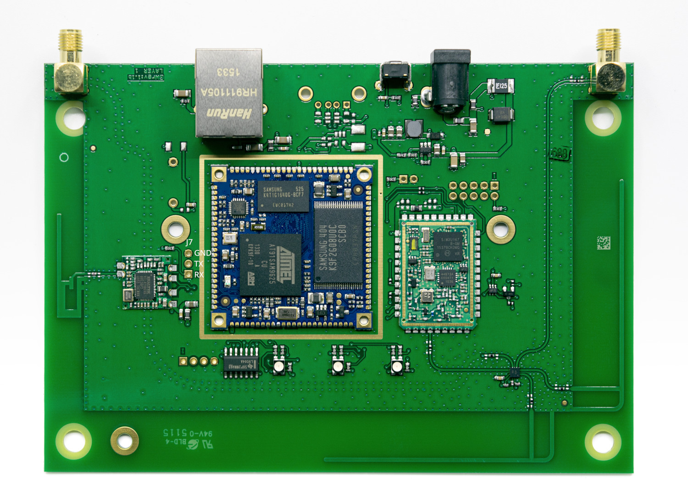

.. _boardname_linkname:

GARDENA SiM3U radio module
##########################

Overview
********

This is a SoM that is used as a radio module by the GARDENA smart Gateway.

Hardware
********

- SIM3U167-B-GM SoC
- SPI Silicon Labs Si4467 transceiver
- Controls an RGB LED via high drive pins. It's expected to mirror the
  state of 3 low-drive pins coming from the Linux SoC.
- UART is connected to the Linux SoC. Usually it's used for PPP, but it can
  also be used for debugging when PPP is not active.

Supported Features
==================

- USART: polling and interrupt mode

Programming and Debugging
*************************

Flashing
========

The easiest way is to do this via SSH from the Linux SoM that's connected to
the SiM3U SoM.

On your building machine:

.. code-block:: console
   scp -O build/zephyr/zephyr.hex root@IP:/tmp/

On the gateway:

.. code-block:: console
   openocd -f board/gardena_radio.cfg -c 'program /tmp/zephyr.hex verify exit'
   reset-rm

Debugging
=========

The easiest way is to do this via SSH from the Linux gateway as well:

.. code-block:: console
   openocd -f board/gardena_radio.cfg -c init

References
**********

.. _User manual:
   https://www.gardena.com/tdrdownload//pub000070911/doc000120830

.. _SoC product page:
   https://www.silabs.com/mcu/32-bit-microcontrollers/precision32-sim3u1xx/device.SiM3U167-B-GQ?tab=specs

.. _Yocto source code and documentation:
   https://github.com/husqvarnagroup/smart-garden-gateway-public
