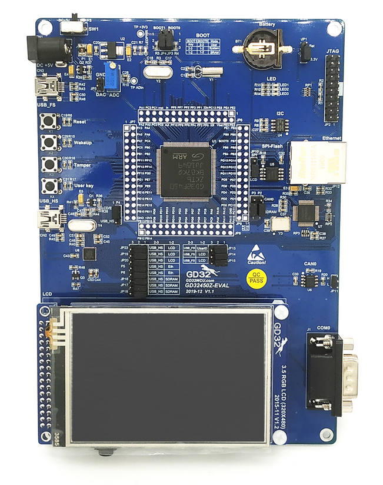

.. _gd32f450z_eval:

GigaDevice GD32F450Z-EVAL
#########################

Overview
********

The GD32F450Z-EVAL board is a hardware platform that enables prototyping
on GD32F450ZK Cortex-M4F Stretch Performance MCU.

The GD32F450ZK features a single-core ARM Cortex-M4F MCU which can run up
to 200 MHz with flash accesses zero wait states, 3072kiB of Flash, 256kiB of
SRAM and 114 GPIOs.

Hardware
********

- GD32F450ZKT6 MCU
- AT24C02C 2Kb EEPROM
- GD25Q16B 16Mbit SPI and QSPI NOR Flash
- Micron MT48LC16M16A2P-6AIT 256Mbit SDRAM
- 3 x User LEDs
- 3 x User Push buttons
- 1 x USART (RS-232 at J1 connector)
- 1 x POT connected to an ADC input
- Headphone interface
- Micro SD Card Interface
- USB FS connector
- USB HS connector
- 1 x CAN
- Ethernet Interface
- 3.5" RGB-LCD (320x480)
- GD-Link on board programmer
- J-Link/JTAG connector

For more information about the GD32F450 SoC and GD32F450Z-EVAL board:

- `GigaDevice Cortex-M4F Stretch Performance SoC Website`_
- `GD32F450xx Datasheet`_
- `GD32F4xx User Manual`_
- `GD32F450Z-EVAL User Manual`_

Supported Features
==================

The board configuration supports the following hardware features:

.. list-table::
   :header-rows: 1

   * - Peripheral
     - Kconfig option
     - Devicetree compatible
   * - EXTI
     - :kconfig:option:`CONFIG_GD32_EXTI`
     - :dtcompatible:`gd,gd32-exti`
   * - GPIO
     - :kconfig:option:`CONFIG_GPIO`
     - :dtcompatible:`gd,gd32-gpio`
   * - NVIC
     - N/A
     - :dtcompatible:`arm,v7m-nvic`
   * - PWM
     - :kconfig:option:`CONFIG_PWM`
     - :dtcompatible:`gd,gd32-pwm`
   * - SYSTICK
     - N/A
     - N/A
   * - USART
     - :kconfig:option:`CONFIG_SERIAL`
     - :dtcompatible:`gd,gd32-usart`
   * - DAC
     - :kconfig:option:`CONFIG_DAC`
     - :dtcompatible:`gd,gd32-dac`
   * - I2C
     - :kconfig:option:`CONFIG_I2C`
     - :dtcompatible:`gd,gd32-i2c`
   * - EEPROM
     - :kconfig:option:`CONFIG_EEPROM`
     - :dtcompatible:`atmel,at24`

Serial Port
===========

The GD32F450Z-EVAL board has one serial communication port. The default port
is USART0 with TX connected at PA9 and RX at PA10.

Programming and Debugging
*************************

Before programming your board make sure to configure boot and serial jumpers
as follows:

- JP3/JP4: Select 2-3 for both (boot from user memory)
- JP13: Select 1-2 position (labeled as ``USART0``)

Using GD-Link
=============

The GD32F450Z-EVAL includes an onboard programmer/debugger (GD-Link) which
allows flash programming and debugging over USB. There is also a JTAG header
(J1) which can be used with tools like Segger J-Link.

#. Build the Zephyr kernel and the :ref:`hello_world` sample application:

   .. zephyr-app-commands::
      :zephyr-app: samples/hello_world
      :board: gd32f450z_eval
      :goals: build
      :compact:

#. Run your favorite terminal program to listen for output. On Linux the
   terminal should be something like ``/dev/ttyUSB0``. For example:

   .. code-block:: console

      minicom -D /dev/ttyUSB0 -o

   The -o option tells minicom not to send the modem initialization
   string. Connection should be configured as follows:

      - Speed: 115200
      - Data: 8 bits
      - Parity: None
      - Stop bits: 1

#. To flash an image:

   .. zephyr-app-commands::
      :zephyr-app: samples/hello_world
      :board: gd32f450z_eval
      :goals: flash
      :compact:

   You should see "Hello World! gd32f450z_eval" in your terminal.

#. To debug an image:

   .. zephyr-app-commands::
      :zephyr-app: samples/hello_world
      :board: gd32f450z_eval
      :goals: debug
      :compact:

.. _GigaDevice Cortex-M4F Stretch Performance SoC Website:
   https://www.gigadevice.com/products/microcontrollers/gd32/arm-cortex-m4/stretch-performance-line/

.. _GD32F450xx Datasheet:
	https://gd32mcu.21ic.com/data/documents/shujushouce/GD32F450xx_Datasheet_Rev1.1.pdf

.. _GD32F4xx User Manual:
	https://www.gigadevice.com/manual/gd32f450xxxx-user-manual/

.. _GD32F450Z-EVAL User Manual:
  http://www.gd32mcu.com/download/down/document_id/118/path_type/1
