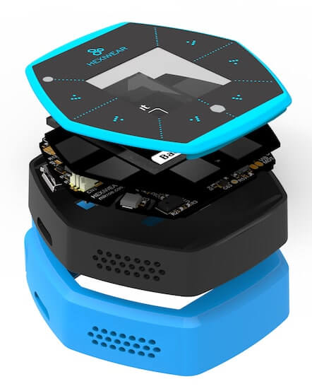

.. _hexiwear_k64:

Hexiwear
########

Overview
********

Hexiwear is powered by a Kinetis K64 microcontroller based on the ARM Cortex-M4
core. Another Kinetis wireless MCU, the KW40Z, provides Bluetooth Low Energy
connectivity. Hexiwear also integrates a wide variety of sensors, as well as a
user interface consisting of a 1.1" 96px x 96px full color OLED display and six
capacitive buttons with haptic feedback.

- Eye-catching Smart Watch form factor with powerful, low power Kinetis K6x MCU
  and 6 on-board sensors.
- Designed for wearable applications with the onboard rechargeable battery,
  OLED screen and onboard sensors such as optical heart rate, accelerometer,
  magnetometer and gyroscope.
- Designed for IoT end node applications with the onboard sensor's such as
  temperature, pressure, humidity and ambient light.
- Flexibility to let you add the sensors of your choice nearly 200 additional
  sensors through click boards.

Hardware
********

- Main MCU: NXP Kinetis K64x (ARM Cortex-M4, 120 MHz, 1M Flash, 256K SRAM)
- Wireless MCU: NXP Kinetis KW4x (ARM Cortex-M0+, Bluetooth Low Energy &
  802.15.4 radio)
- 6-axis combo Accelerometer and Magnetometer NXP FXOS8700
- 3-Axis Gyroscope: NXP FXAS21002
- Absolute Pressure sensor NXP MPL3115
- Li-Ion/Li-Po Battery Charger NXP MC34671
- Optical heart rate sensor Maxim MAX30101
- Ambient Light sensor, Humidity and Temperature sensor
- 1.1" full color OLED display
- Haptic feedback engine
- 190 mAh 2C Li-Po battery
- Capacitive touch interface
- RGB LED

For more information about the K64F SoC and Hexiwear board:

- `K64F Website`_
- `K64F Datasheet`_
- `K64F Reference Manual`_
- `Hexiwear Website`_
- `Hexiwear Fact Sheet`_
- `Hexiwear Schematics`_

Supported Features
==================

The hexiwear_k64 board configuration supports the following hardware features:

+-----------+------------+-------------------------------------+
| Interface | Controller | Driver/Component                    |
+===========+============+=====================================+
| NVIC      | on-chip    | nested vector interrupt controller  |
+-----------+------------+-------------------------------------+
| SYSTICK   | on-chip    | systick                             |
+-----------+------------+-------------------------------------+
| PINMUX    | on-chip    | pinmux                              |
+-----------+------------+-------------------------------------+
| GPIO      | on-chip    | gpio                                |
+-----------+------------+-------------------------------------+
| I2C       | on-chip    | i2c                                 |
+-----------+------------+-------------------------------------+
| WATCHDOG  | on-chip    | watchdog                            |
+-----------+------------+-------------------------------------+
| ADC       | on-chip    | adc                                 |
+-----------+------------+-------------------------------------+
| PWM       | on-chip    | pwm                                 |
+-----------+------------+-------------------------------------+
| UART      | on-chip    | serial port-polling;                |
|           |            | serial port-interrupt               |
+-----------+------------+-------------------------------------+
| FLASH     | on-chip    | soc flash                           |
+-----------+------------+-------------------------------------+
| SENSOR    | off-chip   | fxos8700 polling;                   |
|           |            | fxos8700 trigger;                   |
|           |            | fxas21002 polling;                  |
|           |            | fxas21002 trigger;                  |
|           |            | max30101 polling                    |
+-----------+------------+-------------------------------------+

The default configuration can be found in the defconfig file:

	``boards/arm/hexiwear_k64/hexiwear_k64_defconfig``

Other hardware features are not currently supported by the port.

Connections and IOs
===================

The K64F SoC has five pairs of pinmux/gpio controllers.

+-------+-----------------+---------------------------+
| Name  | Function        | Usage                     |
+=======+=================+===========================+
| PTA29 | GPIO            | LDO_EN                    |
+-------+-----------------+---------------------------+
| PTB0  | I2C0_SCL        | I2C / MAX30101            |
+-------+-----------------+---------------------------+
| PTB1  | I2C0_SDA        | I2C / MAX30101            |
+-------+-----------------+---------------------------+
| PTB12 | GPIO            | 3V3B EN                   |
+-------+-----------------+---------------------------+
| PTB16 | UART0_RX        | UART Console              |
+-------+-----------------+---------------------------+
| PTB17 | UART0_TX        | UART Console              |
+-------+-----------------+---------------------------+
| PTC8  | GPIO / PWM      | Red LED                   |
+-------+-----------------+---------------------------+
| PTC9  | GPIO / PWM      | Green LED                 |
+-------+-----------------+---------------------------+
| PTC10 | I2C1_SCL        | I2C / FXOS8700 / FXAS21002|
+-------+-----------------+---------------------------+
| PTC11 | I2C1_SDA        | I2C / FXOS8700 / FXAS21002|
+-------+-----------------+---------------------------+
| PTC14 | GPIO            | Battery sense enable      |
+-------+-----------------+---------------------------+
| PTC18 | GPIO            | FXAS21002 INT2            |
+-------+-----------------+---------------------------+
| PTD0  | GPIO / PWM      | Blue LED                  |
+-------+-----------------+---------------------------+
| PTD13 | GPIO            | FXOS8700 INT2             |
+-------+-----------------+---------------------------+
| PTE24 | UART4_RX        | UART BT HCI               |
+-------+-----------------+---------------------------+
| PTE25 | UART4_TX        | UART BT HCI               |
+-------+-----------------+---------------------------+

System Clock
============

The K64F SoC is configured to use the 12 MHz external oscillator on the board
with the on-chip PLL to generate a 120 MHz system clock.

Serial Port
===========

The K64F SoC has six UARTs. One is configured for the console, another for BT
HCI, and the remaining are not used.

Programming and Debugging
*************************

Build and flash applications as usual (see :ref:`build_an_application` and
:ref:`application_run` for more details).

Configuring a Debug Probe
=========================

A debug probe is used for both flashing and debugging the board. This board is
configured by default to use the :ref:`opensda-daplink-onboard-debug-probe`,
but because Segger RTT is required for a console on KW40Z, we recommend that
you reconfigure the board for the :ref:`opensda-jlink-onboard-debug-probe`.

.. note::
   OpenSDA is shared between the K64 and the KW40Z via switches, therefore only
   one SoC can be flashed, debugged, or have an open console at a time.

Option 1: :ref:`opensda-jlink-onboard-debug-probe` (Recommended)
----------------------------------------------------------------

Install the :ref:`jlink-debug-host-tools` and make sure they are in your search
path.

Follow the instructions in :ref:`opensda-jlink-onboard-debug-probe` to program
the `OpenSDA J-Link Generic Firmware for V2.1 Bootloader`_. Check that switches
SW1 and SW2 are **on**, and SW3 and SW4 are **off**  to ensure K64F SWD signals
are connected to the OpenSDA microcontroller.

Option 2: :ref:`opensda-daplink-onboard-debug-probe`
----------------------------------------------------

Install the :ref:`pyocd-debug-host-tools` and make sure they are in your search
path.

Follow the instructions in :ref:`opensda-daplink-onboard-debug-probe` to
program the `OpenSDA DAPLink Hexiwear Firmware`_. Check that switches SW1 and
SW2 are **on**, and SW3 and SW4 are **off**  to ensure K64F SWD signals are
connected to the OpenSDA microcontroller.

Add the argument ``-DOPENSDA_FW=daplink`` when you invoke ``west build`` to
override the default runner from J-Link to pyOCD:

.. zephyr-app-commands::
   :zephyr-app: samples/hello_world
   :board: hexiwear_k64
   :gen-args: -DOPENSDA_FW=daplink
   :goals: build

Configuring a Console
=====================

Regardless of your choice in debug probe, we will use the OpenSDA
microcontroller as a usb-to-serial adapter for the serial console.

Connect a USB cable from your PC to CN1.

Use the following settings with your serial terminal of choice (minicom, putty,
etc.):

- Speed: 115200
- Data: 8 bits
- Parity: None
- Stop bits: 1

Flashing
========

Here is an example for the :ref:`hello_world` application.

.. zephyr-app-commands::
   :zephyr-app: samples/hello_world
   :board: hexiwear_k64
   :goals: flash

Open a serial terminal, reset the board (press the T4 button), and you should
see the following message in the terminal:

.. code-block:: console

   ***** Booting Zephyr OS v1.14.0-rc1 *****
   Hello World! hexiwear_k64

Debugging
=========

Here is an example for the :ref:`hello_world` application.

.. zephyr-app-commands::
   :zephyr-app: samples/hello_world
   :board: hexiwear_k64
   :goals: debug

Open a serial terminal, step through the application in your debugger, and you
should see the following message in the terminal:

.. code-block:: console

   ***** Booting Zephyr OS v1.14.0-rc1 *****
   Hello World! hexiwear_k64

Using Bluetooth
***************

Configure the KW40Z as a Bluetooth controller
=============================================

The K64 can support Zephyr Bluetooth host applications when you configure the
KW40Z as a Bluetooth controller.

#. Download and install the `KW40Z Connectivity Software`_. This package
   contains Bluetooth controller application for the KW40Z.
#. Flash the file ``tools/binaries/BLE_HCI_Modem.bin`` to the KW40Z.

Now you can build and run the sample Zephyr Bluetooth host applications on the
K64. You do not need to repeat this step each time you flash a new Bluetooth
host application to the K64.

Peripheral Heart Rate Sensor
============================

Navigate to the Zephyr ``samples/bluetooth/peripheral_hr`` sample
application, then build and flash it to the Hexiwear K64. Make sure
the OpenSDA switches on the docking station are configured for the
K64.

.. zephyr-app-commands::
   :zephyr-app: samples/bluetooth/peripheral_hr
   :board: hexiwear_k64
   :goals: build flash

Reset the KW40Z and the K64 using the push buttons on the docking station.

Install the Kinetis BLE Toolbox on your smartphone:

- `Kinetis BLE Toolbox for iOS`_
- `Kinetis BLE Toolbox for Android`_

Open the app, tap the **Heart Rate** feature, and you should see a **Zephyr
Heartrate Sensor** device. Tap the **Zephyr Heartrate Sensor** device and you
will then see a plot of the heart rate data that updates once per second.

.. _Hexiwear Website:
   https://www.nxp.com/support/developer-resources/nxp-designs/hexiwear-complete-iot-development-solution:HEXIWEAR?&tid=vanHEXIWEAR

.. _Hexiwear Fact Sheet:
   https://www.nxp.com/docs/en/fact-sheet/HEXIWEAR-FS.pdf

.. _Hexiwear Schematics:
   http://cdn-docs.mikroe.com/images/c/c0/Sch_Hexiwear_MainBoard_v106c.pdf

.. _K64F Website:
   https://www.nxp.com/products/processors-and-microcontrollers/arm-based-processors-and-mcus/kinetis-cortex-m-mcus/k-seriesperformancem4/k6x-ethernet/kinetis-k64-120-mhz-256kb-sram-microcontrollers-mcus-based-on-arm-cortex-m4-core:K64_120

.. _K64F Datasheet:
   https://www.nxp.com/docs/en/data-sheet/K64P144M120SF5.pdf

.. _K64F Reference Manual:
   https://www.nxp.com/docs/en/reference-manual/K64P144M120SF5RM.pdf

.. _OpenSDA J-Link Generic Firmware for V2.1 Bootloader:
   https://www.segger.com/downloads/jlink/OpenSDA_V2_1

.. _OpenSDA DAPLink Hexiwear Firmware:
   https://github.com/MikroElektronika/HEXIWEAR/blob/master/HW/HEXIWEAR_DockingStation/HEXIWEAR_DockingStation_DAPLINK_FW.bin

.. _KW40Z Connectivity Software:
   https://www.nxp.com/webapp/Download?colCode=KW40Z-CONNECTIVITY-SOFTWARE&appType=license&location=null&fpsp=1&WT_TYPE=Protocol%20Stacks&WT_VENDOR=FREESCALE&WT_FILE_FORMAT=exe&WT_ASSET=Downloads&fileExt=.exe&Parent_nodeId=1432854896956716810497&Parent_pageType=product

.. _Kinetis BLE Toolbox for iOS:
   https://itunes.apple.com/us/app/kinetis-ble-toolbox/id1049036961?mt=8

.. _Kinetis BLE Toolbox for Android:
   https://play.google.com/store/apps/details?id=com.freescale.kinetisbletoolbox
