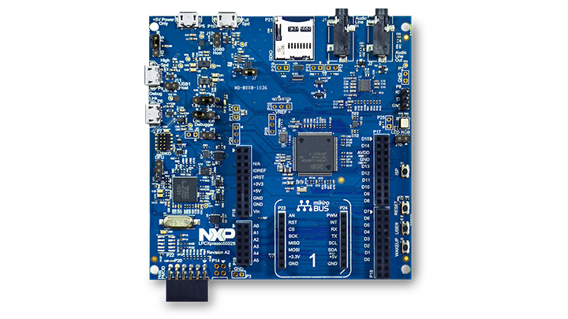

.. _lpcxpresso55s28:

NXP LPCXpresso55S28
###################

Overview
********

The LPCXpresso55S28 development board provides the ideal platform for evaluation
of and development with the LPC552x/S2x MCU based on the Arm® Cortex®-M33
architecture. The board includes a high-performance onboard debug probe, audio
subsystem and accelerometer, with several options for adding off-the-shelf
add-on boards for networking, sensors, displays, and other interfaces.

Hardware
********

- LPC55S28 Arm® Cortex®-M33 microcontroller running at up to 150 MHz
- 512 KB flash and 256 KB SRAM on-chip
- Onboard, high-speed USB, Link2 debug probe with CMSIS-DAP and SEGGER J-Link
  protocol options
- UART and SPI port bridging from LPC55S28 target to USB via the onboard debug
  probe
- Hardware support for external debug probe
- 3 x user LEDs, plus Reset, ISP (3) and user buttons
- Micro SD card slot (4-bit SDIO)
- NXP MMA8652FCR1 accelerometer
- Stereo audio codec with line in/out
- High and full speed USB ports with micro A/B connector for host or device
  functionality
- MikroEletronika Click expansion option
- LPCXpresso-V3 expansion option compatible with Arduino UNO
- PMod compatible expansion / host connector

For more information about the LPC55S28 SoC and LPCXPresso55S28 board, see:

- `LPC55S28 SoC Website`_
- `LPC55S28 Datasheet`_
- `LPC55S28 User Manual`_
- `LPCXpresso55S28 Website`_
- `LPCXpresso55S28 User Manual`_
- `LPCXpresso55S28 Development Board Design Files`_

Supported Features
==================

The lpcxpresso55s28 board configuration supports the following
hardware features:

+-----------+------------+-------------------------------------+
| Interface | Controller | Driver/Component                    |
+===========+============+=====================================+
| NVIC      | on-chip    | nested vector interrupt controller  |
+-----------+------------+-------------------------------------+
| SYSTICK   | on-chip    | systick                             |
+-----------+------------+-------------------------------------+
| IOCON     | on-chip    | pinmux                              |
+-----------+------------+-------------------------------------+
| GPIO      | on-chip    | gpio                                |
+-----------+------------+-------------------------------------+
| I2C       | on-chip    | i2c                                 |
+-----------+------------+-------------------------------------+
| SPI       | on-chip    | spi                                 |
+-----------+------------+-------------------------------------+
| USART     | on-chip    | serial port-polling                 |
+-----------+------------+-------------------------------------+
| WWDT      | on-chip    | windowed watchdog timer             |
+-----------+------------+-------------------------------------+
| TrustZone | on-chip    | Trusted Firmware-M                  |
+-----------+------------+-------------------------------------+
| ADC       | on-chip    | adc                                 |
+-----------+------------+-------------------------------------+
| CLOCK     | on-chip    | clock_control                       |
+-----------+------------+-------------------------------------+

Other hardware features are not currently enabled.

The default configuration file
``boards/arm/lpcxpresso55s28/lpcxpresso55s28_defconfig``

Currently available targets for this board are:

- *lpcxpresso55s28* secure (S) address space

Connections and IOs
===================

The LPC55S28 SoC has IOCON registers, which can be used to configure
the functionality of a pin.

+---------+-----------------+----------------------------+
| Name    | Function        | Usage                      |
+=========+=================+============================+
| PIO0_26 | SPI             | SPI MOSI                   |
+---------+-----------------+----------------------------+
| PIO0_29 | USART           | USART RX                   |
+---------+-----------------+----------------------------+
| PIO0_30 | USART           | USART TX                   |
+---------+-----------------+----------------------------+
| PIO1_1  | SPI             | SPI SSEL                   |
+---------+-----------------+----------------------------+
| PIO1_2  | SPI             | SPI SCK                    |
+---------+-----------------+----------------------------+
| PIO1_3  | SPI             | SPI MISO                   |
+---------+-----------------+----------------------------+
| PIO1_4  | GPIO            | RED LED                    |
+---------+-----------------+----------------------------+
| PIO1_6  | GPIO            | BLUE_LED                   |
+---------+-----------------+----------------------------+
| PIO1_7  | GPIO            | GREEN LED                  |
+---------+-----------------+----------------------------+
| PIO1_20 | I2C             | I2C SCL                    |
+---------+-----------------+----------------------------+
| PIO1_21 | I2C             | I2C SDA                    |
+---------+-----------------+----------------------------+

System Clock
============

The LPC55S28 SoC is configured to use the internal FRO at 96MHz as a
source for the system clock. Other sources for the system clock are
provided in the SOC, depending on your system requirements.

Serial Port
===========

The LPC55S28 SoC has 8 FLEXCOMM interfaces for serial communication. One is
configured as USART for the console and the remaining are not used.

Programming and Debugging
*************************

Build and flash applications as usual (see :ref:`build_an_application`
and :ref:`application_run` for more details).

Configuring a Debug Probe
=========================

A debug probe is used for both flashing and debugging the board. This
board is configured by default to use the LPC-Link2 CMSIS-DAP Onboard
Debug Probe.

Configuring a Console
=====================

Connect a USB cable from your PC to P6, and use the serial terminal of your
choice (minicom, putty, etc.) with the following settings:

- Speed: 115200
- Data: 8 bits
- Parity: None
- Stop bits: 1

Flashing
========

Here is an example for the :ref:`hello_world` application.

.. zephyr-app-commands::
   :zephyr-app: samples/hello_world
   :board: lpcxpresso55s28
   :goals: flash

Open a serial terminal, reset the board (press the RESET button), and you should
see the following message in the terminal:

.. code-block:: console

   ***** Booting Zephyr OS v2.4.0 *****
   Hello World! lpcxpresso55s28

Debugging
=========

Here is an example for the :ref:`hello_world` application.

.. zephyr-app-commands::
   :zephyr-app: samples/hello_world
   :board: lpcxpresso55s28
   :goals: debug

Open a serial terminal, step through the application in your debugger, and you
should see the following message in the terminal:

.. code-block:: console

   ***** Booting Zephyr OS zephyr-v2.4.0 *****
   Hello World! lpcxpresso55s28

.. _LPC55S28 SoC Website:
   https://www.nxp.com/products/processors-and-microcontrollers/arm-microcontrollers/general-purpose-mcus/lpc5500-cortex-m33/lpc552x-s2x-mainstream-arm-cortex-m33-based-microcontroller-family:LPC552x-S2x

.. _LPC55S28 Datasheet:
   https://www.nxp.com/docs/en/data-sheet/LPC55S2X-LPC552X.pdf

.. _LPC55S28 User Manual:
   https://www.nxp.com/webapp/Download?colCode=UM11126

.. _LPCxpresso55S28 Website:
   https://www.nxp.com/design/software/development-software/lpcxpresso55s28-development-board:LPC55S28-EVK

.. _LPCXpresso55S28 User Manual:
   https://www.nxp.com/webapp/Download?colCode=UM11158

.. _LPCXpresso55S28 Development Board Design Files:
   https://www.nxp.com/webapp/Download?colCode=LPCXpresso55S69-DS
