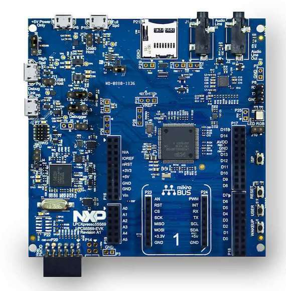

.. _lpcxpresso55s69:

NXP LPCXPRESSO55S69
###################

Overview
********

The LPCXpresso55S69 development board provides the ideal platform for evaluation
of and development with the LPC55S6x MCU based on the Arm® Cortex®-M33
architecture. The board includes a high performance onboard debug probe, audio
subsystem, and accelerometer, with several options for adding off-the-shelf
add-on boards for networking, sensors, displays, and other interfaces.

Hardware
********

- LPC55S69 dual core Arm Cortex-M33 microcontroller running at up to 100 MHz
- Onboard, high-speed USB, Link2 debug probe with CMSIS-DAP and SEGGER J-Link
  protocol options
- UART and SPI port bridging from LPC55S69 target to USB via the onboard debug
  probe
- Hardware support for external debug probe
- 3 x user LEDs, plus Reset, ISP (3) and user buttons
- Micro SD card slot (4-bit SDIO)
- NXP MMA8652FCR1 accelerometer
- Stereo audio codec with line in/out
- High and full speed USB ports with micro A/B connector for host or device
  functionality
- MikroEletronika Click expansion option
- LPCXpresso-V3 expansion option compatible with Arduino UNO
- PMod compatible expansion / host connector

For more information about the LPC55S69 SoC and LPCXPRESSO55S69 board, see:

- `LPC55S69 SoC Website`_
- `LPC55S69 Datasheet`_
- `LPC55S69 Reference Manual`_
- `LPCXPRESSO55S69 Website`_
- `LPCXPRESSO55S69 User Guide`_
- `LPCXPRESSO55S69 Schematics`_

Supported Features
==================

The lpcxpresso55s69 board configuration supports the following hardware
features:

+-----------+------------+-------------------------------------+
| Interface | Controller | Driver/Component                    |
+===========+============+=====================================+
| NVIC      | on-chip    | nested vector interrupt controller  |
+-----------+------------+-------------------------------------+
| SYSTICK   | on-chip    | systick                             |
+-----------+------------+-------------------------------------+
| IOCON     | on-chip    | pinmux                              |
+-----------+------------+-------------------------------------+
| GPIO      | on-chip    | gpio                                |
+-----------+------------+-------------------------------------+
| I2C       | on-chip    | i2c                                 |
+-----------+------------+-------------------------------------+
| SPI       | on-chip    | spi                                 |
+-----------+------------+-------------------------------------+
| USART     | on-chip    | serial port-polling                 |
+-----------+------------+-------------------------------------+
| WWDT      | on-chip    | windowed watchdog timer             |
+-----------+------------+-------------------------------------+
| TrustZone | on-chip    | Trusted Firmware-M                  |
+-----------+------------+-------------------------------------+

The default configuration file
``boards/arm/lpcxpresso55s69/lpcxpresso55s69_cpu0_defconfig``
only enables the first core.

Other hardware features are not currently enabled such as dual core or secure/non-secure.

Targets available for this board are:

- *lpcxpresso55s69_cpu0* secure (S) address space for CPU0
- *lpcxpresso55s69_ns* non-secure (NS) address space for CPU0
- *lpcxpresso55s69_cpu1* CPU1 target, NS only

CPU0 is the only target that can run standalone.
NS target for CPU0 does not work correctly without a secure image enabling it.
CPU1 does not work without CPU0 enabling it.

Connections and IOs
===================

The LPC55S69 SoC has IOCON registers, which can be used to configure the
functionality of a pin.

+---------+-----------------+----------------------------+
| Name    | Function        | Usage                      |
+=========+=================+============================+
| PIO0_26 | SPI             | SPI MOSI                   |
+---------+-----------------+----------------------------+
| PIO0_29 | USART           | USART RX                   |
+---------+-----------------+----------------------------+
| PIO0_30 | USART           | USART TX                   |
+---------+-----------------+----------------------------+
| PIO1_1  | SPI             | SPI SSEL                   |
+---------+-----------------+----------------------------+
| PIO1_2  | SPI             | SPI SCK                    |
+---------+-----------------+----------------------------+
| PIO1_3  | SPI             | SPI MISO                   |
+---------+-----------------+----------------------------+
| PIO1_4  | GPIO            | RED LED                    |
+---------+-----------------+----------------------------+
| PIO1_6  | GPIO            | BLUE_LED                   |
+---------+-----------------+----------------------------+
| PIO1_7  | GPIO            | GREEN LED                  |
+---------+-----------------+----------------------------+
| PIO1_20 | I2C             | I2C SCL                    |
+---------+-----------------+----------------------------+
| PIO1_21 | I2C             | I2C SDA                    |
+---------+-----------------+----------------------------+

System Clock
============

The LPC55S69 SoC is configured to use the internal FRO at 96MHz as a source for
the system clock. Other sources for the system clock are provided in the SOC,
depending on your system requirements.

Serial Port
===========

The LPC55S69 SoC has 8 FLEXCOMM interfaces for serial communication.  One is
configured as USART for the console and the remaining are not used.

Programming and Debugging
*************************

Build and flash applications as usual (see :ref:`build_an_application` and
:ref:`application_run` for more details).

Configuring a Debug Probe
=========================

A debug probe is used for both flashing and debugging the board. This board is
configured by default to use the LPC-Link2 CMSIS-DAP Onboard Debug Probe,
however the :ref:`pyocd-debug-host-tools` does not yet support this probe so you
must reconfigure the board for one of the following debug probes instead.

:ref:`lpclink2-jlink-onboard-debug-probe`
-----------------------------------------

Install the :ref:`jlink-debug-host-tools` and make sure they are in your search
path.

Follow the instructions in :ref:`lpclink2-jlink-onboard-debug-probe` to program
the J-Link firmware. Please make sure you have the latest firmware for this
board.

:ref:`opensda-daplink-onboard-debug-probe`
------------------------------------------

PyOCD support for this board is ongoing and not yet available.
To use DAPLink's flash memory programming on this board, follow the instructions
for `updating LPCXpresso firmware`_.

Configuring a Console
=====================

Connect a USB cable from your PC to P6, and use the serial terminal of your choice
(minicom, putty, etc.) with the following settings:

- Speed: 115200
- Data: 8 bits
- Parity: None
- Stop bits: 1

Flashing
========

Here is an example for the :ref:`hello_world` application. This example uses the
:ref:`jlink-debug-host-tools` as default.

.. zephyr-app-commands::
   :zephyr-app: samples/hello_world
   :board: lpcxpresso55s69_cpu0
   :goals: flash

Open a serial terminal, reset the board (press the RESET button), and you should
see the following message in the terminal:

.. code-block:: console

   ***** Booting Zephyr OS v1.14.0 *****
   Hello World! lpcxpresso55s69_cpu0

Building and flashing secure/non-secure with Arm |reg| TrustZone |reg|
----------------------------------------------------------------------
The TF-M integration samples can be run using the ``lpcxpresso55s69_ns`` target.
Next we need to manually flash the secure (``tfm_s.hex``)
and non-secure (``zephyr.hex``) images wth a J-Link as follows:

.. code-block:: console

   JLinkExe -device lpc55s69 -if swd -speed 2000 -autoconnect 1
   J-Link>loadfile build/tfm/install/outputs/LPC55S69/tfm_s.hex
   J-Link>loadfile build/zephyr/zephyr.hex

NOTE: At present, the LPC55S69 doesn't include support for the MCUBoot bootloader.
We need to reset the board manually after flashing the image to run this code.

Debugging
=========

Here is an example for the :ref:`hello_world` application. This example uses the
:ref:`jlink-debug-host-tools` as default.

.. zephyr-app-commands::
   :zephyr-app: samples/hello_world
   :board: lpcxpresso55s69_cpu0
   :goals: debug

Open a serial terminal, step through the application in your debugger, and you
should see the following message in the terminal:

.. code-block:: console

   ***** Booting Zephyr OS zephyr-v1.14.0 *****
   Hello World! lpcxpresso55s69_cpu0

.. _LPC55S69 SoC Website:
   https://www.nxp.com/products/processors-and-microcontrollers/arm-based-processors-and-mcus/lpc-cortex-m-mcus/lpc5500-cortex-m33/high-efficiency-arm-cortex-m33-based-microcontroller-family:LPC55S6x

.. _LPC55S69 Datasheet:
   https://www.nxp.com/docs/en/data-sheet/LPC55S6x.pdf

.. _LPC55S69 Reference Manual:
   https://www.nxp.com/webapp/Download?colCode=UM11126

.. _LPCXPRESSO55S69 Website:
   https://www.nxp.com/products/processors-and-microcontrollers/arm-based-processors-and-mcus/lpc-cortex-m-mcus/lpc5500-cortex-m33/lpcxpresso55s69-development-board:LPC55S69-EVK

.. _LPCXPRESSO55S69 User Guide:
   https://www.nxp.com/webapp/Download?colCode=UM11158

.. _LPCXPRESSO55S69 Schematics:
   https://www.nxp.com/webapp/Download?colCode=LPC55S69-SCH

.. _updating LPCXpresso firmware:
   https://os.mbed.com/teams/NXP/wiki/Updating-LPCXpresso-firmware
