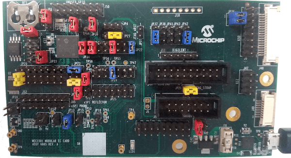

.. _mec1501modular_assy6885:

MEC1501 Modular card ASSY6885
#############################

Overview
********

The MEC1501 Modular card ASSY6885 is a development board to evaluate the Microchip
MEC152X series microcontrollers. This board can work standalone or be mated with
any platform that complies with MECC specification.

Hardware
********

- MEC1521HA0SZ ARM Cortex-M4 Processor
- 256 KB RAM and 64 KB boot ROM
- GPIO headers
- UART1 using microUSB
- PECI interface 3.0
- 10 SMBUS instances
- FAN, PMW and TACHO pins
- VCI interface
- Independent Hardware Driven PS/2 Ports

At difference from MEC15xx evaluation board, modular MEC1521 exposes the pins
in 2 different ways:

1) Standalone mode via headers

   - GPIOs
   - PWM5
   - JTAG/SWD, ETM and MCHP Trace ports
   - eSPI bus
   - SMB0

2) Mated mode with another platform that has a high density MECC connector.

   - FAN0, PWM0, SMB0, SMB1, SMB4 and SMB5
   - eSPI bus
   - Breathing/Blinking LEDs

The board is powered through the +5V USB Micro A connector or from the MECC connector.

For more information about the SOC please see the `MEC152x Reference Manual`_

Supported Features
==================

The mec1501modular_assy6885 board configuration supports the following hardware
features:

+-----------+------------+-------------------------------------+
| Interface | Controller | Driver/Component                    |
+===========+============+=====================================+
| NVIC      | on-chip    | nested vector interrupt controller  |
+-----------+------------+-------------------------------------+
| SYSTICK   | on-chip    | systick                             |
+-----------+------------+-------------------------------------+
| UART      | on-chip    | serial port                         |
+-----------+------------+-------------------------------------+
| GPIO      | on-chip    | gpio                                |
+-----------+------------+-------------------------------------+
| ESPI      | on-chip    | espi                                |
+-----------+------------+-------------------------------------+
| I2C       | on-chip    | i2c                                 |
+-----------+------------+-------------------------------------+
| PINMUX    | on-chip    | pinmux                              |
+-----------+------------+-------------------------------------+
| RTOS      | on-chip    | timer                               |
+-----------+------------+-------------------------------------+
| TIMER     | on-chip    | counter                             |
+-----------+------------+-------------------------------------+
| PWM       | on-chip    | pwm                                 |
+-----------+------------+-------------------------------------+
| ADC       | on-chip    | adc                                 |
+-----------+------------+-------------------------------------+
| WATCHDOG  | on-chip    | watchdog                            |
+-----------+------------+-------------------------------------+
| PS2       | on-chip    | ps2                                 |
+-----------+------------+-------------------------------------+

Other hardware features are not currently supported by Zephyr (at the moment)

The default configuration can be found in the
:zephyr_file:`boards/arm/mec1501modular_assy6885/mec1501modular_assy6885_defconfig`
Kconfig file.

Connections and IOs
===================

This evaluation board kit is comprised of the following HW blocks:

- MEC1501 Modular Card ASSY 6885 Rev A0 `MEC1501 Modular EC Card - Assy_6885 Rev A0p1`_

System Clock
============

The MEC1501 MCU is configured to use the 48Mhz internal oscillator with the
on-chip PLL to generate a resulting EC clock rate of 12 MHz. See Processor clock
control register in chapter 4 "4.0 POWER, CLOCKS, and RESETS" of the data sheet in
the references at the end of this document.

Serial Port
===========
UART1 is configured for serial logs.

Jumper settings
***************

Please follow the jumper settings below to properly demo this
board. Advanced users may deviate from this recommendation.

Jumper setting for MEC1501 Modular Assy 6885 Rev A1p0
=====================================================

Power-related jumpers
---------------------

If you wish to power from type A/B connector ``P10`` set the jumper ``JP35 1-2``.

If you wish to power through MECC connector ``P1`` and mate to external platform,
set the jumper to ``JP35 3-4``.

.. note:: A single jumper is required in JP35.

+------+---------+---------+------+------+------+----------+
| JP30 | JP31    | JP32    | JP33 | JP34 | JP40 | JP21     |
| VTR3 | VTR_PLL | VTR_REG | VTR1 | VTR2 | 3.3V | VREF_ADC |
+======+=========+=========+======+======+======+==========+
| 1-2  |   1-2   |   1-2   | 1-2  |  1-2 | 1-2  |   1-2    |
+------+---------+---------+------+------+------+----------+

+------+------------+------+----------+
| JP6  | JP36       | JP27 | JP4      |
| VBAT | VTR_ANALOG | PECI | VREF_VTT |
+======+============+======+==========+
| 2-3  |    1-2     | 2-3  |   open   |
+------+------------+------+----------+

These jumpers configure nRESETI and JTAG_STRAP respectively.

+-----------+---------------+
| JP22      | JP29          |
| (nRESETI) | (JTAG_STRAP)  |
+===========+===============+
| 11-12     | 1-2           |
+-----------+---------------+

Boot-ROM Straps
---------------

These jumpers configure MEC1501 Boot-ROM straps.

+-------------+------------+--------------+-------------+
| JP37        | J6         | JP41         | JP23        |
| (CMP_STRAP) | (CR_STRAP) | (VTR2_STRAP) | (BSS_STRAP) |
+=============+============+==============+=============+
| 1-2         | 1-2        | 1-2          | 3-4         |
+-------------+------------+--------------+-------------+

``JP23 3-4`` pulls SHD SPI CS0# up to VTR2. MEC1501 Boot-ROM samples
SHD SPI CS0# and if high, it loads code from SHD SPI.
This is the recommended setup.

+-------------+------------+----------------------------+
|  CR_STRAP   | BSS_STRAP  |         SOURCE             |
+-------------+------------+----------------------------+
|      0      |     X      |   Use 3.3V Private SPI     |
+-------------+------------+----------------------------+
|      1      |     0      |  Use eSPI Flash channel    |
+-------------+------------+----------------------------+
|             |     1      |  Use 3.3V Shared channel(R)|
+-------------+------------+----------------------------+

Power management
----------------
``JP20 2-3`` is required so all GPIOs powered by VTR3 rail worked at 1.8V.

.. note:: External 1.8V needs to be connected to JP13.1

+-------------------+-----------------+
| JP20              | JP13            |
| (VTR3 selection)  | (1.8V source)   |
+===================+=================+
|   2-3             | 1.8V to pin 1   |
+-------------------+-----------------+

Jumper location map
-------------------

.. code-block:: none

   +--------------------------------------------------------------------------------------+
   |                  |------------|                     +----------+ J10              || |
   |  [BT1]       +   +------------+ J50                                      ++   ++  || |
   |              |                                           JP38 JP43       ++   ||  || |
   |              +         +      +       +-+ JP4              +    +       JP26  ||  || |
   |             JP6        +      +                  +      +  + +  + +           ||  || |
   |    JP31 ++            JP32   JP36     +-+ JP27   +      +    +    +           J6  || |
   |                                                 JP18  JP37 JP41 JP42              ++ |
   |         ++                  +   +    +--------+                                  J48 |
   |         ||  JP21            +   +    +--------+ JP22    +----------+                 |
   |      J2 ||   +            JP34 JP30                         J11              ++      |
   |         ++   +                                                  J44          ||      |
   |                            ++                         +----------------+     ||      |
   |       +---------------+    ||  +        JP24          |----------------|     ++      |
   |       |---------------|    ++  +    +----------+      +----------------+    J47      |
   | JP20  +---------------+  JP23  JP40 +----------+                                  ++ |
   |                                                     +           ++ JP29           || |
   |                             +  +    +----------+    +                             || |
   |    J52+---------------+     +  +    +----------+   J5   +-------------+           ++ |
   |    J45+---------------+  JP33 TP57      JP25            +-------------+ J4       J49 |
   |                                                                                      |
   | ++                                           TP4   +----------+   ++                 |
   | ++     +    +      +    +    +       +  TP61         +----------+   ++               |
   | JP28   +    +      +    +    +  TP65 +  TP60            J51        JP35              |
   |      TP58 JP16   JP11 JP13 JP15     JP10                                             |
   | TP5                                                                                  |
   | TP6                                        TP1                                       |
   +--------------------------------------------------------------------------------------+

Programming and Debugging
*************************

Setup
=====

#. Clone the `MEC152x SPI Image Gen`_ repository or download the files within
   that directory. For the pre-production MEC150x use the `MEC150x SPI Image Gen`_
   repository.

#. Make the image generation available for Zephyr, by making the tool
   searchable by path, or by setting an environment variable
   ``EVERGLADES_SPI_GEN``, for example:

   .. code-block:: console

      export EVERGLADES_SPI_GEN=<path to tool>/everglades_spi_gen_RomE

   Note that the tools for Linux and Windows have different file names.
   For the pre-production MEC1501 SOC use everglades_spi_gen_lin64.

#. If needed, a custom SPI image configuration file can be specified
   to override the default one.

   .. code-block:: console

      export EVERGLADES_SPI_CFG=custom_spi_cfg.txt

Building
==========
#. Build :ref:`hello_world` application as you would normally do.

#. Once you have ``zephyr.bin``, use the `MEC152x SPI Image Gen`_ microchip tool
   to create the final binary. You need the output from this tool to flash
   in the SHD SPI memory.

Flashing
========

#. Connect Dediprog into header ``J2``.

#. Flash the SPI NOR ``U3`` at offset 0x0 using Dediprog SF100
   or a similar tool for flashing SPI chips.

#. Run your favorite terminal program to listen for output. Under Linux the
   terminal should be :code:`/dev/ttyACM0`. For example:

   .. code-block:: console

      $ minicom -D /dev/ttyACM0 -o

   The -o option tells minicom not to send the modem initialization
   string. Connection should be configured as follows:

   - Speed: 115200
   - Data: 8 bits
   - Parity: None
   - Stop bits: 1

#. Connect the MEC1501MODULAR_ASSY6885 board to your host computer using the
   UART1 port and apply power.

   You should see ``"Hello World! mec1501modular_assy6885"`` in your terminal.

Debugging
=========
This board comes with a Cortex ETM port which facilitates tracing and debugging
using a single physical connection.  In addition, it comes with sockets for
JTAG only sessions.

HW Issues
=========
In case you don't see your application running, please make sure ``LED1`` is lit.
If is off, then check the power related jumpers again.

References
**********
.. target-notes::

.. _MEC152x Preliminary Data Sheet:
    https://github.com/MicrochipTech/CPGZephyrDocs/blob/master/MEC152x/MEC152x_Datasheet.pdf
.. _MEC152x Reference Manual:
    https://github.com/MicrochipTech/CPGZephyrDocs/blob/master/MEC152x/MEC152x_Datasheet.pdf
.. _MEC1501 Modular EC Card - Assy_6885 Rev A0p1:
    https://github.com/MicrochipTech/CPGZephyrDocs/blob/master/MEC1501/MEC1501%20Modular%20EC%20Card%20-%20Assy_6885%20Rev%20A0p1%20-%20SCH.pdf
.. _MEC152x SPI Image Gen:
    https://github.com/MicrochipTech/CPGZephyrDocs/tree/master/MEC152x/SPI_image_gen
.. _MEC150x SPI Image Gen:
    https://github.com/MicrochipTech/CPGZephyrDocs/tree/master/MEC1501/SPI_image_gen
