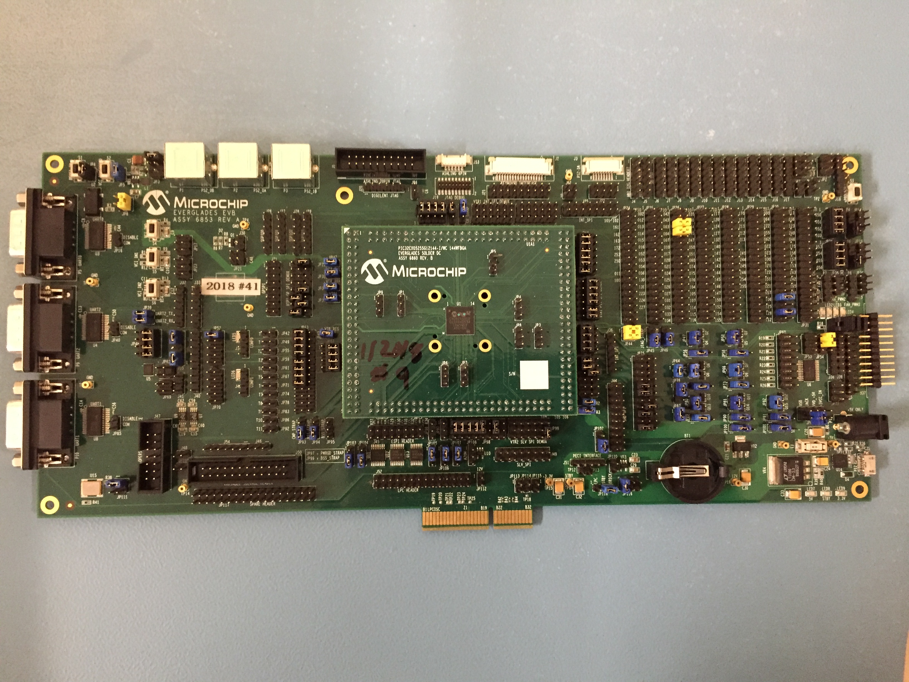

.. _mec15xxevb_assy6853:

MEC15xxEVB ASSY6853
###################

Overview
********

The MEC15xxEVB_ASSY6853 kit is a future development platform to evaluate the
Microchip MEC15XX series microcontrollers. This board needs to be mated with
part number MEC1501 144WFBA SOLDER DC ASSY 6860(cpu board) in order to operate.

Hardware
********

- MEC1501HB0SZ ARM Cortex-M4 Processor
- 256 KB RAM and 64 KB boot ROM
- Keyboard interface
- ADC & GPIO headers
- UART0, UART1, and UART2
- FAN0, FAN1, FAN2 headers
- FAN PWM interface
- JTAG/SWD, ETM and MCHP Trace ports
- PECI interface 3.0
- I2C voltage translator
- 10 SMBUS headers
- 4 SGPIO headers
- VCI interface
- 5 independent Hardware Driven PS/2 Ports
- eSPI header
- 3 Breathing/Blinking LEDs
- 2 Sockets for SPI NOR chips
- One reset and VCC_PWRDGD pushbuttons
- One external PCA9555 I/O port with jumper selectable I2C address.
- One external LTC2489 delta-sigma ADC with jumper selectable I2C address.
- Board power jumper selectable from +5V 2.1mm/5.5mm barrel connector or USB Micro A connector.

For more information about the SOC please see the `MEC1501 Reference Manual`_

Supported Features
==================

The mec15xxevb_assy6853 board configuration supports the following hardware
features:

+-----------+------------+-------------------------------------+
| Interface | Controller | Driver/Component                    |
+===========+============+=====================================+
| NVIC      | on-chip    | nested vector interrupt controller  |
+-----------+------------+-------------------------------------+
| SYSTICK   | on-chip    | systick                             |
+-----------+------------+-------------------------------------+
| UART      | on-chip    | serial port                         |
+-----------+------------+-------------------------------------+
| GPIO      | on-chip    | gpio                                |
+-----------+------------+-------------------------------------+

Other hardware features are not currently supported by Zephyr (at the moment)

The default configuration can be found in the
:zephyr_file:`boards/arm/mec15xxevb_assy6853/mec15xxevb_assy6853_defconfig`
Kconfig file.

Connections and IOs
===================

Microchip to provide the schematic for this board.

System Clock
============

The MEC1501 MCU is configured to use the 48Mhz internal oscillator with the
on-chip PLL to generate a resulting EC clock rate of 12 MHz. See Processor clock
control register in chapter 4 "4.0 POWER, CLOCKS, and RESETS" of the data sheet in
the references at the end of this document.

Serial Port
===========

UART0 is configured for serial logs.

Jumper settings
***************

Please follow the jumper settings below to properly demo this
board. Advanced users may deviate from this recommendation.

Jumper setting for MEC15xx EVB Assy 6853 Rev A1p0
=================================================

Power-related jumpers.
----------------------

Power from +5V power brick connected to barrel connector P11 (5.5mm OD, 2.1mm ID)
JP88 5-6 only

Power from micro-USB type A/B connector P12.
JP88 7-8 only

+-------+------+------+------+------+------+------+------+------+------+------+
| JP22  | JP32 | JP33 | JP37 | JP43 | JP47 | JP54 | JP56 | JP58 | JP64 | JP65 |
+=======+======+======+======+======+======+======+======+======+======+======+
| 1-2   | 1-2  | 1-2  | 1-2  |  1-2 | 1-2  | 1-2  | 1-2  | 1-2  | 1-2  | 1-2  |
+-------+------+------+------+------+------+------+------+------+------+------+

+------+------+------+------+------+------+------+------+------+------+
| JP72 | JP73 | JP76 | JP79 | JP80 | JP81 | JP82 | JP84 | JP87 | JP89 |
+======+======+======+======+======+======+======+======+======+======+
| 1-2  | 1-2  | 1-2  | 1-2  | 1-2  | 1-2  | 1-2  | 1-2  | 1-2  | 1-2  |
+------+------+------+------+------+------+------+------+------+------+

+------+------+-------+-------+-------+
| JP90 | JP91 | JP100 | JP101 | JP118 |
+======+======+=======+=======+=======+
| 1-2  | 1-2  | 1-2   | 1-2   | 2-3   |
+------+------+-------+-------+-------+

These jumpers configure VCC Power good, nRESETI and JTAG_STRAP respectively.

+------------------+-----------+--------------+
| JP5              | JP4       | JP45         |
| (VCC Power good) | (nRESETI) | (JTAG_STRAP) |
+==================+===========+==============+
| 1-2              | 1-2       | 2-3          |
+------------------+-----------+--------------+

Boot-ROM Straps.
----------------

These jumpers configure MEC1501 Boot-ROM straps.

+-------------+---------- -+--------------+-------------+
| JP93        | JP11       | JP46         | JP96        |
| (CMP_STRAP) | (CR_STRAP) | (VTR2_STRAP) | (BSS_STRAP) |
+=============+============+==============+=============+
| 2-3         | 1-2        | 2-3          | 1-2         |
+-------------+------------+--------------+-------------+

JP96 1-2 pulls SHD SPI CS0# up to VTR2
MEC1501 Boot-ROM samples SHD SPI CS0# and if high
loads from SHD SPI.

Peripheral Routing Jumpers
--------------------------

Each column of the following table illustrates how to enable UART0, JTAG,
PVT SPI, SHD SPI and LED0-2 respectively.

+---------+--------+-----------+----------+---------+
| JP68    | JP9    | JP38      | JP98     | JP41    |
| (UART0) | (JTAG) | (PVT SPI) | (SHD SPI)| (LED0-2)|
+=========+========+===========+==========+=========+
| 1-2     | 2-3    | 2-3       | 2-3      | 1-2     |
+---------+--------+-----------+----------+---------+
| 4-5     | 5-6    | 5-6       | 5-6      | 3-4     |
+---------+--------+-----------+----------+---------+
| 8-9     | 8-9    | 8-9       | 8-9      | 5-6     |
+---------+--------+-----------+----------+---------+
|         | 11-12  | 11-12     | 11-12    |         |
+---------+--------+-----------+----------+---------+
|         |        | 14-15     | 14-15    |         |
+---------+--------+-----------+----------+---------+
|         |        | 17-18     | 20-21    |         |
+---------+--------+-----------+----------+---------+

Jumper settings for MEC1501 144WFBGA Socket DC Assy 6883 Rev B1p0
=================================================================

The jumper configuration explained above covers the base board. The ASSY
6883 MEC1501 CPU board provides capability for an optional, external 32KHz
clock source. The card includes a 32KHz crystal oscillator. The card can
also be configured to use an external 50% duty cycle 32KHz source on the
XTAL2/32KHZ_IN pin. Note, firmware must set the MEC15xx clock enable
register to select the external source matching the jumper settings. If
using the MEC15xx internal silicon oscillator then the 32K jumper settings
are don't cares. JP1 is for scoping test clock outputs. Please refer to
the schematic in reference section below.

Parallel 32KHz crystal configuration
------------------------------------
+-------+-------+
| JP2   | JP3   |
+=======+=======+
| 1-2   | 2-3   |
+-------+-------+

External 32KHz 50% duty cycle configuration
-------------------------------------------
+-------+-------+
| JP2   | JP3   |
+=======+=======+
| NC    | 1-2   |
+-------+-------+

Jumper settings for MEC1503 144WFBGA Socket DC Assy 6856 Rev B1p0
=================================================================

The MEC1503 ASSY 6856 CPU card does not include an onboard external
32K crystal or oscillator. The one jumper block JP1 is for scoping
test clock outputs not for configuration. Please refer to schematic
in reference section below.

Programming and Debugging
*************************

This board comes with a Cortex ETM port which facilitates tracing and debugging
using a single physical connection.  In addition, it comes with sockets for
JTAG only sessions.

Flashing
========

#. Connect the SPI Dongle ASSY 6791 to J36 (SPI dongle) in order to flash and
   boot from SHD SPI NOR. Then proceed to flash using Dediprog SF100 or a
   similar tool for flashing SPI chips.

   .. note:: Remember that SPI MISO/MOSI are swapped on dediprog headers!

#. Run your favorite terminal program to listen for output. Under Linux the
   terminal should be :code:`/dev/ttyACM0`. For example:

   .. code-block:: console

      $ minicom -D /dev/ttyACM0 -o

   The -o option tells minicom not to send the modem initialization
   string. Connection should be configured as follows:

   - Speed: 115200
   - Data: 8 bits
   - Parity: None
   - Stop bits: 1

#. Connect the MEC15xxEVB_ASSY_6853 board to your host computer using the
   UART0 port. Then build :ref: `hello_world` application. It is important
   to generate a binary with a new load address, for example do the following::

        ${OBJCOPY} --change-addresses -0xe0000 -O binary -S ${in_elf} ${out_bin}

   Once you obtain the binary, proceed to use the microchip tool mec15xx_spi_gen
   in order to create the final binary. This binary is what you need to flash
   in your spi nor.

   .. zephyr-app-commands::
      :zephyr-app: samples/hello_world
      :board: mec15xxevb_assy6853
      :goals: build flash

   You should see "Hello World! mec15xxevb_assy6853" in your terminal.

Debugging
=========

You can debug an application in the usual way.  Here is an example for the
:ref:`hello_world` application.

.. zephyr-app-commands::
   :zephyr-app: samples/hello_world
   :board: mec15xxevb_assy6853
   :maybe-skip-config:
   :goals: debug

References
**********
.. target-notes::

.. _MEC1501 Preliminary Data Sheet:
    https://github.com/MicrochipTech/CPGZephyrDocs/blob/master/MEC1501/MEC1501_Datasheet.pdf
.. _MEC1501 Reference Manual:
    https://github.com/MicrochipTech/CPGZephyrDocs/blob/master/MEC1501/MEC1501_Datasheet.pdf
.. _MEC15xx EVB Schematic:
    https://github.com/MicrochipTech/CPGZephyrDocs/blob/master/MEC1501/Everglades%20EVB%20-%20Assy_6853%20Rev%20A1p1%20-%20SCH.pdf
.. _MEC1501 Daughter Card Schematic:
    https://github.com/MicrochipTech/CPGZephyrDocs/blob/master/MEC1501/MEC1501%20Socket%20DC%20for%20EVERGLADES%20EVB%20-%20Assy_6883%20Rev%20A0p1%20-%20SCH.pdf
.. _MEC1503 Daughter Card Schematic:
    https://github.com/MicrochipTech/CPGZephyrDocs/blob/master/MEC1501/MEC1503%20Socket%20DC%20for%20EVERGLADES%20EVB%20-%20Assy_6856%20Rev%20A1p0%20-%20SCH.pdf
.. _SPI Dongle Schematic:
    https://github.com/MicrochipTech/CPGZephyrDocs/blob/master/MEC1501/SPI%20Dongles%20and%20Aardvark%20Interposer%20Assy%206791%20Rev%20A1p1%20-%20SCH.pdf
