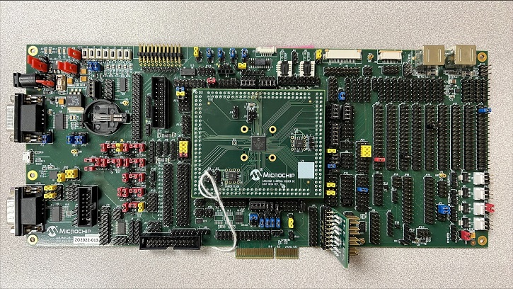

.. _mec172xevb_assy6906:

MEC172xEVB ASSY6906
###################

Overview
********

The MEC172xEVB_ASSY6906 kit is a future development platform to evaluate the
Microchip MEC172X series microcontrollers. This board needs to be mated with
part number MEC172x 144WFBGA SOLDER DC ASSY 6914 (cpu board) in order to operate.
MEC172x and MEC152x SPI image formats are not compatible with each other.

Hardware
********

- MEC172x ARM Cortex-M4 Processor
- 416 KB RAM and 128 KB boot ROM
- Keyboard interface
- ADC & GPIO headers
- UART0 and UART1
- FAN0, FAN1, FAN2 headers
- FAN PWM interface
- JTAG/SWD, ETM and MCHP Trace ports
- PECI interface 3.0
- I2C voltage translator
- 10 SMBUS headers
- VCI interface
- 1 Hardware Driven PS/2 Port
- eSPI header
- 2 Sockets for SPI NOR chips
- One reset and VCC_PWRDGD pushbuttons
- One external PCA9555 I/O port with jumper selectable I2C address.
- One external LTC2489 delta-sigma ADC with jumper selectable I2C address.
- Board power jumper selectable from +5V 2.1mm/5.5mm barrel connector or USB Micro A connector.

For more information about the SOC's please see `MEC172x Reference Manual`_

Supported Features
==================

The mec172xevb_assy6906 board configuration supports the following hardware
features:

+-----------+------------+-------------------------------------+
| Interface | Controller | Driver/Component                    |
+===========+============+=====================================+
| NVIC      | on-chip    | nested vector interrupt controller  |
+-----------+------------+-------------------------------------+
| SYSTICK   | on-chip    | systick                             |
+-----------+------------+-------------------------------------+
| UART      | on-chip    | serial port                         |
+-----------+------------+-------------------------------------+
| GPIO      | on-chip    | gpio                                |
+-----------+------------+-------------------------------------+
| I2C       | on-chip    | i2c                                 |
+-----------+------------+-------------------------------------+
| PINMUX    | on-chip    | pinmux                              |
+-----------+------------+-------------------------------------+
| PS/2      | on-chip    | ps2                                 |
+-----------+------------+-------------------------------------+
| KSCAN     | on-chip    | kscan                               |
+-----------+------------+-------------------------------------+
| TACH      | on-chip    | tachometer                          |
+-----------+------------+-------------------------------------+
| RPMFAN    | on-chip    | Fan speed controller                |
+-----------+------------+-------------------------------------+

Other hardware features are not currently supported by Zephyr.

The default configuration can be found in the
:zephyr_file:`boards/arm/mec172xevb_assy6906/mec172xevb_assy6906_defconfig` Kconfig file.

Connections and IOs
===================

This evaluation board kit is comprised of the following HW blocks:

- MEC172x EVB ASSY 6906 Rev A `MEC172x EVB Schematic`_
- MEC172x 144WFBGA SOLDER DC ASSY 6914 with MEC172x silicon `MEC172x Daughter Card Schematic`_
- SPI DONGLE ASSY 6791 `SPI Dongle Schematic`_

System Clock
============

The MEC1723 MCU is configured to use the 96Mhz internal oscillator with the
on-chip PLL to generate a resulting EC clock rate of 12 MHz. See Processor clock
control register in chapter 4 "4.0 POWER, CLOCKS, and RESETS" of the data sheet in
the references at the end of this document.

Serial Port
===========

UART1 is configured for serial logs.

Jumper settings
***************

Please follow the jumper settings below to properly demo this
board. Advanced users may deviate from this recommendation.

Jumper setting for MEC172x EVB Assy 6906 Rev A1p0
=================================================

Power-related jumpers
---------------------

If you wish to power from +5V power brick, then connect to barrel connector ``P1``
(5.5mm OD, 2.1mm ID) and move the jumper to ``JP30 5-6``.

If you wish to power from micro-USB type A/B connector ``P2``, move the
jumper to ``JP30 7-8``.

.. note:: A single jumper is required in ``JP30``.

+------+-------+-------+------+------+
| JP31 | JP158 | JP159 | JP40 | JP42 |
+======+=======+=======+======+======+
| 2-3  |  2-3  |  2-3  | 1-2  | 1-2  |
+------+-------+-------+------+------+

+------+------+------+------+------+------+------+
| JP36 | JP37 | JP38 | JP39 | JP41 | JP43 | JP44 |
+======+======+======+======+======+======+======+
| 1-2  | 1-2  | 1-2  | 1-2  | 1-2  | 1-2  | 1-2  |
+------+------+------+------+------+------+------+

+------+------+------+------+------+------+------+------+------+
| JP45 | JP46 | JP47 | JP50 | JP51 | JP52 | JP55 | JP56 | JP57 |
+======+======+======+======+======+======+======+======+======+
| 1-2  | 1-2  | 1-2  | 1-2  | 1-2  | 1-2  | 1-2  | 1-2  | 1-2  |
+------+------+------+------+------+------+------+------+------+

+------+------+------+------+------+------+------+
| JP59 | JP60 | JP61 | JP62 | JP63 | JP65 | JP66 |
+======+======+======+======+======+======+======+
| 1-2  | 1-2  | 1-2  | 1-2  | 1-2  | 1-2  | 1-2  |
+------+------+------+------+------+------+------+

These jumpers configure VCC Power good and nRESET_IN.

+------------------+-------------+
| JP32             | JP33        |
| (VCC Power good) | (nRESET_IN) |
+==================+=============+
| 1-2              | 1-2         |
+------------------+-------------+

Boot-ROM Straps
---------------

These jumpers configure MEC172x Boot-ROM straps.

+------------+--------------+-------------+-------------+---------------+
| JP1        | JP2          | JP3         | JP7         | JP160         |
| (CR_STRAP) | (JTAG_STRAP) | (CMP_STRAP) | (BSS_STRAP) | (UART_BSTRAP) |
+============+==============+=============+=============+===============+
| 1-2        | 2-3          | 2-3         | 1-2         | 1-2           |
+------------+--------------+-------------+-------------+---------------+

``JP7 1-2`` pulls SHD SPI CS0# up to VTR2. MEC172x Boot-ROM samples
SHD SPI CS0# and if high, it loads code from SHD SPI.

Peripheral Routing Jumpers
--------------------------

Each column of the following table illustrates how to enable UART0, UART1, SHD SPI
and SWD, respectively.

+-------+-------+------+------+------+------+------+
|                   UART0 (P11)                    |
+-------+-------+------+------+------+------+------+
| JP13  | JP17  | JP19 | JP22 | JP88 | JP89 | JP93 |
+=======+=======+======+======+======+======+======+
| 2-3   | 2-3   | 1-2  | 1-2  | 2-3  | 2-3  | 1-3  |
+-------+-------+------+------+------+------+------+
| 5-6   | 5-6   | 4-5  | 4-5  |      |      | 2-4  |
+-------+-------+------+------+------+------+------+
| 8-9   | 8-9   |      |      |      |      |      |
+-------+-------+------+------+------+------+------+
| 11-12 | 11-12 |      |      |      |      |      |
+-------+-------+------+------+------+------+------+
| 14-15 | 14-15 |      |      |      |      |      |
+-------+-------+------+------+------+------+------+
| 17-18 | 17-18 |      |      |      |      |      |
+-------+-------+------+------+------+------+------+
|       | 20-21 |      |      |      |      |      |
+-------+-------+------+------+------+------+------+
|       | 23-24 |      |      |      |      |      |
+-------+-------+------+------+------+------+------+

+------+------+-------+-------+------+------+-------+-----+--------+------+------+------+-------+
|                                             UART1                                             |
+---------------------------------------------------+-------------------------------------------+
|                      (P12)                        |                    (P2)                   |
+------+------+-------+-------+------+------+-------+------+-------+------+------+------+-------+
| JP11 | JP14 | JP19  | JP24  | JP90 | JP94 | JP157 | JP11 | JP19  | JP24 | JP90 | JP94 | JP157 |
+======+======+=======+=======+======+======+=======+======+=======+======+======+======+=======+
| 1-2  | 1-2  | 20-21 |  2-3  | 2-3  | 1-3  |  1-2  | 1-2  | 11-12 | 5-6  | 2-3  | 1-3  |  1-3  |
+------+------+-------+-------+------+------+-------+------+-------+------+------+------+-------+
| 4-5  |      |       |  5-6  |      | 2-4  |  4-5  | 4-5  |       | 8-9  |      | 2-4  |  4-6  |
+------+------+-------+-------+------+------+-------+------+-------+------+------+------+-------+
| 8-9  |      |       |  8-9  |      |      |  7-8  |      |       |17-18 |      |      |  7-9  |
+------+------+-------+-------+------+------+-------+------+-------+------+------+------+-------+
|      |      |       | 11-12 |      |      | 10-11 |      |       |23-24 |      |      | 10-12 |
+------+------+-------+-------+------+------+-------+------+-------+------+------+------+-------+
|      |      |       | 14-15 |      |      |       |      |       |      |      |      |       |
+------+------+-------+-------+------+------+-------+------+-------+------+------+------+-------+
|      |      |       | 17-18 |      |      |       |      |       |      |      |      |       |
+------+------+-------+-------+------+------+-------+------+-------+------+------+------+-------+

NOTE: The "Hello World" example outputs at ``UART1 P12`` .

+----------------------+-------+--------+
|        SHD_SPI       |  SWD  | LED4-5 |
+-------+------+-------+-------+--------+
| JP23  | JP25 | JP156 |  J18  |  JP21  |
+=======+======+=======+=======+========+
|  2-3  | 1-2  |  1-2  |  8-9  |  4-5   |
+-------+------+-------+-------+--------+
|  8-9  |      |       | 11-12 | 16-17  |
+-------+------+-------+-------+--------+
| 14-15 |      |       |       |        |
+-------+------+-------+-------+--------+
| 17-18 |      |       |       |        |
+-------+------+-------+-------+--------+

Jumper settings for MEC172x 144WFBGA Socket DC Assy 6914 Rev A0p1
=================================================================

The jumper configuration explained above covers the base board. The ASSY
6914 MEC172x CPU board provides capability for an optional, external 32KHz
clock source. The card includes a 32KHz crystal oscillator. The card can
also be configured to use an external 50% duty cycle 32KHz source on the
XTAL2/32KHZ_IN pin. Note, firmware must set the MEC172x clock enable
register to select the external source matching the jumper settings. If
using the MEC172x internal silicon oscillator then the 32K jumper settings
are don't cares. ``JP1`` on DC is for scoping test clock outputs. Please
refer to the schematic in reference section below.

Parallel 32KHz crystal configuration
------------------------------------

+-------+-------+
| JP1   | JP2   |
+=======+=======+
| 1-2   | 2-3   |
+-------+-------+

External 32KHz 50% duty cycle configuration
-------------------------------------------

+-------+-------+
| JP2   | JP3   |
+=======+=======+
| NC    | 1-2   |
+-------+-------+

NOTE: ``JP121 3-4`` on base board also needs to be loaded.

Programming and Debugging
*************************

Setup
=====

#. If you use Dediprog SF100 programmer, then setup it.

   Windows version can be found at the `SF100 Product page`_.

   Linux version source code can be found at `SF100 Linux GitHub`_.
   Follow the `SF100 Linux manual`_ to complete setup of the SF100 programmer.
   For Linux please make sure that you copied ``60-dediprog.rules``
   from the ``SF100Linux`` folder to the :code:`/etc/udev/rules.s` (or rules.d)
   then restart service using:

   .. code-block:: console

      $ udevadm control --reload

   Add directory with program ``dpcmd`` (on Linux)
   or ``dpcmd.exe`` (on Windows) to your ``PATH``.

#. Clone the `MEC172x SPI Image Gen`_ repository or download the files within
   that directory.

#. Make the image generation available for Zephyr, by making the tool
   searchable by path, or by setting an environment variable
   ``MEC172X_SPI_GEN``, for example:

   .. code-block:: console

      export MEC172X_SPI_GEN=<path to tool>/mec172x_spi_gen_lin_x86_64

   Note that the tools for Linux and Windows have different file names.

#. The default MEC172X_SPI_CFG file is spi_cfg.txt located in ${BOARD_DIR}/support.
   If needed, a custom SPI image configuration file can be specified to override the
   default one.

   .. code-block:: console

      export MEC172X_SPI_CFG=custom_spi_cfg.txt

Wiring
========

#. Connect the SPI Dongle ASSY 6791 to ``J34`` in the EVB.

   .. image:: ./spidongle_assy6791.png
        :width: 337px
        :align: center
        :alt: SPI DONGLE ASSY 6791 Connected

#. Connect programmer to the header J6 on the Assy6791 board, it will flash the SPI NOR chip
   ``U3``. Make sure that your programmer's offset is 0x0.
   For programming you can use Dediprog SF100 or a similar tool for flashing SPI chips.

   .. image:: ./dediprog_connector.png
        :width: 800px
        :align: center
        :alt: SF100 Connected

   .. note:: Remember that SPI MISO/MOSI are swapped on Dediprog headers!
    Use separate wires to connect Dediprog pins with pins on the Assy6791 SPI board.
    Wiring connection is described in the table below.

    +------------+---------------+
    |  Dediprog  |  Assy6791     |
    |  Connector |  J6 Connector |
    +============+===============+
    |    VCC     |       1       |
    +------------+---------------+
    |    GND     |       2       |
    +------------+---------------+
    |    CS      |       3       |
    +------------+---------------+
    |    CLK     |       4       |
    +------------+---------------+
    |    MISO    |       6       |
    +------------+---------------+
    |    MOSI    |       5       |
    +------------+---------------+

#. Connect UART1 port of the MEC17xxEVB_ASSY_6906 board
   to your host computer using the RS232 cable.

#. Apply power to the board via a micro-USB cable.
   Configure this option by using a jumper between ``JP30 7-8``.

   .. image:: ./jp30_power_options.png
        :width: 600px
        :align: center
        :alt: Power Connection

Building
========

#. Build :ref:`hello_world` application as you would normally do.

#. The file :file:`spi_image.bin` will be created if the build system
   can find the image generation tool. This binary image can be used
   to flash the SPI chip.

Flashing
========

#. Run your favorite terminal program to listen for output.
   Under Linux the terminal should be :code:`/dev/ttyUSB0`. Do not close it.

   For example:

   .. code-block:: console

      $ minicom -D /dev/ttyUSB0 -o

   The -o option tells minicom not to send the modem initialization
   string. Connection should be configured as follows:

   - Speed: 115200
   - Data: 8 bits
   - Parity: None
   - Stop bits: 1

#. Flash your board using ``west`` from the second terminal window.
   Split first and second terminal windows to view both of them.

   .. code-block:: console

      $ west flash

   .. note:: When west process started press Reset button ``S2`` and do not release it
    till the whole west process will not be finished successfully.

   .. image:: ./Reset_Button.png
        :width: 600px
        :align: center
        :alt: Reset Button

   .. note:: If you don't want to press Reset button every time, you can disconnect
    SPI Dongle ASSY 6791 from the EVB during the west flash programming.
    Then connect it back to the ``J34`` header and apply power to the EVB.
    Result will be the same.

#. You should see ``"Hello World! mec172xevb_assy6906"`` in the first terminal window.
   If you don't see this message, press the Reset button and the message should appear.

Debugging
=========

This board comes with a Cortex ETM port which facilitates tracing and debugging
using a single physical connection.  In addition, it comes with sockets for
JTAG only sessions.

Troubleshooting
===============

#. In case you don't see your application running, please make sure ``LED1`` and ``LED2``
   are lit. If one of these is off, then check the power-related jumpers again.

#. If you can't program the board using Dediprog, disconnect the Assy6791
   from the main board Assy6906 and try again.

#. If Dediprog can't detect the onboard flash, press the board's Reset button and try again.

References
**********

.. target-notes::

.. _MEC172x Reference Manual:
    https://github.com/MicrochipTech/CPGZephyrDocs/blob/master/MEC172x/MEC172x-Data-Sheet.pdf
.. _MEC172x EVB Schematic:
    https://github.com/MicrochipTech/CPGZephyrDocs/blob/master/MEC172x/MEC172X-EVB-Assy_6906-A1p0-SCH.pdf
.. _MEC172x Daughter Card Schematic:
    https://github.com/MicrochipTech/CPGZephyrDocs/blob/master/MEC172x/MEC172X-144WFBGA-Socket-DC-Assy6914-Rev-A-SCH.pdf
.. _SPI Dongle Schematic:
    https://github.com/MicrochipTech/CPGZephyrDocs/blob/master/MEC1501/SPI%20Dongles%20and%20Aardvark%20Interposer%20Assy%206791%20Rev%20A1p1%20-%20SCH.pdf
.. _MEC172x SPI Image Gen:
    https://github.com/MicrochipTech/CPGZephyrDocs/tree/master/MEC172x/SPI_image_gen
.. _SF100 Linux GitHub:
    https://github.com/DediProgSW/SF100Linux
.. _SF100 Product page:
    https://www.dediprog.com/product/SF100
.. _SF100 Linux manual:
    https://www.dediprog.com/download/save/727.pdf
