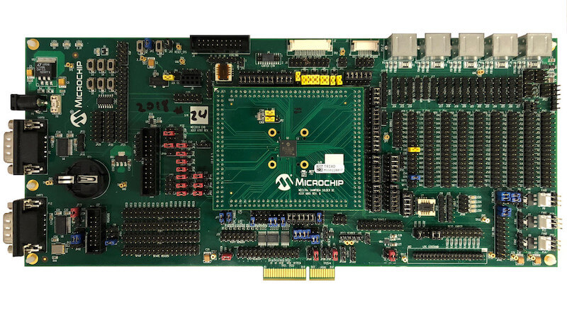

.. _mec2016evb_assy6797:

MEC2016EVB ASSY6797
###################

Overview
********

The MEC2016EVB_ASSY6797 kit is a development platform to evaluate the
Microchip MEC1701X series microcontrollers. This board needs to be mated with
part number MEC170X 144WFBA SOLDER DC ASSY 6801(cpu board) in order to operate.

Hardware
********

- MEC1701QC2SZ ARM Cortex-M4F Processor
- 480 KB RAM and 64 KB boot ROM
- 2 Microchip BC-Link Interconnection bus
- Keyboard interface
- ADC & GPIO headers
- UART0 and UART1
- FAN0, FAN1, FAN2 headers
- FAN PWM interface
- Jtag and Trace ports
- PECI interface 3.0
- I2C voltage translator
- 10 SMBUS headers
- 3 UDP I2C headers
- VCI interface
- 5 independent Hardware Driven PS/2 Ports
- eSPI header
- LPC sideband headers
- 4 Breathing/Blinking LEDs
- 2 Sockets for SPI NOR chips
- One reset and VCC_PWRDGD pushbuttons

For more information about the SOC please visit:

- `MEC170x Reference Manual`_

Supported Features
==================

The mec2016evb_assy6797 board configuration supports the following hardware
features:

+-----------+------------+-------------------------------------+
| Interface | Controller | Driver/Component                    |
+===========+============+=====================================+
| NVIC      | on-chip    | nested vector interrupt controller  |
+-----------+------------+-------------------------------------+
| SYSTICK   | on-chip    | systick                             |
+-----------+------------+-------------------------------------+
| UART      | on-chip    | serial port                         |
+-----------+------------+-------------------------------------+

Other hardware features are not currently supported by Zephyr (at the moment)

The default configuration can be found in the Kconfig file:
``boards/arm/mec2016evb_assy6797/mec2016evb_assy6797_defconfig``

Connections and IOs
===================

Microchip to provide the schematic for this board.

System Clock
============

The MEC1701 MCU is configured to use the 48Mhz internal oscillator with the
on-chip PLL to generate a resulting EC clock rate of 12 MHz. See Processor clock
control register (chapter 4 in user manual)

Serial Port
===========

UART0 is configured for serial logs.

Jumper settings
***************

Please follow the jumper settings below to properly demo this
board. Advanced users may deviate from this recommendation.

Jump setting for MEC2016 EVB Assy 6797 Rev A1p0
===============================================

Power-related jumpers.

+-------+------+------+------+------+------+-------+-------+
| JP31  | JP32 | JP35 | JP36 | JP49 | JP50 | JP54  | JP55  |
+=======+======+======+======+======+======+=======+=======+
| 1-2   | 1-2  | 1-2  | 1-2  | 1-2  | 1-2  | 1-2   | 1-2   |
+-------+------+------+------+------+------+-------+-------+

+-------+-------+------+------+------+-------+
| JP56  | JP57  | JP58 | JP60 | JP61 | JP102 |
+=======+=======+======+======+======+=======+
| 1-2   | 1-2   | 1-2  | 1-2  | 1-2  | 2-3   |
+-------+-------+------+------+------+-------+

These jumpers configure VCC Power good, nRESETI and JTAG_STRAP respectively.

+------------------+-----------+--------------+
| JP1              | JP2       | JP51         |
| (VCC Power good) | (nRESETI) | (JTAG_STRAP) |
+==================+===========+==============+
| 1-2              | 1-2       | 2-3          |
+------------------+-----------+--------------+

Each column of the following table illustrates how to enable UART0, JTAG,
PVT SPI, SHD SPI and LED0-3 respectively.

+---------+--------+-----------+----------+---------+
| JP27    | JP10   | JP34      | JP75     | JP68    |
| (UART0) | (JTAG) | (PVT SPI) | (SHD SPI)| (LED0-3)|
+=========+========+===========+==========+=========+
| 11-12   | 2-3    | 2-3       | 2-3      | 1-2     |
+---------+--------+-----------+----------+---------+
| 8-9     | 5-6    | 5-6       | 5-6      | 3-4     |
+---------+--------+-----------+----------+---------+
|         | 8-9    | 8-9       | 8-9      | 5-6     |
+---------+--------+-----------+----------+---------+
|         | 11-12  | 11-12     | 11-12    | 7-8     |
+---------+--------+-----------+----------+---------+
|         |        | 14-15     | 14-15    |         |
+---------+--------+-----------+----------+---------+
|         |        | 17-18     | 17-18    |         |
+---------+--------+-----------+----------+---------+

Jump settings for MEC170x 144WFBGA Socket DC Assy 6801 Rev B1p0
===============================================================

The jumper configuration explained above covers the base board. Now the CPU
board requires the following settings.

+-------+-------+
| JP1   | JP2   |
+=======+=======+
| 1-2   | 2-3   |
+-------+-------+

Programming and Debugging
*************************

This board comes with a Cortex ETM port which facilitates tracing and debugging
using a single physical connection.  In addition, it comes with sockets for
JTAG only sessions.

Flashing
========

#. Connect the SPI Dongle ASSY 6791 to J36 (SPI dongle) in order to flash and
   boot from SHD SPI NOR. Then proceed to flash using Dediprog SF100 or a
   similar tool for flashing SPI chips. Remember that SPI MISO/MOSI are
   swapped on dediprog headers!

#. Run your favorite terminal program to listen for output. Under Linux the
   terminal should be :code:`/dev/ttyACM0`. For example:

   .. code-block:: console

      $ minicom -D /dev/ttyACM0 -o

   The -o option tells minicom not to send the modem initialization
   string. Connection should be configured as follows:

   - Speed: 115200
   - Data: 8 bits
   - Parity: None
   - Stop bits: 1

#. Connect the MEC2016EVB_ASSY_6797 board to your host computer using the
   UART0 port. Then build :ref:`hello_world` application. It is important
   to generate a binary with a new load address, for example do the following::

        ${OBJCOPY} --change-addresses -0xb0000 -O binary -S ${in_elf} ${out_bin}

   Once you obtain the binary, proceed to use the microchip tool mec2016_spi_gen
   in order to create the final binary. This binary is what you need to flash
   in your spi nor.

   .. zephyr-app-commands::
      :zephyr-app: samples/hello_world
      :board: mec2016evb_assy6797
      :goals: build flash

   You should see "Hello World! mec2016evb_assy6797" in your terminal.

Debugging
=========

You can debug an application in the usual way.  Here is an example for the
:ref:`hello_world` application.

.. zephyr-app-commands::
   :zephyr-app: samples/hello_world
   :board: mec2016evb_assy6797
   :maybe-skip-config:
   :goals: debug

References
**********
.. target-notes::

.. _MEC170x Reference Manual:
    http://ww1.microchip.com/downloads/en/DeviceDoc/MEC170x-Data-Sheet-DS00002206D.pdf
