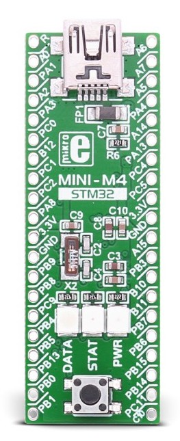
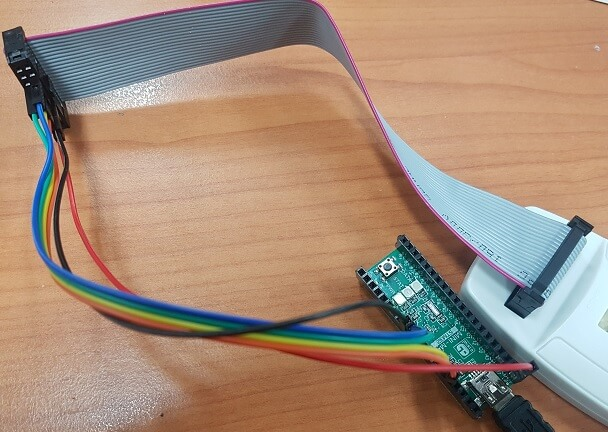

.. _mikroe_mini_m4_for_stm32:

Mikroe MINI-M4 for STM32
########################

Overview
********

MINI-M4 for STM32 is a small ARM® Cortex™-M4 development board containing
an `STM32F415RG`_ microcontroller. It is pin compatible with PIC16F887 and
PIC18(L)F45K20 microcontrollers and it perfectly fits into a standard DIP40
socket. The board is equipped with a 16MHz SMD crystal oscillator, and
a 32.768KHz crystal which can be used for the internal RTCC module.
It has a reset button and three signal LEDs.
It operates on a 3.3V power supply. An on-board voltage regulator allows
the board to be powered directly from a USB cable.

Pin Mapping
===========

This port is a starting point for your own customizations and not a complete
port for a specific board. Most of the GPIOs on the STM32 SoC have been exposed
in the external header with silk screen labels that match the SoC's pin names.

For more information on Pin Mapping, please refer to `MINI-M4 for STM32 User Manual`_.

STLinkV2 connection:
====================

The board can be flashed by using STLinkV2 with the following connections.

+------------------+---------------------+
| MINI-M4(Pin no.) | ST-Link/V2(Pin no.) |
+==================+=====================+
| PA14(36)         | TCK_SWCLK(9)        |
+------------------+---------------------+
| PA13(35)         | TMS_SWDIO(7)        |
+------------------+---------------------+
| PA15(30)         | TDI(5)              |
+------------------+---------------------+
| PB3(29)          | TDO_SWO(13)         |
+------------------+---------------------+
| GND(31)          | GND(8)              |
+------------------+---------------------+
| MCLR(1)          | NRST(15)            |
+------------------+---------------------+

Supported Features
==================

The MINI-M4 for STM32 board configuration supports the following hardware
features:

+-----------+------------+----------------------+
| Interface | Controller | Driver/Component     |
+===========+============+======================+
| CRYP      | on-chip    | crypto               |
+-----------+------------+----------------------+
| NVIC      | on-chip    | nested vectored      |
|           |            | interrupt controller |
+-----------+------------+----------------------+
| PINMUX    | on-chip    | pinmux               |
+-----------+------------+----------------------+
| UART      | on-chip    | serial port          |
+-----------+------------+----------------------+
| GPIO      | on-chip    | gpio                 |
+-----------+------------+----------------------+
| I2C       | on-chip    | i2c                  |
+-----------+------------+----------------------+
| SPI       | on-chip    | spi                  |
+-----------+------------+----------------------+
| PWM       | on-chip    | PWM                  |
+-----------+------------+----------------------+
| USB       | on-chip    | USB                  |
+-----------+------------+----------------------+

Other hardware features have not been enabled yet for this board.

The default configuration can be found in the defconfig file:

	``boards/arm/mikroe_mini_m4_for_stm32/mikroe_mini_m4_for_stm32_defconfig``

Serial Port
===========

The Zephyr console output is assigned to USART2. Default settings are 115200 8N1.

Programming and Debugging
*************************

Applications for the ``mikroe_mini_m4_for_stm32`` board configuration can
be built and flashed in the usual way (see :ref:`build_an_application` and
:ref:`application_run` for more details).

Flashing
========

The initial state of the board is set to lock.
When you flash, it will fail with the message:

.. code-block:: console

   Error: stm32x device protected

Unlocking with openocd makes it possible to flash.

.. code-block:: console

   $ openocd -f /usr/share/openocd/scripts/interface/stlink-v2.cfg \
       -f /usr/share/openocd/scripts/target/stm32f4x.cfg -c init\
       -c "reset halt" -c "stm32f4x unlock 0" -c "reset run" -c shutdown

Here is an example for the :ref:`hello_world` application.

.. zephyr-app-commands::
   :zephyr-app: samples/hello_world
   :board: mikroe_mini_m4_for_stm32
   :goals: build flash

You should see the following message on the console:

.. code-block:: console

   Hello World! mikroe_mini_m4_for_stm32

Debugging
=========

You can debug an application in the usual way.  Here is an example for the
:ref:`hello_world` application.

.. zephyr-app-commands::
   :zephyr-app: samples/hello_world
   :board: mikroe_mini_m4_for_stm32
   :maybe-skip-config:
   :goals: debug

.. _STM32F415RG:
        https://www.st.com/resource/en/datasheet/stm32f415rg.pdf
.. _MINI-M4 for STM32 User Manual:
        https://download.mikroe.com/documents/starter-boards/mini/stm32/f4/mini-m4-stm32-manual-v100.pdf
