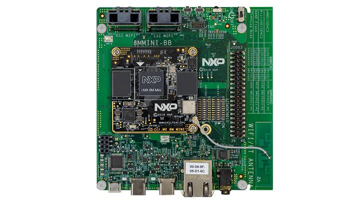

.. _mimx8mm_evk:

NXP MIMX8MM EVK
###############

Overview
********

i.MX8M Mini LPDDR4 EVK board is based on NXP i.MX8M Mini applications
processor, composed of a quad Cortex®-A53 cluster and a single Cortex®-M4 core.
Zephyr OS is ported to run on the Cortex®-M4 core.

- Board features:

  - RAM: 2GB LPDDR4
  - Storage:

    - SanDisk 16GB eMMC5.1
    - Micron 32MB QSPI NOR
    - microSD Socket
  - Wireless:

    - WiFi: 2.4/5GHz IEEE 802.11b/g/n
    - Bluetooth: v4.1
  - USB:

    - OTG - 2x type C
  - Ethernet
  - PCI-E M.2
  - Connectors:

    - 40-Pin Dual Row Header
  - LEDs:

    - 1x Power status LED
    - 1x UART LED
  - Debug

    - JTAG 20-pin connector
    - MicroUSB for UART debug, two COM ports for A53 and M4

More information about the board can be found at the
`NXP website`_.

Supported Features
==================

The Zephyr mimx8mm_evk board configuration supports the following hardware
features:

+-----------+------------+-------------------------------------+
| Interface | Controller | Driver/Component                    |
+===========+============+=====================================+
| NVIC      | on-chip    | nested vector interrupt controller  |
+-----------+------------+-------------------------------------+
| SYSTICK   | on-chip    | systick                             |
+-----------+------------+-------------------------------------+
| CLOCK     | on-chip    | clock_control                       |
+-----------+------------+-------------------------------------+
| PINMUX    | on-chip    | pinmux                              |
+-----------+------------+-------------------------------------+
| UART      | on-chip    | serial port-polling;                |
|           |            | serial port-interrupt               |
+-----------+------------+-------------------------------------+
| GPIO      | on-chip    | GPIO output                         |
|           |            | GPIO input                          |
+-----------+------------+-------------------------------------+

The default configuration can be found in the defconfig file:
:zephyr_file:`boards/arm/mimx8mm_evk/mimx8mm_evk_defconfig`.

It is recommended to disable peripherals used by the M4 core on the Linux host.

Other hardware features are not currently supported by the port.

Connections and IOs
===================

MIMX8MM EVK board was tested with the following pinmux controller
configuration.

+---------------+-----------------+---------------------------+
| Board Name    | SoC Name        | Usage                     |
+===============+=================+===========================+
| UART4 RXD     | UART4_TXD       | UART Console              |
+---------------+-----------------+---------------------------+
| UART4 TXD     | UART4_RXD       | UART Console              |
+---------------+-----------------+---------------------------+

System Clock
============

The M4 Core is configured to run at a 400 MHz clock speed.

Serial Port
===========

The i.MX8M Mini SoC has four UARTs. UART_4 is configured for the console and
the remaining are not used/tested.

Programming and Debugging
*************************

The MIMX8MM EVK board doesn't have QSPI flash for the M4 and it needs
to be started by the A53 core. The A53 core is responsible to load the M4 binary
application into the RAM, put the M4 in reset, set the M4 Program Counter and
Stack Pointer, and get the M4 out of reset. The A53 can perform these steps at
bootloader level or after the Linux system has booted.

The M4 can use up to 3 different RAMs. These are the memory mapping for A53 and M4:

+------------+-------------------------+------------------------+-----------------------+----------------------+
| Region     | Cortex-A53              | Cortex-M4 (System Bus) | Cortex-M4 (Code Bus)  | Size                 |
+============+=========================+========================+=======================+======================+
| OCRAM      | 0x00900000-0x0093FFFF   | 0x20200000-0x2023FFFF  | 0x00900000-0x0093FFFF | 256KB                |
+------------+-------------------------+------------------------+-----------------------+----------------------+
| TCMU       | 0x00800000-0x0081FFFF   | 0x20000000-0x2001FFFF  |                       | 128KB                |
+------------+-------------------------+------------------------+-----------------------+----------------------+
| TCML       | 0x007E0000-0x007FFFFF   |                        | 0x1FFE0000-0x1FFFFFFF | 128KB                |
+------------+-------------------------+------------------------+-----------------------+----------------------+
| OCRAM_S    | 0x00180000-0x00187FFF   | 0x20180000-0x20187FFF  | 0x00180000-0x00187FFF | 32KB                 |
+------------+-------------------------+------------------------+-----------------------+----------------------+

For more information about memory mapping see the
`i.MX 8M Applications Processor Reference Manual`_  (section 2.1.2 and 2.1.3)

At compilation time you have to choose which RAM will be used. This
configuration is done in the file ``boards/arm/mimx8mm_evk/mimx8mm_evk.dts``
with "zephyr,flash" (when CONFIG_XIP=y) and "zephyr,sram" properties.
The available configurations are:

.. code-block:: none

   "zephyr,flash"
   - &tcml_code
   - &ocram_code
   - &ocram_s_code

   "zephyr,sram"
   - &tcmu_sys
   - &ocram_sys
   - &ocram_s_sys

Load and run Zephyr on M4 from A53 using u-boot by copying the compiled
``zephyr.bin`` to the first FAT partition of the SD card and plug the SD
card into the board. Power it up and stop the u-boot execution at prompt.

Load the M4 binary onto the desired memory and start its execution using:

.. code-block:: console

   fatload mmc 0:1 0x7e0000 zephyr.bin;bootaux 0x7e0000

Debugging
=========

MIMX8MM EVK board can be debugged by connecting an external JLink
JTAG debugger to the J902 debug connector and to the PC. Then
the application can be debugged using the usual way.

Here is an example for the :ref:`hello_world` application.

.. zephyr-app-commands::
   :zephyr-app: samples/hello_world
   :board: mimx8mm_evk
   :goals: debug

Open a serial terminal, step through the application in your debugger, and you
should see the following message in the terminal:

.. code-block:: console

   ***** Booting Zephyr OS build zephyr-v2.0.0-1859-g292afe8533c0 *****
   Hello World! mimx8mm_evk

References
==========

.. _NXP website:
   https://www.nxp.com/design/development-boards/i.mx-evaluation-and-development-boards/evaluation-kit-for-thebr-i.mx-8m-mini-applications-processor:8MMINILPD4-EVK

.. _i.MX 8M Applications Processor Reference Manual:
   https://www.nxp.com/webapp/Download?colCode=IMX8MMRM
