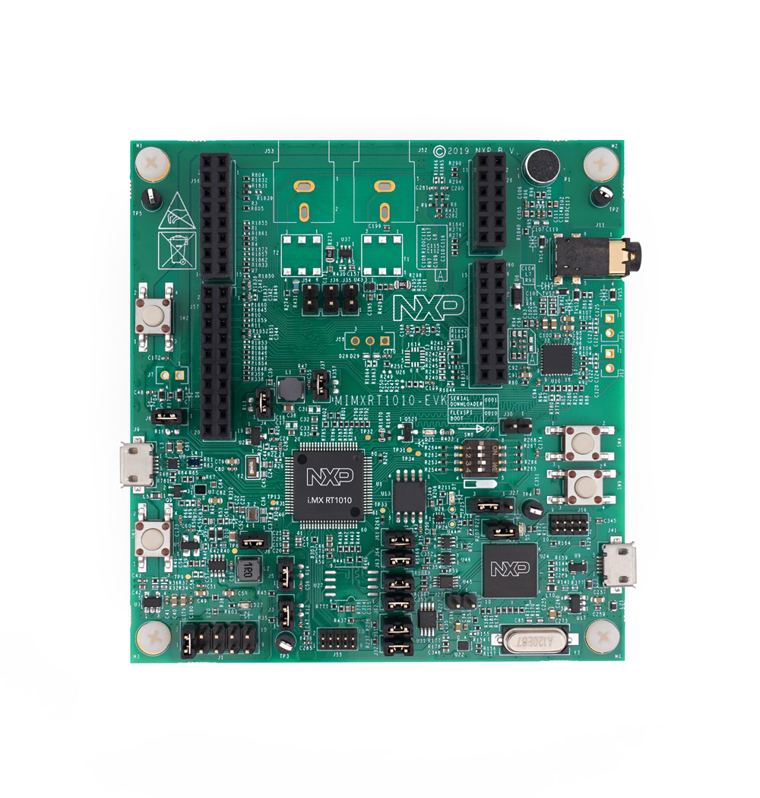

.. _mimxrt1010_evk:

NXP MIMXRT1010-EVK
##################

Overview
********

The i.MX RT1010 offers a new entry-point into the i.MX RT crossover processor
series by providing the lowest-cost LQFP package option, combined with the
high performance and ease-of-use known throughout the entire i.MX RT series.
This device is fully supported by NXP’s MCUXpresso Software and Tools.

Hardware
********

- MIMXRT1011DAE5A MCU

- Memory

  - 128 Mbit QSPI Flash

- Connectivity

  - Micro USB host and OTG connectors
  - Arduino interface

- Audio

  - Audio Codec
  - 4-pole audio headphone jack
  - External speaker connection
  - Microphone

- Debug

  - JTAG 10-pin connector
  - OpenSDA with DAPLink

For more information about the MIMXRT1010 SoC and MIMXRT1010-EVK board, see
these references:

- `i.MX RT1010 Website`_
- `i.MX RT1010 Datasheet`_
- `i.MX RT1010 Reference Manual`_
- `MIMXRT1010-EVK Website`_
- `MIMXRT1010-EVK User Guide`_
- `MIMXRT1010-EVK Design Files`_

Supported Features
==================

The mimxrt1010_evk board configuration supports the following hardware
features:

+-----------+------------+-------------------------------------+
| Interface | Controller | Driver/Component                    |
+===========+============+=====================================+
| NVIC      | on-chip    | nested vector interrupt controller  |
+-----------+------------+-------------------------------------+
| SYSTICK   | on-chip    | systick                             |
+-----------+------------+-------------------------------------+
| GPIO      | on-chip    | gpio                                |
+-----------+------------+-------------------------------------+
| SPI       | on-chip    | spi                                 |
+-----------+------------+-------------------------------------+
| I2C       | on-chip    | i2c                                 |
+-----------+------------+-------------------------------------+
| UART      | on-chip    | serial port-polling;                |
|           |            | serial port-interrupt               |
+-----------+------------+-------------------------------------+
| USB       | on-chip    | USB device                          |
+-----------+------------+-------------------------------------+
| ADC       | on-chip    | adc                                 |
+-----------+------------+-------------------------------------+
| GPT       | on-chip    | gpt                                 |
+-----------+------------+-------------------------------------+

The default configuration can be found in the defconfig file:
``boards/arm/mimxrt1010_evk/mimxrt1010_evk_defconfig``

Other hardware features are not currently supported by the port.

Connections and I/Os
====================

The MIMXRT1010 SoC has five pairs of pinmux/gpio controllers.

+---------------+-----------------+---------------------------+
| Name          | Function        | Usage                     |
+===============+=================+===========================+
| GPIO_11       | GPIO            | LED                       |
+---------------+-----------------+---------------------------+
| GPIO_SD_05    | GPIO            | SW4                       |
+---------------+-----------------+---------------------------+
| GPIO_10       | LPUART1_TX      | UART Console              |
+---------------+-----------------+---------------------------+
| GPIO_09       | LPUART1_RX      | UART Console              |
+---------------+-----------------+---------------------------+
| GPIO_01       | LPI2C1_SDA      | I2C SDA                   |
+---------------+-----------------+---------------------------+
| GPIO_02       | LPI2C1_CLK      | I2C SCL                   |
+---------------+-----------------+---------------------------+
| GPIO_AD_03    | LPSPI1_SDI      | SPI                       |
+---------------+-----------------+---------------------------+
| GPIO_AD_04    | LPSPI1_SDO      | SPI                       |
+---------------+-----------------+---------------------------+
| GPIO_AD_05    | LPSPI1_PCS0     | SPI                       |
+---------------+-----------------+---------------------------+
| GPIO_AD_06    | LPSPI1_SCK      | SPI                       |
+---------------+-----------------+---------------------------+
| GPIO_AD_01    | ADC             | ADC1 Channel 1            |
+---------------+-----------------+---------------------------+
| GPIO_AD_02    | ADC             | ADC1 Channel 2            |
+---------------+-----------------+---------------------------+

System Clock
============

The MIMXRT1010 SoC is configured to use the 32 KHz low frequency oscillator on
the board as a source for the GPT timer to generate a system clock.

Serial Port
===========

The MIMXRT1010 SoC has four UARTs. ``LPUART1`` is configured for the console,
and the remaining are not used.

Programming and Debugging
*************************

Build and flash applications as usual (see :ref:`build_an_application` and
:ref:`application_run` for more details).

Configuring a Debug Probe
=========================

A debug probe is used for both flashing and debugging the board. This board is
configured by default to use the :ref:`opensda-daplink-onboard-debug-probe`,
however the :ref:`pyocd-debug-host-tools` do not yet support programming the
external flashes on this board so you must reconfigure the board for one of the
following debug probes instead.

:ref:`jlink-external-debug-probe`
-------------------------------------------

Install the :ref:`jlink-debug-host-tools` and make sure they are in your search
path.

Attach a J-Link 10-pin connector to J55. Check that jumpers J61 and J62 are
**off** (they are on by default when boards ship from the factory) to ensure
SWD signals are disconnected from the OpenSDA microcontroller.

Configuring a Console
=====================

Regardless of your choice in debug probe, we will use the OpenSDA
microcontroller as a usb-to-serial adapter for the serial console. Check that
jumpers J31 and J32 are **on** (they are on by default when boards ship from
the factory) to connect UART signals to the OpenSDA microcontroller.

Connect a USB cable from your PC to J41.

Use the following settings with your serial terminal of choice (minicom, putty,
etc.):

- Speed: 115200
- Data: 8 bits
- Parity: None
- Stop bits: 1

Flashing
========

Here is an example for the :ref:`hello_world` application.

.. zephyr-app-commands::
    :zephyr-app: samples/hello_world
    :board: mimxrt1010_evk
    :goals: flash

Open a serial terminal, reset the board (press the SW9 button), and you should
see the following message in the terminal:

.. code-block:: console

    Hello World! mimxrt1010_evk

MCUXpresso Config Tool
======================

A ``mimxrt1010_evk.mex`` file is included. This file was used to generate the clock
initialization code and can be used as a starting point to tweak the clock configuration.
This could be useful for different boards that are based on i.MX RT1010.

NOTE: The MCUXpresso Config Tool currently generates a ``.c`` file with the clock configuration.
Considering options on leveraging this tool in the future to generate a devicetree compatible file.

Clock Configuration at Platform Initialization
==============================================

Below is the clock configuration at platform initialization.

- On-chip 24MHz oscillator is enabled

- Clock sources

+----------------------------+-----------------+
| Name                       | Frequency       |
+============================+=================+
| RTC Oscillator             | 32.768 kHz      |
+----------------------------+-----------------+
| 24MHz clock source         | 24 MHz          |
+----------------------------+-----------------+
| 1MHz clock                 | 1 MHz           |
+----------------------------+-----------------+
| SAI1 MCLK                  | Inactive        |
+----------------------------+-----------------+
| SAI3 MCLK                  | Inactive        |
+----------------------------+-----------------+
| SPDIF_CLK_EXT              | Inactive        |
+----------------------------+-----------------+
| SPDIF_SRCLK                | 1 MHz           |
+----------------------------+-----------------+
| SPDIF_OUTCLK               | 1 MHz           |
+----------------------------+-----------------+

- Clock outputs

+----------------------------+-----------------+
| Name                       | Frequency       |
+============================+=================+
| CORE_CLK_ROOT              | 500 MHz         |
+----------------------------+-----------------+
| IPG_CLK_ROOT               | 125 MHz         |
+----------------------------+-----------------+
| PERCLK_CLK_ROOT            | 62.5 MHz        |
+----------------------------+-----------------+
| FLEXSPI_CLK_ROOT           | 90 MHz          |
+----------------------------+-----------------+
| SPDIF0_CLK_ROOT            | 30 MHz          |
+----------------------------+-----------------+
| FLEXIO1_CLK_ROOT           | 30 MHz          |
+----------------------------+-----------------+
| SAI1_CLK_ROOT              | 41.53 MHz       |
+----------------------------+-----------------+
| SAI3_CLK_ROOT              | 41.53 MHz       |
+----------------------------+-----------------+
| LPI2C_CLK_ROOT             | 10 MHz          |
+----------------------------+-----------------+
| UART_CLK_ROOT              | 80 MHz          |
+----------------------------+-----------------+
| ADC_ALT_CLK                | 40 MHz          |
+----------------------------+-----------------+
| LPSPI_CLK_ROOT             | 90 MHz          |
+----------------------------+-----------------+
| TRACE_CLK_ROOT             | 99 MHz          |
+----------------------------+-----------------+
| CKIL_SYNC_CLK_ROOT         | 32.768 kHz      |
+----------------------------+-----------------+
| Clock 1M output            | 1 MHz           |
+----------------------------+-----------------+
| Clock 24MHz output         | 24 MHz          |
+----------------------------+-----------------+
| CLKO1_CLK                  | Inactive        |
+----------------------------+-----------------+
| CLKO2_CLK                  | Inactive        |
+----------------------------+-----------------+
| ENET_500M_CLK              | 500 MHz         |
+----------------------------+-----------------+
| USBPHY PLL clock           | 480 MHz         |
+----------------------------+-----------------+
| GPT1 high frequency clock  | 62.5 MHz        |
+----------------------------+-----------------+
| GPT2 high frequency clock  | 62.5 MHz        |
+----------------------------+-----------------+
| SAI1 MCLK 1                | 41.53 MHz       |
+----------------------------+-----------------+
| SAI1 MCLK 2                | 41.53 MHz       |
+----------------------------+-----------------+
| SAI1 MCLK 3                | 30 MHz          |
+----------------------------+-----------------+
| SAI3 MCLK 1                | 41.53 MHz       |
+----------------------------+-----------------+
| SAI3 MCLK 2                | Inactive        |
+----------------------------+-----------------+
| SAI3 MCLK 3                | 30 MHz          |
+----------------------------+-----------------+
| SPDIF0_EXTCLK              | Inactive        |
+----------------------------+-----------------+
| MQS MCLK                   | 41.53 MHz       |
+----------------------------+-----------------+

.. _MIMXRT1010-EVK Website:
   https://www.nxp.com/MIMXRT1010-EVK

.. _MIMXRT1010-EVK User Guide:
   https://www.nxp.com/webapp/Download?colCode=MIMXRT1010EVKHUG

.. _MIMXRT1010-EVK Design Files:
   https://www.nxp.com/downloads/en/printed-circuit-boards/IMXRT1010-EVK-DESIGN-FILES.7z

.. _i.MX RT1010 Website:
   https://www.nxp.com/imxrt1010

.. _i.MX RT1010 Datasheet:
   https://www.nxp.com/docs/en/data-sheet/IMXRT1010CEC.pdf

.. _i.MX RT1010 Reference Manual:
   https://www.nxp.com/webapp/Download?colCode=IMXRT1010RM
