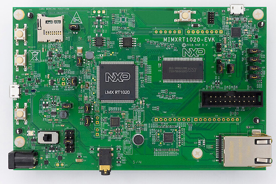

.. _mimxrt1020_evk:

NXP MIMXRT1020-EVK
##################

Overview
********

The i.MX RT1020 expands the i.MX RT crossover processor families by providing
high-performance feature set in low-cost LQFP packages, further simplifying
board design and layout for customers. The i.MX RT1020 runs on the Arm®
Cortex®-M7 core at 500 MHz.

Hardware
********

- MIMXRT1021DAG5A MCU

- Memory

  - 256 Mbit SDRAM
  - 64 Mbit QSPI Flash
  - TF socket for SD card

- Connectivity

  - 10/100 Mbit/s Ethernet PHY
  - Micro USB host and OTG connectors
  - CAN transceivers
  - Arduino interface

- Audio

  - Audio Codec
  - 4-pole audio headphone jack
  - Microphone
  - External speaker connection

- Power

  - 5 V DC jack

- Debug

  - JTAG 20-pin connector
  - OpenSDA with DAPLink

For more information about the MIMXRT1020 SoC and MIMXRT1020-EVK board, see
these references:

- `i.MX RT1020 Website`_
- `i.MX RT1020 Datasheet`_
- `i.MX RT1020 Reference Manual`_
- `MIMXRT1020-EVK Website`_
- `MIMXRT1020-EVK User Guide`_
- `MIMXRT1020-EVK Design Files`_

Supported Features
==================

The mimxrt1020_evk board configuration supports the following hardware
features:

+-----------+------------+-------------------------------------+
| Interface | Controller | Driver/Component                    |
+===========+============+=====================================+
| NVIC      | on-chip    | nested vector interrupt controller  |
+-----------+------------+-------------------------------------+
| SYSTICK   | on-chip    | systick                             |
+-----------+------------+-------------------------------------+
| GPIO      | on-chip    | gpio                                |
+-----------+------------+-------------------------------------+
| I2C       | on-chip    | i2c                                 |
+-----------+------------+-------------------------------------+
| UART      | on-chip    | serial port-polling;                |
|           |            | serial port-interrupt               |
+-----------+------------+-------------------------------------+
| ENET      | on-chip    | ethernet                            |
+-----------+------------+-------------------------------------+

The default configuration can be found in the defconfig file:
``boards/arm/mimxrt1020_evk/mimxrt1020_evk_defconfig``

Other hardware features are not currently supported by the port.

Connections and I/Os
====================

The MIMXRT1020 SoC has five pairs of pinmux/gpio controllers.

+---------------+-----------------+---------------------------+
| Name          | Function        | Usage                     |
+===============+=================+===========================+
| GPIO_AD_B0_05 | GPIO            | LED                       |
+---------------+-----------------+---------------------------+
| GPIO_AD_B0_06 | LPUART1_TX      | UART Console              |
+---------------+-----------------+---------------------------+
| GPIO_AD_B0_07 | LPUART1_RX      | UART Console              |
+---------------+-----------------+---------------------------+
| GPIO_AD_B1_08 | LPUART2_TX      | UART BT HCI               |
+---------------+-----------------+---------------------------+
| GPIO_AD_B1_09 | LPUART2_RX      | UART BT HCI               |
+---------------+-----------------+---------------------------+
| GPIO_AD_B1_14 | LPI2C1_SCL      | I2C                       |
+---------------+-----------------+---------------------------+
| GPIO_AD_B1_15 | LPI2C1_SDA      | I2C                       |
+---------------+-----------------+---------------------------+
| GPIO_SD_B1_02 | LPI2C4_SCL      | I2C                       |
+---------------+-----------------+---------------------------+
| GPIO_SD_B1_03 | LPI2C4_SDA      | I2C                       |
+---------------+-----------------+---------------------------+
| WAKEUP        | GPIO            | SW0                       |
+---------------+-----------------+---------------------------+
| GPIO_AD_B0_04 | ENET_RST        | Ethernet                  |
+---------------+-----------------+---------------------------+
| GPIO_AD_B0_08 | ENET_REF_CLK    | Ethernet                  |
+---------------+-----------------+---------------------------+
| GPIO_AD_B0_09 | ENET_RX_DATA01  | Ethernet                  |
+---------------+-----------------+---------------------------+
| GPIO_AD_B0_10 | ENET_RX_DATA00  | Ethernet                  |
+---------------+-----------------+---------------------------+
| GPIO_AD_B0_11 | ENET_RX_EN      | Ethernet                  |
+---------------+-----------------+---------------------------+
| GPIO_AD_B0_12 | ENET_RX_ER      | Ethernet                  |
+---------------+-----------------+---------------------------+
| GPIO_AD_B0_13 | ENET_TX_EN      | Ethernet                  |
+---------------+-----------------+---------------------------+
| GPIO_AD_B0_14 | ENET_TX_DATA00  | Ethernet                  |
+---------------+-----------------+---------------------------+
| GPIO_AD_B0_15 | ENET_TX_DATA01  | Ethernet                  |
+---------------+-----------------+---------------------------+
| GPIO_AD_B1_06 | ENET_INT        | Ethernet                  |
+---------------+-----------------+---------------------------+
| GPIO_EMC_41   | ENET_MDC        | Ethernet                  |
+---------------+-----------------+---------------------------+
| GPIO_EMC_40   | ENET_MDIO       | Ethernet                  |
+---------------+-----------------+---------------------------+

System Clock
============

The MIMXRT1020 SoC is configured to use the 24 MHz external oscillator on the
board with the on-chip PLL to generate a 500 MHz core clock.

Serial Port
===========

The MIMXRT1020 SoC has eight UARTs. ``LPUART1`` is configured for the console,
``LPUART2`` for the Bluetooth Host Controller Interface (BT HCI), and the
remaining are not used.

Programming and Debugging
*************************

Build and flash applications as usual (see :ref:`build_an_application` and
:ref:`application_run` for more details).

Configuring a Debug Probe
=========================

A debug probe is used for both flashing and debugging the board. This board is
configured by default to use the :ref:`opensda-daplink-onboard-debug-probe`,
however the :ref:`pyocd-debug-host-tools` do not yet support programming the
external flashes on this board so you must reconfigure the board for one of the
following debug probes instead.

Option 1: :ref:`opensda-jlink-onboard-debug-probe` (Recommended)
----------------------------------------------------------------

Install the :ref:`jlink-debug-host-tools` and make sure they are in your search
path.

Follow the instructions in :ref:`opensda-jlink-onboard-debug-probe` to program
the `OpenSDA J-Link MIMXRT1020-EVK Firmware`_. Check that jumpers J27 and J28
are **on** (they are on by default when boards ship from the factory) to ensure
SWD signals are connected to the OpenSDA microcontroller.

Option 2: :ref:`jlink-external-debug-probe`
-------------------------------------------

Install the :ref:`jlink-debug-host-tools` and make sure they are in your search
path.

Attach a J-Link 20-pin connector to J16. Check that jumpers J27 and J28 are
**off** (they are on by default when boards ship from the factory) to ensure
SWD signals are disconnected from the OpenSDA microcontroller.

Configuring a Console
=====================

Regardless of your choice in debug probe, we will use the OpenSDA
microcontroller as a usb-to-serial adapter for the serial console. Check that
jumpers J25 and J26 are **on** (they are on by default when boards ship from
the factory) to connect UART signals to the OpenSDA microcontroller.

Connect a USB cable from your PC to J23.

Use the following settings with your serial terminal of choice (minicom, putty,
etc.):

- Speed: 115200
- Data: 8 bits
- Parity: None
- Stop bits: 1

Flashing
========

Here is an example for the :ref:`hello_world` application.

.. zephyr-app-commands::
   :zephyr-app: samples/hello_world
   :board: mimxrt1020_evk
   :goals: flash

Open a serial terminal, reset the board (press the SW5 button), and you should
see the following message in the terminal:

.. code-block:: console

   ***** Booting Zephyr OS v1.14.0-rc1 *****
   Hello World! mimxrt1020_evk

Debugging
=========

Here is an example for the :ref:`hello_world` application.

.. zephyr-app-commands::
   :zephyr-app: samples/hello_world
   :board: mimxrt1020_evk
   :goals: debug

Open a serial terminal, step through the application in your debugger, and you
should see the following message in the terminal:

.. code-block:: console

   ***** Booting Zephyr OS v1.14.0-rc1 *****
   Hello World! mimxrt1020_evk

.. _MIMXRT1020-EVK Website:
   https://www.nxp.com/support/developer-resources/run-time-software/i.mx-developer-resources/i.mx-rt1020-evaluation-kit:MIMXRT1020-EVK

.. _MIMXRT1020-EVK User Guide:
   https://www.nxp.com/docs/en/user-guide/MIMXRT1020EVKHUG.pdf

.. _MIMXRT1020-EVK Design Files:
   https://www.nxp.com/webapp/Download?colCode=MIMXRT1020-EVK-Design-Files

.. _i.MX RT1020 Website:
   https://www.nxp.com/products/processors-and-microcontrollers/arm-based-processors-and-mcus/i.mx-applications-processors/i.mx-rt-series/i.mx-rt1020-crossover-processor-with-arm-cortex-m7-core:i.MX-RT1020

.. _i.MX RT1020 Datasheet:
   https://www.nxp.com/docs/en/data-sheet/IMXRT1020CEC.pdf

.. _i.MX RT1020 Reference Manual:
   https://www.nxp.com/webapp/Download?colCode=IMXRT1020RM

.. _OpenSDA J-Link MIMXRT1020-EVK Firmware:
   https://www.segger.com/downloads/jlink/OpenSDA_MIMXRT1020-EVK
