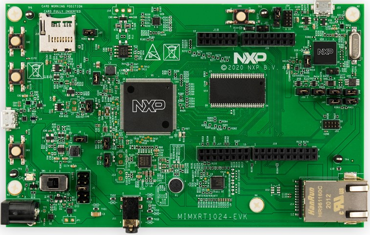

.. _mimxrt1024_evk:

NXP MIMXRT1024-EVK
##################

Overview
********

The i.MX RT1024 expands the i.MX RT crossover processor families by providing
high-performance feature set in low-cost LQFP packages, further simplifying
board design and layout for customers. The i.MX RT1024 runs on the Arm®
Cortex®-M7 core at 500 MHz.

Hardware
********

- MIMXRT1024DAG5A MCU (600 MHz, 256 KB on-chip memory, 4096KB on-chip QSPI
  flash)

- Memory

  - 256 Mbit SDRAM
  - 64 Mbit QSPI Flash
  - TF socket for SD card

- Connectivity

  - 10/100 Mbit/s Ethernet PHY
  - Micro USB host and OTG connectors
  - CAN transceivers
  - Arduino interface

- Audio

  - Audio Codec
  - 4-pole audio headphone jack
  - Microphone
  - External speaker connection

- Power

  - 5 V DC jack

- Debug

  - JTAG 10-pin connector
  - OpenSDA with DAPLink

For more information about the MIMXRT1024 SoC and MIMXRT1024-EVK board, see
these references:

- `i.MX RT1024 Website`_
- `i.MX RT1024 Datasheet`_
- `i.MX RT1024 Reference Manual`_
- `MIMXRT1024-EVK Website`_
- `MIMXRT1024-EVK User Guide`_
- `MIMXRT1024-EVK Design Files`_

Supported Features
==================

The mimxrt1024_evk board configuration supports the following hardware
features:

+-----------+------------+-------------------------------------+
| Interface | Controller | Driver/Component                    |
+===========+============+=====================================+
| NVIC      | on-chip    | nested vector interrupt controller  |
+-----------+------------+-------------------------------------+
| SYSTICK   | on-chip    | systick                             |
+-----------+------------+-------------------------------------+
| GPIO      | on-chip    | gpio                                |
+-----------+------------+-------------------------------------+
| UART      | on-chip    | serial port-polling;                |
|           |            | serial port-interrupt               |
+-----------+------------+-------------------------------------+

The default configuration can be found in the defconfig file:
``boards/arm/mimxrt1024_evk/mimxrt1024_evk_defconfig``

Other hardware features are not currently supported by the port.

Connections and I/Os
====================

The MIMXRT1024 SoC has five pairs of pinmux/gpio controllers.

+---------------+-----------------+---------------------------+
| Name          | Function        | Usage                     |
+===============+=================+===========================+
| GPIO_AD_B1_08 | GPIO            | LED                       |
+---------------+-----------------+---------------------------+
| GPIO_AD_B0_06 | LPUART1_TX      | UART Console              |
+---------------+-----------------+---------------------------+
| GPIO_AD_B0_07 | LPUART1_RX      | UART Console              |
+---------------+-----------------+---------------------------+
| WAKEUP        | GPIO            | SW4                       |
+---------------+-----------------+---------------------------+

System Clock
============

The MIMXRT1024 SoC is configured to use the 24 MHz external oscillator on the
board with the on-chip PLL to generate a 500 MHz core clock.

Serial Port
===========

The MIMXRT1024 SoC has eight UARTs. One is configured for the console and the
remaining are not used.

Programming and Debugging
*************************

Build and flash applications as usual (see :ref:`build_an_application` and
:ref:`application_run` for more details).

Configuring a Debug Probe
=========================

A debug probe is used for both flashing and debugging the board. This board is
configured by default to use the :ref:`opensda-daplink-onboard-debug-probe`,
however the :ref:`pyocd-debug-host-tools` do not yet support programming the
external flashes on this board so you must reconfigure the board for one of the
following debug probes instead.

:ref:`jlink-external-debug-probe`
---------------------------------

Install the :ref:`jlink-debug-host-tools` and make sure they are in your search
path.

Attach a J-Link 10-pin connector to J55. Check that jumpers J47 and J48 are
**off** (they are on by default when boards ship from the factory) to ensure
SWD signals are disconnected from the OpenSDA microcontroller.

Configuring a Console
=====================

Regardless of your choice in debug probe, we will use the OpenSDA
microcontroller as a usb-to-serial adapter for the serial console. Check that
jumpers J50 and J46 are **on** (they are on by default when boards ship from
the factory) to connect UART signals to the OpenSDA microcontroller.

Connect a USB cable from your PC to J23.

Use the following settings with your serial terminal of choice (minicom, putty,
etc.):

- Speed: 115200
- Data: 8 bits
- Parity: None
- Stop bits: 1

Flashing
========

Here is an example for the :ref:`hello_world` application.

.. zephyr-app-commands::
   :zephyr-app: samples/hello_world
   :board: mimxrt1024_evk
   :goals: flash

Open a serial terminal, reset the board (press the SW9 button), and you should
see the following message in the terminal:

.. code-block:: console

   ***** Booting Zephyr OS v2.4.0-rc1 *****
   Hello World! mimxrt1024_evk

Debugging
=========

Here is an example for the :ref:`hello_world` application.

.. zephyr-app-commands::
   :zephyr-app: samples/hello_world
   :board: mimxrt1024_evk
   :goals: debug

Open a serial terminal, step through the application in your debugger, and you
should see the following message in the terminal:

.. code-block:: console

   ***** Booting Zephyr OS v2.4.0-rc1 *****
   Hello World! mimxrt1024_evk

.. _MIMXRT1024-EVK Website:
   https://www.nxp.com/design/development-boards/i-mx-evaluation-and-development-boards/i-mx-rt1024-evaluation-kit:MIMXRT1024-EVK

.. _MIMXRT1024-EVK User Guide:
   https://www.nxp.com.cn/docs/en/user-guide/MIMXRT1024EVKHUG.pdf

.. _MIMXRT1024-EVK Design Files:
   https://www.nxp.com/webapp/sps/download/preDownload.jsp?render=true

.. _i.MX RT1024 Website:
   https://www.nxp.com/products/processors-and-microcontrollers/arm-microcontrollers/i-mx-rt-crossover-mcus/i-mx-rt1024-crossover-processor-with-arm-cortex-m7-core:i.MX-RT1024

.. _i.MX RT1024 Datasheet:
   https://www.nxp.com.cn/docs/en/data-sheet/IMXRT1024CEC.pdf

.. _i.MX RT1024 Reference Manual:
   https://www.nxp.com.cn/docs/en/reference-manual/IMXRT1024RM.pdf
