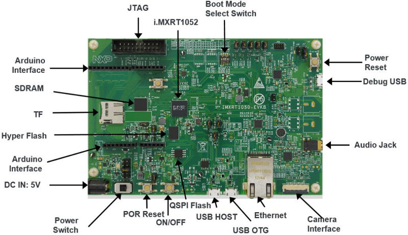

.. _mimxrt1050_evk:

NXP MIMXRT1050-EVK
##################

Overview
********

The i.MX RT1050 is a new processor family featuring NXP's advanced
implementation of the ARM Cortex-M7 Core. It provides high CPU performance and
real-time response.

The i.MX RT1050 provides various memory interfaces, including SDRAM, Raw NAND
FLASH, NOR FLASH, SD/eMMC, Quad SPI, HyperBus and a wide range of other
interfaces for connecting peripherals, such as WLAN, Bluetooth™, GPS, displays,
and camera sensors. As with other i.MX processors, i.MX RT1050 also has rich
audio and video features, including LCD display, basic 2D graphics, camera
interface, SPDIF, and I2S audio interface.

The following document refers to the discontinued MIMXRT1050-EVK board. For the
MIMXRT1050-EVKB board, refer to `Board Revisions`_ section.

Hardware
********

- MIMXRT1052DVL6A MCU (600 MHz, 512 KB TCM)

- Memory

  - 256 KB SDRAM
  - 64 Mbit QSPI Flash
  - 512 Mbit Hyper Flash

- Display

  - LCD connector
  - Touch connector

- Ethernet

  - 10/100 Mbit/s Ethernet PHY

- USB

  - USB 2.0 OTG connector
  - USB 2.0 host connector

- Audio

  - 3.5 mm audio stereo headphone jack
  - Board-mounted microphone
  - Left and right speaker out connectors

- Power

  - 5 V DC jack

- Debug

  - JTAG 20-pin connector
  - OpenSDA with DAPLink

- Sensor

  - FXOS8700CQ 6-axis e-compass
  - CMOS camera sensor interface

- Expansion port

  - Arduino interface

- CAN bus connector

For more information about the MIMXRT1050 SoC and MIMXRT1050-EVK board, see
these references:

- `i.MX RT1050 Website`_
- `i.MX RT1050 Datasheet`_
- `i.MX RT1050 Reference Manual`_
- `MIMXRT1050-EVK Website`_
- `MIMXRT1050-EVK User Guide`_
- `MIMXRT1050-EVK Schematics`_

External Memory
===============

This platform has the following external memories:

+--------------------+------------+-------------------------------------+
| Device             | Controller | Status                              |
+====================+============+=====================================+
| IS42S16160J        | SEMC       | Enabled via device configuration    |
|                    |            | data block, which sets up SEMC at   |
|                    |            | boot time                           |
+--------------------+------------+-------------------------------------+
| S26KS512SDPBHI020  | FLEXSPI    | Enabled via flash configurationn    |
|                    |            | block, which sets up FLEXSPI at     |
|                    |            | boot time.                          |
+--------------------+------------+-------------------------------------+

Supported Features
==================

The mimxrt1050_evk board configuration supports the hardware features listed
below.  For additional features not yet supported, please also refer to the
:ref:`mimxrt1064_evk` , which is the superset board in NXP's i.MX RT10xx family.
NXP prioritizes enabling the superset board with NXP's Full Platform Support for
Zephyr.  Therefore, the mimxrt1064_evk board may have additional features
already supported, which can also be re-used on this mimxrt1050_evk board:

+-----------+------------+-------------------------------------+
| Interface | Controller | Driver/Component                    |
+===========+============+=====================================+
| NVIC      | on-chip    | nested vector interrupt controller  |
+-----------+------------+-------------------------------------+
| SYSTICK   | on-chip    | systick                             |
+-----------+------------+-------------------------------------+
| DISPLAY   | on-chip    | display                             |
+-----------+------------+-------------------------------------+
| GPIO      | on-chip    | gpio                                |
+-----------+------------+-------------------------------------+
| I2C       | on-chip    | i2c                                 |
+-----------+------------+-------------------------------------+
| SDHC      | on-chip    | disk access                         |
+-----------+------------+-------------------------------------+
| SPI       | on-chip    | spi                                 |
+-----------+------------+-------------------------------------+
| UART      | on-chip    | serial port-polling;                |
|           |            | serial port-interrupt               |
+-----------+------------+-------------------------------------+
| ENET      | on-chip    | ethernet                            |
+-----------+------------+-------------------------------------+
| USB       | on-chip    | USB device                          |
+-----------+------------+-------------------------------------+
| ADC       | on-chip    | adc                                 |
+-----------+------------+-------------------------------------+
| GPT       | on-chip    | gpt                                 |
+-----------+------------+-------------------------------------+
| TRNG      | on-chip    | entropy                             |
+-----------+------------+-------------------------------------+
| FLEXSPI   | on-chip    | flash programming                   |
+-----------+------------+-------------------------------------+

The default configuration can be found in the defconfig file:

	``boards/arm/mimxrt1050_evk/mimxrt1050_evk_defconfig``

Other hardware features are not currently supported by the port.

Connections and IOs
===================

The MIMXRT1050 SoC has five pairs of pinmux/gpio controllers.

+---------------+-----------------+---------------------------+
| Name          | Function        | Usage                     |
+===============+=================+===========================+
| GPIO_AD_B0_00 | LPSPI1_SCK      | SPI                       |
+---------------+-----------------+---------------------------+
| GPIO_AD_B0_01 | LPSPI1_SDO      | SPI                       |
+---------------+-----------------+---------------------------+
| GPIO_AD_B0_02 | LPSPI3_SDI/LCD_RST| SPI/LCD Display         |
+---------------+-----------------+---------------------------+
| GPIO_AD_B0_03 | LPSPI3_PCS0     | SPI                       |
+---------------+-----------------+---------------------------+
| GPIO_AD_B0_05 | GPIO            | SD Card                   |
+---------------+-----------------+---------------------------+
| GPIO_AD_B0_09 | GPIO/ENET_RST   | LED                       |
+---------------+-----------------+---------------------------+
| GPIO_AD_B0_10 | GPIO/ENET_INT   | GPIO/Ethernet             |
+---------------+-----------------+---------------------------+
| GPIO_AD_B0_11 | GPIO            | Touch Interrupt           |
+---------------+-----------------+---------------------------+
| GPIO_AD_B0_12 | LPUART1_TX      | UART Console              |
+---------------+-----------------+---------------------------+
| GPIO_AD_B0_13 | LPUART1_RX      | UART Console              |
+---------------+-----------------+---------------------------+
| GPIO_AD_B1_00 | LPI2C1_SCL      | I2C                       |
+---------------+-----------------+---------------------------+
| GPIO_AD_B1_01 | LPI2C1_SDA      | I2C                       |
+---------------+-----------------+---------------------------+
| GPIO_AD_B1_06 | LPUART3_TX      | UART BT HCI               |
+---------------+-----------------+---------------------------+
| GPIO_AD_B1_07 | LPUART3_RX      | UART BT HCI               |
+---------------+-----------------+---------------------------+
| GPIO_AD_B1_11 | ADC             | ADC1 channel 0            |
+---------------+-----------------+---------------------------+
| WAKEUP        | GPIO            | SW0                       |
+---------------+-----------------+---------------------------+
| GPIO_B0_00    | LCD_CLK         | LCD Display               |
+---------------+-----------------+---------------------------+
| GPIO_B0_01    | LCD_ENABLE      | LCD Display               |
+---------------+-----------------+---------------------------+
| GPIO_B0_02    | LCD_HSYNC       | LCD Display               |
+---------------+-----------------+---------------------------+
| GPIO_B0_03    | LCD_VSYNC       | LCD Display               |
+---------------+-----------------+---------------------------+
| GPIO_B0_04    | LCD_DATA00      | LCD Display               |
+---------------+-----------------+---------------------------+
| GPIO_B0_05    | LCD_DATA01      | LCD Display               |
+---------------+-----------------+---------------------------+
| GPIO_B0_06    | LCD_DATA02      | LCD Display               |
+---------------+-----------------+---------------------------+
| GPIO_B0_07    | LCD_DATA03      | LCD Display               |
+---------------+-----------------+---------------------------+
| GPIO_B0_08    | LCD_DATA04      | LCD Display               |
+---------------+-----------------+---------------------------+
| GPIO_B0_09    | LCD_DATA05      | LCD Display               |
+---------------+-----------------+---------------------------+
| GPIO_B0_10    | LCD_DATA06      | LCD Display               |
+---------------+-----------------+---------------------------+
| GPIO_B0_11    | LCD_DATA07      | LCD Display               |
+---------------+-----------------+---------------------------+
| GPIO_B0_12    | LCD_DATA08      | LCD Display               |
+---------------+-----------------+---------------------------+
| GPIO_B0_13    | LCD_DATA09      | LCD Display               |
+---------------+-----------------+---------------------------+
| GPIO_B0_14    | LCD_DATA10      | LCD Display               |
+---------------+-----------------+---------------------------+
| GPIO_B0_15    | LCD_DATA11      | LCD Display               |
+---------------+-----------------+---------------------------+
| GPIO_B1_00    | LCD_DATA12      | LCD Display               |
+---------------+-----------------+---------------------------+
| GPIO_B1_01    | LCD_DATA13      | LCD Display               |
+---------------+-----------------+---------------------------+
| GPIO_B1_02    | LCD_DATA14      | LCD Display               |
+---------------+-----------------+---------------------------+
| GPIO_B1_03    | LCD_DATA15      | LCD Display               |
+---------------+-----------------+---------------------------+
| GPIO_B1_04    | ENET_RX_DATA00  | Ethernet                  |
+---------------+-----------------+---------------------------+
| GPIO_B1_05    | ENET_RX_DATA01  | Ethernet                  |
+---------------+-----------------+---------------------------+
| GPIO_B1_06    | ENET_RX_EN      | Ethernet                  |
+---------------+-----------------+---------------------------+
| GPIO_B1_07    | ENET_TX_DATA00  | Ethernet                  |
+---------------+-----------------+---------------------------+
| GPIO_B1_08    | ENET_TX_DATA01  | Ethernet                  |
+---------------+-----------------+---------------------------+
| GPIO_B1_09    | ENET_TX_EN      | Ethernet                  |
+---------------+-----------------+---------------------------+
| GPIO_B1_10    | ENET_REF_CLK    | Ethernet                  |
+---------------+-----------------+---------------------------+
| GPIO_B1_11    | ENET_RX_ER      | Ethernet                  |
+---------------+-----------------+---------------------------+
| GPIO_B1_12    | GPIO            | SD Card                   |
+---------------+-----------------+---------------------------+
| GPIO_B1_14    | USDHC1_VSELECT  | SD Card                   |
+---------------+-----------------+---------------------------+
| GPIO_B1_15    | BACKLIGHT_CTL   | LCD Display               |
+---------------+-----------------+---------------------------+
| GPIO_EMC_40   | ENET_MDC        | Ethernet                  |
+---------------+-----------------+---------------------------+
| GPIO_EMC_41   | ENET_MDIO       | Ethernet                  |
+---------------+-----------------+---------------------------+
| GPIO_AD_B0_09 | ENET_RST        | Ethernet                  |
+---------------+-----------------+---------------------------+
| GPIO_AD_B0_10 | ENET_INT        | Ethernet                  |
+---------------+-----------------+---------------------------+
| GPIO_SD_B0_00 | USDHC1_CMD/LPSPI1_SCK | SD Card/SPI         |
+---------------+-----------------+---------------------------+
| GPIO_SD_B0_01 | USDHC1_CLK/LPSPI1_PCS0 | SD Card/SPI        |
+---------------+-----------------+---------------------------+
| GPIO_SD_B0_02 | USDHC1_DATA0/LPSPI1_SDO | SD Card/SPI       |
+---------------+-----------------+---------------------------+
| GPIO_SD_B0_03 | USDHC1_DATA1/LPSPI1_SDI | SD Card/SPI       |
+---------------+-----------------+---------------------------+
| GPIO_SD_B0_04 | USDHC1_DATA2    | SD Card                   |
+---------------+-----------------+---------------------------+
| GPIO_SD_B0_05 | USDHC1_DATA3    | SD Card                   |
+---------------+-----------------+---------------------------+
| GPIO_AD_B1_02 | 1588_EVENT2_OUT | 1588                      |
+---------------+-----------------+---------------------------+
| GPIO_AD_B1_03 | 1588_EVENT2_IN  | 1588                      |
+---------------+-----------------+---------------------------+

.. note::
        In order to use the SPI peripheral on this board, resistors R278,
        R279, R280, and R281 must be populated with zero ohm resistors

System Clock
============

The MIMXRT1050 SoC is configured to use SysTick as the system clock source,
running at 600MHz.

When power management is enabled, the 32 KHz low frequency
oscillator on the board will be used as a source for the GPT timer to
generate a system clock. This clock enables lower power states, at the
cost of reduced resolution

Serial Port
===========

The MIMXRT1050 SoC has eight UARTs. ``LPUART1`` is configured for the console,
``LPUART3`` for the Bluetooth Host Controller Interface (BT HCI), and the
remaining are not used.

USB
===

The RT1050 SoC has two USB OTG (USBOTG) controllers that supports both
device and host functions through its micro USB connectors.
Only USB device function is supported in Zephyr at the moment.

Programming and Debugging
*************************

Build and flash applications as usual (see :ref:`build_an_application` and
:ref:`application_run` for more details).

Configuring a Debug Probe
=========================

A debug probe is used for both flashing and debugging the board. This board is
configured by default to use the :ref:`opensda-daplink-onboard-debug-probe`,
however the :ref:`pyocd-debug-host-tools` do not yet support programming the
external flashes on this board so you must reconfigure the board for one of the
following debug probes instead.

Option 1: :ref:`opensda-jlink-onboard-debug-probe` (Recommended)
----------------------------------------------------------------

Install the :ref:`jlink-debug-host-tools` and make sure they are in your search
path.

Follow the instructions in :ref:`opensda-jlink-onboard-debug-probe` to program
the `OpenSDA J-Link MIMXRT1050-EVK-Hyperflash Firmware`_. Check that jumpers
J32 and J33 are **on** (they are on by default when boards ship from the
factory) to ensure SWD signals are connected to the OpenSDA microcontroller.

Follow the instructions in `Enable QSPI flash support in SEGGER JLink`_
in order to support your EVK if you have modified it to boot from QSPI NOR
flash as specified by NXP AN12108.

Option 2: :ref:`jlink-external-debug-probe`
-------------------------------------------

Install the :ref:`jlink-debug-host-tools` and make sure they are in your search
path.

Attach a J-Link 20-pin connector to J21. Check that jumpers J32 and J33 are
**off** (they are on by default when boards ship from the factory) to ensure
SWD signals are disconnected from the OpenSDA microcontroller.

Configuring a Console
=====================

Regardless of your choice in debug probe, we will use the OpenSDA
microcontroller as a usb-to-serial adapter for the serial console. Check that
jumpers J30 and J31 are **on** (they are on by default when boards ship from
the factory) to connect UART signals to the OpenSDA microcontroller.

Connect a USB cable from your PC to J28.

Use the following settings with your serial terminal of choice (minicom, putty,
etc.):

- Speed: 115200
- Data: 8 bits
- Parity: None
- Stop bits: 1

Flashing
========

Here is an example for the :ref:`hello_world` application.

.. zephyr-app-commands::
   :zephyr-app: samples/hello_world
   :board: mimxrt1050_evk
   :goals: flash

Open a serial terminal, reset the board (press the SW4 button), and you should
see the following message in the terminal:

.. code-block:: console

   ***** Booting Zephyr OS v1.14.0-rc1 *****
   Hello World! mimxrt1050_evk

Debugging
=========

Here is an example for the :ref:`hello_world` application.

.. zephyr-app-commands::
   :zephyr-app: samples/hello_world
   :board: mimxrt1050_evk
   :goals: debug

Open a serial terminal, step through the application in your debugger, and you
should see the following message in the terminal:

.. code-block:: console

   ***** Booting Zephyr OS v1.14.0-rc1 *****
   Hello World! mimxrt1050_evk

Troubleshooting
===============

If the debug probe fails to connect with the following error, it's possible
that the boot header in HyperFlash is invalid or corrupted. The boot header is
configured by :kconfig:option:`CONFIG_NXP_IMX_RT_BOOT_HEADER`.

.. code-block:: console

   Remote debugging using :2331
   Remote communication error.  Target disconnected.: Connection reset by peer.
   "monitor" command not supported by this target.
   "monitor" command not supported by this target.
   You can't do that when your target is `exec'
   (gdb) Could not connect to target.
   Please check power, connection and settings.

You can fix it by erasing and reprogramming the HyperFlash with the following
steps:

#. Set the SW7 DIP switches to ON-ON-ON-OFF to prevent booting from HyperFlash.

#. Reset by pressing SW4

#. Run ``west debug`` or ``west flash`` again with a known working Zephyr
   application.

#. Set the SW7 DIP switches to OFF-ON-ON-OFF to boot from HyperFlash.

#. Reset by pressing SW4

Board Revisions
***************

The original MIMXRT1050-EVK (rev A0) board was updated with a newer
MIMXRT1050-EVKB (rev A1) board, with these major hardware differences:

- SoC changed from MIMXRT1052DVL6\ **A** to MIMXRT1052DVL6\ **B**
- Hardware bug fixes for: power, interfaces, and memory
- Arduino headers included

For more details, please see the following `NXP i.MXRT1050 A0 to A1 Migration Guide`_.

Current Zephyr build supports the new MIMXRT1050-EVKB

.. _MIMXRT1050-EVK Website:
   https://www.nxp.com/products/microcontrollers-and-processors/arm-based-processors-and-mcus/i.mx-applications-processors/i.mx-rt-series/i.mx-rt1050-evaluation-kit:MIMXRT1050-EVK

.. _MIMXRT1050-EVK User Guide:
   https://www.nxp.com/webapp/Download?colCode=IMXRT1050EVKBHUG

.. _MIMXRT1050-EVK Schematics:
   https://www.nxp.com/webapp/Download?colCode=MIMXRT1050-EVK-DESIGNFILES

.. _i.MX RT1050 Website:
   https://www.nxp.com/products/microcontrollers-and-processors/arm-based-processors-and-mcus/i.mx-applications-processors/i.mx-rt-series/i.mx-rt1050-crossover-processor-with-arm-cortex-m7-core:i.MX-RT1050

.. _i.MX RT1050 Datasheet:
   https://www.nxp.com/docs/en/data-sheet/IMXRT1050CEC.pdf

.. _i.MX RT1050 Reference Manual:
   https://www.nxp.com/docs/en/reference-manual/IMXRT1050RM.pdf

.. _OpenSDA J-Link MIMXRT1050-EVK-Hyperflash Firmware:
   https://www.segger.com/downloads/jlink/OpenSDA_MIMXRT1050-EVK-Hyperflash

.. _NXP i.MXRT1050 A0 to A1 Migration Guide:
   https://www.nxp.com/docs/en/nxp/application-notes/AN12146.pdf

.. _Enable QSPI flash support in SEGGER JLink:
   https://wiki.segger.com/i.MXRT1050#QSPI_flash
