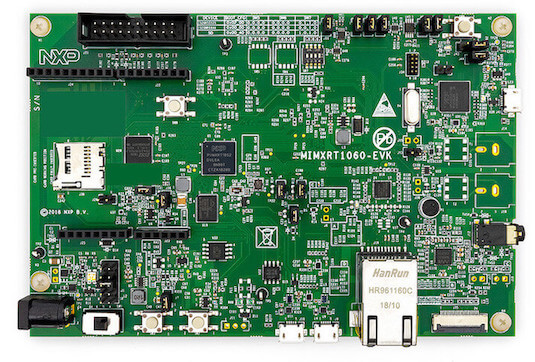

.. _mimxrt1060_evk:

NXP MIMXRT1060-EVK
##################

Overview
********

The i.MX RT1060 adds to the industry's first crossover
processor series and expands the i.MX RT series to three scalable families.

The i.MX RT1060 doubles the On-Chip SRAM to 1MB while keeping pin-to-pin
compatibility with i.MX RT1050. This series introduces additional features
ideal for real-time applications such as High-Speed GPIO, CAN-FD, and
synchronous parallel NAND/NOR/PSRAM controller. The i.MX RT1060 runs on the
Arm® Cortex-M7® core up to 600 MHz.

Hardware
********

- MIMXRT1062DVL6A MCU (600 MHz, 1024 KB on-chip memory)

- Memory

  - 256 Mbit SDRAM
  - 64 Mbit QSPI Flash
  - 512 Mbit Hyper Flash
  - TF socket for SD card

- Display

  - LCD connector

- Ethernet

  - 10/100 Mbit/s Ethernet PHY

- USB

  - USB 2.0 OTG connector
  - USB 2.0 host connector

- Audio

  - 3.5 mm audio stereo headphone jack
  - Board-mounted microphone
  - Left and right speaker out connectors

- Power

  - 5 V DC jack

- Debug

  - JTAG 20-pin connector
  - OpenSDA with DAPLink

- Sensor

  - FXOS8700CQ 6-axis e-compass
  - CMOS camera sensor interface

- Expansion port

  - Arduino interface

- CAN bus connector

For more information about the MIMXRT1060 SoC and MIMXRT1060-EVK board, see
these references:

- `i.MX RT1060 Website`_
- `i.MX RT1060 Datasheet`_
- `i.MX RT1060 Reference Manual`_
- `MIMXRT1060-EVK Website`_
- `MIMXRT1060-EVK User Guide`_
- `MIMXRT1060-EVK Schematics`_

Supported Features
==================

The mimxrt1060_evk board configuration supports the hardware features listed
below.  For additional features not yet supported, please also refer to the
:ref:`mimxrt1064_evk` , which is the superset board in NXP's i.MX RT10xx family.
NXP prioritizes enabling the superset board with NXP's Full Platform Support for
Zephyr.  Therefore, the mimxrt1064_evk board may have additional features
already supported, which can also be re-used on this mimxrt1060_evk board:

+-----------+------------+-------------------------------------+
| Interface | Controller | Driver/Component                    |
+===========+============+=====================================+
| NVIC      | on-chip    | nested vector interrupt controller  |
+-----------+------------+-------------------------------------+
| SYSTICK   | on-chip    | systick                             |
+-----------+------------+-------------------------------------+
| DISPLAY   | on-chip    | display                             |
+-----------+------------+-------------------------------------+
| FLASH     | on-chip    | QSPI flash                          |
+-----------+------------+-------------------------------------+
| GPIO      | on-chip    | gpio                                |
+-----------+------------+-------------------------------------+
| SPI       | on-chip    | spi                                 |
+-----------+------------+-------------------------------------+
| I2C       | on-chip    | i2c                                 |
+-----------+------------+-------------------------------------+
| WATCHDOG  | on-chip    | watchdog                            |
+-----------+------------+-------------------------------------+
| SDHC      | on-chip    | disk access                         |
+-----------+------------+-------------------------------------+
| UART      | on-chip    | serial port-polling;                |
|           |            | serial port-interrupt               |
+-----------+------------+-------------------------------------+
| ENET      | on-chip    | ethernet                            |
+-----------+------------+-------------------------------------+
| USB       | on-chip    | USB device                          |
+-----------+------------+-------------------------------------+
| CAN       | on-chip    | can                                 |
+-----------+------------+-------------------------------------+
| DMA       | on-chip    | dma                                 |
+-----------+------------+-------------------------------------+
| ADC       | on-chip    | adc                                 |
+-----------+------------+-------------------------------------+
| SAI       | on-chip    | i2s                                 |
+-----------+------------+-------------------------------------+
| GPT       | on-chip    | gpt                                 |
+-----------+------------+-------------------------------------+
| TRNG      | on-chip    | entropy                             |
+-----------+------------+-------------------------------------+
| FLEXSPI   | on-chip    | flash programming                   |
+-----------+------------+-------------------------------------+

The default configuration can be found in the defconfig file:
``boards/arm/mimxrt1060_evk/mimxrt1060_evk_defconfig``

Other hardware features are not currently supported by the port.

Connections and I/Os
====================

The MIMXRT1060 SoC has five pairs of pinmux/gpio controllers.

+---------------+-----------------+---------------------------+
| Name          | Function        | Usage                     |
+===============+=================+===========================+
| GPIO_AD_B0_00 | LPSPI1_SCK      | SPI                       |
+---------------+-----------------+---------------------------+
| GPIO_AD_B0_01 | LPSPI1_SDO      | SPI                       |
+---------------+-----------------+---------------------------+
| GPIO_AD_B0_02 | LPSPI3_SDI/LCD_RST| SPI/LCD Display         |
+---------------+-----------------+---------------------------+
| GPIO_AD_B0_03 | LPSPI3_PCS0     | SPI                       |
+---------------+-----------------+---------------------------+
| GPIO_AD_B0_05 | GPIO            | SD Card                   |
+---------------+-----------------+---------------------------+
| GPIO_AD_B0_09 | GPIO/ENET_RST   | LED                       |
+---------------+-----------------+---------------------------+
| GPIO_AD_B0_10 | GPIO/ENET_INT   | GPIO/Ethernet             |
+---------------+-----------------+---------------------------+
| GPIO_AD_B0_11 | GPIO            | Touch Interrupt           |
+---------------+-----------------+---------------------------+
| GPIO_AD_B0_12 | LPUART1_TX      | UART Console              |
+---------------+-----------------+---------------------------+
| GPIO_AD_B0_13 | LPUART1_RX      | UART Console              |
+---------------+-----------------+---------------------------+
| GPIO_AD_B1_00 | LPI2C1_SCL      | I2C                       |
+---------------+-----------------+---------------------------+
| GPIO_AD_B1_01 | LPI2C1_SDA      | I2C                       |
+---------------+-----------------+---------------------------+
| GPIO_AD_B1_06 | LPUART3_TX      | UART BT HCI               |
+---------------+-----------------+---------------------------+
| GPIO_AD_B1_07 | LPUART3_RX      | UART BT HCI               |
+---------------+-----------------+---------------------------+
| WAKEUP        | GPIO            | SW0                       |
+---------------+-----------------+---------------------------+
| GPIO_B0_00    | LCD_CLK         | LCD Display               |
+---------------+-----------------+---------------------------+
| GPIO_B0_01    | LCD_ENABLE      | LCD Display               |
+---------------+-----------------+---------------------------+
| GPIO_B0_02    | LCD_HSYNC       | LCD Display               |
+---------------+-----------------+---------------------------+
| GPIO_B0_03    | LCD_VSYNC       | LCD Display               |
+---------------+-----------------+---------------------------+
| GPIO_B0_04    | LCD_DATA00      | LCD Display               |
+---------------+-----------------+---------------------------+
| GPIO_B0_05    | LCD_DATA01      | LCD Display               |
+---------------+-----------------+---------------------------+
| GPIO_B0_06    | LCD_DATA02      | LCD Display               |
+---------------+-----------------+---------------------------+
| GPIO_B0_07    | LCD_DATA03      | LCD Display               |
+---------------+-----------------+---------------------------+
| GPIO_B0_08    | LCD_DATA04      | LCD Display               |
+---------------+-----------------+---------------------------+
| GPIO_B0_09    | LCD_DATA05      | LCD Display               |
+---------------+-----------------+---------------------------+
| GPIO_B0_10    | LCD_DATA06      | LCD Display               |
+---------------+-----------------+---------------------------+
| GPIO_B0_11    | LCD_DATA07      | LCD Display               |
+---------------+-----------------+---------------------------+
| GPIO_B0_12    | LCD_DATA08      | LCD Display               |
+---------------+-----------------+---------------------------+
| GPIO_B0_13    | LCD_DATA09      | LCD Display               |
+---------------+-----------------+---------------------------+
| GPIO_B0_14    | LCD_DATA10      | LCD Display               |
+---------------+-----------------+---------------------------+
| GPIO_B0_15    | LCD_DATA11      | LCD Display               |
+---------------+-----------------+---------------------------+
| GPIO_B1_00    | LCD_DATA12      | LCD Display               |
+---------------+-----------------+---------------------------+
| GPIO_B1_01    | LCD_DATA13      | LCD Display               |
+---------------+-----------------+---------------------------+
| GPIO_B1_02    | LCD_DATA14      | LCD Display               |
+---------------+-----------------+---------------------------+
| GPIO_B1_03    | LCD_DATA15      | LCD Display               |
+---------------+-----------------+---------------------------+
| GPIO_B1_04    | ENET_RX_DATA00  | Ethernet                  |
+---------------+-----------------+---------------------------+
| GPIO_B1_05    | ENET_RX_DATA01  | Ethernet                  |
+---------------+-----------------+---------------------------+
| GPIO_B1_06    | ENET_RX_EN      | Ethernet                  |
+---------------+-----------------+---------------------------+
| GPIO_B1_07    | ENET_TX_DATA00  | Ethernet                  |
+---------------+-----------------+---------------------------+
| GPIO_B1_08    | ENET_TX_DATA01  | Ethernet                  |
+---------------+-----------------+---------------------------+
| GPIO_B1_09    | ENET_TX_EN      | Ethernet                  |
+---------------+-----------------+---------------------------+
| GPIO_B1_10    | ENET_REF_CLK    | Ethernet                  |
+---------------+-----------------+---------------------------+
| GPIO_B1_11    | ENET_RX_ER      | Ethernet                  |
+---------------+-----------------+---------------------------+
| GPIO_B1_12    | GPIO            | SD Card                   |
+---------------+-----------------+---------------------------+
| GPIO_B1_14    | USDHC1_VSELECT  | SD Card                   |
+---------------+-----------------+---------------------------+
| GPIO_B1_15    | BACKLIGHT_CTL   | LCD Display               |
+---------------+-----------------+---------------------------+
| GPIO_EMC_40   | ENET_MDC        | Ethernet                  |
+---------------+-----------------+---------------------------+
| GPIO_EMC_41   | ENET_MDIO       | Ethernet                  |
+---------------+-----------------+---------------------------+
| GPIO_AD_B0_09 | ENET_RST        | Ethernet                  |
+---------------+-----------------+---------------------------+
| GPIO_AD_B0_10 | ENET_INT        | Ethernet                  |
+---------------+-----------------+---------------------------+
| GPIO_SD_B0_00 | USDHC1_CMD/LPSPI1_SCK | SD Card/SPI         |
+---------------+-----------------+---------------------------+
| GPIO_SD_B0_01 | USDHC1_CLK/LPSPI1_PCS0 | SD Card/SPI        |
+---------------+-----------------+---------------------------+
| GPIO_SD_B0_02 | USDHC1_DATA0/LPSPI1_SDO | SD Card/SPI       |
+---------------+-----------------+---------------------------+
| GPIO_SD_B0_03 | USDHC1_DATA1/LPSPI1_SDI | SD Card/SPI       |
+---------------+-----------------+---------------------------+
| GPIO_SD_B0_04 | USDHC1_DATA2    | SD Card                   |
+---------------+-----------------+---------------------------+
| GPIO_SD_B0_05 | USDHC1_DATA3    | SD Card                   |
+---------------+-----------------+---------------------------+
| GPIO_AD_B1_11 | ADC             | ADC1 Channel 0            |
+---------------+-----------------+---------------------------+
| GPIO_AD_B1_10 | ADC             | ADC1 Channel 15           |
+---------------+-----------------+---------------------------+
| GPIO_AD_B1_09 | SAI1_MCLK       | I2S                       |
+---------------+-----------------+---------------------------+
| GPIO_AD_B1_12 | SAI1_RX         | I2S                       |
+---------------+-----------------+---------------------------+
| GPIO_AD_B1_13 | SAI1_TX         | I2S                       |
+---------------+-----------------+---------------------------+
| GPIO_AD_B1_14 | SAI1_TX_BCLK    | I2S                       |
+---------------+-----------------+---------------------------+
| GPIO_AD_B1_15 | SAI1_TX_SYNC    | I2S                       |
+---------------+-----------------+---------------------------+
| GPIO_AD_B1_02 | 1588_EVENT2_OUT | 1588                      |
+---------------+-----------------+---------------------------+
| GPIO_AD_B1_03 | 1588_EVENT2_IN  | 1588                      |
+---------------+-----------------+---------------------------+

.. note::
        In order to use the SPI peripheral on this board, resistors R278, R279,
        R280 and R281 must be populated with zero ohm resistors.

System Clock
============

The MIMXRT1060 SoC is configured to use the 32 KHz low frequency oscillator on
the board as a source for the GPT timer to generate a system clock.

Serial Port
===========

The MIMXRT1060 SoC has eight UARTs. ``LPUART1`` is configured for the console,
``LPUART3`` for the Bluetooth Host Controller Interface (BT HCI), and the
remaining are not used.

Programming and Debugging
*************************

Build and flash applications as usual (see :ref:`build_an_application` and
:ref:`application_run` for more details).

Configuring a Debug Probe
=========================

A debug probe is used for both flashing and debugging the board. This board is
configured by default to use the :ref:`opensda-daplink-onboard-debug-probe`,
however the :ref:`pyocd-debug-host-tools` do not yet support programming the
external flashes on this board so you must reconfigure the board for one of the
following debug probes instead.

.. _Using J-Link RT1060:

Using J-Link
---------------------------------

Install the :ref:`jlink-debug-host-tools` and make sure they are in your search
path.

There are two options: the onboard debug circuit can be updated with Segger
J-Link firmware, or :ref:`jlink-external-debug-probe` can be attached to the
EVK. See `Using J-Link with MIMXRT1060-EVK or MIMXRT1064-EVK`_ or
`Using J-Link with MIMXRT1060-EVKB`_ for more details.

Configuring a Console
=====================

Regardless of your choice in debug probe, we will use the OpenSDA
microcontroller as a usb-to-serial adapter for the serial console. Check that
jumpers J45 and J46 are **on** (they are on by default when boards ship from
the factory) to connect UART signals to the OpenSDA microcontroller.

Connect a USB cable from your PC to J41.

Use the following settings with your serial terminal of choice (minicom, putty,
etc.):

- Speed: 115200
- Data: 8 bits
- Parity: None
- Stop bits: 1

Using SWO
---------
SWO can be used as a logging backend, by setting ``CONFIG_LOG_BACKEND_SWO=y``.
Your SWO viewer should be configured with a CPU frequency of 132MHz, and
SWO frequency of 7500KHz.

Flashing
========

Here is an example for the :ref:`hello_world` application.

.. zephyr-app-commands::
   :zephyr-app: samples/hello_world
   :board: mimxrt1060_evk
   :goals: flash

Open a serial terminal, reset the board (press the SW9 button), and you should
see the following message in the terminal:

.. code-block:: console

   ***** Booting Zephyr OS v1.14.0-rc1 *****
   Hello World! mimxrt1060_evk

Debugging
=========

Here is an example for the :ref:`hello_world` application.

.. zephyr-app-commands::
   :zephyr-app: samples/hello_world
   :board: mimxrt1060_evk
   :goals: debug

Open a serial terminal, step through the application in your debugger, and you
should see the following message in the terminal:

.. code-block:: console

   ***** Booting Zephyr OS v1.14.0-rc1 *****
   Hello World! mimxrt1060_evk

Troubleshooting
===============

If the debug probe fails to connect with the following error, it's possible
that the boot header in QSPI flash is invalid or corrupted. The boot header is
configured by :kconfig:option:`CONFIG_NXP_IMX_RT_BOOT_HEADER`.

.. code-block:: console

   Remote debugging using :2331
   Remote communication error.  Target disconnected.: Connection reset by peer.
   "monitor" command not supported by this target.
   "monitor" command not supported by this target.
   You can't do that when your target is `exec'
   (gdb) Could not connect to target.
   Please check power, connection and settings.

You can fix it by erasing and reprogramming the QSPI flash with the following
steps:

#. Set the SW7 DIP switches to ON-OFF-ON-OFF to prevent booting from QSPI flash.

#. Reset by pressing SW9

#. Run ``west debug`` or ``west flash`` again with a known working Zephyr
   application.

#. Set the SW7 DIP switches to OFF-OFF-ON-OFF to boot from QSPI flash.

#. Reset by pressing SW9

If the west flash or debug commands fail, and the command hangs while executing
runners.jlink, confirm the J-Link debug probe is configured, powered, and
connected to the EVK properly. See :ref:`Using J-Link RT1060` for more details.

.. _MIMXRT1060-EVK Website:
   https://www.nxp.com/design/development-boards/i-mx-evaluation-and-development-boards/i-mx-rt1060-evaluation-kit:MIMXRT1060-EVKB

.. _MIMXRT1060-EVK User Guide:
   https://www.nxp.com/webapp/Download?colCode=MIMXRT10601064EKBHUG

.. _MIMXRT1060-EVK Schematics:
   https://www.nxp.com/webapp/Download?colCode=MIMXRT1060-EVK-DESIGNFILE-A3

.. _i.MX RT1060 Website:
   https://www.nxp.com/products/processors-and-microcontrollers/arm-based-processors-and-mcus/i.mx-applications-processors/i.mx-rt-series/i.mx-rt1060-crossover-processor-with-arm-cortex-m7-core:i.MX-RT1060

.. _i.MX RT1060 Datasheet:
   https://www.nxp.com/docs/en/nxp/data-sheets/IMXRT1060CEC.pdf

.. _i.MX RT1060 Reference Manual:
   https://www.nxp.com/webapp/Download?colCode=IMXRT1060RM

.. _Using J-Link with MIMXRT1060-EVK or MIMXRT1064-EVK:
   https://community.nxp.com/t5/i-MX-RT-Knowledge-Base/Using-J-Link-with-MIMXRT1060-EVK-or-MIMXRT1064-EVK/ta-p/1281149

.. _Using J-Link with MIMXRT1060-EVKB:
   https://community.nxp.com/t5/i-MX-RT-Knowledge-Base/Using-J-Link-with-MIMXRT1060-EVKB/ta-p/1452717
