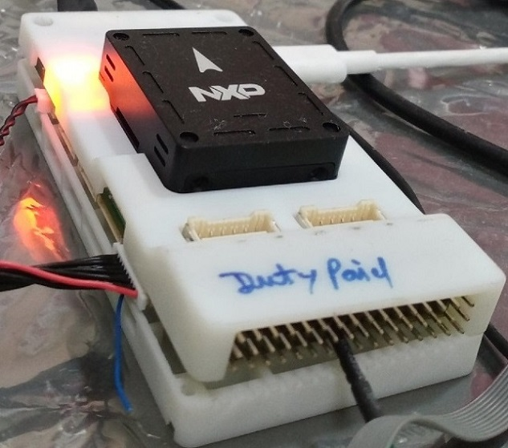

.. _fmurt6:

NXP FMURT6
##################

Overview
********

The MIMXRT1062_FMURT6 adds to the industry's crossover
processor series and expands the i.MX RT series to three scalable families.

The i.MX RT1062 doubles the On-Chip SRAM to 1MB while keeping pin-to-pin
compatibility with i.MX RT1050. This series introduces additional features
ideal for real-time applications such as High-Speed GPIO, CAN-FD, and
synchronous parallel NAND/NOR/PSRAM controller. The i.MX RT1062 runs on the
Arm® Cortex-M7® core up to 600 MHz.

Hardware
********

- MIMXRT1062DVL6B MCU (600 MHz, 1024 KB on-chip memory)

- Memory

  - 256 Mbit SDRAM
  - 512 Mbit Hyper Flash
  - TF socket for SD card

- Ethernet

  - 10/100 Mbit/s Ethernet PHY

- USB

  - USB 2.0 OTG connector
  - USB 2.0 host connector

- Audio

  - 3.5 mm audio stereo headphone jack
  - Board-mounted microphone
  - Left and right speaker out connectors

- Power

  - 5 V DC jack

- Debug

  - JTAG 20-pin connector
  - OpenSDA with DAPLink

- Sensor

  - BMI088 6-axis e-compass

- Expansion port

  - Arduino interface

- CAN bus connector

For more information about the MIMXRT1062 SoC and MIMXRT1062-FMURT6 board, see
these references:

- `i.MX RT1060 Website`_
- `i.MX RT1060 Reference Manual`_
- `MIMXRT1062-FMURT6 User Guide`_
- `MIMXRT1062-FMURT6 Schematics`_

Supported Features
==================

The mimxrt1062_fmurt6 board configuration supports the hardware features listed
below.  For additional features not yet supported, please also refer to the
:ref:`mimxrt1064_evk` , which is the superset board in NXP's i.MX RT10xx family.
NXP prioritizes enabling the superset board with NXP's Full Platform Support for
Zephyr.  Therefore, the mimxrt1064_evk board may have additional features
already supported, which can also be re-used on this mimxrt1060_evk board:

+-----------+------------+-------------------------------------+
| Interface | Controller | Driver/Component                    |
+===========+============+=====================================+
| NVIC      | on-chip    | nested vector interrupt controller  |
+-----------+------------+-------------------------------------+
| SYSTICK   | on-chip    | systick                             |
+-----------+------------+-------------------------------------+
| DISPLAY   | on-chip    | display                             |
+-----------+------------+-------------------------------------+
| FLASH     | on-chip    | QSPI hyper flash                    |
+-----------+------------+-------------------------------------+
| GPIO      | on-chip    | gpio                                |
+-----------+------------+-------------------------------------+
| SPI       | on-chip    | spi                                 |
+-----------+------------+-------------------------------------+
| I2C       | on-chip    | i2c                                 |
+-----------+------------+-------------------------------------+
| ADC       | on-chip    | adc                                 |
+-----------+------------+-------------------------------------+
| WATCHDOG  | on-chip    | watchdog                            |
+-----------+------------+-------------------------------------+
| PWM       | on-chip    | pwm                                 |
+-----------+------------+-------------------------------------+
| UART      | on-chip    | serial port-polling;                |
|           |            | serial port-interrupt               |
+-----------+------------+-------------------------------------+
| ENET      | on-chip    | ethernet                            |
+-----------+------------+-------------------------------------+
| USB       | on-chip    | USB device                          |
+-----------+------------+-------------------------------------+
| CAN       | on-chip    | can                                 |
+-----------+------------+-------------------------------------+
| DMA       | on-chip    | dma                                 |
+-----------+------------+-------------------------------------+
| GPT       | on-chip    | gpt                                 |
+-----------+------------+-------------------------------------+
| FLEXSPI   | on-chip    | flash programming                   |
+-----------+------------+-------------------------------------+

The default configuration can be found in the defconfig file:
``boards/arm/mimxrt1062_fmurt6/mimxrt1062_fmurt6_defconfig``

Other hardware features are not currently supported by the port.

Connections and I/Os
====================

The MIMXRT1062 SoC has five pairs of pinmux/gpio controllers.

+---------------+-----------------+---------------------------+
| Name          | Function        | Usage                     |
+===============+=================+===========================+
| GPIO_AD_B1_08 | FLEXCAN1 TX     | CAN                       |
+---------------+-----------------+---------------------------+
| GPIO_B0_03    | FLEXCAN1 RX     | CAN                       |
+---------------+-----------------+---------------------------+
| GPIO_AD_B0_06 | PWM2A0          | PWM                       |
+---------------+-----------------+---------------------------+
| GPIO_EMC_08   | PWM2A1          | PWM                       |
+---------------+-----------------+---------------------------+
| GPIO_EMC_10   | PWM2A2          | PWM                       |
+---------------+-----------------+---------------------------+
| GPIO_AD_B0_09 | PWM2A3          | PWM                       |
+---------------+-----------------+---------------------------+
| GPIO_EMC_31   | LPUART7_TX      | UART Console              |
+---------------+-----------------+---------------------------+
| GPIO_EMC_32   | LPUART7_RX      | UART Console              |
+---------------+-----------------+---------------------------+
| GPIO_B0_04    | LPI2C2_SCL      | I2C                       |
+---------------+-----------------+---------------------------+
| GPIO_B0_05    | LPI2C2_SDA      | I2C                       |
+---------------+-----------------+---------------------------+
| GPIO_AD_B1_00 | LPI2C1_SCL      | I2C                       |
+---------------+-----------------+---------------------------+
| GPIO_AD_B1_01 | LPI2C1_SDA      | I2C                       |
+---------------+-----------------+---------------------------+
| GPIO_AD_B0_12 | LPI2C4_SCL      | I2C                       |
+---------------+-----------------+---------------------------+
| GPIO_AD_B0_13 | LPI2C4_SDA      | I2C                       |
+---------------+-----------------+---------------------------+
| WAKEUP        | GPIO            | SW0                       |
+---------------+-----------------+---------------------------+
| GPIO_B1_01    | ENET_RX_DATA00  | Ethernet                  |
+---------------+-----------------+---------------------------+
| GPIO_B1_02    | ENET_RX_DATA01  | Ethernet                  |
+---------------+-----------------+---------------------------+
| GPIO_B1_03    | ENET_RX_EN      | Ethernet                  |
+---------------+-----------------+---------------------------+
| GPIO_B0_12    | ENET_TX_DATA00  | Ethernet                  |
+---------------+-----------------+---------------------------+
| GPIO_B0_13    | ENET_TX_DATA01  | Ethernet                  |
+---------------+-----------------+---------------------------+
| GPIO_B0_14    | ENET_TX_EN      | Ethernet                  |
+---------------+-----------------+---------------------------+
| GPIO_B0_15    | ENET_REF_CLK    | Ethernet                  |
+---------------+-----------------+---------------------------+
| GPIO_B1_00    | ENET_RX_ER      | Ethernet                  |
+---------------+-----------------+---------------------------+
| GPIO_B1_12    | GPIO            | SD Card                   |
+---------------+-----------------+---------------------------+
| GPIO_B1_14    | USDHC1_VSELECT  | SD Card                   |
+---------------+-----------------+---------------------------+
| GPIO_EMC_40   | ENET_MDC        | Ethernet                  |
+---------------+-----------------+---------------------------+
| GPIO_B0_01    | ENET_MDIO       | Ethernet                  |
+---------------+-----------------+---------------------------+
| GPIO_SD_B0_00 | USDHC1_CMD      | SD Card                   |
+---------------+-----------------+---------------------------+
| GPIO_SD_B0_01 | USDHC1_CLK      | SD Card                   |
+---------------+-----------------+---------------------------+
| GPIO_SD_B0_02 | USDHC1_DATA0    | SD Card                   |
+---------------+-----------------+---------------------------+
| GPIO_SD_B0_03 | USDHC1_DATA1    | SD Card                   |
+---------------+-----------------+---------------------------+
| GPIO_SD_B0_04 | USDHC1_DATA2    | SD Card                   |
+---------------+-----------------+---------------------------+
| GPIO_SD_B0_05 | USDHC1_DATA3    | SD Card                   |
+---------------+-----------------+---------------------------+
| GPIO_EMC_27   | LPSPI1_SCK      | SPI                       |
+---------------+-----------------+---------------------------+
| GPIO_EMC_28   | LPSPI1_SDO      | SPI                       |
+---------------+-----------------+---------------------------+
| GPIO_EMC_29   | LPSPI1_SDI      | SPI                       |
+---------------+-----------------+---------------------------+
| GPIO_EMC_00   | LPSPI2_SCK      | SPI                       |
+---------------+-----------------+---------------------------+
| GPIO_EMC_02   | LPSPI2_SDO      | SPI                       |
+---------------+-----------------+---------------------------+
| GPIO_EMC_03   | LPSPI2_SDI      | SPI                       |
+---------------+-----------------+---------------------------+
| GPIO_AD_B1_15 | LPSPI3_SCK      | SPI                       |
+---------------+-----------------+---------------------------+
| GPIO_AD_B1_14 | LPSPI3_SDO      | SPI                       |
+---------------+-----------------+---------------------------+
| GPIO_AD_B1_13 | LPSPI3_SDI      | SPI                       |
+---------------+-----------------+---------------------------+
| GPIO_AD_B1_11 | ADC             | ADC1 Channel 0            |
+---------------+-----------------+---------------------------+
| GPIO_AD_B1_09 | ADC             | ADC1 Channel 14           |
+---------------+-----------------+---------------------------+
| GPIO_AD_B0_15 | ADC             | ADC1 Channel 4            |
+---------------+-----------------+---------------------------+
| GPIO_AD_B1_02 | UART2_TX_GPS1   | UART GPS                  |
+---------------+-----------------+---------------------------+
| GPIO_AD_B1_03 | UART2_RX_GPS1   | UART GPS                  |
+---------------+-----------------+---------------------------+

System Clock
============

The MIMXRT1062 SoC is configured to use SysTick as the system clock source,
running at 600MHz.

When power management is enabled, the 32 KHz low frequency
oscillator on the board will be used as a source for the GPT timer to
generate a system clock. This clock enables lower power states, at the
cost of reduced resolution

Serial Port
===========

The MIMXRT1062 SoC has eight UARTs. ``LPUART7`` is configured for the console,
``LPUART8 and 2`` for GPS/MAG, ``LPUART3 and 4`` for Telemetry and the remaining are not used.

Programming and Debugging
*************************

Build and flash applications as usual (see :ref:`build_an_application` and
:ref:`application_run` for more details).

Configuring a Debug Probe
=========================

A debug probe is used for both flashing and debugging the board. This board is
configured by default to use the :ref:`opensda-daplink-onboard-debug-probe`,
however the :ref:`pyocd-debug-host-tools` do not yet support programming the
external flashes on this board so you must reconfigure the board for one of the
following debug probes instead.

.. _Using J-Link RT1062:

Using J-Link
---------------------------------

Install the :ref:`jlink-debug-host-tools` and make sure they are in your search
path.

For Hyperflash support on i.MxRT106x use JLink_V780 or above.

There are two options: the onboard debug circuit can be updated with Segger
J-Link firmware, or :ref:`jlink-external-debug-probe` can be attached to the
FMURT6 on J23 FMU Debug Port.
Run JLink.exe and choose device / core as MIMXRT106A-ALEXA.

Configuring a Console
=====================

Regardless of your choice in debug probe, we will use the OpenSDA
microcontroller as a usb-to-serial adapter for the serial console.

Connect a USB cable from your PC to PixHawk debug adapter.

Use the following settings with your serial terminal of choice (minicom, putty,
etc.):

- Speed: 115200
- Data: 8 bits
- Parity: None
- Stop bits: 1

Using SWO
---------
SWO can be used as a logging backend, by setting ``CONFIG_LOG_BACKEND_SWO=y``.
Your SWO viewer should be configured with a CPU frequency of 132MHz, and
SWO frequency of 7500KHz.

Flashing
========

Here is an example for the :ref:`hello_world` application.

.. zephyr-app-commands::
   :zephyr-app: samples/hello_world
   :board: mimxrt1062_fmurt6
   :goals: flash

Open a serial terminal, reset the board (press the SW9 button), and you should
see the following message in the terminal:

.. code-block:: console

   ***** Booting Zephyr OS v3.20.0 *****
   Hello World! mimxrt1062_fmurt6

Debugging
=========

Here is an example for the :ref:`hello_world` application.

.. zephyr-app-commands::
   :zephyr-app: samples/hello_world
   :board: mimxrt1062_fmurt6
   :goals: debug

Open a serial terminal, step through the application in your debugger, and you
should see the following message in the terminal:

.. code-block:: console

   ***** Booting Zephyr OS v3.20.0 *****
   Hello World! mimxrt1062_fmurt6

Troubleshooting
===============

If the west flash or debug commands fail, and the command hangs while executing
runners.jlink, confirm the J-Link debug probe is configured, powered, and
connected to the FMURT6 properly.

.. _MIMXRT1062-FMURT6 Website:
   https://www.nxp.com/part/RDDRONE-FMURT6#

.. _MIMXRT1062-FMURT6 User Guide:
   https://docs.px4.io/master/en/

.. _MIMXRT1062-FMURT6 Schematics:
   https://github.com/NXPHoverGames/NXP-FMUMRT6

.. _i.MX RT1060 Website:
   https://www.nxp.com/products/processors-and-microcontrollers/arm-based-processors-and-mcus/i.mx-applications-processors/i.mx-rt-series/i.mx-rt1060-crossover-processor-with-arm-cortex-m7-core:i.MX-RT1060

.. _i.MX RT1060 Datasheet:
   https://www.nxp.com/docs/en/nxp/data-sheets/IMXRT1060CEC.pdf

.. _i.MX RT1060 Reference Manual:
   https://www.nxp.com/webapp/Download?colCode=IMXRT1060RM
