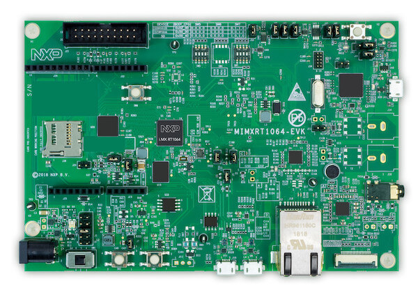

.. _mimxrt1064_evk:

NXP MIMXRT1064-EVK
##################

Overview
********

The i.MX RT1064 is the latest addition to the industry's first crossover
processor series and expands the i.MX RT series to three scalable families.
The i.MX RT1064 doubles the On-Chip SRAM to 1MB while keeping pin-to-pin
compatibility with i.MX RT1050. This new series introduces additional features
ideal for real-time applications such as High-Speed GPIO, CAN-FD, and
synchronous parallel NAND/NOR/PSRAM controller. The i.MX RT1064 runs on the
Arm® Cortex-M7® core at 600 MHz.

Hardware
********

- MIMXRT1064DVL6A MCU (600 MHz, 1024 KB on-chip memory, 4096KB on-chip QSPI
  flash)

- Memory

  - 256 Mbit SDRAM
  - 64 Mbit QSPI Flash
  - 512 Mbit Hyper Flash
  - TF socket for SD card

- Display

  - LCD connector

- Ethernet

  - 10/100 Mbit/s Ethernet PHY

- USB

  - USB 2.0 OTG connector
  - USB 2.0 host connector

- Audio

  - 3.5 mm audio stereo headphone jack
  - Board-mounted microphone
  - Left and right speaker out connectors

- Power

  - 5 V DC jack

- Debug

  - JTAG 20-pin connector
  - OpenSDA with DAPLink

- Sensor

  - FXOS8700CQ 6-axis e-compass
  - CMOS camera sensor interface

- Expansion port

  - Arduino interface

- CAN bus connector

For more information about the MIMXRT1064 SoC and MIMXRT1064-EVK board, see
these references:

- `i.MX RT1064 Website`_
- `i.MX RT1064 Datasheet`_
- `i.MX RT1064 Reference Manual`_
- `MIMXRT1064-EVK Website`_
- `MIMXRT1064-EVK Quick Reference Guide`_
- `MIMXRT1064-EVK Schematics`_

Supported Features
==================

The mimxrt1064_evk board configuration supports the following hardware
features:

+-----------+------------+-------------------------------------+
| Interface | Controller | Driver/Component                    |
+===========+============+=====================================+
| NVIC      | on-chip    | nested vector interrupt controller  |
+-----------+------------+-------------------------------------+
| SYSTICK   | on-chip    | systick                             |
+-----------+------------+-------------------------------------+
| DISPLAY   | on-chip    | display                             |
+-----------+------------+-------------------------------------+
| GPIO      | on-chip    | gpio                                |
+-----------+------------+-------------------------------------+
| UART      | on-chip    | serial port-polling;                |
|           |            | serial port-interrupt               |
+-----------+------------+-------------------------------------+
| ENET      | on-chip    | ethernet                            |
+-----------+------------+-------------------------------------+
| USB       | on-chip    | USB device controller               |
+-----------+------------+-------------------------------------+

The default configuration can be found in the defconfig file:
``boards/arm/mimxrt1064_evk/mimxrt1064_evk_defconfig``

Other hardware features are not currently supported by the port.

Connections and I/Os
====================

The MIMXRT1064 SoC has four pairs of pinmux/gpio controllers.

+---------------+-----------------+---------------------------+
| Name          | Function        | Usage                     |
+===============+=================+===========================+
| GPIO_AD_B0_02 | LCD_RST         | LCD Display               |
+---------------+-----------------+---------------------------+
| GPIO_AD_B0_09 | GPIO/ENET_RST   | LED/Ethernet              |
+---------------+-----------------+---------------------------+
| GPIO_AD_B0_10 | GPIO/ENET_INT   | GPIO/Ethernet             |
+---------------+-----------------+---------------------------+
| GPIO_AD_B0_12 | LPUART1_TX      | UART Console              |
+---------------+-----------------+---------------------------+
| GPIO_AD_B0_13 | LPUART1_RX      | UART Console              |
+---------------+-----------------+---------------------------+
| WAKEUP        | GPIO            | SW0                       |
+---------------+-----------------+---------------------------+
| GPIO_B0_00    | LCD_CLK         | LCD Display               |
+---------------+-----------------+---------------------------+
| GPIO_B0_01    | LCD_ENABLE      | LCD Display               |
+---------------+-----------------+---------------------------+
| GPIO_B0_02    | LCD_HSYNC       | LCD Display               |
+---------------+-----------------+---------------------------+
| GPIO_B0_03    | LCD_VSYNC       | LCD Display               |
+---------------+-----------------+---------------------------+
| GPIO_B0_04    | LCD_DATA00      | LCD Display               |
+---------------+-----------------+---------------------------+
| GPIO_B0_05    | LCD_DATA01      | LCD Display               |
+---------------+-----------------+---------------------------+
| GPIO_B0_06    | LCD_DATA02      | LCD Display               |
+---------------+-----------------+---------------------------+
| GPIO_B0_07    | LCD_DATA03      | LCD Display               |
+---------------+-----------------+---------------------------+
| GPIO_B0_08    | LCD_DATA04      | LCD Display               |
+---------------+-----------------+---------------------------+
| GPIO_B0_09    | LCD_DATA05      | LCD Display               |
+---------------+-----------------+---------------------------+
| GPIO_B0_10    | LCD_DATA06      | LCD Display               |
+---------------+-----------------+---------------------------+
| GPIO_B0_11    | LCD_DATA07      | LCD Display               |
+---------------+-----------------+---------------------------+
| GPIO_B0_12    | LCD_DATA08      | LCD Display               |
+---------------+-----------------+---------------------------+
| GPIO_B0_13    | LCD_DATA09      | LCD Display               |
+---------------+-----------------+---------------------------+
| GPIO_B0_14    | LCD_DATA10      | LCD Display               |
+---------------+-----------------+---------------------------+
| GPIO_B0_15    | LCD_DATA11      | LCD Display               |
+---------------+-----------------+---------------------------+
| GPIO_B1_00    | LCD_DATA12      | LCD Display               |
+---------------+-----------------+---------------------------+
| GPIO_B1_01    | LCD_DATA13      | LCD Display               |
+---------------+-----------------+---------------------------+
| GPIO_B1_02    | LCD_DATA14      | LCD Display               |
+---------------+-----------------+---------------------------+
| GPIO_B1_03    | LCD_DATA15      | LCD Display               |
+---------------+-----------------+---------------------------+
| GPIO_B1_04    | ENET_RX_DATA00  | Ethernet                  |
+---------------+-----------------+---------------------------+
| GPIO_B1_05    | ENET_RX_DATA01  | Ethernet                  |
+---------------+-----------------+---------------------------+
| GPIO_B1_06    | ENET_RX_EN      | Ethernet                  |
+---------------+-----------------+---------------------------+
| GPIO_B1_07    | ENET_TX_DATA00  | Ethernet                  |
+---------------+-----------------+---------------------------+
| GPIO_B1_08    | ENET_TX_DATA01  | Ethernet                  |
+---------------+-----------------+---------------------------+
| GPIO_B1_09    | ENET_TX_EN      | Ethernet                  |
+---------------+-----------------+---------------------------+
| GPIO_B1_10    | ENET_REF_CLK    | Ethernet                  |
+---------------+-----------------+---------------------------+
| GPIO_B1_11    | ENET_RX_ER      | Ethernet                  |
+---------------+-----------------+---------------------------+
| GPIO_B1_15    | BACKLIGHT_CTL   | LCD Display               |
+---------------+-----------------+---------------------------+
| GPIO_EMC_40   | ENET_MDC        | Ethernet                  |
+---------------+-----------------+---------------------------+
| GPIO_EMC_41   | ENET_MDIO       | Ethernet                  |
+---------------+-----------------+---------------------------+
| GPIO_AD_B0_09 | ENET_RST        | Ethernet                  |
+---------------+-----------------+---------------------------+
| GPIO_AD_B0_10 | ENET_INT        | Ethernet                  |
+---------------+-----------------+---------------------------+

System Clock
============

The MIMXRT1064 SoC is configured to use the 24 MHz external oscillator on the
board with the on-chip PLL to generate a 600 MHz core clock.

Serial Port
===========

The MIMXRT1064 SoC has eight UARTs. One is configured for the console and the
remaining are not used.

Programming and Debugging
*************************

Build and flash applications as usual (see :ref:`build_an_application` and
:ref:`application_run` for more details).

Configuring a Debug Probe
=========================

A debug probe is used for both flashing and debugging the board. This board is
configured by default to use the :ref:`opensda-daplink-onboard-debug-probe`,
however the :ref:`pyocd-debug-host-tools` do not yet support programming the
external flashes on this board so you must reconfigure the board for one of the
following debug probes instead.

:ref:`jlink-external-debug-probe`
---------------------------------

Install the :ref:`jlink-debug-host-tools` and make sure they are in your search
path.

Attach a J-Link 20-pin connector to J21. Check that jumpers J47 and J48 are
**off** (they are on by default when boards ship from the factory) to ensure
SWD signals are disconnected from the OpenSDA microcontroller.

Configuring a Console
=====================

Regardless of your choice in debug probe, we will use the OpenSDA
microcontroller as a usb-to-serial adapter for the serial console. Check that
jumpers J45 and J46 are **on** (they are on by default when boards ship from
the factory) to connect UART signals to the OpenSDA microcontroller.

Connect a USB cable from your PC to J41.

Use the following settings with your serial terminal of choice (minicom, putty,
etc.):

- Speed: 115200
- Data: 8 bits
- Parity: None
- Stop bits: 1

Flashing
========

Here is an example for the :ref:`hello_world` application.

.. zephyr-app-commands::
   :zephyr-app: samples/hello_world
   :board: mimxrt1064_evk
   :goals: flash

Open a serial terminal, reset the board (press the SW9 button), and you should
see the following message in the terminal:

.. code-block:: console

   ***** Booting Zephyr OS v1.14.0-rc1 *****
   Hello World! mimxrt1064_evk

Debugging
=========

Here is an example for the :ref:`hello_world` application.

.. zephyr-app-commands::
   :zephyr-app: samples/hello_world
   :board: mimxrt1064_evk
   :goals: debug

Open a serial terminal, step through the application in your debugger, and you
should see the following message in the terminal:

.. code-block:: console

   ***** Booting Zephyr OS v1.14.0-rc1 *****
   Hello World! mimxrt1064_evk

.. _MIMXRT1064-EVK Website:
   https://www.nxp.com/support/developer-resources/run-time-software/i.mx-developer-resources/mimxrt1064-evk-i.mx-rt1064-evaluation-kit:MIMXRT1064-EVK

.. _MIMXRT1064-EVK Quick Reference Guide:
   https://www.nxp.com/docs/en/quick-reference-guide/IMXRT1064QSG.pdf

.. _MIMXRT1064-EVK Schematics:
   https://www.nxp.com/webapp/Download?colCode=i.MXRT160EVKDS&Parent_nodeId=1537930933174731284155&Parent_pageType=product

.. _i.MX RT1064 Website:
   https://www.nxp.com/products/processors-and-microcontrollers/arm-based-processors-and-mcus/i.mx-applications-processors/i.mx-rt-series/i.mx-rt1064-crossover-processor-with-arm-cortex-m7-core:i.MX-RT1064

.. _i.MX RT1064 Datasheet:
   https://www.nxp.com/docs/en/data-sheet/IMXRT1064CEC.pdf

.. _i.MX RT1064 Reference Manual:
   https://www.nxp.com/docs/en/reference-manual/IMXRT1064RM.pdf
