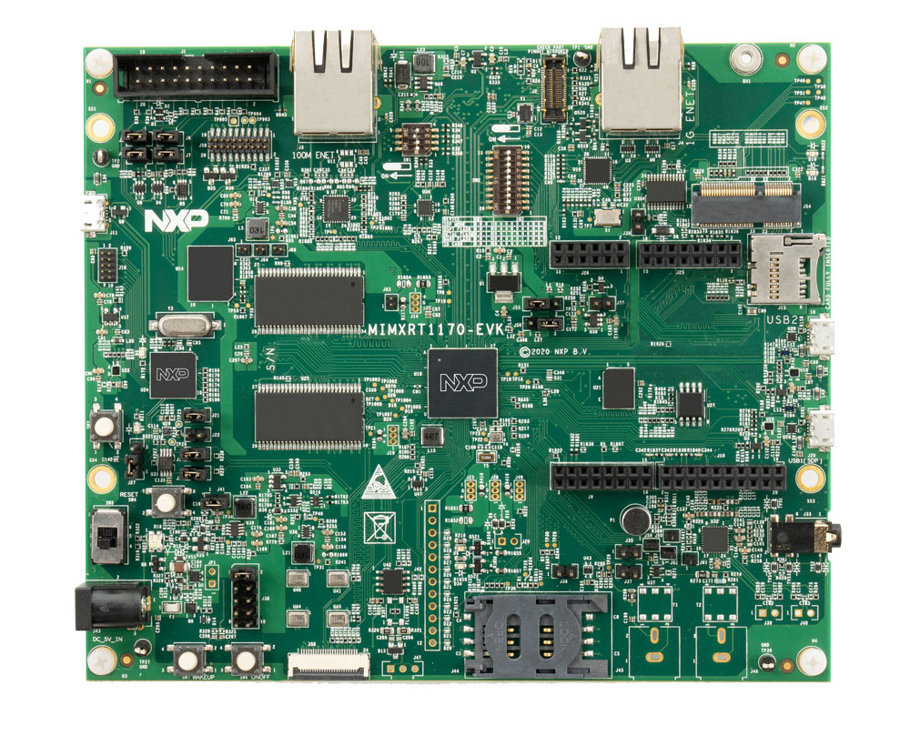

.. _mimxrt1170_evk:

NXP MIMXRT1170-EVK
##################

Overview
********

The dual core i.MX RT1170 runs on the Cortex-M7 core at 1 GHz and on the Cortex-M4
at 400 MHz. The i.MX RT1170 MCU offers support over a wide temperature range
and is qualified for consumer, industrial and automotive markets.

Hardware
********

- MIMXRT1176DVMAA MCU

  - 1GHz Cortex-M7 & 400Mhz Cortex-M4
  - 2MB SRAM with 512KB of TCM for Cortex-M7 and 256KB of TCM for Cortex-M4

- Memory

  - 512 Mbit SDRAM
  - 128 Mbit QSPI Flash
  - 512 Mbit Octal Flash
  - 2 Gbit raw NAND flash
  - 64 Mbit LPSPI flash
  - TF socket for SD card

- Display

  - MIPI LCD connector

- Ethernet

  - 10/100 Mbit/s Ethernet PHY
  - 10/100/1000 Mbit/s Ethernet PHY

- USB

  - USB 2.0 OTG connector
  - USB 2.0 host connector

- Audio

  - 3.5 mm audio stereo headphone jack
  - Board-mounted microphone
  - Left and right speaker out connectors

- Power

  - 5 V DC jack

- Debug

  - JTAG 20-pin connector
  - OpenSDA with DAPLink

- Sensor

  - FXOS8700CQ 6-axis e-compass
  - MIPI camera sensor connector

- Expansion port

  - Arduino interface

- CAN bus connector

For more information about the MIMXRT1170 SoC and MIMXRT1170-EVK board, see
these references:

- `i.MX RT1170 Website`_
- `i.MX RT1170 Datasheet`_
- `i.MX RT1170 Reference Manual`_
- `MIMXRT1170-EVK Website`_
- `MIMXRT1170-EVK Board Hardware User's Guide`_

Supported Features
==================

NXP considers the MIMXRT1170-EVK as the superset board for the i.MX RT11xx
family of MCUs.  This board is a focus for NXP's Full Platform Support for
Zephyr, to better enable the entire RT11xx family.  NXP prioritizes enabling
this board with new support for Zephyr features.  The mimxrt1170_evk board
configuration supports the following hardware features:

+-----------+------------+-------------------------------------+
| Interface | Controller | Driver/Component                    |
+===========+============+=====================================+
| NVIC      | on-chip    | nested vector interrupt controller  |
+-----------+------------+-------------------------------------+
| SYSTICK   | on-chip    | systick                             |
+-----------+------------+-------------------------------------+
| GPIO      | on-chip    | gpio                                |
+-----------+------------+-------------------------------------+
| COUNTER   | on-chip    | counter                             |
+-----------+------------+-------------------------------------+
| CAN       | on-chip    | flexcan                             |
+-----------+------------+-------------------------------------+
| SPI       | on-chip    | spi                                 |
+-----------+------------+-------------------------------------+
| I2C       | on-chip    | i2c                                 |
+-----------+------------+-------------------------------------+
| PWM       | on-chip    | pwm                                 |
+-----------+------------+-------------------------------------+
| ADC       | on-chip    | adc                                 |
+-----------+------------+-------------------------------------+
| UART      | on-chip    | serial port-polling;                |
|           |            | serial port-interrupt               |
+-----------+------------+-------------------------------------+
| DMA       | on-chip    | dma                                 |
+-----------+------------+-------------------------------------+
| GPT       | on-chip    | gpt                                 |
+-----------+------------+-------------------------------------+
| WATCHDOG  | on-chip    | watchdog                            |
+-----------+------------+-------------------------------------+
| ENET      | on-chip    | ethernet                            |
+-----------+------------+-------------------------------------+
| SAI       | on-chip    | i2s                                 |
+-----------+------------+-------------------------------------+
| USB       | on-chip    | USB Device                          |
+-----------+------------+-------------------------------------+
| HWINFO    | on-chip    | Unique device serial number         |
+-----------+------------+-------------------------------------+
| DISPLAY   | on-chip    | display                             |
+-----------+------------+-------------------------------------+
| ACMP      | on-chip    | analog comparator                   |
+-----------+------------+-------------------------------------+
| CAAM RNG  | on-chip    | entropy                             |
+-----------+------------+-------------------------------------+
| FLEXSPI   | on-chip    | flash programming                   |
+-----------+------------+-------------------------------------+

The default configuration can be found in the defconfig file:
``boards/arm/mimxrt1170_evk/mimxrt1170_evk_cm7_defconfig``

Other hardware features are not currently supported by the port.

Connections and I/Os
====================

The MIMXRT1170 SoC has six pairs of pinmux/gpio controllers.

+---------------------------+----------------+------------------+
| Name                      | Function       | Usage            |
+---------------------------+----------------+------------------+
| WAKEUP                    | GPIO           | SW7              |
+---------------------------+----------------+------------------+
| GPIO_AD_04                | GPIO           | LED              |
+---------------------------+----------------+------------------+
| GPIO_AD_24                | LPUART1_TX     | UART Console     |
+---------------------------+----------------+------------------+
| GPIO_AD_25                | LPUART1_RX     | UART Console     |
+---------------------------+----------------+------------------+
| GPIO_LPSR_00              | CAN3_TX        | flexcan          |
+---------------------------+----------------+------------------+
| GPIO_LPSR_01              | CAN3_RX        | flexcan          |
+---------------------------+----------------+------------------+
| GPIO_AD_29                | SPI1_CS0       | spi              |
+---------------------------+----------------+------------------+
| GPIO_AD_28                | SPI1_CLK       | spi              |
+---------------------------+----------------+------------------+
| GPIO_AD_30                | SPI1_SDO       | spi              |
+---------------------------+----------------+------------------+
| GPIO_AD_31                | SPI1_SDI       | spi              |
+---------------------------+----------------+------------------+
| GPIO_AD_08                | LPI2C1_SCL     | i2c              |
+---------------------------+----------------+------------------+
| GPIO_AD_09                | LPI2C1_SDA     | i2c              |
+---------------------------+----------------+------------------+
| GPIO_LPSR_05              | LPI2C5_SCL     | i2c              |
+---------------------------+----------------+------------------+
| GPIO_LPSR_04              | LPI2C5_SDA     | i2c              |
+---------------------------+----------------+------------------+
| GPIO_AD_04                | FLEXPWM1_PWM2  | pwm              |
+---------------------------+----------------+------------------+
| GPIO_AD_32                | ENET_MDC       | Ethernet         |
+---------------------------+----------------+------------------+
| GPIO_AD_33                | ENET_MDIO      | Ethernet         |
+---------------------------+----------------+------------------+
| GPIO_DISP_B2_02           | ENET_TX_DATA00 | Ethernet         |
+---------------------------+----------------+------------------+
| GPIO_DISP_B2_03           | ENET_TX_DATA01 | Ethernet         |
+---------------------------+----------------+------------------+
| GPIO_DISP_B2_04           | ENET_TX_EN     | Ethernet         |
+---------------------------+----------------+------------------+
| GPIO_DISP_B2_05           | ENET_REF_CLK   | Ethernet         |
+---------------------------+----------------+------------------+
| GPIO_DISP_B2_06           | ENET_RX_DATA00 | Ethernet         |
+---------------------------+----------------+------------------+
| GPIO_DISP_B2_07           | ENET_RX_DATA01 | Ethernet         |
+---------------------------+----------------+------------------+
| GPIO_DISP_B2_08           | ENET_RX_EN     | Ethernet         |
+---------------------------+----------------+------------------+
| GPIO_DISP_B2_09           | ENET_RX_ER     | Ethernet         |
+---------------------------+----------------+------------------+
| GPIO_AD_17_SAI1_MCLK      | SAI_MCLK       | SAI              |
+---------------------------+----------------+------------------+
| GPIO_AD_21_SAI1_TX_DATA00 | SAI1_TX_DATA   | SAI              |
+---------------------------+----------------+------------------+
| GPIO_AD_22_SAI1_TX_BCLK   | SAI1_TX_BCLK   | SAI              |
+---------------------------+----------------+------------------+
| GPIO_AD_23_SAI1_TX_SYNC   | SAI1_TX_SYNC   | SAI              |
+---------------------------+----------------+------------------+
| GPIO_AD_17_SAI1_MCLK      | SAI1_MCLK      | SAI              |
+---------------------------+----------------+------------------+
| GPIO_AD_20_SAI1_RX_DATA00 | SAI1_RX_DATA00 | SAI              |
+---------------------------+----------------+------------------+

Dual Core samples
*****************

+-----------+------------------+----------------------------+
| Core      | Boot Address     | Comment                    |
+===========+==================+============================+
| Cortex M7 | 0x30000000[630K] | primary core               |
+-----------+------------------+----------------------------+
| Cortex M4 | 0x20020000[96k]  | boots from OCRAM           |
+-----------+------------------+----------------------------+

+----------+------------------+-----------------------+
| Memory   | Address[Size]    | Comment               |
+==========+==================+=======================+
| flexspi1 | 0x30000000[16M]  | Cortex M7 flash       |
+----------+------------------+-----------------------+
| sdram0   | 0x80030000[64M]  | Cortex M7 ram         |
+----------+------------------+-----------------------+
| ocram    | 0x20020000[512K] | Cortex M4 "flash"     |
+----------+------------------+-----------------------+
| sram1    | 0x20000000[128K] | Cortex M4 ram         |
+----------+------------------+-----------------------+
| ocram2   | 0x200C0000[512K] | Mailbox/shared memory |
+----------+------------------+-----------------------+

Only the first 16K of ocram2 has the correct MPU region attributes set to be
used as shared memory

System Clock
============

The MIMXRT1170 SoC is configured to use SysTick as the system clock source,
running at 996MHz. When targeting the M4 core, SysTick will also be used,
running at 400MHz

When power management is enabled, the 32 KHz low frequency
oscillator on the board will be used as a source for the GPT timer to
generate a system clock. This clock enables lower power states, at the
cost of reduced resolution

Serial Port
===========

The MIMXRT1170 SoC has 12 UARTs. One is configured for the console and the
remaining are not used.

Programming and Debugging
*************************

Build and flash applications as usual (see :ref:`build_an_application` and
:ref:`application_run` for more details).

Building a Dual-Core Image
==========================
Dual core samples load the M4 core image from flash into the shared ``ocram``
region. The M7 core then sets the M4 boot address to this region. The only
sample currently enabled for dual core builds is the ``openamp`` sample.
To flash a dual core sample, the M4 image must be flashed first, so that it is
written to flash. Then, the M7 image must be flashed. The openamp sysbuild
sample will do this automatically by setting the image order.

The secondary core can be debugged normally in single core builds
(where the target is ``mimxrt1170_evk_cm4``). For dual core builds, the
secondary core should be placed into a loop, then a debugger can be attached
(see `AN13264`_, section 4.2.3 for more information)

Configuring a Debug Probe
=========================

A debug probe is used for both flashing and debugging the board. This board is
configured by default to use the :ref:`opensda-daplink-onboard-debug-probe`,
however the :ref:`pyocd-debug-host-tools` do not yet support programming the
external flashes on this board so you must reconfigure the board for one of the
following debug probes instead.

.. _Using J-Link RT1170:

Using J-Link
---------------------------------

Install the :ref:`jlink-debug-host-tools` and make sure they are in your search
path.

There are two options: the onboard debug circuit can be updated with Segger
J-Link firmware, or :ref:`jlink-external-debug-probe` can be attached to the
EVK. See `Using J-Link with MIMXRT1160-EVK or MIMXRT1170-EVK`_ for more details.

Configuring a Console
=====================

Regardless of your choice in debug probe, we will use the OpenSDA
microcontroller as a usb-to-serial adapter for the serial console. Check that
jumpers J5 and J8 are **on** (they are on by default when boards ship from
the factory) to connect UART signals to the OpenSDA microcontroller.

Connect a USB cable from your PC to J11.

Use the following settings with your serial terminal of choice (minicom, putty,
etc.):

- Speed: 115200
- Data: 8 bits
- Parity: None
- Stop bits: 1

Flashing
========

Here is an example for the :ref:`hello_world` application.

Before power on the board, make sure SW1 is set to 0001b

.. zephyr-app-commands::
   :zephyr-app: samples/hello_world
   :board: mimxrt1170_evk_cm7
   :goals: flash

Power off the board, and change SW1 to 0010b. Then power on the board and
open a serial terminal, reset the board (press the SW4 button), and you should
see the following message in the terminal:

.. code-block:: console

   ***** Booting Zephyr OS v2.4.0-xxxx-xxxxxxxxxxxxx *****
   Hello World! mimxrt1170_evk_cm7

Debugging
=========

Here is an example for the :ref:`hello_world` application.

.. zephyr-app-commands::
   :zephyr-app: samples/hello_world
   :board: mimxrt1170_evk_cm7
   :goals: debug

Open a serial terminal, step through the application in your debugger, and you
should see the following message in the terminal:

.. code-block:: console

   ***** Booting Zephyr OS v2.4.0-xxxx-xxxxxxxxxxxxx *****
   Hello World! mimxrt1170_evk_cm7

.. _MIMXRT1170-EVK Website:
   https://www.nxp.com/design/development-boards/i-mx-evaluation-and-development-boards/i-mx-rt1170-evaluation-kit:MIMXRT1170-EVK

.. _MIMXRT1170-EVK Board Hardware User's Guide:
   https://www.nxp.com/webapp/Download?colCode=MIMXRT1170EVKHUG

.. _i.MX RT1170 Website:
   https://www.nxp.com/products/processors-and-microcontrollers/arm-microcontrollers/i-mx-rt-crossover-mcus/i-mx-rt1170-crossover-mcu-family-first-ghz-mcu-with-arm-cortex-m7-and-cortex-m4-cores:i.MX-RT1170

.. _i.MX RT1170 Datasheet:
   https://www.nxp.com/docs/en/data-sheet/IMXRT1170CEC.pdf

.. _i.MX RT1170 Reference Manual:
   https://www.nxp.com/webapp/Download?colCode=IMXRT1170RM

.. _Using J-Link with MIMXRT1160-EVK or MIMXRT1170-EVK:
   https://community.nxp.com/t5/i-MX-RT-Knowledge-Base/Using-J-Link-with-MIMXRT1160-EVK-or-MIMXRT1170-EVK/ta-p/1529760

.. _AN13264:
   https://www.nxp.com/docs/en/application-note/AN13264.pdf
